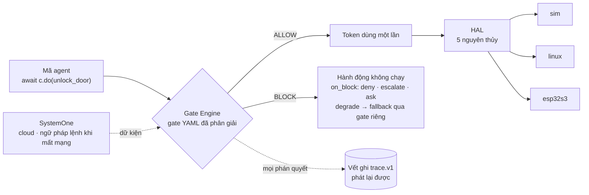

# NeuroEdge

**Hợp đồng hành động chuẩn kiểu cho Physical AI.** Khi chatbot trả lời sai, ta bấm
*Regenerate*; khi một agent vật lý sai, chốt cửa đã mở, rơ-le đã đóng — không bấm lại
được. Một trợ lý giọng nói trong nhà cũng vậy: nó trả lời câu hỏi, đọc tin tức và tắt đèn —
câu trả lời sai thì sửa được, còn tắt đèn khi vẫn còn người trên cầu thang thì không.
NeuroEdge đặt một **gate** — chính sách an toàn dạng YAML, có phiên bản, kế thừa được —
trước mọi lệnh ra phần cứng, để lời nói đi đường lời nói, hành động đi đường hành động, và
chạy **cùng một mã agent** trên trình mô phỏng, Linux và vi điều khiển ESP32-S3.

> Trạng thái: đang phát triển, chưa phát hành. Lõi thực thi trên `sim` đã chạy
> (Sprint 2); chi tiết ở [`docs/user/trang-thai.md`](docs/user/trang-thai.md).

## Kiến trúc trong 30 giây



Không có đường nào tới chân GPIO bỏ qua gate. Luồng chi tiết từng bước:
[`docs/spec/threat_model.md`](docs/spec/threat_model.md) §1.

## Một gate và một hành động

Gate — [`gates/unlock_door@1.2.0.yaml`](gates/unlock_door@1.2.0.yaml) (trích):

```yaml
name:    unlock_door
version: 1.2.0
extends: neuroedge://gates/hospitality/base-access@1.0.0   # chỉ được siết chặt gate cha

evaluate:
  room_matches:
    type: bool
    instructions: "Số phòng yêu cầu trùng khớp hoàn toàn với hồ sơ đặt phòng của khách"

allow_when:
  room_matches: true
  risk_level:   { lte: low }        # cha cho tới medium — con siết xuống low

on_block: { action: escalate, to: human_receptionist }
budget:   { p95_latency_ms: 120, fail: closed }   # không thẩm định kịp ⇒ CHẶN
```

Hành động — [`fixtures/agents/villa-concierge/actions/unlock_door.py`](fixtures/agents/villa-concierge/actions/unlock_door.py):

```python
from neuroedge import action
from neuroedge.hal import digital

@action(name="unlock_door", requires="digital.out:door_lock", gate="unlock_door")
def unlock_door(guest_id: str = "", duration_s: int = 30) -> None:
    digital.out("door_lock").pulse(seconds=duration_s)   # chỉ chạy được bên trong c.do()
```

## Chạy thử

Cài đặt (Python 3.11+): [`python/README.md`](python/README.md). Rồi, từ thư mục gốc:

```bash
neuroedge gate lint                     # phân giải mọi gate mẫu, kiểm 5 nguyên tắc kế thừa
neuroedge run -c "mở cửa phòng 101"     # gate cho phép: chốt cửa ảo kích 30 giây
neuroedge run -c "mở cửa phòng 202"     # sai phòng: gate chặn, chân không nhúc nhích, báo lễ tân
```

Bỏ `-c` để vào vòng lặp gõ chữ (`:help` xem lệnh), thêm `--ui` để xem chốt cửa, đèn và phán quyết trực tiếp trên trình duyệt — không mạng, không khoá API. Thêm
`--board linux-rpi5`: agent bị từ chối trước khi chạy vì bo mạch không có khử vang phần
cứng — lỗi nêu ở đâu, vì sao, sửa thế nào. `neuroedge new my-agent` tạo dự án của bạn;
`neuroedge new nha --template home-voice` tạo trợ lý giọng nói mẫu (hỏi đáp, tin tức, đèn).
Mọi lệnh và đầu ra kỳ vọng: [`CHANGELOG.md`](CHANGELOG.md) §2.

**Gọi từ agent khác qua MCP.** Mỗi `@action` là một tool; `neuroedge mcp serve` là máy chủ
MCP có gate — Claude Desktop, IDE hay agent của bạn gọi được thiết bị, nhưng tool call chỉ
là *yêu cầu*: gate vẫn quyết định, lời gọi sai tham số bị từ chối trước khi tới phần cứng.
Cấu hình Claude Desktop (cần `pip install 'neuroedge[mcp]'`):

```json
{ "mcpServers": { "home-voice": { "command": "neuroedge",
    "args": ["mcp", "serve", "--agent", "/đường/dẫn/fixtures/agents/home-voice/agent.toml"] } } }
```

Quy tắc đầy đủ: [`docs/spec/tool_calling.md`](docs/spec/tool_calling.md).

## Đọc gì tiếp theo

| Bạn là | Đọc |
|:---|:---|
| Người mới — cần biết đọc tệp nào | [`docs/user/README.md`](docs/user/README.md) |
| Gặp mã lạ (`FR-GATE-03`, `Q-14`, `A1`…) | [`docs/user/thuat-ngu.md`](docs/user/thuat-ngu.md) |
| Muốn hiểu sản phẩm và kiến trúc | [`neuroedge-proposal.md`](neuroedge-proposal.md) · [`neuroedge-prd.md`](neuroedge-prd.md) |
| Muốn đóng góp | [`CONTRIBUTING.md`](CONTRIBUTING.md) |
| Tiếp quản để build tiếp | [`CHANGELOG.md`](CHANGELOG.md) §3 · thẻ bàn giao `neuroedge-roadmap.md` §0.3 |

Giấy phép lõi: MIT — xem [`NOTICE`](NOTICE).
