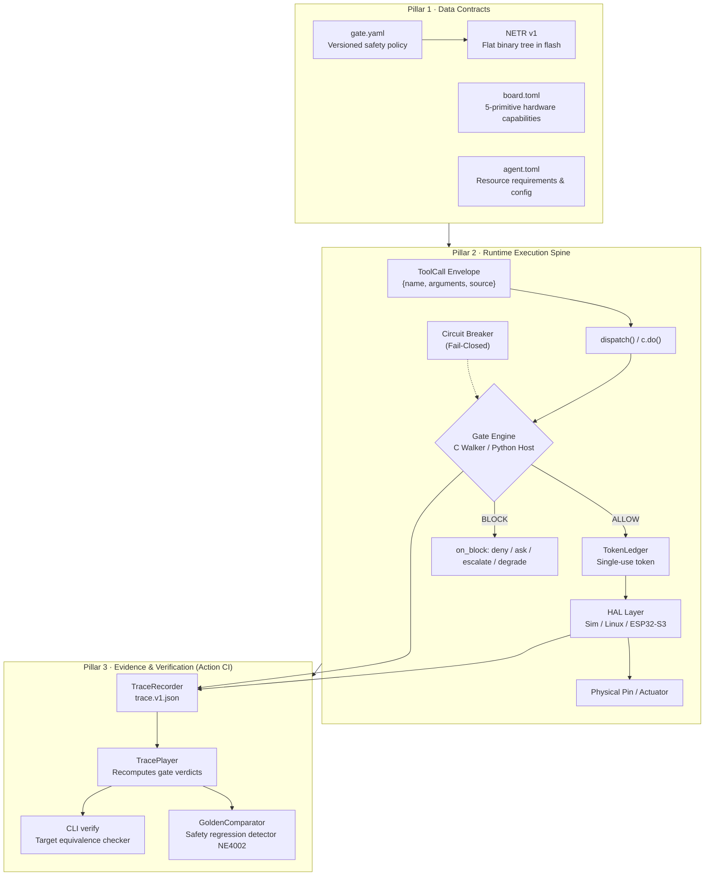

# 00 · Architecture Overview

> **Status:** `done` for I0–I4 (code implemented and tests passing on `main`); `planned` for I5–I18 (specified in PRD, Roadmap, RFCs, and design notes). Release dates, schedule milestones, and version tags are strictly managed in [`neuroedge-roadmap.md` §0.2](../../neuroedge-roadmap.md#02-bảng-tổng-quan-tiến-độ-các-sprint-sprint-matrix-overview).

---

## 1. Core Premise & Mission

> **NeuroEdge — Physical AI, under contract. No contract, no action.**

When a software chatbot hallucinates, the user clicks *Regenerate*. But when a Physical AI Agent misbehaves, the relay has closed, the motor has turned, the door lock has opened — these physical actions are irreversible.

NeuroEdge places a **Gate** (a type-safe, versioned, monotonically inherited, 100% deterministic safety policy) as the **closest layer of defense standing directly above the 5 HAL hardware primitives** (`Q-30`, PRD §1.2). Every action proposal — whether recognized by local fixed grammar, inferred by an LLM via the Cloud, or received from external agents via MCP — is treated strictly as an unprivileged `ToolCall`. The Gate independently adjudicates, enforces *fail-closed* safety by default, issues single-use execution tokens, and logs the entire session into a canonical audit trace (`trace.v1.json`).

*Figure E-08 — Evolution timeline of the 19 increments (I0–I18). Solid lines: done · Dashed lines: planned.*

---

## 2. The Five Invariant Principles (P-1..P-5, PRD §1.5)

All architectural decisions and component designs in this document strictly serve and adhere to five invariant principles:

| Code | Invariant Principle | Architectural Consequence & Technical Invariant |
|:---:|:---|:---|
| **P-1** | **Physical actions are type-safe contracts, not free function calls** | Every command reaching physical pins requires an authorized Gate token (`c.do()`). Direct invocations are forbidden at build time. All callers (`local_grammar`, `system_two`, `mcp`) are normalized into a unified `ToolCall` envelope routed through the exact same Gate (`Q-24`). |
| **P-2** | **Target Equivalence across execution environments** | No branching on targets inside agent code. The same Gate and scenario must yield identical adjudication verdicts across `sim`, `linux`, and `esp32s3` (`FR-TGT-04`). Conformance guarantees are tiered across 3 target levels (`Q-13`, `FR-TGT-08`). |
| **P-3** | **Value in Fleet Management & Commercial Licensing, not token reselling** | Core framework is source-available; specifications are open standards. NeuroEdge does not monetize AI inference tokens. Revenue comes from the Fleet OS management platform and enterprise commercial licensing (`Q-45`). |
| **P-4** | **Pluggable AI models, Cloud-First** | All model interactions route through `SystemOne` and `SystemTwo` abstraction layers (OpenAI API standard via LiteLLM SDK + custom adapters, `Q-10`, `Q-12`). Heavy processing (LLM, STT, TTS) resides in the Cloud; microcontrollers only run audio I/O, voice FSM, and on-device Gate evaluation. |
| **P-5** | **Network effects from shared community safety Gates** | Gates are versioned data artifacts, statically verifiable. Inheritance rules only allow monotonic tightening, never loosening. A public Gate Registry allows sharing proven safety policies without disclosing proprietary business logic. |

---

## 3. The Three Architectural Pillars

The NeuroEdge architecture operates on three foundational pillars:

1. **Contracts as Data:** Safety logic is never hardcoded inside application code. Policies are defined in standalone YAML files, boards are specified in capability TOML files, and when compiled for embedded firmware, Gates become a flat binary decision tree `NETR v1` (`Q-9`, `Q-23`, RFC-0003) walked in-place within Flash memory.
2. **Single Execution Spine:** There is no backchannel to actuate physical pins bypassing the Gate. The sole path is: `ToolCall → dispatch() → c.do() → Gate.evaluate() → TokenLedger.issue() → HAL.authorize() → Pin Actuator`.
3. **Evidence by Design:** All input facts, intermediate verdicts, issued tokens, and actuator pulses are canonicalized using RFC 8785 (JCS) into JSON v1 trace artifacts. These traces can be deterministically replayed across all target environments to prove zero safety regression.

---

## 4. Reading Guide by Persona

The documentation is organized following the C4 Model hierarchy (Context $\rightarrow$ Container $\rightarrow$ Component $\rightarrow$ Code), serving four distinct audiences:

| Target Audience | Primary Goal | Recommended Reading Path |
|:---|:---|:---|
| **New Developers (Day 1)** | Run the system on a local machine in $< 10$ minutes without physical hardware | [`12-dev-quickstart.md`](12-dev-quickstart.md) $\rightarrow$ [`00-overview.md`](00-overview.md) $\rightarrow$ [`01-context-c4l1.md`](01-context-c4l1.md) |
| **Core & Embedded Engineers** | Understand the 8 host Python layers, FreeRTOS firmware architecture, memory map, and runtime flows | [`02-container-c4l2.md`](02-container-c4l2.md) $\rightarrow$ [`03-component-host-c4l3.md`](03-component-host-c4l3.md) $\rightarrow$ [`04-component-device-c4l3.md`](04-component-device-c4l3.md) $\rightarrow$ [`05-code-gate-hal-c4l4.md`](05-code-gate-hal-c4l4.md) $\rightarrow$ [`06-runtime-flows.md`](06-runtime-flows.md) |
| **OEM Hardware Partners** | Port NeuroEdge to new silicon architectures (STM32, RP2350, NXP) | [`11-hal-port-guide.md`](11-hal-port-guide.md) $\rightarrow$ [`10-target-equivalence.md`](10-target-equivalence.md) $\rightarrow$ [`07-data-contracts.md`](07-data-contracts.md) |
| **Safety Certifiers & QA Leads** | Audit NFR tactics, trust boundaries, and ADR architectural decision indices | [`08-nfr.md`](08-nfr.md) $\rightarrow$ [`09-adr.md`](09-adr.md) $\rightarrow$ [`06-runtime-flows.md`](06-runtime-flows.md) |

---

## 5. Overview of 19 Increments (Scope I0–I18)

The NeuroEdge architecture evolves across 19 planned increments, ensuring modularity without requiring architectural rewrites:

| Phase Group | Increments | Status | Core Capability | Reference Document |
|:---|:---:|:---:|:---|:---|
| **Block 1a — Logic Core & Action CI** | **I0 – I2** | `done` | Schemas v1, Gate Resolver (5 principles), `sim` + `linux` HAL, Action CI (record/replay/golden), System 2 via LiteLLM, Gated Tool Profile MCP. | [`03`](03-component-host-c4l3.md), [`05`](05-code-gate-hal-c4l4.md), [`06`](06-runtime-flows.md), [`10`](10-target-equivalence.md) |
| **Block 1b — Edge Microcontroller** | **I3 – I5** | `in-progress` | C99 Walker & Token Ledger on QEMU (`done`); UART Trace stream (`TSK-S4-09`); C/C++ Voice FSM & Audio streaming on Box-3 (`TSK-S5-01..07`). | [`04`](04-component-device-c4l3.md), [`10`](10-target-equivalence.md), [`13`](13-evolution-i0-i18.md) |
| **Public Release & v1.0** | **I6 – I7** | `planned` | Public Schemas, PyPI release v0.1.0, Signed A/B Device OTA with rollback, full A1–A9 verification. | [`13-evolution-i0-i18.md`](13-evolution-i0-i18.md) |
| **Developer Beta** | **I8** | `planned` | Freeze `1.0.x` maintenance branch, onboard 50–100 external developers, measure B1–B5 metrics. | [`13-evolution-i0-i18.md`](13-evolution-i0-i18.md) |
| **Blocks 2 & 3 — Service Tier** | **I9 – I10** | `planned` | **Fleet OS** (Canary OTA orchestration, EMQX mTLS Broker, Trace vault) & **Gate Registry** (CNCF ORAS/OCI, OpenMeter billing). | [`02`](02-container-c4l2.md), [`13`](13-evolution-i0-i18.md) |
| **Target Scaling & NeuroBrain** | **I11 – I13** | `planned` | Target enum expansion (RFC-0002 PR2), **NeuroBrain** (Chat Contracting & Gated lab bring-up), Tier-3 Community Porting Kit. | [`11`](11-hal-port-guide.md), [`13`](13-evolution-i0-i18.md) |
| **Tiered Robotics & Vision** | **I14 – I18** | `planned` | Distributed Robot architecture (Linux Brain + MCU Nodes via Zenoh-pico, `motion.*` token lease), Computer Vision `vision.in`, Jetson Orin Nano, OEM Ecosystem. | [`13-evolution-i0-i18.md`](13-evolution-i0-i18.md) |
