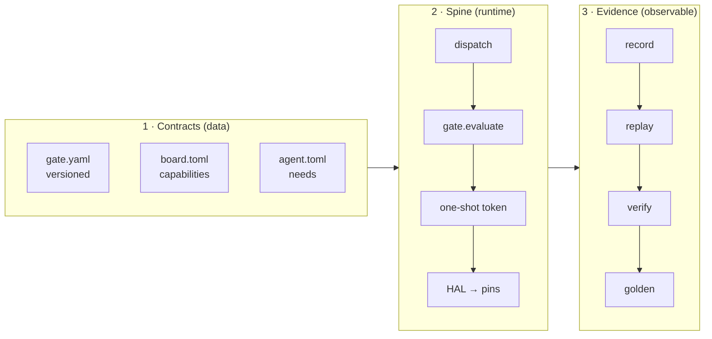

# 00 · Architecture Overview

> Status: `done` for I0–I4 (code on `main`); `planned` for I5–I18
> (PRD/roadmap/drafts/RFCs only). Dates and tags live in roadmap §0.2.

## 1. Product statement (one sentence)

**NeuroEdge — Physical AI, under contract. No contract, no action.** Every
physical effect (door locks, relays, lamps, motors) must pass a **typed,
versioned safety contract** — the closest guard standing right above 5 HAL
primitives (`Q-30`, PRD §1.2).

*Figure E-08 — increment roadmap. Solid: done · dashed: planned.*

## 2. Five invariant principles (P-1..P-5, PRD §1.5)

| # | Principle | Architectural consequence |
|:---:|:---|:---|
| P-1 | Physical action is a typed contract | HAL refuses any command without a passed-gate signature; every source (grammar, S1/S2, MCP) is one ToolCall through the same gate (`Q-24`) |
| P-2 | Peer execution environments | No target branching in agent code; verification commitment tiered by target (`Q-13`, `FR-TGT-08`) |
| P-3 | Value in fleet management + license | Source-available core, open standards; Fleet OS is the only commercial service (`Q-45`) |
| P-4 | Replaceable, cloud-first models | All model access via `SystemOne`/`SystemTwo`; OpenAI API standard + adapters (`Q-10`, `Q-12`); STT/TTS at providers |
| P-5 | Network effects from shared gates | Gates are versioned data, inheritance only tightens; adapters/HAL ports carry their own control gates |

## 3. Three architectural pillars

1. **Contracts are data**, not code: gate YAML, board/agent TOML, NETR binary
   trees on device (`Q-9`, `Q-23`, RFC-0003).
2. **One spine** to the pins: `ToolCall → dispatch → c.do → gate → token →
   HAL` (see `05-code-gate-hal-c4l4.md`).
3. **Every session leaves a trace** replayable on every target (see `06`,
   `07`).

## 4. I0–I18 reading map

| Increment | Capability | Read |
|:---|:---|:---|
| I0–I2 (done) | Contract core, `sim`+`linux`, Action CI, C walker on QEMU | `03`, `05`, `06`, `10` |
| I3–I5 (board-independent parts done) | Gates + voice on real Box-3 | `04`, `10` |
| I6–I7 (planned) | Public, signed OTA A/B, 24h stability | `13-evolution-i0-i18.md` |
| I8 (planned) | Developer Beta, frozen `1.0.x` line | `13` |
| I9–I10 (planned) | Fleet OS, Registry | `02`, `13` |
| I11–I13 (planned) | Open target list, NeuroBrain, community port kit | `11`, `13` |
| I14–I18 (planned) | Tiered robot, vision, device ecosystem | `13` |

Objectives M1..M5, personas U1..U6, journeys 1..3: PRD §1–§2 (not repeated here).
