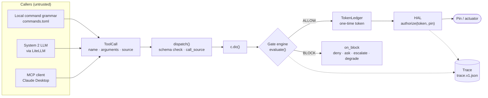

# 00 · Architecture Overview

> **Scope:** the whole system, at the highest level. **Source of truth:** the code in `main`; requirements in
> [`neuroedge-prd.md`](../../../neuroedge-prd.md); progress in
> [`neuroedge-roadmap.md`](../../../neuroedge-roadmap.md) §0. Label conventions `done` / `partial` /
> `planned`: [`README.md`](../README.md).

## 1. What problem NeuroEdge solves

When a chatbot answers incorrectly, the user clicks "Regenerate". When an agent controlling a physical device is wrong, the door lock is already open, the fan is already off, the relay is already closed — there is no "Regenerate" button. An AI model produces proposals; it cannot be the place that decides whether a physical action is allowed to happen.

NeuroEdge separates those two concerns. Every action proposal — from the local command grammar, from an LLM, from another agent via MCP — is normalized into a **typed tool call**, then must pass a **gate**: a safety policy written in YAML, versioned, inheritable, compiled into a deterministic decision tree. When the gate returns `ALLOW`, a **single-use verdict token** is issued, and only that token can open the exact hardware pins of that action. Every fact, verdict and pin command is written to a replayable **trace**. The same gate runs on the simulator (`sim`), on Linux (`linux`) and on the ESP32-S3 chip (`esp32s3`).

## 2. The system in one picture

*Figure E-01 — Users, external systems, and the boundary of NeuroEdge. Details: [`01`](01-context-c4l1.md).*

The only path from intent to a hardware pin — the **execution spine** — is the same for every caller source and every environment:

```mermaid
flowchart LR
    subgraph Sources["Callers (untrusted)"]
        G["Local command grammar<br/>commands.toml"]
        S2["System 2 LLM<br/>via LiteLLM"]
        MCP["MCP client<br/>Claude Desktop"]
    end
    TC["ToolCall<br/>name · arguments · source"]
    D["dispatch()<br/>schema check · call_source"]
    DO["c.do()"]
    GATE{"Gate engine<br/>evaluate()"}
    TOK["TokenLedger<br/>one-time token"]
    HAL["HAL<br/>authorize(token, pin)"]
    PIN(["Pin / actuator"])
    OB["on_block<br/>deny · ask · escalate · degrade"]
    TR[("Trace<br/>trace.v1.json")]

    G --> TC
    S2 --> TC
    MCP --> TC
    TC --> D --> DO --> GATE
    GATE -- ALLOW --> TOK --> HAL --> PIN
    GATE -- BLOCK --> OB
    GATE -.-> TR
    HAL -.-> TR
```

- **No shortcuts.** Calling an `@action` function directly, calling `digital.out()` outside `c.do()`, handing HAL a made-up string or token, reusing a token, using an expired token — all are refused and traced (`docs/spec/threat_model.md` §2).
- **When unsure, block.** Cannot adjudicate in time, offline with no fallback, missing or wrongly typed facts ⇒ `BLOCK`, never `ALLOW` (invariant 2, `CHANGELOG.md` §3.3).
- **Evidence by construction.** The trace holds enough facts to recompute every verdict without calling a model and without touching the machine (details: [`06`](06-runtime-flows.md) §7).

## 3. The five principles and where the architecture enforces them

The principles themselves are in PRD §1.5; this table points out the **architectural mechanism** that holds each principle.

| Principle (PRD §1.5) | Enforcing architectural mechanism | Where |
|:---|:---|:---|
| **P-1** Physical actions are typed contracts | One single path `dispatch()` → `c.do()` → gate → token → HAL; without a token ledger, HAL refuses every command | [`05`](05-code-gate-hal-c4l4.md) · `actions/`, `hal/` |
| **P-2** Execution environments are peers | The same gate file, the same evaluation semantics on host (Python) and chip (C); `verify` compares decisions across targets | [`10`](10-target-equivalence.md) |
| **P-3** Value in fleet management and commercial licensing | The safety core lives entirely in the `neuroedge` package; services (Fleet OS) are separate containers, with no code yet | [`02`](02-container-c4l2.md) §4 |
| **P-4** AI models are replaceable | Every model sits behind the `FactSource` protocol / provider; no SDK is imported in the core | [`03`](03-component-host-c4l3.md) §3.4 |
| **P-5** Network effects from sharing policies | Gates are versioned data, identified by `neuroedge://`, hashed with JCS SHA-256, inheritance only tightens | [`07`](07-data-contracts.md) §2 |

## 4. Architectural characteristics, in priority order

When two characteristics conflict, the one higher up wins. Each row is a design decision already backed by code.

| # | Characteristic | Means | Main tactic | Chapter |
|:---:|:---|:---|:---|:---|
| 1 | **Safe by default** | Every failure leads to a block | `budget.fail` defaults to `closed`; `fail: open` cannot be inherited; a full token ledger refuses instead of evicting old tokens | [`05`](05-code-gate-hal-c4l4.md), [`08`](08-nfr.md) |
| 2 | **Deterministic and replayable** | Same facts ⇒ same verdict, everywhere | Gate resolution is a pure function; the decision tree never reads the clock; replay recomputes from recorded facts | [`05`](05-code-gate-hal-c4l4.md), [`06`](06-runtime-flows.md) |
| 3 | **Equivalence across environments** | The agent never branches on target | Two implementations (Python, C) of the same specification, proven by truth tables and shared vectors | [`10`](10-target-equivalence.md) |
| 4 | **Auditable** | A reviewer can understand it without reading code | Gates are readable YAML; `gate explain`; traces follow a frozen schema; errors always have three parts | [`07`](07-data-contracts.md) |
| 5 | **Replaceable model** | Change provider by configuration | OpenAI-compatible standard, `python:` adapter; a model returns facts only, never `ALLOW` | [`03`](03-component-host-c4l3.md) |
| 6 | **Runs offline** | Safety functions need no Internet | The local command grammar is the fallback for every model; the core uses only the standard library for HTTP | [`06`](06-runtime-flows.md) §5 |
| 7 | **Fits a small chip** | The gate runs on ESP32-S3 | No JSON, no CEL on the chip; the `NETR` binary tree is read in place in flash; the walker allocates nothing, stack ≤ 512 B | [`04`](04-component-device-c4l3.md) |

## 5. System shape

NeuroEdge has three parts, plus the CI chain that keeps them in sync:

| Part | What it is | Language | Status |
|:---|:---|:---|:---|
| **`neuroedge` package** (host) | SDK, CLI, gate engine, `sim`/`linux` HAL, models, voice, MCP, Action CI | Python 3.11+ | `done` |
| **`esp32s3` firmware** | `NETR` walker, token ledger, UART trace, generated component for the agent, signed OTA | C99 on ESP-IDF v5.4 | `partial` — runs on QEMU; does not drive pins yet |
| **Data contracts** | `gate.v1`, `trace.v1`, `board.v1`, `agent.toml`, `NETR` v1, UART lines | JSON Schema, TOML, binary | `done`, frozen via RFC |
| **CI** | Python tests, gpio-sim, QEMU, golden images, OTA, security | GitHub Actions | `done` |

Two parts have no code today and appear only in the `planned` state: **Fleet OS** (I9) and the **Gate Registry** (I10). Everything else that is planned (multi-node robots, vision, NeuroBrain) is in [`13`](13-evolution-i0-i18.md).

## 6. Current state by capability

The table below is a snapshot of the shape, not a progress table; per-task progress is in roadmap §4–§8.

| Capability | `sim` | `linux` | `esp32s3` |
|:---|:---|:---|:---|
| Gate: resolution, evaluation, tokens | `done` | `done` | `done` on host and QEMU |
| Pin control | `done` (virtual) | `done` on gpio-sim | `planned` (TSK-S4-01) |
| Sensors, display | `done` (virtual) | `done` on `i2c-stub`, `vkms` | `planned`; the LVGL interface builds on host only |
| Voice (from WAV files) | `done` | `done` | `planned` (I5) |
| Real-time voice (microphone) | `planned` | `partial` — only opens the device | `planned` |
| Cloud models (System 1, System 2) | `done` | `done` | not applicable: the chip only evaluates gates |
| MCP | `done` | `done` | not applicable |
| Trace, replay, verify | `done` | `done` | `done` (UART, QEMU) |
| Signed OTA update | not applicable | not applicable | `partial` — on QEMU |

## 7. Boundaries — what NeuroEdge is not

- **Not certified functional safety** (no SIL per IEC 61508, no PL per ISO 13849 — Q-38). The gate does not replace an emergency stop or a hardware interlock.
- **Does not defend against an attacker inside the same process.** A token is `(nonce, digest)` in memory; the in-scope threat is **accidentally bypassing the gate**, and that is proven by tests (`docs/spec/threat_model.md` §3, `TODOS.md` #2).
- **Not a cloud service.** Today NeuroEdge is a library, a CLI and a firmware; there is no server operated by NeuroEdge.

## 8. Further reading

Reading paths by role are in [`README.md`](../README.md). Beginners start at [`12-dev-quickstart.md`](12-dev-quickstart.md).
