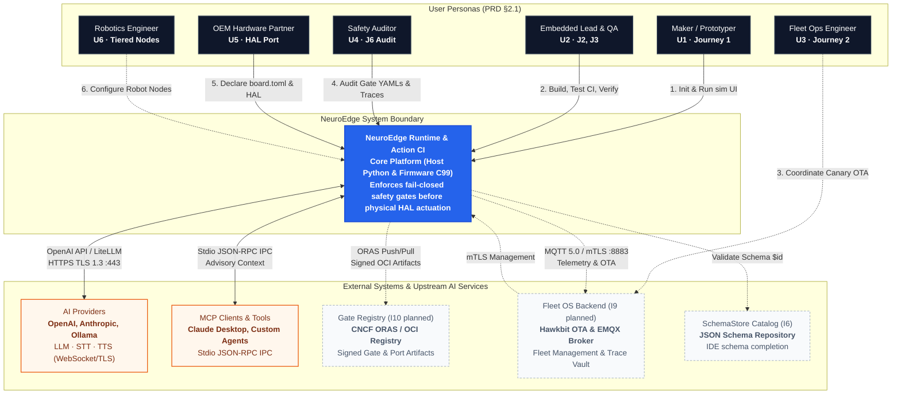

# 01 · System Context (C4 L1)

> **Status:** `done` for Core integrations, AI Providers via OpenAI API standard, and stdio MCP; `planned` for Fleet OS, public Gate Registry, and SchemaStore (I6–I10). See [`00-overview.md`](00-overview.md) for full documentation map.

---

## 1. System Context Diagram (C4 L1)

The C4 Level 1 diagram establishes NeuroEdge's central position within the Physical AI ecosystem, interfacing between human users, hardware execution environments, and external cloud services:


*Figure E-01 — NeuroEdge System Context: Actors on the left, external systems on the right. Solid lines: done · Dashed lines: planned.*



---

## 2. User Actors & Personas

Actors interacting with the system map directly to standard personas and user journeys defined in PRD §2:

| Actor | System Role | Primary Interfaces | Core Expectation |
|:---|:---|:---|:---|
| **Maker / Creative Dev (U1)** | Individual developers prototyping Physical AI applications from scratch | `neuroedge new`, `neuroedge run --ui`, Local Web UI 127.0.0.1 | **TTFV < 10 minutes** on a clean workstation; no hardware required, no cloud API keys needed (Journey 1). |
| **Embedded Lead (U2)** | Responsible for hardware safety, memory budget, and board stability | `neuroedge build`, `neuroedge test`, `verify`, Nightly CI runner | Changing prompts or changing silicon **never causes safety regressions** (door locks never unlock unexpectedly) (J2, J3). |
| **Fleet Ops Lead (U3)** | Manages fleets of deployed devices in hotels, buildings, and industrial plants | Fleet OS UI (planned I9), Remote issue trace logs | **Reproduce field incidents in 30 seconds** on a laptop via `neuroedge replay`; execute safe canary OTA without bricking devices (Journey 2). |
| **Safety Certifier / Auditor (U4)** | Approves operational safety policies and regulatory compliance | Gate YAML files, `neuroedge gate explain`, `trace.v1.json` | Review and sign off on physical safety policies **without reading Python or C code**; verify non-repudiable audit logs (J6). |
| **OEM Hardware Partner (U5)** | Silicon vendors and hardware OEMs porting NeuroEdge to new boards | `board.toml`, C HAL stubs, Compliance test suite | Fast porting **without silicon lock-in**; retains full IP ownership of custom HAL drivers (details: [`11-hal-port-guide.md`](11-hal-port-guide.md)). |
| **Robotics Engineer (U6)** | Designs autonomous mobile robots and distributed robot arms (planned I14) | Zenoh-pico, ROS 2 / Nav2 adapters, Node-level Gates | Every velocity command (`cmd_vel`) must pass an active Gate; supports deterministic hardware e-stop (Q-32..Q-38). |

---

## 3. External Systems & Protocols

### 3.1 AI Providers (LLM, STT, TTS)
* **Role:** Provides natural language comprehension, Speech-to-Text (STT), reasoning capabilities (System 2 LLM), and Speech Synthesis (TTS).
* **Protocols & Constraints:**
  * Standardized communication via **OpenAI API specification** or custom pluggable adapters (`Q-10`, `Q-12`, PRD §4.3).
  * Mandatory Transport Security: **TLS 1.3 HTTPS** (`NFR-SEC-08`). API keys are supplied strictly via process environment variables, never hardcoded in `agent.toml` or trace logs.
  * Tracing Discipline: Traces record provider name, model identifier, token count, and latency in `system_two_call` events; raw text is hashed if `--anonymize` is enabled.

### 3.2 MCP Clients (Model Context Protocol)
* **Role:** Enables modern AI agent interfaces (such as Claude Desktop, Cursor, or autonomous agents) to interact with physical actuators.
* **Protocols & Constraints:**
  * Version 1.0 supports **stdio transport** locally within the same machine (`NFR-SEC-09`).
  * Every `@action` maps directly to an MCP Tool with declared `inputSchema` and `outputSchema`.
  * **Safety Invariant:** Invocations from MCP clients receive `call_source = "mcp"` (untrusted caller) and must pass the Gate before reaching HAL (`Q-24`, `Q-27`). Network MCP (HTTP/mTLS) is deferred to Block 2 (`TODOS.md` #24).

### 3.3 Gate Registry (Planned I10)
* **Role:** Repository for storing, versioning, and distributing verified Gate policies, adapters, and community HAL ports.
* **Protocol:** OCI Artifact standard using **CNCF ORAS / Harbor**. All uploaded artifacts are cryptographically signed.
* **Current Readiness:** Version 1.0 is forward-compatible via `neuroedge gate publish` (RFC 8785 JCS SHA-256 hash) and `digests.lock` version immutability.

### 3.4 Fleet OS Backend (Planned I9)
* **Role:** SaaS device management platform providing canary OTA rollouts via Eclipse Hawkbit, telemetry routing via EMQX, and incident trace archiving (Trace Vault).
* **Protocol:** Devices connect via **MQTT 5.0 wrapped in mTLS** with unique per-device X.509 certificates (`NFR-SEC-04`).

---

## 4. Trust Boundaries & Threat Model

Following the security specification in [`docs/spec/threat_model.md`](file:///Users/minhlt/Downloads/Projects/neuroedge-init/docs/spec/threat_model.md), the system defines three distinct trust zones:

```mermaid
flowchart LR
    subgraph Untrusted["Untrusted Zone"]
        U_LLM["Cloud LLMs<br/>(Hallucinations, Prompt Injections)"]
        U_MCP["MCP Clients / External Servers<br/>(Untrusted External Callers)"]
        U_ENV["Insecure Network Environments"]
    end

    subgraph DMZ["Contract Adjudication DMZ"]
        DISP["dispatch() & Argument Bounds Check"]
        GATE["Gate Engine (100% Deterministic)"]
        CB["Circuit Breaker (Fail-Closed)"]
        TL["TokenLedger (Single-Use Tokens)"]
    end

    subgraph Trusted["Trusted Execution Zone"]
        USER["Physical User at Device<br/>(Direct UI/Button Confirmation)"]
        HAL["HAL Layer (Verifies & Burns Tokens)"]
        GPIO["Actuators / Door Locks / Relays"]
    end

    U_LLM -->|Proposes ToolCall| DISP
    U_MCP -->|Proposes ToolCall| DISP
    DISP --> GATE
    CB -.-> GATE
    GATE -- "BLOCK (Denied)" --> LOG["Trace Log / on_block"]
    GATE -- "ALLOW (Passed)" --> TL
    TL -->|Issues Token (Digest + Nonce)| HAL
    USER -->|POST /confirm| GATE
    HAL -->|Burns Token| GPIO

    style Untrusted fill:#fee,stroke:#c00,stroke-dasharray: 5 5
    style DMZ fill:#fef,stroke:#90c,stroke-width:2px
    style Trusted fill:#efe,stroke:#090,stroke-width:2px
```

1. **Zero Trust Callers:**
   * AI models (including frontier LLMs) and external MCP clients are treated strictly as untrusted inputs (`trust: untrusted`). Because they are susceptible to prompt injection and hallucinations, model output is **strictly a proposal**, never a direct command to hardware.
2. **The Only Trusted Human Confirmation:**
   * When an action is held by a Gate under `on_block: ask`, confirmation **can only be granted by an authenticated human physically present at the device** via the local terminal REPL (`:confirm`) or a same-origin local Web UI (`POST /confirm`) (`Q-26`, RFC-0006). AI models and remote callers are strictly forbidden from self-confirming.
3. **Fail-Closed Offline Guarantee:**
   * Network disconnection never disables the Gate. The system falls back seamlessly to the local command grammar (`commands.toml`, `Q-14`). If a command matches the grammar and sensor conditions pass $\rightarrow$ the Gate allows execution. If any condition fails or the fallback crashes $\rightarrow$ the circuit breaker trips, safely blocking actuation with reason `gate_unreachable`.
