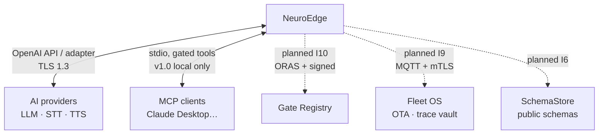

# 01 · System Context (C4 L1)

> Status: core + providers + MCP `done`; Fleet OS, Registry, public
> SchemaStore `planned` (I6–I10).

*Figure E-01 — NeuroEdge in the middle: users left, external systems right.
Dashed: planned.*

## 1. Actors (personas: PRD §2.1)

| Actor | Uses | Expects |
|:---|:---|:---|
| Maker U1 | `new`, `run --target sim`, sim UI | TTFV < 10 min, no hardware, no account (Journey 1) |
| Embed team U2 | `build`, `test`, `verify`, nightly | Prompt/board changes never regress the lock (J2, J3) |
| Fleet Ops U3 | incident traces, canary OTA (planned) | One-command field reproduction (Journey 2) |
| Safety/QA U4 | gate YAML, `gate explain`, traces | Review conditions without reading Python (J6) |
| OEM U5 | board.toml, HAL ports, compliance suite | Integration without chip lock-in (see `11-hal-port-guide.md`) |
| Robot team U6 (planned) | per-node gates, ROS 2/Nav2 adapter | Every velocity command gated (Q-32..Q-38) |

## 2. External systems

- **Providers** (P-4, `Q-10`, `Q-12`): replaceable, keys via env vars only,
  provider + model recorded in `system_two_call`, never prompts/keys.
- **MCP clients**: call device tools via `mcp serve`, **still through gates**;
  network transport with auth is deferred (`TODOS.md` #24, NFR-SEC-09).
- **Registry/Fleet/SchemaStore**: planned — today's `gate publish` digests,
  `digests.lock`, and replayable traces already reserve their place (no
  redesign when they arrive).

## 3. Trust boundary (spec: `threat_model.md`)

- **Untrusted** callers: LLMs, MCP clients, external MCP server content
  (`trust: untrusted`, digests only in traces).
- **Trusted** confirmation channel: humans via device only (`local_grammar`, `ui`).
- Offline: gates still evaluate via the local command grammar; `BLOCK`
  `gate_unreachable` only when no fallback runs (`Q-14`).
