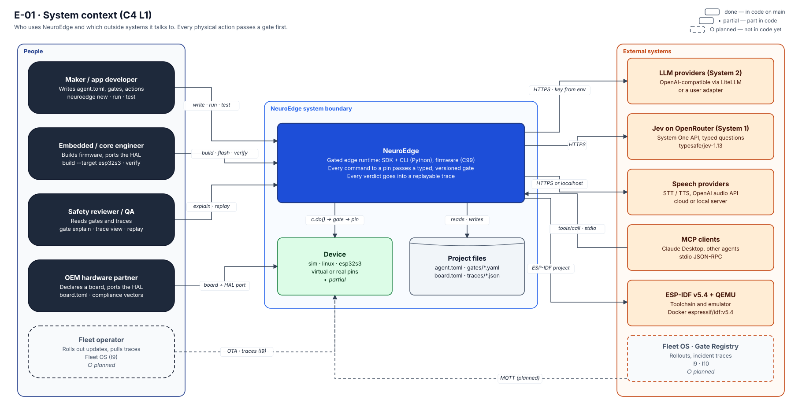
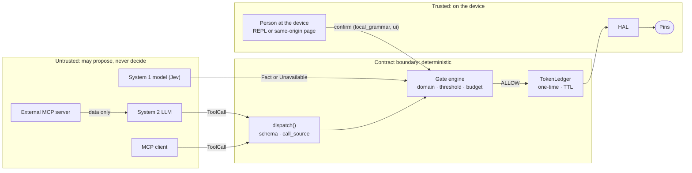

# 01 · System context (C4 L1)

> **Scope:** NeuroEdge seen from outside — who uses it, which systems it talks to, and where the trust
> boundary lies. **Sources:** `python/neuroedge/models/providers/`,
> `python/neuroedge/perception/providers/`, `python/neuroedge/mcp_server.py`, PRD §2,
> `docs/spec/threat_model.md`.

**What this chapter is for:** This chapter describes NeuroEdge at the C4 L1 level (System context). The document answers the questions: *Who are the direct users of NeuroEdge? What external services does the system integrate with (LLMs, voice, MCP, embedded devices, robots)? Where does the trust boundary lie and what data is allowed to leave the machine?* Before reading, you should grasp the overview in [`00`](00-overview.md). After this chapter, read [`02`](02-container-c4l2.md) to understand the structure of independently running processes and containers.

## 1. Context diagram

*Figure E-01 — Users on the left, external systems on the right. Dashed lines are `planned`.*

*How to read Figure E-01:* The figure shows the context boundary between users (left), the NeuroEdge system (center), and external providers (right). Solid blocks represent operating actors and connections; dashed blocks represent planned parties (`planned`). Key takeaway: external systems only propose tool calls, supply facts, or receive text/audio; no system decides a physical action on its own — every tool call still passes through the gate.

## 2. Users

| User | What they do with NeuroEdge | Main tools | Status |
|:---|:---|:---|:---|
| **Maker, application developer** | Writes agents (`agent.toml`, gate, action), runs and checks them on their own machine | `neuroedge new · run · test · record` | `done` |
| **Core and embedded engineers** | Generates firmware for an agent, flashes it to the chip, compares verdicts across environments | `build --target esp32s3 · verify · record --port` | `done` (on QEMU) |
| **Safety reviewer, QA** | Reads and approves gates without reading code; investigates a session from the trace | `gate explain · trace view · replay` | `done` |
| **OEM partner** | Declares a new board, ports HAL, proves equivalence | `board.toml`, conformance vectors | `partial` — see [`11`](11-hal-port-guide.md) |
| **Fleet operator** | Fleet management via 5 capabilities: provisioning, staged OTA updates & rollback, health monitoring and inventory, remote gate/config updates, incident trace collection; needed to update, monitor, and collect traces across hundreds or thousands of devices without manually reflashing firmware ([`neuroedge-proposal.md`](../../../roadmap/neuroedge-proposal.md) §6.2) | Fleet OS | `planned` (I9) — see [`15`](15-target-architecture.md) §3.1 |
| **Layered robot integration team** | Integrates multi-node systems via Zenoh bus, ROS 2 / Nav2 bridge; needed to decouple centralized intent on the SBC from local actuator safety on each MCU node ([`neuroedge-prd.md`](../../../roadmap/neuroedge-prd.md) U6, Q-32, Q-34) | Node firmware, Zenoh router, ROS 2 bridge | `planned` — see [`15`](15-target-architecture.md) §4.3 |

The source user groups and journeys are in PRD §2 (`U1`…`U6`, `J1`…`J7`).

## 3. External systems

Every outbound connection is **optional**: a basic install runs the whole `sim` without network or keys (Q-15). API keys are never stored in files: only the **name** of an environment variable is recorded (`api_key_env`), and the build refuses any field that looks like a key (`models/providers/common.py`).

| System | Role | Protocol and format | Code responsible | Status |
|:---|:---|:---|:---|:---|
| **LLM provider** (System 2) | Answers free-form questions, proposes tool calls | OpenAI-standard chat completions via the LiteLLM library (no proxy process — Q-10); or a `python:` adapter | `models/providers/litellm_provider.py`, `openai_chat.py` | `done` |
| **Jev on OpenRouter** (System 1) | Decides some gate criteria from the user's words | `POST {api_base}/systemone` (System One API), HTTPS required except loopback | `models/providers/systemone_api.py` | `done` |
| **Speech provider** | STT, TTS | OpenAI-standard `POST {base_url}/audio/transcriptions` and `/audio/speech` | `perception/providers/openai_audio.py` | `done` |
| **Local STT server** | Fallback STT when the primary STT fails | As above, usually `http://localhost` | `[stt.fallback]` | `done` |
| **MCP client** | Calls agent actions as tools | JSON-RPC over **stdio** (not over the network — NFR-SEC-09) | `mcp_server.py` | `done` |
| **External MCP server** | Information source for System 2 (news, lookups) | stdio; only tools on the allowlist | `mcp_host.py` | `done` |
| **ESP-IDF v5.4 and Espressif QEMU** | Compiles firmware, runs the virtual chip | ESP-IDF project generated by `build`; UART read through a file or `tcp://` | `engine/firmware.py`, `testing/uart.py` | `done` |
| **OTA image server** | Serves a signed app image | HTTP(S) GET to any static server | `components/ne_ota/` | `partial` — on QEMU |
| **Fleet OS, Gate Registry** | Fleet management (5 capabilities) and shared gate repository; needed to automate safety updates and policy distribution at scale | Planned: MQTT with a permissively licensed broker (Mosquitto, NanoMQ or VerneMQ — **not** EMQX, Q-11); OCI via ORAS and Harbor | no code yet | `planned` (I9, I10) — see [`15`](15-target-architecture.md) §3.1, §3.2 |
| **ROS 2 / Nav2** | Navigation and motion planning system; receives velocity commands only through the gate; needed to leverage the robot ecosystem without compromising safety ([`neuroedge-prd.md`](../../../roadmap/neuroedge-prd.md) §14, Q-34) | ROS 2 messages/actions via bridge on Linux SBC | No code yet (out of core) | `planned` (I14) — see [`15`](15-target-architecture.md) §4.3 |
| **Zenoh router** | Transmission network between agent host (Pi) and MCU nodes; untrusted "black channel" (IEC 61784-3 — [`draft-ke-hoach-mo-rong-robot-fofoca.md`](../../../roadmap/draft-ke-hoach-mo-rong-robot-fofoca.md) §4.2); Zenoh-pico per Q-36 | Eclipse Zenoh (`zenohd` on host, `zenoh-pico` on MCU, Apache-2.0 branch) | No code yet | `planned` (I14) — see [`15`](15-target-architecture.md) §4.3 |

## 4. Trust boundary

```mermaid
flowchart LR
    subgraph Untrusted["Untrusted: may propose, never decide"]
        LLM["System 2 LLM"]
        JEV["System 1 model (Jev)"]
        MCPC["MCP client"]
        EXT["External MCP server"]
    end
    subgraph Contract["Contract boundary: deterministic"]
        DISP["dispatch()<br/>schema · call_source"]
        GATE["Gate engine<br/>domain · threshold · budget"]
        LEDGER["TokenLedger<br/>one-time · TTL"]
    end
    subgraph Local["Trusted: on the device"]
        PERSON["Person at the device<br/>REPL or same-origin page"]
        HAL["HAL"]
        PIN(["Pins"])
    end
    LLM -- "ToolCall" --> DISP
    MCPC -- "ToolCall" --> DISP
    EXT -- "data only" --> LLM
    JEV -- "Fact or Unavailable" --> GATE
    DISP --> GATE
    GATE -- "ALLOW" --> LEDGER --> HAL --> PIN
    PERSON -- "confirm (local_grammar, ui)" --> GATE
```

Four rules define the boundary, each with a test in `docs/spec/threat_model.md` §2b:

1. **Models and clients only propose.** LLMs and MCP clients can only submit a `ToolCall` through `dispatch()`. A tool that does not exist or an ill-typed argument ⇒ `REJECTED`, no verdict is computed.
2. **The call source is assigned by the runtime, not declared by the caller.** `call_source` is injected by the dispatcher as a trusted fact; a gate can refuse an action for the `mcp` or `system_two` source alone.
3. **A model's answer is a fact, not a verdict.** Jev returns `Fact` or `Unavailable`, then is checked against the value domain and the confidence threshold before entering the gate. A model never returns `ALLOW`. Content from an external MCP server is marked "untrusted data"; any call it leads to must still pass the gate.
4. **Only a person at the device can confirm.** When the gate asks (`on_block: ask`), only two channels may answer: `local_grammar` (typing or saying "yes") and `ui` (a button on the same-origin 127.0.0.1 page) (Q-26). System 2 and MCP clients have no way to confirm instead.

Out of scope, stated explicitly: MCP over the network (stdio only in v1.0), attackers inside the same process, and certified functional safety (`docs/spec/threat_model.md` §3, §3b).

## 5. Data leaving the machine

| To | Data sent | Never sent |
|:---|:---|:---|
| LLM (System 2) | User sentences, tool list, turn history | API keys (read from environment variables only), verdict tokens |
| Jev (System 1) | **The user's words only** and typed questions for each criterion | Action names, arguments, session facts; an MCP call nobody spoke sends nothing |
| STT | The audio clip of one turn | — |
| TTS | The reply to be spoken | — |
| Camera / vision *(`sim`, `linux`: `done`; `esp32s3`: planned)* | To vision models; the maker declares `bool`/`level`/`choice` facts with a numeric confidence, and the gate locks the threshold with the `numeric` criterion (Q-54, `neuroedge-design-phase2.md` §2.2) | The trace does not embed raw frames: by default only the SHA-256 hash and dimensions are stored; raw image storage must be explicitly enabled (`metadata.raw_capture`, phase2 §2.3, TSK-V1b-08) — see [`15`](15-target-architecture.md) §4.4 |

By default the trace stores decisions only: raw text (typed sentences, transcripts) is hashed at the source (NFR-PRIV-03); `--raw` is the explicit opt-in that keeps it verbatim, and that trace carries `metadata.anonymized = false` (NFR-PRIV-04). Audio is never stored in the trace.
