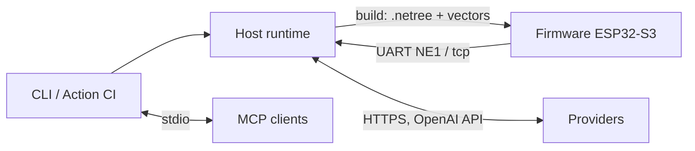

# 02 · Containers (C4 L2)

> Status: host runtime + firmware walker + CLI/CI `done`;
> Fleet/Registry/extensions `planned` (I8–I18).

*Figure E-02 — 3 done containers (solid) + 2 planned areas (dashed).*

## 1. Done containers

| Container | Technology | Contains | Talks via |
|:---|:---|:---|:---|
| Host Python runtime | Python 3.11+, `neuroedge` package | engine, actions, hal, models, perception, sim, mcp, testing, trace, viz | HTTPS to providers; UART/TCP for `NE1` device traces |
| ESP32-S3 firmware | C/C++ on ESP-IDF | `ne_gate` (walker), `ne_token` (ledger), `ne_trace` (`NE1` lines), `main` (boot → selftest → vector replay → network/idle) | UART `NE1`, Wi-Fi WebSocket binary Opus + JSON events |
| CLI + Action CI | Typer + Rich, pytest | `run`, `build`, `verify`, `replay`, `record`, `trace view/export`, `gate lint/resolve/publish/explain` | Same `trace.v1` traces; exit codes 0/1/2 (PRD FR-CLI) |

## 2. Planned containers (reserved today)

| Container | Increment | What today's architecture already reserves |
|:---|:---|:---|
| Fleet OS | I9 | Traces are replayable JSON Lines; `device_id` in `metadata`; OTA A/B + signing in FR-OTA |
| Gate Registry | I10 | `gate publish` prints JCS digests; `digests.lock` pins golden gates; digest-pinned `extends` |
| NeuroBrain | I12 | `neuroedge.brain` (planned) may only reach HAL via `dispatch()` → gates (invariant B-1) |
| Multi-node robot | I14 | Each node owns HAL + gates; Zenoh-pico wire (`Q-36`); lease tokens for `motion.*` (`Q-37`) |
| Vision / Jetson | I15–I17 | `vision.in` primitive via its own RFC; target tiers 2/3 (`Q-13`, RFC-0002 PR2) |

Evolution details: `13-evolution-i0-i18.md`.
