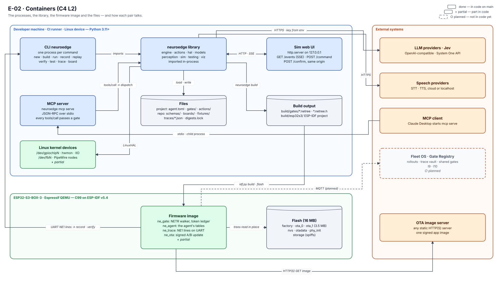

# 02 · Containers and process boundaries (C4 L2)

> **Scope:** the independently running blocks — processes, libraries, firmware, file stores — and how each
> pair talks. **Sources:** `python/pyproject.toml`, `python/neuroedge/cli/`, `sim/ui.py`,
> `mcp_server.py`, `targets/esp32s3/`, `.github/workflows/`.

## 1. Container diagram

*Figure E-02 — Containers on a dev machine or Linux device (top), on the chip (bottom), and external systems (right).*

## 2. Container catalogue

| Container | Technology | Responsibility | Entry point | Status |
|:---|:---|:---|:---|:---|
| **`neuroedge` CLI** | Python 3.11+, Typer, Rich | Each command is a process: loads a session, turns errors into three-part messages and exit codes; never decides a gate itself | `neuroedge.cli.main:app` | `done` |
| **`neuroedge` library** | Python (source-available core code — Q-45); core dependencies: `pydantic`, `jsonschema`, `pyyaml`, `rfc8785`, `deepdiff`, `typer`, `rich` | All logic: gate engine, actions, HAL, models, voice, sessions, Action CI | `import neuroedge` | `done` |
| **Session web UI** | Standard-library `http.server.ThreadingHTTPServer`, 127.0.0.1 only | Shows the virtual device and the verdict stream; accepts typed commands and the confirmation button from a person present | `run --ui`, `mcp serve --ui` | `done` (`sim` only) |
| **MCP server** | MCP Python SDK (extra `mcp`), stdio | Exposes each `@action` as a tool; every `tools/call` passes the gate | `neuroedge mcp serve` | `done` |
| **Files** | Local filesystem | Agent project (`agent.toml`, `commands.toml`, `knowledge.toml`, `gates/`, `actions/`, `traces/`); repository data (`schemas/`, `gates/`, `boards/`, `fixtures/`, `digests.lock`) | — | `done` |
| **Build output** | Filesystem | `build/gates/` (JSON tree, gate artifact, `NETR`, C header); `build/esp32s3/` (full ESP-IDF project) | `neuroedge build` | `done` |
| **Linux device** | Linux kernel: libgpiod v2, sysfs hwmon/IIO, framebuffer, PipeWire | Real pins, sensors, display, audio for `LinuxHAL` | `--target linux` | `partial` — tested on virtual hardware, not yet on a Pi |
| **Firmware image** | C99, ESP-IDF v5.4 | `NETR` walker, token ledger, agent tables, UART trace, OTA; boot self-test | `app_main` | `partial` — runs on QEMU, does not drive pins yet |
| **Flash** | 16 MB, partition table `partitions.csv` | `factory`, `ota_0`, `ota_1` (3.5 MB per slot); `nvs`, `otadata`, `phy_init`, `storage` | — | `done` |
| **Fleet OS, Gate Registry** | Not fully chosen; Eclipse Hawkbit (Q-11), ORAS and Harbor are settled | Fleet management; signed gate repository | — | `planned` (I9, I10) |

## 3. Process and thread model

NeuroEdge has no background process that runs forever. Everything lives in the process of the command being run.

| Situation | Process | Threads and event loop |
|:---|:---|:---|
| `run -c`, `run` (REPL), `record` | One `neuroedge` process | A fresh `asyncio` loop per turn (`asyncio.run(session.handle(text))`) |
| `run --ui` | As above, plus the HTTP server | `ThreadingHTTPServer` HTTP thread; each turn runs under a shared lock; SSE pushes state on change or every 1 second |
| `mcp serve` | Child process started by the MCP client | One `anyio` loop; the `turns` lock guarantees one call at a time |
| `mcp serve --ui` | As above, plus the web page | MCP calls and page turns share one session and one lock |
| `--target linux` | As above | Timed GPIO pulses are released by `threading.Timer`; SIGTERM/SIGHUP return every line to rest before exit |
| Firmware | One `app_main` task | No FreeRTOS task is created; every boot step runs sequentially ([`04`](04-component-device-c4l3.md) §3) |

Consequence: an MCP connection to an external server lives for one turn only (`TODOS.md` #25), and a stuck I2C bus can hold the loop for about one second (`TODOS.md` #48).

## 4. Communication matrix

Only what is in the code is recorded. No latency budget here is measured; latency thresholds are NFRs (PRD §9.1) and their measurement status is in [`08`](08-nfr.md).

| Source → Destination | Channel | Format | Control |
|:---|:---|:---|:---|
| CLI → library | In-process function call | Python objects | — |
| Browser ↔ web UI | HTTP on 127.0.0.1: `GET /events` (Server-Sent Events), `GET /state`, `POST /command`, `POST /confirm` | JSON; body max 4096 bytes | `Host` and `Origin` must be 127.0.0.1 or localhost with the correct port, otherwise 403 |
| MCP client → MCP server | stdin/stdout of the child process | JSON-RPC (MCP); results carry `outputSchema` | Every call carries the `mcp` source and passes the gate; `BLOCK` is not an error, `REJECTED` is an error |
| Library → LLM | HTTPS (LiteLLM) | OpenAI-standard chat completions | Keys are read from environment variables only; never enter the trace |
| Library → Jev | HTTPS, `POST {api_base}/systemone` | JSON: `model`, `state.utterance`, `questions` | HTTPS required except loopback; only the user's words are sent; standard-library client (`net.py`): no redirects, no proxy, with a deadline |
| Library → STT/TTS | HTTPS or `http://localhost` | OpenAI-standard audio API | `http://` to another machine with a key present ⇒ the build refuses; same `net.py` client |
| Library → Linux device | Device nodes `/dev/gpiochipN`, sysfs, `/dev/fbN`, PortAudio | libgpiod v2, text files, pixels | Lines are looked up by **name**; a missing device ⇒ error before any line is held |
| Library → build output → firmware image | `idf.py build` reads the generated project | C, header `.netree.h`, `version.txt` | A failing build ⇒ prints every problem, writes no files |
| Firmware image → library | UART (log file, `tcp://`, serial port) | `NE1 {…}` lines ≤ 512 bytes, the `device_info` … `trace_end` frame | A corrupt line, a missing frame, a count mismatch ⇒ `NE4001`, nothing is written |
| Firmware image → OTA server | HTTP(S) GET | RSA-3072-signed app image | No redirects; download deadline; a bad signature ⇒ erase the slot just written |
| Firmware image → Fleet OS | MQTT | — | `planned` (I9) — see [`15`](15-target-architecture.md) §3.1 |
| Firmware image ↔ provider *(planned)* | WebSocket (TLS 1.3) | Opus (binary 16 kHz audio) and JSON (events/results) ([`neuroedge-prd.md`](../../../roadmap/neuroedge-prd.md) Appendix D.2) | MCU-optimized audio streaming termination point (FR-GW-04, TSK-S5-06); per-device quota is an optional provider layer feature (FR-GW-05, v1.1) — see [`15`](15-target-architecture.md) §2.3 |
| MCP client ↔ MCP server over network *(planned)* | Streamable HTTP (TLS 1.3) | JSON-RPC (MCP) | OAuth 2.1 (Protected Resource Metadata RFC 9728, RFC 8414) behind mTLS (TSK-P2-04, Q-32) — see [`15`](15-target-architecture.md) §4.3 |

## 5. Planned containers

Only technologies named in the planning documents are recorded; everything else is "not chosen".

| Container | Increment | Named technology | Not chosen | Source | Target architecture |
|:---|:---:|:---|:---|:---|:---|
| **Fleet OS** | I9 | Eclipse Hawkbit for staged OTA campaigns; permissively licensed MQTT broker (Mosquitto, NanoMQ or VerneMQ, chosen by load measurement); FastAPI WebSockets for connection and telemetry; audio does not pass through Fleet OS — it terminates at the self-hosted provider layer (Q-47, FR-GW-04) | Central trace store, database, gateway | Q-11, Q-47, proposal §6.2, roadmap §3.4, §6.1 | [`15`](15-target-architecture.md) §3.1 |
| **Gate Registry** | I10 | OCI standard with ORAS and Harbor; OpenMeter for metering | Specific gate signing mechanism (only records "OCI/ORAS", TSK-W2-04) | roadmap §6.2, Q-5 | [`15`](15-target-architecture.md) §3.2 |
| **Robot node (MCU node)** | I14 | Zenoh-pico on MCU and `zenohd` on Pi (micro-ROS is plan B only); mTLS or PSK between Pi and node; watchdog / black channel local safety (IEC 61784-3) | Intent encryption on the wire, clock synchronization | Q-36, node RFC draft, `draft-ke-hoach-mo-rong-robot-fofoca.md` §4 | [`15`](15-target-architecture.md) §4.3 |
| **Vision Pipeline** | I2a, I3a (basic); I16–I17 (`jetson`, multimodal) | `vision.in` vision HAL on `sim`, `linux` and `esp32s3` (RFC-0012, TSK-V1b-07; Q-53), then `jetson`; the maker declares `bool`/`level`/`choice` facts with a numeric confidence from the model label, and the gate locks the threshold with the `numeric` criterion (Q-54; `neuroedge-design-phase2.md` §2.2); dedicated gate semantics for vision evidence stay open (TSK-V3-04); the trace does not embed raw frames, raw storage must be explicitly enabled (phase2 §2.3) | Specific choice among named frameworks (ONNX Runtime/YOLO, HailoRT/Edge TPU, TensorRT) and models | `neuroedge-design-phase2.md` §2, TSK-V1b-07, TSK-V3-04 | [`15`](15-target-architecture.md) §4.4 |

What the current architecture already prepares for these containers is in [`13`](13-evolution-i0-i18.md) §3.
