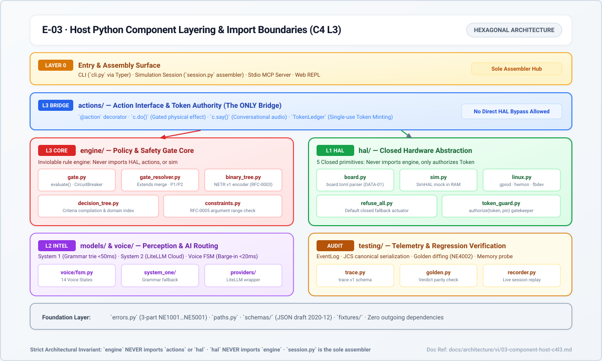
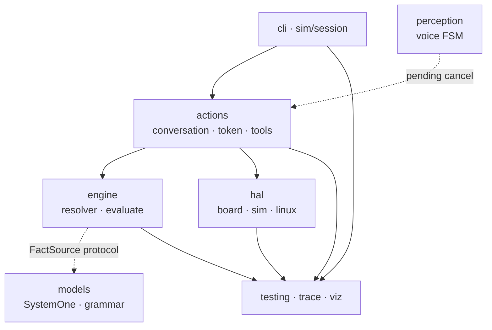

# 03 · Host Python Components (C4 L3)

> Status: `done` (I0–I4). Code: `python/neuroedge/`
> (repo map: `CONTRIBUTING.md` §6).

*Figure E-03 — host layer stack. Arrows: allowed dependency direction.*

## 1. Layer matrix

| Layer | Key files | Responsibility | Imported by | Must not import |
|:---|:---|:---|:---|:---|
| Foundation | `errors.py`, `paths.py`, `trace.py` | 3-part `NE…` errors; repo/wheel root lookup; `trace.v1` validation | every layer | no internal imports |
| L3 core · engine | `engine/gate_resolver.py`, `constraints.py`, `gate.py`, `decision_tree.py`, `binary_tree.py`, `compiler.py`, `circuit_breaker.py`, `latency.py`, `canonical.py` | `extends` resolution + 5 principles; `evaluate` → verdicts; tree compile + NETR; `build`-time checks; breaker; per-stage latency | `actions`, `sim`, `cli`, `testing` | `actions`, `hal`, `sim`, `models` (except `compiler → hal/board`) |
| L3 surface · actions | `actions/spec.py`, `conversation.py`, `token.py`, `tools.py`, `confirmation.py` | `@action`; `c.do()/c.say()`; single-use `TokenLedger` (TTL=`p95×3`); `dispatch()`; `ask` confirmations | `sim`, `cli`, `testing`, `mcp_*` | `sim`, `cli` |
| L1 · hal | `hal/__init__.py`, `board.py`, `digital.py`, `sim.py`, `linux.py`, `sysfs.py`, `framebuffer.py` | 5 closed primitives; `BoardProfile`; `digital_out` requires `authorize(token)`; refuse-all by default | `actions` (via `digital.grant`), `sim`, `testing` | `engine`, `actions` |
| L2 · models | `models/system.py`, `grammar.py`, `knowledge.py`, `providers/` | `SystemOne` bool/level/choice + grammar fallback; open-ended `SystemTwo`; LiteLLM/adapters behind `providers/` | `engine` (via `FactSource` protocol), `sim` | provider SDKs directly in core |
| L2 · perception | `perception/voice_fsm.py`, `voice_session.py` | 5-state FSM + injected clock; never decides gates, never drives pins; only cancels pendings + closes tokens on barge-in | `sim` | `hal` directly (pendings are injected) |
| L0 · sim/cli | `sim/session.py`, `sim/ui.py`, `cli/` | **Only assembler**: `load()` wires HAL+engine+models+tools+MCP; REPL; `--ui` page | — (top) | — |
| Observability | `engine/trace_sink.py`, `testing/recorder.py`, `player.py`, `golden.py`, `assertions.py`, `viz/` | Shared `EventLog.emit` bus; record/anonymize; recompute replay; golden compare; HTML/Perfetto | `cli`, `sim` | decision logic |

## 2. Dependency laws (architectural invariants)

1. `engine` knows nothing of `hal`/`actions`/`sim` — only the `FactSource`
   protocol (plus `board` for `compiler`).
2. `hal` knows nothing of `engine` — only `authorize(token)` and logical pin names.
3. The only `engine ↔ hal` bridge is `actions/conversation.py`.
4. `sim/session.py` is the only place that sees everything to wire a session.
5. `EventLog` is the shared bus: engine, hal, conversation, SystemTwo, FSM all
   `emit()` into one validatable trace.

Violating 1–3 in review is grounds to reject a PR (wrong-layer branching
breaks target equivalence, P-2).
