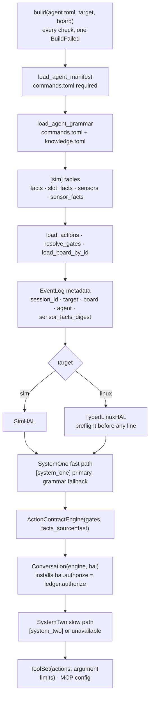

# 03 · Host-side components (C4 L3)

> **Scope:** the Python package `python/neuroedge/` — its subpackages, the responsibility of each package, the real
> dependencies between them, the protocols that connect them, and the assembly point. **Sources:** the code
> in `python/neuroedge/`; the dependency graph is locked down by the test
> [`test_architecture_layers.py`](../../../python/tests/test_architecture_layers.py).

## 1. Component diagram


*Figure E-03 — Subpackages ordered by dependency direction: a package above uses packages below, never the reverse.*

## 2. Layers and dependency rules

Each package's docstring names its own layer: HAL is **L1**, models and perception are **L2**, engine and actions are **L3** ("Action Contract"), targets are **L0**. Ordered by real dependency direction, from the bottom up:

| Rank | Package | Depends on | Layer |
|:---:|:---|:---|:---|
| 0 | `errors`, `paths`, `net`, `trace` | each other only | foundation |
| 1 | `hal` | `errors`, `paths` | L1 |
| 2 | `engine` | rank 0; **`engine/compiler.py` alone** may use `hal` (board cross-check at build time) and late-imports `actions`, `models`, `perception`, `mcp_host` (configuration checks) | L3 core |
| 3 | `actions` | `engine`, `hal`, rank 0 | L3 surface |
| 4 | `models` | `engine` (implements its protocol), `net`, rank 0 | L2 |
| 5 | `mcp_server`, `mcp_host`, `mcp_desktop` | `actions`, rank 0 | L4 per proposal §3.1 (docstring does not declare a layer) |
| 6 | `viz`, `templates` | `viz`: `hal`, `trace`, rank 0; `templates`: `errors`, `paths` | tools |
| 7 | `sim` | every rank below | L0, **assembly point** |
| 8 | `perception` | `sim` (the voice session wraps the typed session), `models`, `actions`, `engine`, `hal`, `net` | L2 |
| 9 | `testing` | `perception`, `actions`, `engine`, `hal`, `trace`; late-imports `sim` (and `sim/serve.py` late-imports `testing` for the trace recorder, only when `trace_out` is given) | Action CI |
| 10 | `studio` | every layer below except `cli` — the local web app `neuroedge studio` that shows every capability (TSK-I1-04, `docs/spec/studio.md`) | tooling |
| 11 | `cli` | every package | entry |

Between L2 and L3 lies the principle of dependency inversion: System 1 adapters of L2 in `models/` (`SystemOne`, `CommandGrammar`, `systemone_api`) implement the `FactSource` protocol of `engine/gate.py` (L3), instead of L3 depending on L2.

Four rules, each a deliberate choice:

1. **A pure engine core.** `gate.py`, `gate_resolver.py`, `decision_tree.py`, `binary_tree.py`, `verdict.py` do not know that HAL, actions or models exist. They receive facts through the `FactSource` protocol and return `GateResult`. That is what makes gate resolution a pure function (invariant 4).
2. **HAL is a leaf.** `hal` depends only on `errors` and `paths`. It does not know what a gate is: it only calls an `authorize(token, pin, called_from)` function installed from outside, and the default function refuses every command.
3. **One single bridge between gate and HAL:** `actions/conversation.py` (`Conversation.do`). No other package both calls `evaluate()` and touches a pin.
4. **One runtime assembly point:** `SimSession.load` (`sim/session.py`) creates and wires the engine, token ledger, HAL, models, tool set and MCP. `VoiceSession` wraps a `SimSession`; the CLI, the MCP server and the corpus runner all go through it. At build time, the assembly point is `engine/compiler.py::build`.

### 2.1 Planned packages

The following packages are planned in the future architecture but have no code in the repository today:

- `brain/` (I4a, NeuroBrain): lab orchestration logic; complies with invariant B-1 — acts physically only through `dispatch()` and gates, never calls HAL directly, locked down by AST scan and import tests (`neuroedge-design-neurobrain.md` §1 "Seven principles"; TSK-N1-07, `tests/test_brain_boundary.py`) — see [`15`](15-target-architecture.md) §4.2.
- `perception/vision/` and `sim/vision/` (I2a, TSK-V1b-*): vision pipeline and vision simulation; vision serves as L2 input, entering the gate as maker-declared facts (Q-54) — see [`15`](15-target-architecture.md) §4.4.
- `services/fleet/` and `services/registry/` (I9–I10, TSK-K2, TSK-K3): server-side services for Fleet OS (staged OTA coordination, MQTT broker, telemetry) and Gate Registry (OCI repository via ORAS/Harbor, metering) — see [`15`](15-target-architecture.md) §3.1, §3.2.

When `brain/` enters the repository, it needs an entry in `ALLOWED` (and `LAZY` if late-imported) of [`python/tests/test_architecture_layers.py`](../../../python/tests/test_architecture_layers.py). `perception/vision/` and `sim/vision/` belong to the existing `perception` and `sim` units and thus need no new entry; `services/` (including `services/metering/engine.py`, TSK-K3-02) lives outside the `neuroedge` package, so this test does not scan it.

## 3. Component catalogue

### 3.1 `engine/` — the action contract engine

| Module | Responsibility | Main types and functions |
|:---|:---|:---|
| `gate_resolver.py` | Merges the `extends` chain into one `ResolvedGate`, enforces the five inheritance principles and RFC-0004/0005/0006; looks up `neuroedge://` in the gate directory | `GateRegistry`, `ResolvedGate`, `resolve_gate_file`, `resolve_gate_uri` |
| `constraints.py` | Normalises an `allow_when` clause into a set of accepted values; compares strictness | `Constraint.is_at_least_as_strict_as`, `parse_allow_when` |
| `arguments.py` | Argument limits (RFC-0005): check, narrow-only merge, schema hints | `check`, `merge_arguments`, `schema_hint` |
| `canonical.py` | RFC 8785 canonical JSON and SHA-256 hashing | `canonicalize`, `digest`, `gate_digest` |
| `decision_tree.py` | Compiles a gate into an internal JSON tree; walks the tree (the Python version the C walker must match) | `compile_tree`, `walk`, `known_failure`, `truth_table` |
| `binary_tree.py` | Encodes the tree into `NETR` v1 for the chip; generates the C header | `encode`, `c_header`, `domain_index` |
| `gate.py` | Evaluates a gate: checks arguments, gathers facts within the time budget, walks the tree, applies `on_block` and `budget.fail` | `ActionContractEngine.evaluate`, `GateResult`, the `FactSource` protocol |
| `verdict.py` | Verdict vocabulary | `GateVerdict`, `Reason`, `Fact`, `Unavailable` |
| `circuit_breaker.py` | Trips the primary model after repeated consecutive errors; only routes, never creates `ALLOW` | `DegradationBreaker` |
| `trace_sink.py` | Session event log, exports `trace.v1` | `EventLog.emit`, `EventLog.to_trace` |
| `latency.py` | Per-stage latency and the System 1 / System 2 ratio | `TurnMeter`, `turn_summary` |
| `gate_explain.py` | Data for `gate explain`: where a criterion comes from, what was tightened | `explain_gate_file` |
| `compiler.py` | `neuroedge build`: cross-checks agent ↔ board, validates every configuration table, writes artifacts; collects **every** problem into one `BuildFailed` | `build`, `load_agent_manifest`, `check_capabilities` |
| `firmware.py` | Generates the ESP-IDF project for an agent: `ne_agent` component, `version.txt`, copies firmware code | `render_project`, `firmware_problems`, `checks` |

### 3.2 `actions/` — the physical action surface

| Module | Responsibility | Main types and functions |
|:---|:---|:---|
| `spec.py` | `@action`: registers an action, its gate, the capability it needs; calling the function directly ⇒ `NE1001` | `action`, `ActionSpec`, `REGISTRY` |
| `conversation.py` | `c.do()`: gate → token → function body → close token; `degrade` fallback; opens an `ask` question. `c.say()` speaks, without passing the gate | `Conversation.do`, `confirm`, `say`, `ActionResult` |
| `token.py` | The single-use verdict token ledger, TTL = p95 × 3; is HAL's `authorize` function | `TokenLedger.issue`, `authorize`, `close`, `VerdictToken` |
| `tools.py` | Each `@action` is a tool; `dispatch()` is the only path from a tool call to a pin | `ToolCall`, `dispatch`, `ToolResult`, `input_schema` |
| `confirmation.py` | `on_block: ask` questions: who may answer, when they expire, bound to the gate digest | `ConfirmationBook.open`, `take`, `PendingConfirmation` |

### 3.3 `hal/` — hardware abstraction layer

| Module | Responsibility |
|:---|:---|
| `__init__.py` | `HardwareAbstractionLayer`: checks the pin name **before** calling `authorize` (a typo costs no token), then records the command |
| `board.py` | Reads and validates `boards/*.toml`; the five primitives (`PRIMITIVES`), three targets (`SUPPORTED_TARGETS`), the reference board |
| `digital.py`, `sensor.py`, `display.py` | API for the `@action` body: `digital.out("door_lock").pulse(...)`, `sensor.read(...)`, `display.show(...)`; `digital.out` outside `c.do()` ⇒ `NE1001` |
| `sim.py` | `SimHAL`: virtual pins, sensors, display, microphone, speaker; timed commands cancelled on barge-in |
| `linux.py` | `LinuxHAL`, `TypedLinuxHAL`: GPIO lines through libgpiod v2 looked up by name; checks every device before holding a line; releases every line on exit |
| `sysfs.py` | hwmon and IIO sensors, looked up by label; never returns a default value |
| `framebuffer.py` | In-memory display or `/dev/fbN` |
| `audio.py` | Standard library: WAV read/write, energy VAD, 20 ms frames, speaker timeline |

### 3.4 `models/` — System 1, System 2, grammar, knowledge

| Module | Responsibility |
|:---|:---|
| `system.py` | `SystemOne` (implements `FactSource`: primary model then fallback, with a circuit breaker) and `SystemTwo` (LLM, with fallback, records `system_two_call`) |
| `grammar.py` | Fixed command grammar from `commands.toml`: normalisation, pattern matching, `difflib` score; `GrammarAdjudicator` decides criteria from the command sentence |
| `knowledge.py` | Local knowledge from `knowledge.toml`, deterministic retrieval |
| `providers/` | **The only place that names a provider.** LiteLLM (late import), System One API (Jev), the `python:pkg.mod:factory` adapter, common rules for every configuration table (no keys in files, endpoint checks) |

### 3.5 `perception/` — voice

| Module | Responsibility |
|:---|:---|
| `voice_fsm.py` | Five-state conversation state machine (`IDLE`, `LISTENING`, `THINKING`, `SPEAKING`, `BARGE_IN`) per `docs/spec/voice_fsm.md`; never evaluates a gate or touches a pin |
| `voice_session.py` | Places the state machine in front of a `SimSession`: audio frames → VAD or wake word → STT → the same path as a typed command; virtual time |
| `providers/` | OpenAI-standard STT/TTS, wake word (openWakeWord or an adapter), fake providers for tests |

### 3.6 `sim/`, MCP, `testing/`, `viz/`, `cli/`

| Component | Responsibility |
|:---|:---|
| `sim/session.py` | `SimSession`: the assembly point for an agent on `sim` or `linux`; handles one turn (`handle`), one tool call (`call_tool`), one confirmation answer |
| `sim/ui.py` | `SessionServer`: web UI for the same session, SSE, same-origin checks |
| `sim/serve.py` | The shared stdio MCP serving loop: `neuroedge mcp serve` and `neuroedge.serve_mcp` (the public Python function, `docs/spec/python_api.md`) both call `run_stdio` |
| `mcp_server.py` | The agent becomes an MCP server over stdio; one call at a time |
| `mcp_host.py` | System 2 as MCP host: device tools through the agent's own MCP server (still through the gate), information tools from external servers per the allowlist |
| `testing/` | Action CI: `TraceRecorder`, `TracePlayer`, `GoldenComparator`, the assert library, UART reading, runs tool-call and voice corpora |
| `viz/` | Self-contained HTML pages for `trace view` and the web UI; Perfetto export |
| `cli/` | Typer: every command; errors become three-part messages and exit codes 0/1/2 |

## 4. Protocols connecting the components

These are the seams an engineer will implement or replace. Signatures are taken verbatim from the code.

```python
# engine/gate.py — nguồn dữ kiện cho gate (SystemOne, GrammarAdjudicator, SystemOneApi hiện thực nó)
class FactSource(Protocol):
    async def adjudicate(self, criterion: str, definition: Mapping[str, Any],
                         state: Mapping[str, Any] | None, deadline_ms: float) -> Fact | Unavailable: ...

# hal/__init__.py — HAL không biết gate; nó chỉ hỏi hàm authorize được lắp vào
Authorizer = Callable[[Any, str, str], None]          # (token, pin, called_from) -> None hoặc raise

# actions/token.py — sổ token là hàm authorize của HAL
class TokenLedger:
    def issue(self, *, gate: str, gate_digest: str, action: str, pins: frozenset[str],
              session_id: str, p95_ms: float) -> VerdictToken: ...
    def authorize(self, signature: Any, pin: str, called_from: str) -> None: ...
    def close(self, token: VerdictToken) -> None: ...

# actions/tools.py — đường duy nhất từ một tool call tới chân
async def dispatch(conversation: Conversation, tools: ToolSet, call: ToolCall) -> ToolResult: ...

# engine/trace_sink.py — mọi thành phần ghi vào một nhật ký của phiên
class EventLog:
    def emit(self, type: str, data: dict[str, Any]) -> None: ...

# models/providers/base.py — nhà cung cấp System 2
class Provider(Protocol):
    def __call__(self, task: str, name: str | None, state: Mapping[str, Any] | None) -> Any: ...

# perception/providers/base.py và wake.py — giọng nói
class SpeechToText(Protocol):
    def transcribe(self, clip: AudioClip) -> str | Transcript | Awaitable[str | Transcript]: ...
class TextToSpeech(Protocol):
    def synthesize(self, text: str) -> Speech | Awaitable[Speech]: ...
class WakeWordDetector(Protocol):
    def detect(self, frame: AudioFrame) -> tuple[str, float] | None: ...
```

## 5. Assembling a session

`SimSession.load(agent_toml, target=...)` performs exactly the following steps, in order; if any step fails, no session is created and no GPIO line is held.


```mermaid
flowchart TB
    A["build(agent.toml, target, board)<br/>every check, one BuildFailed"] --> B["load_agent_manifest<br/>commands.toml required"]
    B --> C["load_agent_grammar<br/>commands.toml + knowledge.toml"]
    C --> D["[sim] tables<br/>facts · slot_facts · sensors · sensor_facts"]
    D --> E["load_actions · resolve_gates · load_board_by_id"]
    E --> F["EventLog metadata<br/>session_id · target · board · agent · sensor_facts_digest"]
    F --> G{"target"}
    G -- sim --> H1["SimHAL"]
    G -- linux --> H2["TypedLinuxHAL<br/>preflight before any line"]
    H1 --> I["SystemOne fast path<br/>[system_one] primary, grammar fallback"]
    H2 --> I
    I --> J["ActionContractEngine(gates, facts_source=fast)"]
    J --> K["Conversation(engine, hal)<br/>installs hal.authorize = ledger.authorize"]
    K --> L["SystemTwo slow path<br/>[system_two] or unavailable"]
    L --> M["ToolSet(actions, argument limits) · MCP config"]
```

Fact order for the gate in a session: `[sim.facts]` → `[sim.slot_facts]` → `[sim.sensor_facts]` (sensors are read on every gathering pass) → the `[system_one]` primary model for the criteria assigned to it → the command grammar.

## 6. External dependencies

The core needs only seven libraries; each optional capability is an extra, late-imported in the exact function that needs it — if it is missing, the three-part error names the extra to install.

| Extra | Package | Late-imported in |
|:---|:---|:---|
| (core) | `typer`, `rich`, `pydantic`, `jsonschema[format-nongpl]`, `pyyaml`, `rfc8785`, `deepdiff` | — |
| `mcp` | `mcp` | `mcp_server.py::_sdk`, `mcp_host.py::ToolHost.__aenter__` |
| `cloud` | `litellm==1.102.0` | `models/providers/litellm_provider.py::_import_litellm` |
| `linux` | `gpiod` (LGPL, hence optional only) | `hal/linux.py::_import_gpiod` |
| `audio` | `sounddevice` | `hal/linux.py::_import_sounddevice`, backend `live` only |
| `wake` | `openwakeword`, `onnxruntime` | `perception/providers/wake.py` |
| `serial` | `pyserial` | `testing/uart.py` |

HTTP to Jev and to STT/TTS uses the standard library (`net.py`): no redirects, no proxy, with deadlines and size limits.

## 7. Extension points

| To add | Do it in | No need to change |
|:---|:---|:---|
| An LLM, STT, TTS, System 1 provider | A `python:package.module:function` adapter in `agent.toml` | Core |
| A wake word | An adapter implementing `WakeWordDetector` | Core |
| An agent template | `python/neuroedge/templates/` | Engine |
| A trace event type | `EventLog.emit("…", data)` — `type` in `trace.v1` is a free string | `schemas/` (no RFC needed) |
| A target | A `HardwareAbstractionLayer` subclass + a `boards/` profile + vectors | Engine, gate — but the target list is frozen until RFC-0002 ([`11`](11-hal-port-guide.md)) |
| An `allow_when` operator or a criterion type | **An RFC is required** (`CONTRIBUTING.md` §3) | — |
