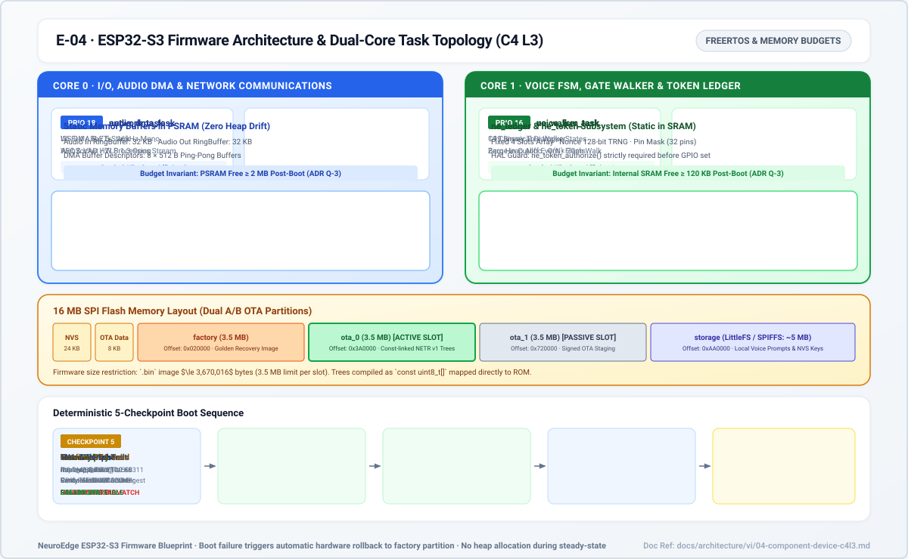
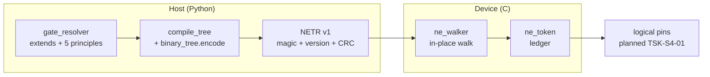

# 04 · ESP32-S3 Firmware Components (C4 L3)

> Status: walker + token + UART traces + selftest `done` (QEMU every PR);
> full firmware HAL `planned` (`TSK-S4-01`, awaiting boards).
> Source: `targets/esp32s3/`, spec `hal_mcu_review.md` (KL-1..KL-5, RB-1..RB-4).

*Figure E-04 — boot order and flash layout. Dashed: planned.*

## 1. Components

| Component | Files | Responsibility | MCU constraint |
|:---|:---|:---|:---|
| `ne_gate` walker | `components/ne_gate/ne_walker.c` | `ne_tree_load` + `ne_evaluate/ne_decide`: walk NETR trees in place in flash, same verdicts as host engine | C99, no heap/static/recursion/JSON parsing/CEL VM, ≤ 512 B stack |
| `ne_token` ledger | `components/ne_token/ne_token.c` | `init/issue/authorize/close`: 4 slots, refuse when full (fail-closed), TTL=`p95×3`, `boot_id` instead of `process_instance_id` | Caller-owned, wrap-safe on monotonic clock |
| `ne_trace` | `components/ne_trace/ne_trace.c` | `NE1 ` lines ≤ 512 B: one `trace.v1` event as JSON; `device_info … trace_end` framing | No silent globals; baud/console pinned when boards arrive (`TODOS.md` #35) |
| `main` boot | `main/main.c`, `memory_probe`, `gate_selftest`, `trace_vectors` | Memory budgets (Q-3) → gate selftest → replay 3 golden traces → network/idle | Failed selftest halts boot — never gate on untested trees |
| Host codegen | `scripts/gen_firmware_gates.py`, `gen_firmware_vectors.py` | `.netree` + C headers + action table + vectors from golden traces | Run at build time, never hand-edit output |

## 2. Host ≡ device contract (Q-8, Q-9, Q-23)

- One semantics: `ne_decide` ≡ `engine/`: arguments first
  (`argument_out_of_range`), then each criterion in `criteria_order`,
  `confirm_mask` after `ask`, `fail_open` for `gate_unreachable`/`budget_exceeded`.
- Facts reach the walker as **domain indexes** (sorted bool/level/choice) — no
  string comparison on chip.
- Equivalence is proven by: host truth tables every PR + nightly QEMU boot +
  `verify --targets esp32s3 --port` against golden (see `10`).

## 3. Pinned hardware budgets (Q-2, Q-3)

Single Box-3 reference board; free SRAM ≥ 120 KB, PSRAM ≥ 2 MB, firmware ≤
3.5 MB (fits A/B on 16 MB flash). STT/TTS live at cloud providers (P-4), so the
on-chip pipeline is only capture/playback + AEC/VAD + FSM + gates.
