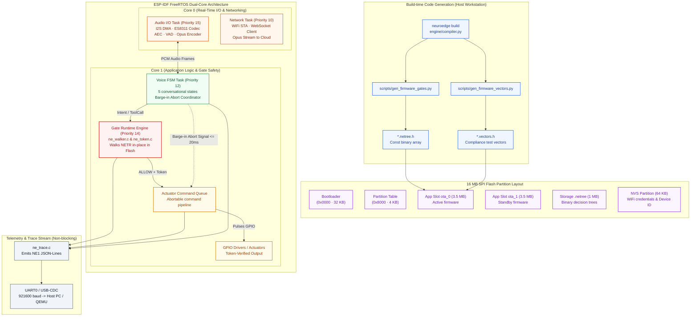
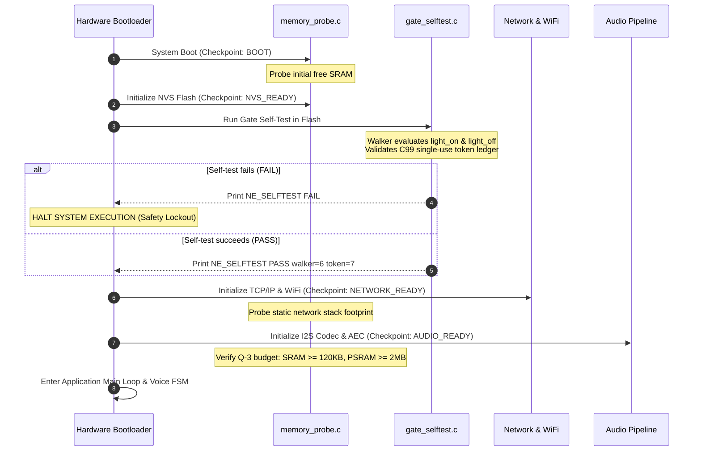

# 04 · ESP32-S3 Firmware Components (C4 L3 — Device Level)

> **Status:** C99 Walker, C99 Token Ledger, UART Trace output, and Boot Self-test are `done` (validated on Espressif QEMU in CI on every PR); complete hardware HAL and audio drivers are `in-progress / planned` (`TSK-S4-01`, awaiting physical silicon arrival).  
> **Source Directory:** `targets/esp32s3/`. Embedded review specifications: [`docs/spec/hal_mcu_review.md`](../../spec/hal_mcu_review.md) (KL-1..KL-5, RB-1..RB-4).

---

## 1. ESP32-S3 Firmware Component Diagram (C4 L3)

The microcontroller firmware is structured into modular C99 components executing atop the FreeRTOS real-time kernel within ESP-IDF 5.2.1+ / 5.4:


*Figure E-04 — Firmware Component Architecture and deterministic boot flow on the ESP32-S3 microcontroller.*



---

## 2. Core Firmware Components

### 2.1 C Binary Decision Tree Walker (`ne_gate/ne_walker.c`)
* **Role:** Evaluates Gate policies natively on the microcontroller with 100% mathematical determinism matching the Python host engine.
* **Technical Constraints & Characteristics:**
  * **Pure C99:** Non-recursive, zero dynamic memory allocation (`malloc`/`calloc`), zero shared global static state (fully reentrant & thread-safe).
  * **Zero Heap RAM:** The `NETR v1` binary tree is mapped directly from Flash (Memory-Mapped Flash over SPI MMU). Pointers walk directly across the Flash bus.
  * **Stack Budget:** Maximum stack depth $\le 512$ bytes, ensuring safe execution on constrained FreeRTOS tasks.
  * **Fact Handling:** Facts passed into the walker are **domain integer indices** (`0..N` for bool/level/choice), eliminating on-chip string parsing or string comparisons.

### 2.2 Single-Use Token Ledger (`ne_gate/ne_token.c`)
* **Role:** Enforces the core invariant: No GPIO pin can pulse without an authorized, unconsumed token issued by the Gate.
* **Technical Characteristics:**
  * **4 Fixed Memory Slots:** Static 4-slot array (`NE_TOKEN_SLOTS = 4`). When all 4 slots are occupied, the ledger rejects further allocations $\rightarrow$ **Fail-Closed by Default** (`NE_TOKEN_ERR_FULL`).
  * **Wrap-Safe Monotonic Clock:** Uses `esp_timer_get_time() / 1000` (monotonic milliseconds) to compute expiration `TTL = p95_latency * 3`.
  * **Tamper Resistance:** Validates random nonces and a hardware-seeded `boot_id`. Any tampered token or second invocation attempt is rejected with `NE_TOKEN_REPLAYED`.

### 2.3 UART Trace Serializer (`ne_gate/ne_trace.c`)
* **Role:** Streams on-device execution events back to the workstation for automated Action CI verification (`TSK-S4-09`).
* **Data Protocol:**
  * Emits each lifecycle event as a **standalone JSON line over UART0/USB-CDC**, prefixed with `NE1 ` followed by compacted JSON:
    ```text
    NE1 {"offset_ms":120,"type":"gate_evaluation_result","data":{"gate":"light_on","verdict":"ALLOW","reason":0}}
    ```
  * Uses a static stack buffer $\le 512$ bytes without heap allocation, cleanly separated from standard ESP-IDF system logging (`ESP_LOGI`).

---

## 3. Deterministic Boot Sequence Timeline

Upon power-on or hardware reset, the ESP32-S3 firmware must pass through 5 deterministic checkpoints:



* **Absolute Safety Invariant:** If `gate_selftest` detects any verdict discrepancy between the C walker and reference decisions $\rightarrow$ the system halts immediately, refusing to bring up network interfaces or drive GPIO pins. An unverified runtime is never permitted to control physical actuators.

---

## 4. Hardware Memory Budgets (Q-2, Q-3)

Based on Technical Decision `Q-3` locked on the reference **ESP32-S3-BOX-3** board (16 MB Quad Flash, 512 KB Internal SRAM, 8 MB Octal PSRAM):

| Resource Domain | Budget Threshold (Q-3) | Expected Allocation | Architectural Enforcement Tactic |
|:---|:---:|:---|:---|
| **Free Application SRAM** | $\ge 120\text{ KB}$ | Networking: ~60 KB · FreeRTOS OS: ~40 KB · DMA Buffers: ~30 KB $\rightarrow$ Free headroom $\ge 140\text{ KB}$ | All large buffers (audio, ring buffers) must reside in external PSRAM; C walker consumes 0 bytes of static SRAM (`RB-1`, `RB-2`). |
| **External PSRAM** | $\ge 2\text{ MB}$ | AEC/VAD Audio Buffers: ~512 KB · WebSocket stream buffer: ~256 KB $\rightarrow$ Free headroom $\ge 6\text{ MB}$ | Static pre-allocation at boot time; dynamic `malloc` is strictly forbidden in real-time audio loops (`RB-4`). |
| **Flash Image Size** | $\le 3.5\text{ MB}$ | Compressed Binary: ~2.8 MB (including mbedTLS, WiFi, Opus, ESP-SR) | Fits within symmetrical A/B dual partition slots ($3.5\text{ MB}$ each on a $16\text{ MB}$ Flash) for zero-downtime OTA rollouts (`FR-OTA-01`). |
