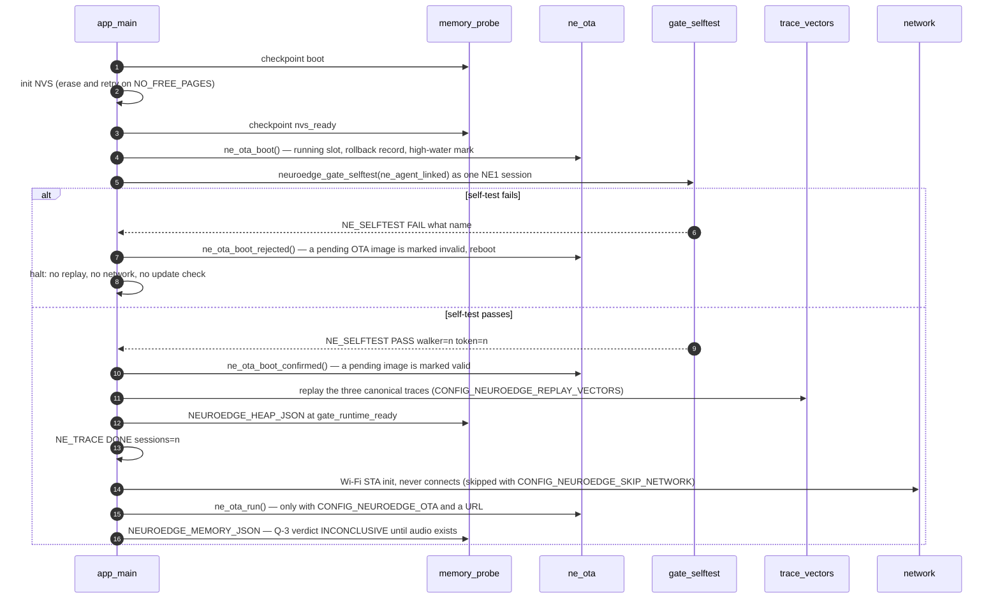
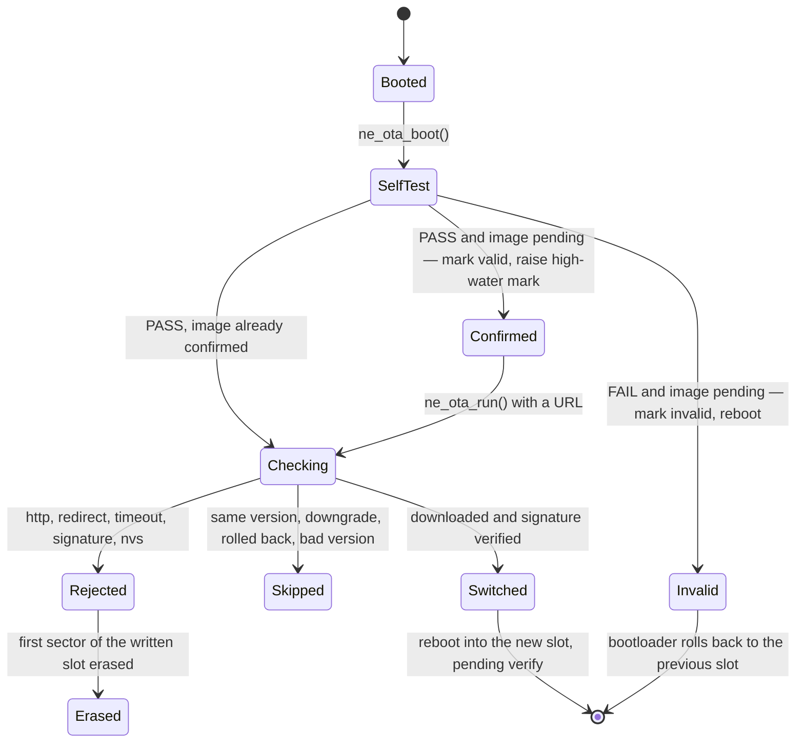

# 04 · ESP32-S3 firmware components (C4 L3)

> **Scope:** firmware in `targets/esp32s3/` — components, boot sequence, memory, OTA,
> interfaces. **Source:** C code in `targets/esp32s3/`, `python/neuroedge/engine/firmware.py`,
> `docs/spec/hal_mcu_review.md`, `docs/reports/memory_spike_report.md`.
> **Status:** `partial` — everything below runs on a computer (C compiled on the host) and on
> Espressif QEMU in CI; there is no board yet, and the firmware **controls no pin**.

**What this chapter is for:** For embedded engineers and systems programmers who need to understand the ESP32-S3 firmware structure, boot process, memory, and OTA mechanism. Answers the questions: what runs on the chip's firmware, how much memory it uses, and how it self-tests before enabling any hardware. You should read [`02`](02-container-c4l2.md) first to grasp container boundaries, and [`05`](05-code-gate-hal-c4l4.md) afterwards to understand the walker and token details.

## 1. Component diagram


*Figure E-04 — Firmware components, build-time generated data, and the boot sequence.*

**How to read the diagram:** Boxes represent firmware components and memory partitions on the ESP32-S3 chip; solid arrows are boot flows and direct function calls, dashed arrows are data generated at build time or written outward. Core takeaway: firmware runs sequentially in `app_main`, self-test must pass 100% before allowing any physical action.

## 2. What the firmware does **not** have today

Said up front, so nobody reads the diagram as more than it is:

- **No FreeRTOS task is created.** Every step runs sequentially in `app_main`. There is no priority,
  queue or core pinning.
- **No audio.** No I2S, codec, AEC, VAD, Opus or ESP-SR — only a `TODO(TSK-S1-10)`
  in `main/main.c`. On-chip voice is increment I5.
- **No GPIO control.** The agent's pin table carries pin **names**, not GPIO numbers; the on-chip
  HAL is TSK-S4-01.
- **Wi-Fi is started but never connects** (no `esp_wifi_connect`): the network is only brought up
  to measure its memory cost (`TODOS.md` #50).
- **The LVGL interface is not linked into the firmware** (§7). The `storage` partition is not mounted.

## 3. Component inventory

| Component | Path | Responsibility | Dependency | Status |
|:---|:---|:---|:---|:---|
| `main` | `main/` | Boot sequence; memory probe (`memory_probe.c`); gate self-test (`gate_selftest.c`); replay of the three canonical traces (`trace_vectors.c`) | every component below | `done` |
| `ne_gate` | `components/ne_gate/` | `NETR` v1 tree walker (`ne_walker.c`) and token ledger (`ne_token.c`); pure C99, no allocation, no globals, no recursion | — | `done` |
| `ne_trace` | `components/ne_trace/` | Trace line format `NE1 {…}` ≤ 512 bytes; format only, the application writes to UART | `ne_gate` | `done` |
| `ne_agent` | `components/ne_agent/` (**generated**) | Agent-specific part: one `NETR` tree per gate, gate · pin · action tables, self-test cases with answers from the host engine | `ne_gate`, `ne_trace` | `done` |
| `ne_ota` | `components/ne_ota/` | Signed A/B update, rollback, downgrade blocking; the policy is pure C99 (`ne_ota_policy.c`), the ESP-IDF part is in `ne_ota.c` | ESP-IDF `app_update`, `esp_https_ota`, `nvs_flash`… | `partial` — on QEMU |
| `ne_ui` | `ui/` (**not linked**) | Nine LVGL screens, Vietnamese and English | LVGL v9.6 | `partial` — host build only |

`ne_gate`, `ne_trace`, `ne_agent` compile with `-std=c99 -Wall -Wextra -Wconversion -Werror`.

### Planned components

| Planned path | Task | Component (what it is) and purpose (why it is needed) | Target architecture |
|:---|:---|:---|:---|
| `targets/esp32s3/hal/` | TSK-S4-01 | Implements 5 HAL primitives on ESP-IDF; needed to control real hardware instead of emulation | [`15`](15-target-architecture.md) §2.1 |
| `targets/esp32s3/drivers/` | TSK-S4-03 | Drivers for `digital.out` and `sensor.read` on real pins; needed to pulse actuators and read sensors on the Box-3 board | [`15`](15-target-architecture.md) §2.1 |
| `targets/esp32s3/audio/` | TSK-S5-01 | Integrates WebRTC AEC, libfvad (VAD), Opus streaming; needed for acoustic echo cancellation, voice activity detection, and audio compression | [`15`](15-target-architecture.md) §2.1 |
| `targets/esp32s3/drivers/audio_path.c` | TSK-S5-02 | I2S capture/playback audio path driver (ES8311/ES7210); needed to interface with Box-3 hardware audio codecs | [`15`](15-target-architecture.md) §2.1 |
| `targets/esp32s3/fsm/voice_fsm.c` | TSK-S5-03 | C implementation of the voice state machine (`voice_fsm.md`); needed to coordinate real-time voice turns directly on chip | [`15`](15-target-architecture.md) §2.1 |
| `targets/esp32s3/fsm/actuator_abort.c` | TSK-S5-04 | Logic to abort unexecuted actuator commands upon barge-in; needed to cancel undelivered actuator commands within ≤ 20 ms and close tokens when barged in ([`voice_fsm.md`](../../spec/voice_fsm.md) §5.2) | [`15`](15-target-architecture.md) §2.1 |
| `targets/esp32s3/audio/provider_client.c` | TSK-S5-06 | Audio streaming client to cloud provider; needed to stream STT/TTS from the microcontroller | [`15`](15-target-architecture.md) §2.1 |
| `targets/esp32s3/fallback/` | TSK-S5-07 | Local fixed-command recognizer; needed for the device to still evaluate gates and act safely when offline | [`15`](15-target-architecture.md) §2.1 |
| `targets/esp32s3/security/` | TSK-S6-05 | Secure Boot, flash encryption, physical microphone mute button; needed to protect firmware integrity and privacy | [`15`](15-target-architecture.md) §2.1 |

Currently the firmware only has a sequential `app_main`; the FreeRTOS task model (task count, priorities, queues, and core pinning) for the voice path is not designed yet (→ [`15`](15-target-architecture.md) §2.2). For firmware for the second peripheral robot MCU node (RP2350, TSK-W3-07 at `targets/rp2350/`, running an independent C99 gate walker and token ledger on the robot arm node — robot draft §9.4), see [`15`](15-target-architecture.md) §4.3.

### 3.1 `ne_gate` — walker and token ledger

```c
/* ne_walker.h — đọc cây tại chỗ trong bộ nhớ của người gọi, không chép */
ne_status ne_tree_load(ne_tree *tree, const uint8_t *buf, uint32_t len);
ne_status ne_evaluate(const ne_tree *tree, const ne_fact *facts, const ne_arg_value *args,
                      int confirmed, ne_result *out);
ne_status ne_decide(const ne_tree *tree, const ne_fact *facts, const ne_arg_value *args,
                    int confirmed, ne_degraded degraded, ne_result *out);

/* ne_token.h — bản thiết bị của actions/token.py; sổ do người gọi cấp phát */
ne_token_status ne_ledger_init(ne_ledger *ledger, uint32_t boot_id);
ne_token_status ne_token_issue(ne_ledger *ledger, const ne_tree *tree, uint32_t pin_mask,
                               uint32_t now_ms, ne_random_fn fill_random, ne_token *out);
ne_token_reason ne_token_authorize(ne_ledger *ledger, const ne_token *token, uint32_t pin,
                                   uint32_t now_ms);
void ne_token_close(ne_ledger *ledger, const ne_token *token);
```

- **Facts entering the walker are indices into the value domain**, not strings: the chip never
  compares strings. Each `ne_fact` carries `present`, `in_domain`, `index`, and confidence if any.
- **The token ledger has four slots** (`NE_TOKEN_SLOTS`), a 16-byte nonce, TTL = `p95_latency_ms × 3`,
  token age computed as `(uint32_t)(now − issued)`, so it is safe when the millisecond counter wraps.
  `boot_id` plays the role of the host's `process_instance_id`: a token from a previous boot ⇒ expired.
- **A full ledger refuses** (`NE_TOKEN_ERR_FULL`); it never evicts a live token.
- Every rejection reason maps to the same error code as on the host: not a token, unknown token, pin
  not granted ⇒ `NE1001`; reuse, expiry ⇒ `NE1002`.

`NETR` byte layout and the walk algorithm: [`05`](05-code-gate-hal-c4l4.md).

### 3.2 `ne_agent` — the component generated per agent

`neuroedge build --target esp32s3` (`engine/firmware.py::render_component`) generates:

| File | Content |
|:---|:---|
| `gates/<key>.netree.h` | `static const uint8_t ne_tree_<key>[]` — the gate's `NETR` v1 bytes, in flash |
| `ne_agent.c` | Gate table (label, digest, the `on_block` text; `NETR` v2 carries them too, `ne_trace` still reads them from this table), pin table (names), action table (gate, pin mask), and the **self-test cases** |
| `include/ne_agent.h` | Data types; `NE_AGENT_VERSION`, `NE_AGENT_BOARD`, `NE_AGENT_LANGUAGE`; one symbol `ne_agent_linked` |

Self-test cases generated for each gate: the base case; for each criterion every value in the domain,
a missing fact, an out-of-domain value, and confidence variants if there is a threshold; an offline
case; and the "confirmed" version for an `ask` gate. **The answer for each case is computed by the
Python engine itself at build time** — that is what makes the self-test a proof of host ↔ chip
equivalence.

## 4. Boot sequence

Every marker line (`NE_SELFTEST`, `NE_TRACE DONE`, `NEUROEDGE_*_JSON`, `NE_OTA`) is printed at
column 0, with no log prefix, so CI scripts can anchor it with `^`.


```mermaid
sequenceDiagram
    autonumber
    participant M as app_main
    participant P as memory_probe
    participant O as ne_ota
    participant S as gate_selftest
    participant V as trace_vectors
    participant N as network
    M->>P: checkpoint boot
    M->>M: init NVS (erase and retry on NO_FREE_PAGES)
    M->>P: checkpoint nvs_ready
    M->>O: ne_ota_boot() — running slot, rollback record, high-water mark
    M->>S: neuroedge_gate_selftest(ne_agent_linked) as one NE1 session
    alt self-test fails
        S-->>M: NE_SELFTEST FAIL what name
        M->>O: ne_ota_boot_rejected() — a pending OTA image is marked invalid, reboot
        M->>M: halt: no replay, no network, no update check
    else self-test passes
        S-->>M: NE_SELFTEST PASS walker=n token=n
        M->>O: ne_ota_boot_confirmed() — a pending image is marked valid
        M->>V: replay the three canonical traces (CONFIG_NEUROEDGE_REPLAY_VECTORS)
        M->>P: NEUROEDGE_HEAP_JSON at gate_runtime_ready
        M->>M: NE_TRACE DONE sessions=n
        M->>N: Wi-Fi STA init, never connects (skipped with CONFIG_NEUROEDGE_SKIP_NETWORK)
        M->>O: ne_ota_run() — only with CONFIG_NEUROEDGE_OTA and a URL
        M->>P: NEUROEDGE_MEMORY_JSON — Q-3 verdict INCONCLUSIVE until audio exists
    end
```

**How to read the diagram:** Vertical columns represent `app_main` and internal firmware functional modules; solid arrows are synchronous function calls, dashed arrows are return values; the `alt` block branches on the self-test result. Core takeaway: if the self-test fails, any pending OTA image (if present) is marked invalid and the machine reboots so the bootloader rolls back to the previous slot; with no pending image, the firmware halts — no replay, no network, no action.

The self-test has four stages: (1) every tree loads and its digest matches the host-compiled version;
(2) the walker decides every case exactly as the host engine, field by field; (3) each action's token
opens exactly its own pin once, rejects another pin, rejects a tampered token; (4) a full ledger
refuses, and closing a token lets the slot be reused. Failure anywhere ⇒ the firmware halts: no gate
runtime, no action, no network.

| Kconfig option | Default | Effect |
|:---|:---:|:---|
| `CONFIG_NEUROEDGE_QEMU` | n | `device_id = "qemu"` instead of `esp32s3-<MAC>` |
| `CONFIG_NEUROEDGE_SKIP_NETWORK` | n | Skip Wi-Fi startup (the `sdkconfig.qemu` layer enables it) |
| `CONFIG_NEUROEDGE_REPLAY_VECTORS` | y | Replay the three canonical traces after the self-test |
| `CONFIG_NEUROEDGE_OTA` | n | Enable the update path; Kconfig and `#error` refuse if signature check or rollback is missing |
| `CONFIG_NEUROEDGE_OTA_ETH` | n | QEMU's `open_eth` virtual Ethernet network for OTA |

## 5. Memory and flash

**Partition table** (`partitions.csv`, 16 MB flash): `nvs` 16 KiB · `otadata` 8 KiB · `phy_init` 4 KiB
· `factory`, `ota_0`, `ota_1` 3.5 MiB per slot · `storage` (spiffs) 5 MiB, unused. The 3.5 MiB slot
is exactly the Q-3 firmware size ceiling.

**Config layers** stack through `SDKCONFIG_DEFAULTS`:

| Layer | What it sets |
|:---|:---|
| `sdkconfig.defaults` | 16 MB flash, custom partition table, 80 MHz octal PSRAM, FreeRTOS 1000 Hz, performance optimization |
| `sdkconfig.qemu` | No network, QEMU flags, skip when PSRAM is not found |
| `sdkconfig.ota` | OTA, bootloader rollback, RSA-3072 image signing and signature verification on update (no Secure Boot yet), 8 KB main task stack |
| `sdkconfig.qemu_ota` | Test server URL, `open_eth`, AES/SHA/MPI hardware acceleration off (QEMU's GDMA model is not complete enough) |

**Static memory discipline**, tested on every PR (`test_c_walker.py`, `test_c_token.py`,
`test_c_trace.py`): the object files of the walker, token ledger and trace formatter have **no**
`.data`/`.bss` symbols; each function uses ≤ 512 bytes of stack. State memory (token ledger, line
buffer) is allocated by the application, never inside the component.

**Q-3 budget** (SRAM ≥ 120 KB and PSRAM ≥ 2 MB for the application, firmware ≤ 3.5 MB) is checked
piecewise in CI: image size, static RAM left for the board configuration, boot heap on QEMU. The
measurements and the measurement conditions are in [`memory_spike_report.md`](../../reports/memory_spike_report.md)
§4.1 — that is a **floor**, not a Q-3 verdict, because there is no board yet and no audio yet.

## 6. `ne_ota` — signed update


```mermaid
stateDiagram-v2
    [*] --> Booted
    Booted --> SelfTest: ne_ota_boot()
    SelfTest --> Confirmed: PASS and image pending — mark valid, raise high-water mark
    SelfTest --> Invalid: FAIL and image pending — mark invalid, reboot
    Invalid --> [*]: bootloader rolls back to the previous slot
    Confirmed --> Checking: ne_ota_run() with a URL
    SelfTest --> Checking: PASS, image already confirmed
    Checking --> Skipped: same version, downgrade, rolled back, bad version
    Checking --> Rejected: http, redirect, timeout, signature, nvs
    Rejected --> Erased: first sector of the written slot erased
    Checking --> Switched: downloaded and signature verified
    Switched --> [*]: reboot into the new slot, pending verify
```

**How to read the diagram:** Rounded nodes represent states in the OTA update image lifecycle; solid arrows are state transitions with triggering conditions. Core takeaway: a newly flashed image is only confirmed (`Confirmed`) once it passes boot self-test; bad signature, download error, or timeout ⇒ `Rejected`: erases the first sector of the just-written slot, the machine continues running the current slot; only a failed self-test on a pending image causes the bootloader to roll back to the previous slot.

- **The install-or-not decision** is a pure C function, `ne_ota_should_install(running, remote,
  rolled_back, high_water)`, tested on the host under ASan/UBSan and used unchanged in the firmware.
  Order: missing version ⇒ skip; version not `MAJOR.MINOR.PATCH` ⇒ skip; same version ⇒ skip; same as
  the version just rolled back ⇒ skip; not above the high-water mark ⇒ skip (downgrade); otherwise ⇒
  install.
- **NVS** (namespace `ne_ota`): `url` (empty ⇒ OTA off), `best` (high-water mark — the highest version
  that passed self-test), `rollback` (the version just rolled back). NVS unreadable ⇒ refuse, do not
  guess.
- **Every rejection after bytes were written** (bad signature, partial download, timeout, download
  error) erases the first sector of the written slot, so no boot ever lands on a rejected image.
- **Limits:** no Secure Boot yet and no eFuse downgrade protection (TSK-S6-05); OTA does not update the
  bootloader; an image that hangs without rebooting only rolls back at the next power cycle. The
  procedure and the meaning of each `NE_OTA` line:
  [`docs/user/nap-firmware.md`](../../user/nap-firmware.md) §6.

## 7. `ne_ui` — device interface (not linked)

Nine screens (`ne_ui_show_boot`, `idle`, `voice`, `confirm`, `verdict`, `degraded`, `sensor`, `ota`,
`fatal`) on a 320×240 RGB565 panel. The code is C99 on the LVGL v9.6 API, with no ESP-IDF headers, so
the same code builds on a computer for **golden image** comparison on every PR (33 cases × 2 languages,
harness run under ASan/UBSan). Deterministic drawing: no clock, no randomness, no animation. Agent text
is data: strictly checked UTF-8, truncation with a `…` mark. Language: `ne_ui_init` returns `false` and
draws nothing if the language has no font table. Spec: [`docs/spec/ui.md`](../../spec/ui.md). Wiring the
interface into the firmware waits for the display driver (TSK-S4-01); the project generated for an agent
today does not copy `ui/`.

## 8. Build and checks

| What is checked | With what | Where |
|:---|:---|:---|
| Walker, token ledger, trace writer match the host; static memory; tree-file fuzz | C compiled on the host (gcc/clang, ASan/UBSan) | `pytest` job `tests` |
| OTA policy, version rules C = Python | C on the host | `pytest` job `tests` |
| Firmware boot, self-test, trace, heap | ESP-IDF v5.4 + QEMU (`scripts/qemu_boot.sh`) | job `firmware-qemu` |
| Image size, static RAM for the board configuration | `scripts/check_firmware_size.py` | job `firmware-size` |
| Firmware generated for a new agent boots, the signed OTA build has the right version | `neuroedge build` + `idf.py` + QEMU + `scripts/build_ota_layer.sh` | job `agent-firmware` |
| Seven-phase OTA a–g | `scripts/qemu_ota.sh` | job `ota-rollback` |
| Interface golden images | `scripts/run_ui_golden.sh` | job `ui-golden` |
| UART trace into `trace.v1`, `verify` on the chip | `neuroedge record --port`, `verify --targets esp32s3` | job `uart-trace` |

Full list and the trigger conditions of each job: `CHANGELOG.md` §2.5.
