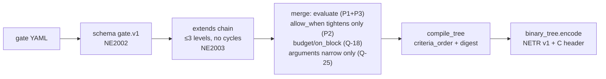
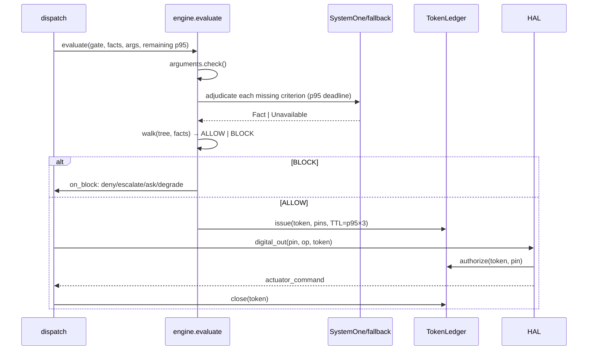

# 05 · Code Level: gate → token → HAL (C4 L4)

> Status: `done`. Read with poster E-05 and `09-adr.md`
> (Q-9, Q-18, Q-23, Q-25, Q-26).

## 1. Gate resolution (build/lint/resolve)

- Redefining an inherited criterion → refused (P1). String-CEL `allow_when`
  inside an `extends` chain → refused (only standalone gates may use CEL, and
  lint currently refuses even that until a compiler exists — fail-closed).
- Child `p95` ≤ parent; an already-`closed` chain cannot be reopened with
  `fail: open`; children cannot introduce new `degrade` (Q-18). Out-of-range
  arguments are gate-BLOCKed (`argument_out_of_range`), never REJECTED (Q-25).

## 2. Runtime evaluation (one `c.do()`)

- `BLOCK` → no token, `@action` body never runs, pins unchanged. `degrade`
  runs `fallback_action` **through its own gate** (recursive, cycle-guarded).
  `ask` with `confirms` opens a single-use `PendingConfirmation` expiring at
  `max(p95×3, 10s)`; confirmations come from humans via device only (Q-26).
- Tokens are single-use per pin; reuse/expiry/foreign-process → NE1002, pins
  stay put, `actuator_command_rejected` is logged. Contract violations (NE1001)
  **raise**, never degrade into BLOCK.

## 3. NETR v1 layout on device (RFC-0003)

64 B header (`NETR`, layout v1, `gate_digest[32]`, node/arg/enum counts,
`on_block`, `fail_open`, p95, `confirm_mask`, CRC32) + 24 B nodes ×n (kind,
domain size, offsets, `admitted_mask`, `confidence_floor`) + args/enums +
NUL strings. Max ~19 KB flash. `ne_tree_load` rejects bad magic/version/size/
CRC/limits. No allocation in the walker — why gates run on a $5 chip and still
fail closed.
