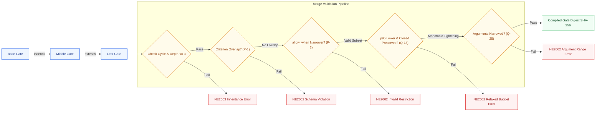
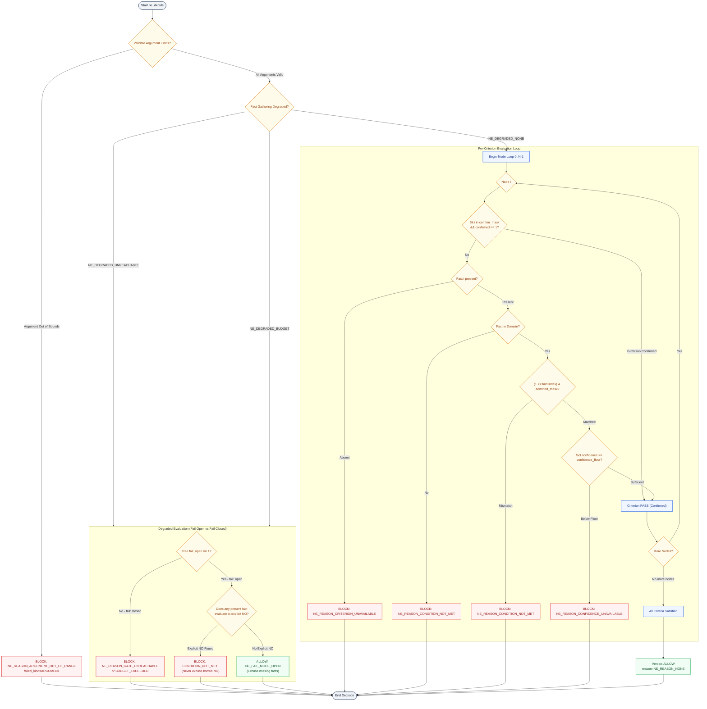
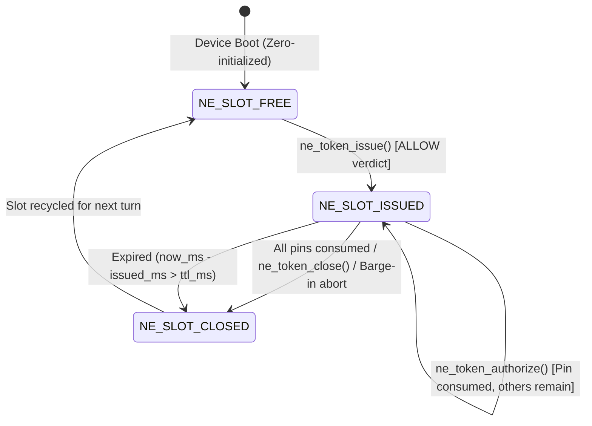
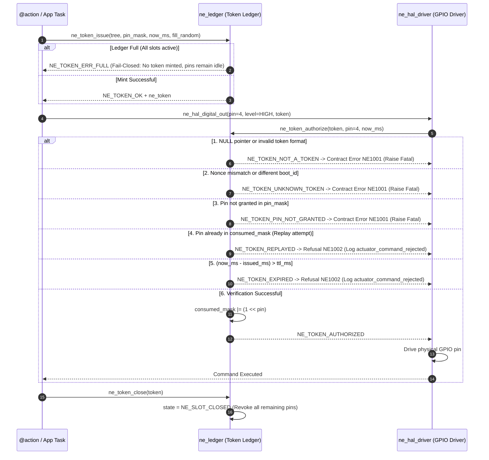

# 05 · Code Level: gate → token → HAL (C4 L4)

> **Status:** `done` · Standardized Code-Level Architecture (C4 L4)  
> **Reference Documents:** Poster [E-05](../assets/svg/E-05-gate-spine.svg), [09-adr.md](file:///Users/minhlt/Downloads/Projects/neuroedge-init/docs/architecture/en/09-adr.md) (ADR Q-9, Q-18, Q-23, Q-25, Q-26), [RFC-0003](file:///Users/minhlt/Downloads/Projects/neuroedge-init/docs/rfcs/RFC-0003-binary-decision-tree.md), [RFC-0005](file:///Users/minhlt/Downloads/Projects/neuroedge-init/docs/rfcs/RFC-0005-gate-argument-limits.md), [RFC-0006](file:///Users/minhlt/Downloads/Projects/neuroedge-init/docs/rfcs/RFC-0006-on-block-ask-confirms.md)  
> **Implementation Sources:** Python [`python/neuroedge/engine/`](file:///Users/minhlt/Downloads/Projects/neuroedge-init/python/neuroedge/engine/) & C99 [`targets/esp32s3/components/ne_gate/`](file:///Users/minhlt/Downloads/Projects/neuroedge-init/targets/esp32s3/components/ne_gate/)

---

## 1. Overall Map of the Gate Spine (C4 L4)

The code-level architecture enforces principle **P-1 (Fail-Closed Default)** and **P-3 (Target Equivalence)**: Any actuation decision modifying physical hardware states must pass through a deterministic binary decision tree, generating an ephemeral, single-use, pin-scoped Token with a strict TTL before the HAL permits GPIO level transitions.

```mermaid
flowchart TD
    classDef bld fill:#eff6ff,stroke:#2563eb,color:#1e3a8a,stroke-width:1.5px;
    classDef hst fill:#fff7ed,stroke:#ea580c,color:#7c2d12,stroke-width:1.5px;
    classDef dev fill:#f0fdf4,stroke:#16a34a,color:#14532d,stroke-width:1.5px;
    classDef sec fill:#fef2f2,stroke:#dc2626,color:#991b1b,stroke-width:1.5px;

    subgraph BuildTime["1. Build Time (Compiler Pipeline)"]
        Y["gate.yaml"]:::bld -->|Schema Check NE2002| SC["Schema Validation"]:::bld
        SC -->|Inheritance Resolve NE2003| IR["Extends Merger &lt;= 3 levels"]:::bld
        IR -->|Rule Invariants P1/P2/Q-18/Q-25| MR["Merged Gate Model"]:::bld
        MR -->|Compile Decision Tree| CD["Deterministic Tree Optimizer"]:::bld
        CD -->|RFC-0003 Encoder| BE["NETR v1 Binary / C Header"]:::bld
    end

    subgraph HostRuntime["2. Host Runtime (c.do())"]
        AC["@action Dispatcher"]:::hst -->|Evaluate Request| GE["engine.evaluate()"]:::hst
        GE -->|Check Arguments| AC2["Argument Range Validator"]:::hst
        GE -->|Resolve Facts via Adjudicator| AD["FactSource / SystemOne"]:::hst
        AD -->|Facts + Latency Check| WT["Decision Tree Walker"]:::hst
        WT -->|Verdict ALLOW| TL["TokenLedger.issue()"]:::sec
        WT -->|Verdict BLOCK| OB["on_block: deny/ask/degrade"]:::sec
        TL -->|Ephemeral Token| AH["actions.conversation"]:::hst
    end

    subgraph DeviceRuntime["3. Device Runtime (Zero-Alloc C99 Walker)"]
        FL["Flash Memory Mapped NETR v1"]:::dev -->|ne_tree_load()| TR["ne_tree Struct View"]:::dev
        SN["Hardware Sensors / Facts"]:::dev -->|ne_decide()| DW["ne_evaluate Core"]:::dev
        DW -->|Status ALLOW| NL["ne_token_issue()"]:::sec
        NL -->|ne_token| DH["ne_token_authorize()"]:::sec
        DH -->|Pin Granted &amp; Consumed| GP["ESP32-S3 GPIO / Actuator Driver"]:::dev
    end

    BE -.->|Flash via OTA / Flash Tool| FL
    AH -->|HAL Driver Call| DH
```

---

## 2. Gate Resolution Pipeline (Build / Lint / Merge)

### 2.1. Inheritance and Merge Invariants

The Gate inheritance resolution (`gate_resolver.py`) performs static validation of the extension chain across five strict invariants:

1. **Bounded Inheritance Depth ($\le 3$ levels):** Cyclic inheritance or chains exceeding 3 levels are prohibited (raises `NE2003`).
2. **Criterion Non-Redefinition Invariant (P-1 & Q-9):** A child gate **must never** redefine a criterion already introduced by any ancestor in the inheritance chain (`NE2002`).
3. **Monotonic Tightening of `allow_when` (P-2):** A child gate may only restrict the admitted domain set (`admitted` must be a strict subset or equal to the parent set) and raise the confidence threshold (`confidence_floor` child $\ge$ parent).
4. **Budget & Fail Mode Inheritance (ADR Q-18):**
   - $p95_{\text{child}} \le p95_{\text{parent}}$ (evaluation latency budget can only tighten).
   - If any ancestor in the chain declares `fail: closed`, a child **cannot** reopen it to `fail: open`.
   - A child gate cannot introduce a new `degrade` fallback if the parent already designated another terminal action.
5. **Argument Range Narrowing (ADR Q-25 / RFC-0005):**
   - `minimum` can only increase ($\ge$).
   - `maximum` can only decrease ($\le$).
   - `enum` can only shrink (subset).
   - `max_length` can only decrease ($\le$).
   - Out-of-bounds argument values are blocked by the Gate with reason `argument_out_of_range` (verdict `BLOCK`), never raising an upstream LLM protocol `REJECTED` error.



---

## 3. NETR v1 Binary Format on Device (RFC-0003)

The decision tree compiles into a flat binary blob (`.netree`) or a `const uint8_t` array in a C header. The on-device C walker reads directly from flash (Memory Mapped I/O) with zero heap allocations, zero recursion, and zero global pointers.

### 3.1. Overall Memory Layout

All integer values are **Little-Endian**, and records are naturally aligned.

```
+------------------------------------------------------------------------+
| 1. Header (64 Bytes)                                                   |
+------------------------------------------------------------------------+
| 2. Node Records (24 Bytes * node_count) [Max 32 nodes]                 |
+------------------------------------------------------------------------+
| 3. Argument Limits (32 Bytes * arg_count) [Max 16 args]                |
+------------------------------------------------------------------------+
| 4. Enum Values (16 Bytes * enum_count) [Max 64 enums]                  |
+------------------------------------------------------------------------+
| 5. String Table (UTF-8, NUL-terminated) [Max 16,384 Bytes]             |
+------------------------------------------------------------------------+
```

### 3.2. Detailed Header Byte Layout (64 Bytes)

| Offset (Bytes) | Field | Type | Description |
| :--- | :--- | :--- | :--- |
| `0x00 - 0x03` | `magic` | `char[4]` | Mandatory ASCII `"NETR"` (`0x4E, 0x45, 0x54, 0x52`). |
| `0x04 - 0x05` | `layout_version` | `uint16_t` | Binary layout version (fixed = `1`). |
| `0x06 - 0x07` | `header_size` | `uint16_t` | Header size in bytes (fixed = `64`). |
| `0x08 - 0x27` | `gate_digest` | `uint8_t[32]`| Raw SHA-256 cryptographic hash of canonical gate definition. |
| `0x28 - 0x29` | `node_count` | `uint16_t` | Number of decision criteria (`nodes`), $0 \le N \le 32$. |
| `0x2A - 0x2B` | `arg_count` | `uint16_t` | Number of argument limits (`arguments`), $0 \le A \le 16$. |
| `0x2C - 0x2D` | `enum_count` | `uint16_t` | Number of enum values across arguments, $0 \le E \le 64$. |
| `0x2E` | `on_block_action`| `uint8_t` | Action on BLOCK: `0`=deny, `1`=escalate, `2`=ask, `3`=degrade. |
| `0x2F` | `fail_open` | `uint8_t` | Behavior when degraded: `0` = fail-closed, `1` = fail-open. |
| `0x30 - 0x33` | `p95_latency_ms`| `uint32_t` | Contractual latency budget deadline in milliseconds. |
| `0x34 - 0x37` | `confirm_mask` | `uint32_t` | Bitmask: Bit $i=1$ means criterion $i$ can be confirmed in-person (RFC-0006). |
| `0x38 - 0x3B` | `strings_size` | `uint32_t` | Total byte length of NUL-terminated UTF-8 string table ($\le 16384$). |
| `0x3C - 0x3F` | `crc32` | `uint32_t` | IEEE 802.3 CRC-32 checksum calculated over file with this field zeroed. |

### 3.3. Node Record Specification (24 Bytes)

Each criterion in the compiled tree maps to a 24-byte record:

| Offset | Field | Type | Meaning |
| :--- | :--- | :--- | :--- |
| `0x00` | `kind` | `uint8_t` | Criterion kind: `0` = `bool`, `1` = `level`, `2` = `choice`. |
| `0x01` | `domain_size` | `uint8_t` | Number of items in domain ($1 \le D \le 32$). |
| `0x02 - 0x03` | `name_off` | `uint16_t` | Byte offset into String Table for criterion name. |
| `0x04 - 0x07` | `admitted_mask`| `uint32_t` | Bitmask of admitted values: Bit $j=1$ indicates domain value $j$ yields `ALLOW`. |
| `0x08 - 0x0F` | `confidence_floor` | `double` (f64)| Minimum required confidence threshold ($0.0 \dots 1.0$, IEEE 754). |
| `0x10 - 0x11` | `domain_off` | `uint16_t` | Offset in String Table to start of consecutive NUL-terminated domain values. |
| `0x12 - 0x13` | `reserved16` | `uint16_t` | Fixed = `0` (alignment padding). |
| `0x14 - 0x17` | `reserved32` | `uint32_t` | Fixed = `0` (alignment padding). |

### 3.4. Argument Limit Record (32 Bytes) & Enum Record (16 Bytes)

- **Argument Record (32 Bytes):**
  - `0x00 - 0x01`: `name_off` (`uint16_t`) - String table offset of argument name.
  - `0x02`: `type` (`uint8_t`) - `0`=string, `1`=integer, `2`=number, `3`=boolean.
  - `0x03`: `flags` (`uint8_t`) - Limit flag bitmask (`0x01`=HAS_MIN, `0x02`=HAS_MAX, `0x04`=HAS_ENUM, `0x08`=HAS_MAX_LENGTH).
  - `0x04 - 0x05`: `enum_first` (`uint16_t`) - First index in Enum Table.
  - `0x06 - 0x07`: `enum_count` (`uint16_t`) - Number of enum entries.
  - `0x08 - 0x0B`: `max_length` (`uint32_t`) - Maximum string length limit.
  - `0x0C - 0x0F`: `reserved` (`uint32_t`) - Fixed = `0`.
  - `0x10 - 0x17`: `minimum` (`double`) - Lower bound value.
  - `0x18 - 0x1F`: `maximum` (`double`) - Upper bound value.

- **Enum Record (16 Bytes):**
  - `0x00 - 0x07`: `number` (`double`) - Numeric value (if numeric enum).
  - `0x08 - 0x0B`: `str_off` (`uint32_t`) - String table offset (if string enum).
  - `0x0C - 0x0F`: `str_len` (`uint32_t`) - Byte length of string enum value.

---

## 4. Firmware C Struct Definitions (`targets/esp32s3/components/ne_gate/`)

The C99 code is strictly audited for 32-bit Xtensa / RISC-V architectures:

```c
/* ne_walker.h — Binary Decision Tree Structures */

typedef enum {
    NE_OK = 0,
    NE_ERR_ARGUMENT = 1,   /* NULL pointer or invalid parameter */
    NE_ERR_SIZE = 2,       /* File shorter than header or size mismatch */
    NE_ERR_MAGIC = 3,      /* Bad Magic (not "NETR") */
    NE_ERR_VERSION = 4,    /* Unsupported layout version (not 1) */
    NE_ERR_CRC = 5,        /* Corrupted file CRC-32 mismatch */
    NE_ERR_LIMITS = 6,     /* Exceeds NE_MAX_* limits (nodes > 32, args > 16) */
    NE_ERR_STRUCTURE = 7   /* Structural error (string offset out of bounds) */
} ne_status;

typedef enum { NE_ALLOW = 0, NE_BLOCK = 1 } ne_verdict;

typedef enum {
    NE_REASON_NONE = 0,
    NE_REASON_CONDITION_NOT_MET = 1,      /* Fact violates admitted_mask */
    NE_REASON_CRITERION_UNAVAILABLE = 2,  /* Missing fact evidence */
    NE_REASON_CONFIDENCE_UNAVAILABLE = 3, /* Confidence falls below confidence_floor */
    NE_REASON_ARGUMENT_OUT_OF_RANGE = 4,  /* Argument violates min/max/enum/max_length */
    NE_REASON_GATE_UNREACHABLE = 5,       /* External fact source disconnected (Q-14) */
    NE_REASON_BUDGET_EXCEEDED = 6         /* Fact collection overrun p95 budget */
} ne_reason;

typedef struct {
    const uint8_t *base;        /* Pointer to flash memory mapped view */
    uint32_t size;              /* Total size of NETR binary blob */
    uint16_t node_count;        /* Number of criteria nodes */
    uint16_t arg_count;         /* Number of argument limits */
    uint16_t enum_count;        /* Number of enum definitions */
    uint8_t on_block_action;    /* on_block action code (0..3) */
    uint8_t fail_open;          /* fail_open flag */
    uint32_t p95_latency_ms;    /* Latency budget deadline */
    uint32_t confirm_mask;      /* Mask of criteria answerable by humans */
    uint32_t strings_size;      /* String table size in bytes */
    const uint8_t *gate_digest; /* Pointer to 32 raw SHA-256 digest bytes */
} ne_tree;

typedef struct {
    uint8_t present;            /* 1 if fact is available, 0 if missing */
    uint8_t in_domain;          /* 1 if value falls in criterion domain */
    uint8_t index;              /* Integer index of value in domain */
    uint8_t has_confidence;     /* 1 if confidence score is attached */
    double confidence;          /* Confidence score (0.0 .. 1.0) */
} ne_fact;

typedef struct {
    ne_verdict verdict;         /* NE_ALLOW or NE_BLOCK */
    ne_reason reason;           /* Adjudication reason code */
    ne_failed_kind failed_kind; /* Failure origin: CRITERION or ARGUMENT */
    uint8_t failed_index;       /* First failing criterion or argument index */
    uint8_t answerable;         /* 1 if BLOCK can be resolved by device confirmation */
    uint8_t fail_mode;          /* NE_FAIL_MODE_OPEN or NE_FAIL_MODE_CLOSED */
    uint32_t confirmed_mask;    /* Mask of confirmed criteria */
} ne_result;
```

---

## 5. Decision Tree Evaluation Algorithm (`ne_evaluate` / `ne_decide`)

The on-device tree walker executes deterministically with $O(N + A)$ time complexity and $O(1)$ auxiliary stack space:



> **The Golden Rule of `fail: open`:**  
> `fail: open` only excuses **disconnected or missing facts**. If a criterion's fact is present and resolves to **"NO"** (`CONDITION_NOT_MET`), the verdict must strictly remain `BLOCK`. Under no circumstance does `fail: open` override a known negative verdict.

---

## 6. Token Ledger & HAL Authorization Mechanics

### 6.1. Token and Ledger Memory Structures

To enforce the **Principle of Least Privilege** and eliminate replay attacks across physical hardware buses, every actuator invocation must present a valid Token minted by the Ledger:

```c
/* ne_token.h — Ledger and Token Specifications */

#define NE_TOKEN_SLOTS 4u     /* Maximum 4 concurrent token slots in SRAM */
#define NE_NONCE_SIZE  16u    /* 128-bit TRNG random nonce against replay */
#define NE_DIGEST_SIZE 32u    /* SHA-256 digest of authorizing gate */
#define NE_TTL_FACTOR  3u     /* Time-To-Live factor: TTL = p95_latency_ms * 3 */
#define NE_MAX_PINS    32u    /* Mask supporting up to 32 independent GPIO pins */

typedef struct {
    uint8_t nonce[NE_NONCE_SIZE];        /* 16 random bytes from hardware TRNG */
    uint8_t gate_digest[NE_DIGEST_SIZE]; /* Digest of gate that issued ALLOW */
    uint32_t boot_id;                    /* Ephemeral boot instance ID (randomized on boot) */
    uint32_t pin_mask;                   /* Granted GPIO pin bitmask */
    uint32_t issued_ms;                  /* Issue timestamp (ms since boot) */
    uint32_t ttl_ms;                     /* Maximum valid lifetime (ms) */
} ne_token;

typedef struct {
    ne_token token;
    uint32_t consumed_mask;              /* Mask of pins already activated/consumed */
    uint8_t state;                       /* NE_SLOT_FREE, NE_SLOT_ISSUED, NE_SLOT_CLOSED */
} ne_token_slot;

typedef struct {
    uint32_t boot_id;                    /* Device boot identifier */
    ne_token_slot slots[NE_TOKEN_SLOTS]; /* Static array of 4 slots, zero heap allocation */
} ne_ledger;
```

### 6.2. Token Ledger Slot State Transitions

Each slot in the Token Ledger transitions through deterministic states:



### 6.3. Token Lifecycle & Strict Authorization Order

The `ne_token_authorize` function verifies conditions in a strict sequential order (identical to `python/neuroedge/actions/token.py` verified via differential test `test_c_token.py`):



> **NE1001 vs NE1002 Error Boundary:**
> - **NE1001 (Contract Violation):** Software developer protocol violation (forged token, token from another process, requested pin not granted). The system **must raise an exception or panic**; contract bugs must never degrade silently into a runtime BLOCK.
> - **NE1002 (Operational Rejection):** Normal runtime condition (token expired due to network delay, or duplicate invocation). Actuation is safely refused and audited via the `actuator_command_rejected` event.

---

## 7. Actuator Abort Contract & Circuit Breaker

### 7.1. Immediate Actuator Abort on Barge-in ($\le 20$ ms)

When a user interrupts speech (`barge_in_detected`), the audio pipeline signals cancellation across RTOS tasks:
1. The orchestrator immediately terminates the active action session.
2. All currently issued tokens (`NE_SLOT_ISSUED`) are revoked via `ne_token_close()`.
3. If an actuator or motor is in active PWM/stepper movement, the HAL driver must halt physical movement within **$\le 1$ audio frame (20 ms)**.

### 7.2. Degrade Loop Circuit Breaker

The `on_block: degrade` configuration invokes a `fallback_action`. To prevent recursion loops or stack overflows:
- Static build analysis rejects any circular degrade loops (`A -> degrade B -> degrade A`).
- At runtime, `engine/gate.py` limits degrade depth to $D_{\max} = 1$. A second consecutive degrade automatically falls back to `deny`.
- **Trip Threshold:** If an action degrades 3 consecutive times within 60 seconds ($N=3$), the circuit breaker trips to `OPEN` for 30 seconds, immediately rejecting requests with `circuit_breaker_tripped` without invoking upstream networks.
