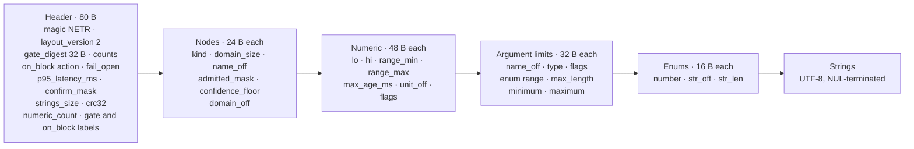
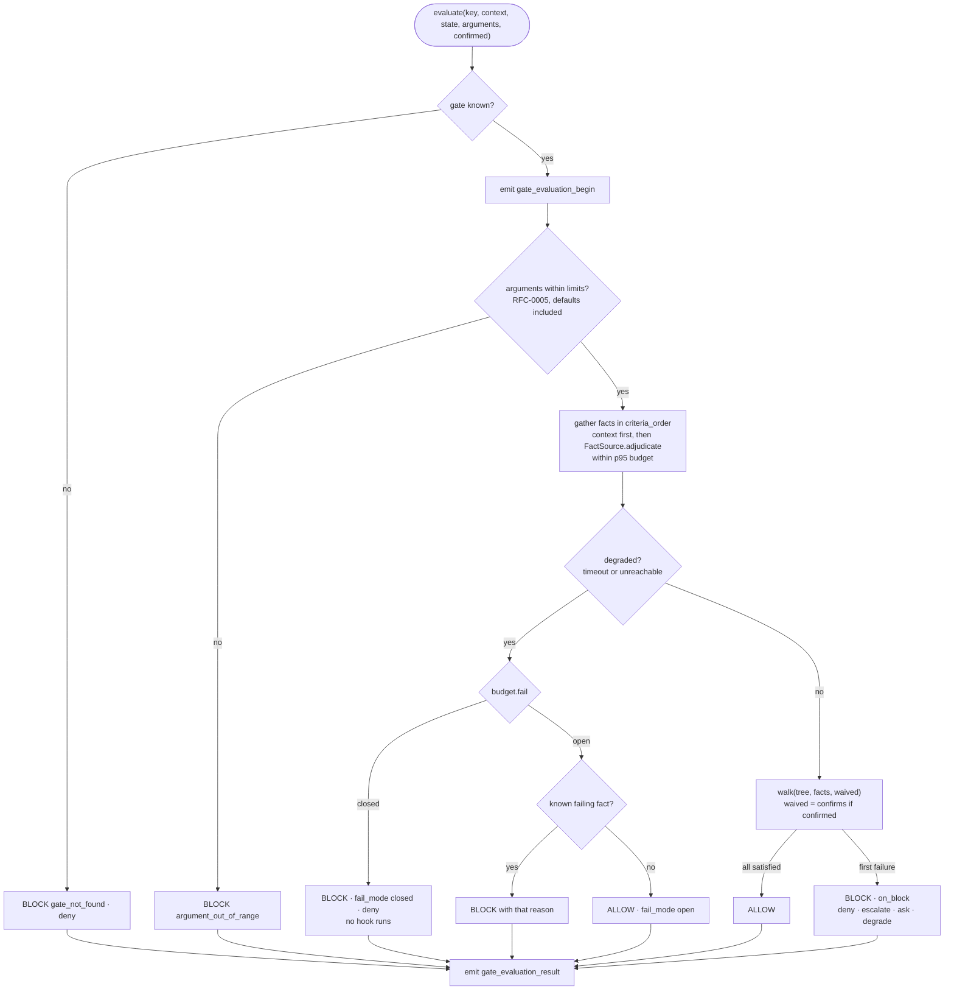
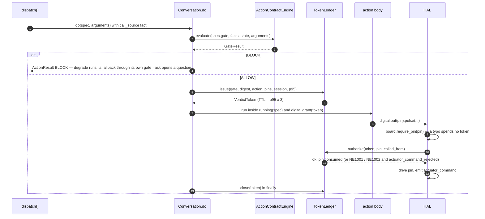
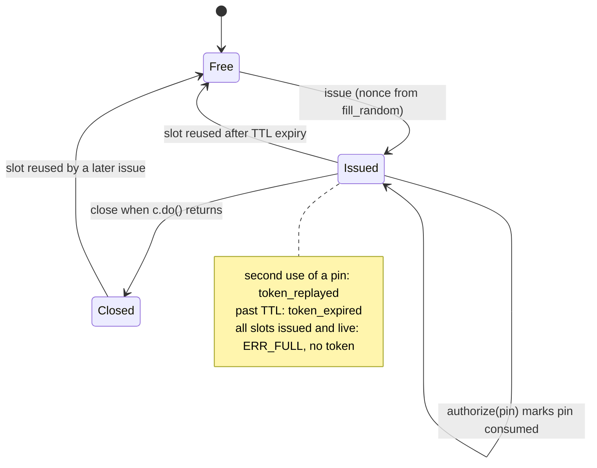
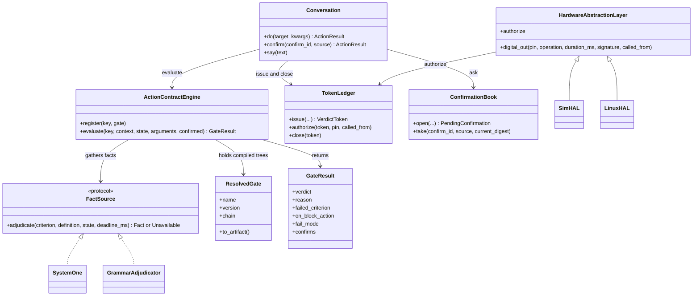

# 05 · Code level: gate → token → HAL (C4 L4)

> **Scope:** the function-level safety spine — one gate from a YAML file to a pin command, on the host
> (Python) and on the chip (C). **Source:** `python/neuroedge/engine/`, `python/neuroedge/actions/`,
> `python/neuroedge/hal/`, `targets/esp32s3/components/ne_gate/`; normative: proposal Appendix B,
> RFC-0001, 0003, 0004, 0005, 0006.

**What this chapter is for:** For software and safety engineers who need the detailed path from a YAML gate file to hardware pin commands (C4 L4). Answers the questions: how a gate is resolved, compiled into a `NETR` binary tree, walked, and granted a single-use token in both Python and C. You should read [`00`](00-overview.md) and [`03`](03-component-host-c4l3.md) first, and read [`06`](06-runtime-flows.md) afterwards to see the runtime flows.

## 1. The spine chain

*Figure E-05 — From gate file to pin: resolution and compilation at build time, evaluation and tokens at run time, with the same semantics on host and chip.*

**How to read the diagram:** Blocks represent transformation stages from YAML policy to hardware commands; solid arrows are sequential processing flows through each step, dashed arrows link auxiliary data. Core takeaway: there is only a single path from intent to hardware pins (`dispatch()` → gate → token → HAL), with no shortcut that bypasses the gate.

| Stage | When | Host (Python) | Chip (C) |
|:---|:---|:---|:---|
| Resolution | build, lint, session load | `gate_resolver.resolve_gate_file` → `ResolvedGate` | — (done on the host) |
| Hashing | build | `canonical.gate_digest` (JCS + SHA-256) | digest is in the `NETR` header |
| Compilation | build | `decision_tree.compile_tree` → JSON tree; `binary_tree.encode` → `NETR` v1 | `ne_tree_load` checks and reads in place |
| Fact gathering | every evaluation | `ActionContractEngine._gather` through `FactSource` | the caller passes `ne_fact[]` (domain indices) |
| Evaluation | every evaluation | `decision_tree.walk` | `ne_evaluate` / `ne_decide` |
| Token issue | after `ALLOW` | `TokenLedger.issue` | `ne_token_issue` |
| Pin grant | every pin command | `TokenLedger.authorize` through HAL | `ne_token_authorize` |
| Token close | when `c.do()` returns | `TokenLedger.close` | `ne_token_close` |

## 2. Resolution: from many files to one policy

`resolve_gate_file` reads the gate, follows `extends` through `GateRegistry` (`neuroedge://gates/<path>@<ver>` →
`<gates>/<path>@<ver>.yaml`), then merges the chain from root to leaf. Resolution is a **pure function**:
no clock, no network, no randomness (invariant 4).

| Rule | Content | Violation ⇒ |
|:---|:---|:---|
| Principle 1 | `evaluate` criteria are inherited; redefinition is refused | `NE2003` |
| Principle 2 | `allow_when` may only be **tightened**: the accepted value set must be a subset of the parent's, the confidence threshold ≥ the parent's | `NE2003` |
| Principle 3 | New criteria may be added | — |
| Principle 4 | `fail: open` is never inherited | — (falls back to `closed`) |
| Principle 5 | At most 3 documents in the chain; no cycles | `NE2003` |
| RFC-0004 R1–R3 | child `p95` ≤ parent's; a `closed` chain does not reopen; a child does not add `degrade` or change `fallback_action` | `NE2003` |
| RFC-0005 | Argument limits may only be narrowed; omitted ⇒ inherited | `NE2003` |
| RFC-0006 | a child's `confirms` is a subset of the parent's; each entry must be a criterion in `allow_when` | `NE2003` |
| `allow_when` as a string (CEL) | Refused everywhere today (TSK-S2-06 deferred, `TODOS.md` #42) | `NE2002` |

`allow_when` operators per criterion type (`constraints.py`): `bool` — a bare value or
`{confidence_gte: x}`; `level` — a bare value, `eq`, `lte`, `gte`; `choice` — a bare value, `eq`, `in`,
`not_in`. Unknown operator ⇒ `NE2002`.

The result is a `ResolvedGate`; `to_artifact()` is what gets canonicalized and hashed: `schema`, `name`,
`version`, `resolved_from` (the chain from the root), `evaluate`, `allow_when`, `on_block`, `budget`
(always with an explicit `fail`), and `arguments` if present. This digest (`gate_digest`) appears in the
trace, in the `NETR` header, and in the token.

> Note the two different digests: `digests.lock` hashes the **YAML document as written** (it locks the
> canonical gate files), while `gate_digest` hashes the **resolved gate** (the identity of the policy
> that runs).

## 3. Compilation: the decision tree and `NETR` v1

`compile_tree` builds an internal JSON tree (`neuroedge.decision_tree/v1`, not frozen): `criteria_order`
in root order, each node carries `kind`, `domain`, the `admitted` set and `confidence_floor`. The domain
of `bool` is `false, true`; of `level` the declared levels; of `choice` the **sorted** choices.

`binary_tree.encode` writes that tree as `NETR` v1 — a binary layout frozen by RFC-0003: little-endian,
no pointers, offsets only, fixed-size records.

```mermaid
flowchart LR
    H["Header · 80 B<br/>magic NETR · layout_version 2<br/>gate_digest 32 B · counts<br/>on_block action · fail_open<br/>p95_latency_ms · confirm_mask<br/>strings_size · crc32<br/>numeric_count · gate and on_block labels"]
    N["Nodes · 24 B each<br/>kind · domain_size · name_off<br/>admitted_mask · confidence_floor<br/>domain_off"]
    M["Numeric · 48 B each<br/>lo · hi · range_min · range_max<br/>max_age_ms · unit_off · flags"]
    A["Argument limits · 32 B each<br/>name_off · type · flags<br/>enum range · max_length<br/>minimum · maximum"]
    E["Enums · 16 B each<br/>number · str_off · str_len"]
    S["Strings<br/>UTF-8, NUL-terminated"]
    H --> N --> M --> A --> E --> S
```

**How to read the diagram:** Boxes represent contiguous partitions in the `NETR` v2 binary file (from the 80-byte header to UTF-8 strings); solid arrows show fixed ordering in memory. Core takeaway: the binary layout contains no pointers and uses fixed offsets, allowing the C walker to read directly in place from flash without dynamic allocation (stack ≤ 512 bytes).

The file size is exactly `80 + 24·n + 48·m + 32·a + 16·e + strings` (`m` numeric criteria); limits: at most 32 nodes, 32 values per
domain, 32 numeric criteria, 16 arguments, 64 enums, 16 384 string bytes (about 21 KB). A gate over the limits is refused
**at build time** (`NE2002`) and never reaches the chip. Changing the layout needs an RFC and a
`layout_version` bump; the v2 walker refuses a v1 file. Full byte table:
[`docs/rfc/0009-tieu-chi-so-numeric.md`](../../rfc/0009-tieu-chi-so-numeric.md) §3d (v1: RFC-0003).

`ne_tree_load` refuses a corrupt file before walking: bad magic, bad version, bad CRC, over the limits,
bad structure (offset outside the file, `bool` domain other than 2, NaN threshold, `confirm_mask` when
not `ask`…). Cannot load the tree ⇒ no `ALLOW`.

## 4. Evaluation

### 4.1 Host: `ActionContractEngine.evaluate`

```mermaid
flowchart TB
    S(["evaluate(key, context, state, arguments, confirmed)"]) --> K{"gate known?"}
    K -- no --> NF["BLOCK gate_not_found · deny"]
    K -- yes --> B["emit gate_evaluation_begin"]
    B --> AR{"arguments within limits?<br/>RFC-0005, defaults included"}
    AR -- no --> AO["BLOCK argument_out_of_range"]
    AR -- yes --> G["gather facts in criteria_order<br/>context first, then FactSource.adjudicate<br/>within p95 budget"]
    G --> DG{"degraded?<br/>timeout or unreachable"}
    DG -- yes --> FM{"budget.fail"}
    FM -- closed --> DC["BLOCK · fail_mode closed · deny<br/>no hook runs"]
    FM -- open --> KF{"known failing fact?"}
    KF -- yes --> DB["BLOCK with that reason"]
    KF -- no --> DO["ALLOW · fail_mode open"]
    DG -- no --> W["walk(tree, facts, waived)<br/>waived = confirms if confirmed"]
    W -- all satisfied --> AL["ALLOW"]
    W -- first failure --> OB["BLOCK · on_block<br/>deny · escalate · ask · degrade"]
    AO --> R["emit gate_evaluation_result"]
    NF --> R
    DC --> R
    DB --> R
    DO --> R
    AL --> R
    OB --> R
```

**How to read the diagram:** Diamonds are branch decision points, rectangles are processing steps and actions; solid arrows point along branch test outcomes (yes/no, closed/open, all satisfied/first failure). Core takeaway: `walk` is a pure function; missing or out-of-domain facts ⇒ `BLOCK`; timeout or lost sources ⇒ applies `budget.fail` — `closed` (default) blocks, `open` only permits `ALLOW` when there is no known failing fact.

- **The time budget** is `budget.p95_latency_ms`, counted from the start of fact gathering; each query
  to a `FactSource` is bounded by the remaining budget. Over the deadline ⇒ `budget_exceeded`; source
  throws ⇒ `gate_unreachable`. These two reasons are **degradation**: they apply `budget.fail` and skip
  `on_block`.
- **Tree walking** (`walk`) is a pure function: `ALLOW` if and only if every node is satisfied; the
  reason is the first failure in `criteria_order`. A missing fact or an out-of-domain value ⇒
  `criterion_unavailable`; confidence not a probability (NaN, `True`, > 1) ⇒ `criterion_unavailable`; a
  threshold with no confidence ⇒ `confidence_unavailable`; a value not admitted or below the threshold
  ⇒ `condition_not_met`.
- **`fail: open`** only pardons what *cannot be decided*: a fact already known to be "no" still blocks
  (`known_failure`).
- **An `ask` question** opens only when a "yes" is enough to turn `BLOCK` into `ALLOW` ("answerable"):
  the engine walks again with the `confirms` criteria waived.

### 4.2 Chip: `ne_evaluate` and `ne_decide`

Same order: argument limits first, then each node in order, first failure wins; `confirm_mask` waives
the confirmed criteria. `ne_decide` adds the degradation path: with `NE_DEGRADED_UNREACHABLE` or
`NE_DEGRADED_BUDGET`, an over-limit argument still stands; `fail_open` only pardons when no fact is
known to be failing; otherwise it blocks with `fail_mode` closed. Reason codes are shared with the host
(`engine/firmware.py::REASONS`): 0 none, 1 `condition_not_met`, 2 `criterion_unavailable`,
3 `confidence_unavailable`, 4 `argument_out_of_range`, 5 `gate_unreachable`, 6 `budget_exceeded`.

## 5. From verdict to pin

```mermaid
sequenceDiagram
    autonumber
    participant D as dispatch()
    participant C as Conversation.do
    participant E as ActionContractEngine
    participant L as TokenLedger
    participant A as action body
    participant H as HAL
    D->>C: do(spec, arguments) with call_source fact
    C->>E: evaluate(spec.gate, facts, state, arguments)
    E-->>C: GateResult
    alt BLOCK
        C-->>D: ActionResult BLOCK — degrade runs its fallback through its own gate · ask opens a question
    else ALLOW
        C->>L: issue(gate, digest, action, pins, session, p95)
        L-->>C: VerdictToken (TTL = p95 x 3)
        C->>A: run inside running(spec) and digital.grant(token)
        A->>H: digital.out(pin).pulse(...)
        H->>H: board.require_pin(pin) — a typo spends no token
        H->>L: authorize(token, pin, called_from)
        L-->>H: ok, pin consumed (or NE1001 / NE1002 and actuator_command_rejected)
        H->>H: drive pin, emit actuator_command
        C->>L: close(token) in finally
    end
```

**How to read the diagram:** Vertical columns represent layers from dispatch (`dispatch`), conversation (`Conversation`), engine (`Engine`), token ledger (`TokenLedger`), and action body to HAL; solid arrows are function calls, dashed arrows are return values; the `alt` block branches between `BLOCK` and `ALLOW`. Core takeaway: HAL must receive a valid `VerdictToken` from `TokenLedger` before pulsing actuator pins, and each token can only be used exactly once.

**The check order of `authorize`** (same on host and chip):

| # | Check | Rejected with |
|:---:|:---|:---|
| 1 | Is a token (`VerdictToken`; on the chip: a pointer other than `NULL`) | `not_a_token` · `NE1001` |
| 2 | Same process (`process_instance_id`); on the chip: same `boot_id` | `token_expired` · `NE1002` |
| 3 | Issued by this very ledger (on the chip: matches a slot by nonce and digest, constant-time comparison) | `unknown_token` · `NE1001` |
| 4 | Pin is in the token's pin set | `pin_not_granted` · `NE1001` |
| 5 | Token not closed, pin not used | `token_replayed` · `NE1002` |
| 6 | TTL not exceeded | `token_expired` · `NE1002` |

Every rejection writes `actuator_command_rejected {pin, reason, code}` **before** throwing, and the pin
does not change. The nonce never enters the trace.

**Done (TSK-N2-01):** the physical safety envelope hook (limiting total on-time and frequency per pin, declared in `board.v1` — RFC-0007) sits in `HAL.digital_out` between pin validation (`require_pin`) and `authorize` (`hal/envelope.py`; tokens are not spent when rejected) → [`15`](15-target-architecture.md) §4.2. Lease tokens (branch `feat/motion`, TSK-I2a-05: short-lived motion authority automatically renewed on new gated commands, self-expiring to safe state upon lost communication) for `motion.*` (Q-37) → [`15`](15-target-architecture.md) §4.3.

```mermaid
stateDiagram-v2
    [*] --> Free
    Free --> Issued: issue (nonce from fill_random)
    Issued --> Issued: authorize(pin) marks pin consumed
    Issued --> Closed: close when c.do() returns
    Issued --> Free: slot reused after TTL expiry
    Closed --> Free: slot reused by a later issue
    note right of Issued
        second use of a pin: token_replayed
        past TTL: token_expired
        all slots issued and live: ERR_FULL, no token
    end note
```

**How to read the diagram:** Nodes represent lifecycle states of a token slot in `TokenLedger` (`Free`, `Issued`, `Closed`); solid arrows are state transition events. Core takeaway: each pin of a token can be used only once; reusing a pin ⇒ `token_replayed`, exceeding TTL ⇒ `token_expired`, and when all slots are full, new issues are refused rather than evicting old tokens.

## 6. Main classes (host)

```mermaid
classDiagram
    class ActionContractEngine {
        +register(key, gate)
        +evaluate(key, context, state, arguments, confirmed) GateResult
    }
    class FactSource {
        <<protocol>>
        +adjudicate(criterion, definition, state, deadline_ms) Fact or Unavailable
    }
    class ResolvedGate {
        +name
        +version
        +chain
        +to_artifact()
    }
    class GateResult {
        +verdict
        +reason
        +failed_criterion
        +on_block_action
        +fail_mode
        +confirms
    }
    class Conversation {
        +do(target, kwargs) ActionResult
        +confirm(confirm_id, source) ActionResult
        +say(text)
    }
    class TokenLedger {
        +issue(...) VerdictToken
        +authorize(token, pin, called_from)
        +close(token)
    }
    class HardwareAbstractionLayer {
        +digital_out(pin, operation, duration_ms, signature, called_from)
        +authorize
    }
    class ConfirmationBook {
        +open(...) PendingConfirmation
        +take(confirm_id, source, current_digest)
    }
    ActionContractEngine --> ResolvedGate : holds compiled trees
    ActionContractEngine --> FactSource : gathers facts
    ActionContractEngine --> GateResult : returns
    Conversation --> ActionContractEngine : evaluate
    Conversation --> TokenLedger : issue and close
    Conversation --> ConfirmationBook : ask
    HardwareAbstractionLayer --> TokenLedger : authorize
    HardwareAbstractionLayer <|-- SimHAL
    HardwareAbstractionLayer <|-- LinuxHAL
    FactSource <|.. SystemOne
    FactSource <|.. GrammarAdjudicator
```

**How to read the diagram:** Boxes are main classes and protocols on the Python host; hollow triangle solid arrows denote inheritance (`SimHAL`, `LinuxHAL`); hollow triangle dashed arrows denote protocol implementation (`SystemOne`, `GrammarAdjudicator` implement `FactSource`); regular arrows denote holding or calling. Core takeaway: `Conversation` is the sole class connecting the engine to the token ledger; HAL only knows `TokenLedger` through `authorize`, with no knowledge of the engine or `FactSource`.

## 7. Python ↔ C comparison

Two implementations of the same spec (Q-8). Equivalence is proven by tests, not by a promise.

| Concept | Python | C | Proof |
|:---|:---|:---|:---|
| Tree | `compile_tree` + `encode` | `ne_tree_load` | `test_c_walker.py` compares the C walker with the engine on every gate and the `fixtures/decision_trees/` truth tables, fuzzes tree files |
| Evaluation | `walk`, `known_failure` | `ne_evaluate`, `ne_decide` | as above; boot self-test against answers the engine computed at build time |
| Token | `TokenLedger` | `ne_token_*` | `test_c_token.py`: the same rejection reasons over the same operation sequence, plus mutations |
| Trace | `EventLog.emit` | `ne_trace_*` | `test_c_trace.py`; `verify --targets esp32s3` against goldens |
| OTA version | `firmware.py::_RELEASE` | `ne_ota_parse_version` | `test_ota_version_rule.py` runs the same case list on both |
