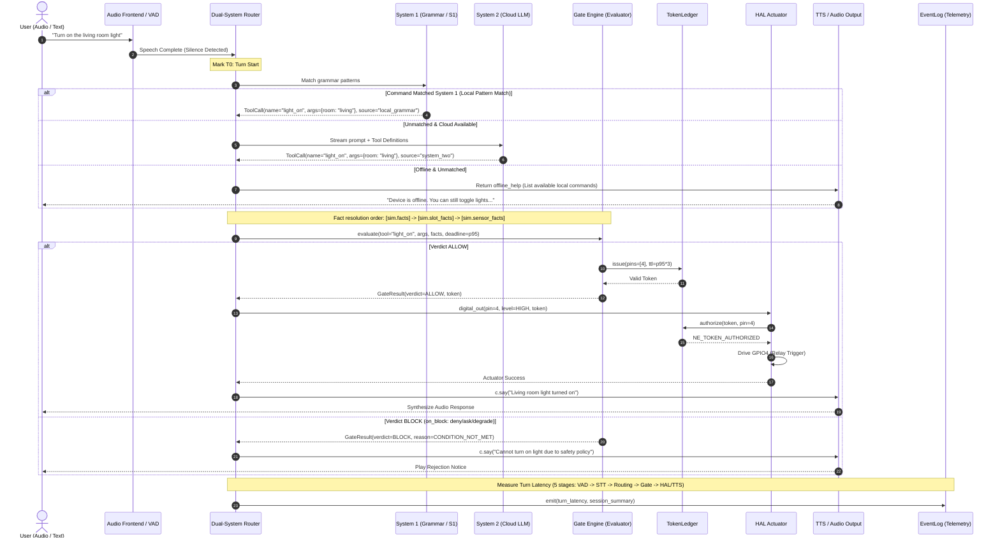
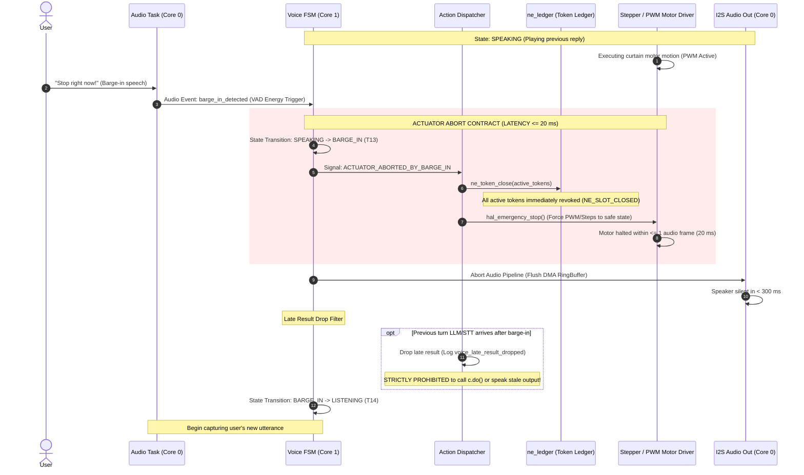
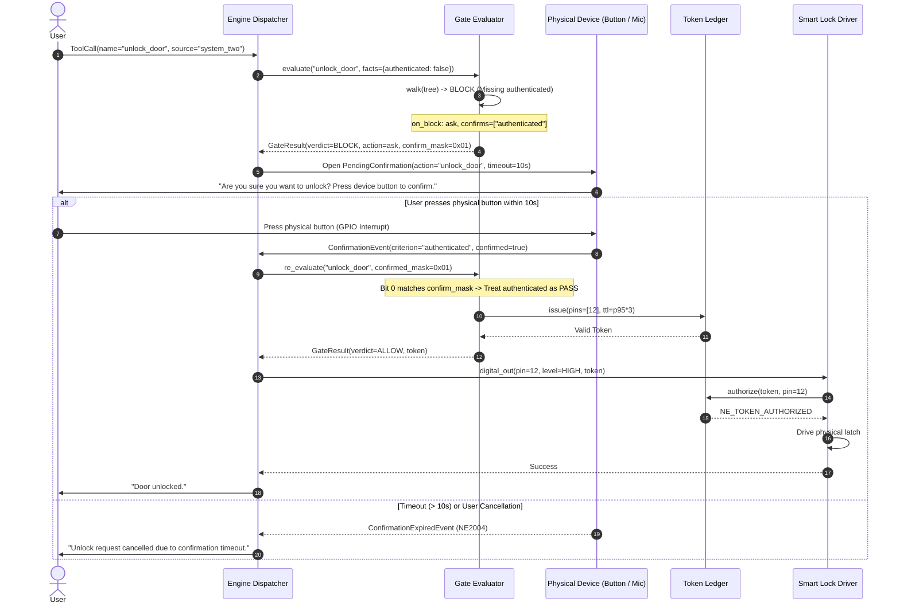
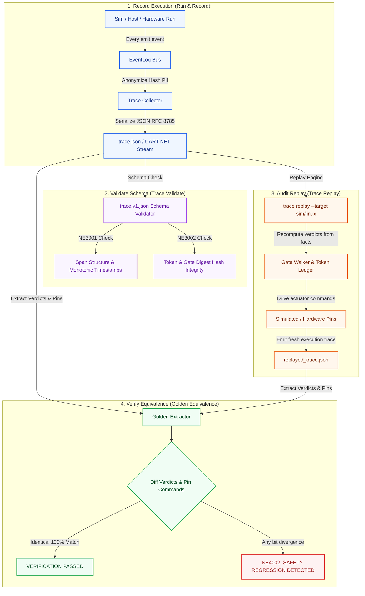

# 06 · Runtime Flows

> **Status:** `done` · Standardized Real-time Runtime Execution Flows  
> **Reference Documents:** [04-component-device-c4l3.md](file:///Users/minhlt/Downloads/Projects/neuroedge-init/docs/architecture/en/04-component-device-c4l3.md), [05-code-gate-hal-c4l4.md](file:///Users/minhlt/Downloads/Projects/neuroedge-init/docs/architecture/en/05-code-gate-hal-c4l4.md), [E-06-trace-lifecycle](../assets/svg/E-06-trace-lifecycle.svg), [RFC-0006](file:///Users/minhlt/Downloads/Projects/neuroedge-init/docs/rfcs/RFC-0006-on-block-ask-confirms.md)  
> **Normative Test Suites:** `tests/test_runtime_flows.py`, `tests/test_barge_in.py`, `tests/test_trace_replay.py`

---

## 1. Overall Interactive Session Flow (`run` session turn)

Each spoken or typed conversational turn strictly adheres to a Dual-System Router model: Short, routine commands are resolved locally via System 1 (Grammar, latency $\le 50$ ms). Open-ended, complex utterances are routed upstream to System 2 (LLM / Cloud, latency $\le 1200$ ms).



### 1.1. Fact Resolution Precedence

When `engine.evaluate()` is invoked, fact sources are aggregated in descending order of precedence:
1. `[sim.facts]` (Explicit fact overrides from test scripts or session harness).
2. `[sim.slot_facts]` (Facts extracted directly from utterance slots).
3. `[sim.sensor_facts]` (Real-time hardware sensor readings queried via HAL).
4. `[grammar]` (Default facts declared statically in grammar rules).

---

## 2. Barge-in & Actuator Abort Contract

Barge-in occurs when a user begins speaking while the device is processing (`THINKING`) or speaking (`SPEAKING`). The system must instantly revoke hardware execution authority.



### 2.1. Four Invariants of Barge-in

1. **Abort Undelivered Actuation ($\le 20$ ms):** Any incomplete actuator command must be halted immediately (`ACTUATOR_ABORTED_BY_BARGE_IN`). Irreversible physical actions already completed cannot be undone, but dependent chains are severed.
2. **Revoke Active Tokens:** Issued tokens associated with aborted actions are transitioned to `closed`. Subsequent authorization attempts are rejected with `NE_TOKEN_EXPIRED` or `NE_TOKEN_REPLAYED`.
3. **Immediate Speaker Silence ($< 300$ ms):** Audio playback must fall silent in $< 300$ ms (accounting for VAD energy detection latency and I2S DMA FIFO drain).
4. **Drop Late Turn Results:** Upstream LLM or STT responses belonging to the interrupted turn that arrive late are dropped silently (`voice_late_result_dropped`), preventing delayed actuation or stale audio playback.

---

## 3. Tool Dispatch & In-Person Confirmation

When a safety policy blocks an action but specifies `on_block: ask` with `confirms` attributes (per [RFC-0006](file:///Users/minhlt/Downloads/Projects/neuroedge-init/docs/rfcs/RFC-0006-on-block-ask-confirms.md)), the system triggers in-person physical verification:



> **In-Person Confirmation Safety Invariants:**
> - Confirmation is strictly **single-use** for a single action invocation.
> - Confirmation must originate from a **physical on-device interface** (hardware push button, biometric sensor, or local microphone). Remote confirmations via unauthenticated network APIs are forbidden.
> - If the Gate configuration changes (hash `gate_digest` updates) while awaiting confirmation, the `PendingConfirmation` is immediately invalidated.

---

## 4. Fail-Closed Offline Fallback

The system adheres to safe disconnection principles: When cloud connectivity drops or AI providers exceed their $p95$ budget, offline degradation logic executes deterministically without freezing the device.

```mermaid
sequenceDiagram
    autonumber
    actor User as User
    participant Router as Session Router
    participant S2 as Cloud System 2
    participant S1 as Local Grammar (System 1)
    participant Gate as Gate Engine
    participant Trace as EventLog

    User->>Router: "Check temperature and turn on the water heater"
    Router->>S2: Dispatch cloud request (Timeout deadline = 1000 ms)
    
    alt Network Disconnection or Timeout (p95 Exceeded)
        S2--xRouter: Network Timeout / DNS Error
        Router->>Trace: emit(source_degraded, reason=GATE_UNREACHABLE)
        
        Router->>S1: match_local_grammar("Check temperature and turn on the water heater")
        alt Command matches local grammar
            S1-->>Router: ToolCall(name="water_heater_on", source="local_grammar")
            Router->>Gate: evaluate("water_heater_on", degraded=UNREACHABLE)
            
            alt Gate configured `fail: closed` (Default)
                Gate-->>Router: GateResult(verdict=BLOCK, reason=GATE_UNREACHABLE)
                Router->>User: "Cannot activate water heater while offline (Safety Policy)."
            else Gate configured `fail: open`
                Note over Gate: Only missing facts are excused; explicit NO still blocks
                Gate-->>Router: GateResult(verdict=ALLOW, degraded=OPEN)
                Router->>User: "Water heater activated in offline mode."
            end
        else No local grammar match
            Router->>User: "Connection lost. Available commands: light on, light off..."
        end
    end
```

---

## 5. Trace Lifecycle & Target Verification

Audit traces (`trace.json`) serve as mathematical evidence guaranteeing system integrity and target equivalence between the Simulator, Linux, and actual hardware (ESP32-S3).



### 5.1. Trace Replay Principles

- **No Result Trust:** `neuroedge trace replay` **recomputes all decisions from scratch** using the binary decision tree and recorded raw facts.
- **Ignore Non-Safety Data:** Golden diffing strips real-time wall-clock timing (`timestamp_ms`, network transit jitter) and unconstrained LLM phrasing, focusing strictly on:
  1. **Gate Verdict Sequences:** `ALLOW` or `BLOCK`.
  2. **HAL Pin Transition Sequences:** Target GPIO pin numbers, logic levels (HIGH/LOW), and relative ordering.
- **Safety Regression Detection (NE4002):** If hardware execution yields an `ALLOW` where the golden trace specifies `BLOCK`, CI immediately fails with a **Fatal Safety Regression**.
