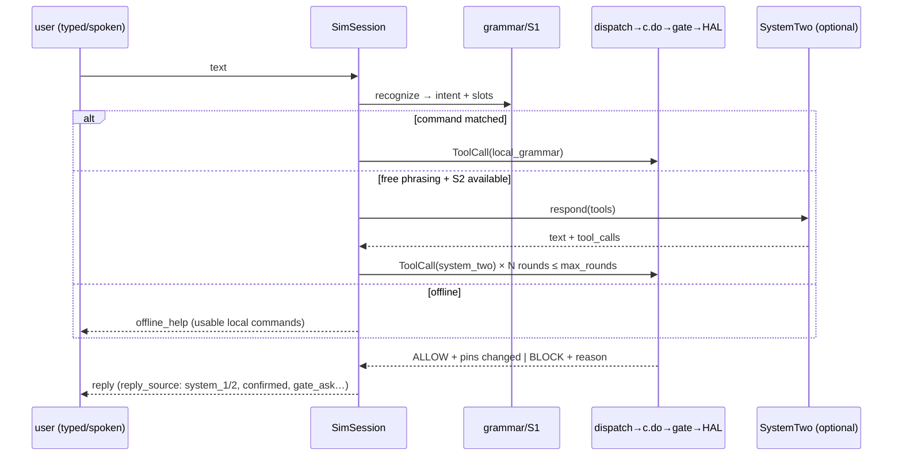
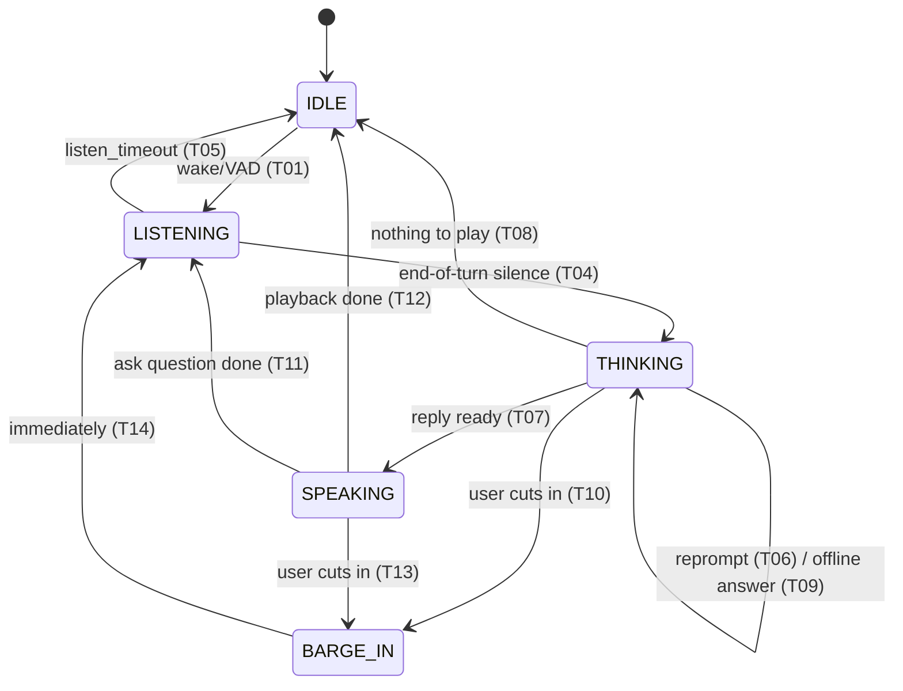

# 06 · Runtime Flows

> Status: session/tool/voice/trace `done` (I0–I4); OTA/multi-node `planned`.
> Normative specs: `voice_fsm.md`, `tool_calling.md`, `simulation_coverage.md`.

## 1. Interactive session (`run`)

Fact order: `[sim.facts] → [sim.slot_facts] → [sim.sensor_facts] → grammar`.
`c.say()` bypasses gates; `c.do()` always passes them. Every turn logs
`turn_latency` (`system_1/2/fallback/none` path + 5 stages); sessions close
with `session_summary`.

## 2. Barge-in — the abort contract

On entering `BARGE_IN`, in mandatory order: (1) cancel every **undelivered**
command (≤ 20 ms, `ACTUATOR_ABORTED_BY_BARGE_IN`); (2) close cancelled tokens —
retry requires a fresh `c.do()`; (3) stop TTS (speaker silent < 300 ms, VAD
included); (4) drop late results of the replaced turn (STT/reply/tool →
`voice_late_result_dropped`), which must **never** `c.do()` or speak.
Delivered commands run to completion; pending `ask` survives — the
interruption may be the answer.

## 3. Tool dispatch + human confirmation

`ToolCall{id, name, arguments, source}` — `source` is stamped by the runtime
(`local_grammar/system_one/system_two/mcp/test`); self-declared sources →
REJECTED. `dispatch`: schema check → trusted `call_source` injection →
`c.do()`. Unknown tools/arguments → REJECTED (protocol error); values outside
gate limits → BLOCK `argument_out_of_range`.

`on_block: ask` (Q-26): humans via device only; gates pre-declare replaceable
criteria (`confirms`); re-evaluation uses current facts with everything else
still enforced; single-use, expiring, void when the gate changes.

## 4. Trace lifecycle (poster E-06)

`record` (every `emit` into one `EventLog`, optional source anonymization via
decision-preserving hashes) → `trace validate` → `replay` (**recomputes**
verdicts + pins on live HAL, never copies results) → `verify` on
sim/linux/esp32s3 → `golden` (verdicts + pin commands only, no timing/text).
BLOCK→ALLOW flips or new pin commands are *SAFETY REGRESSION*s (NE4002).
Device traces arrive over UART `NE1` via `record --target esp32s3 --port`.
