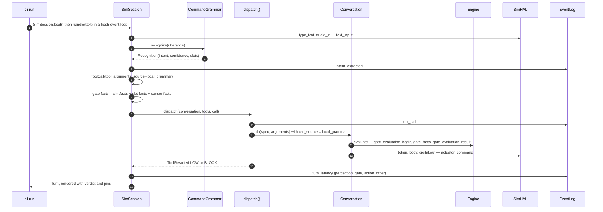
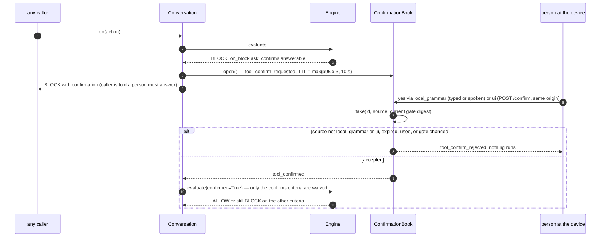
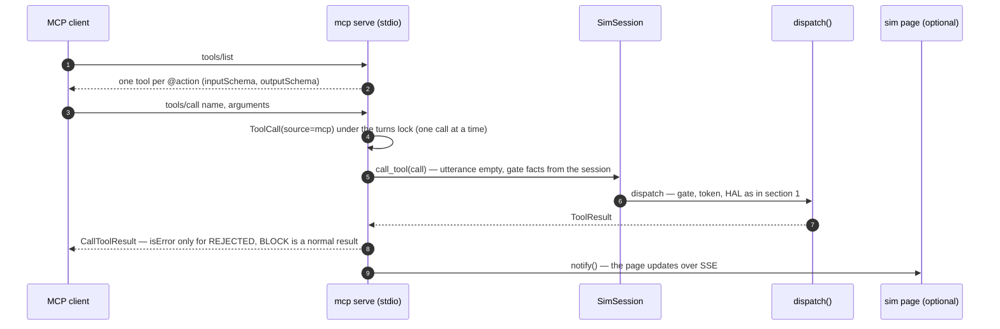
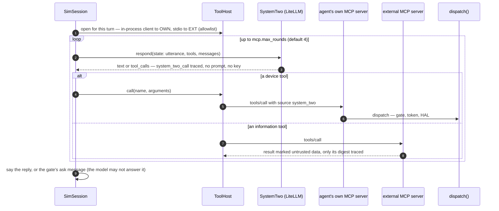
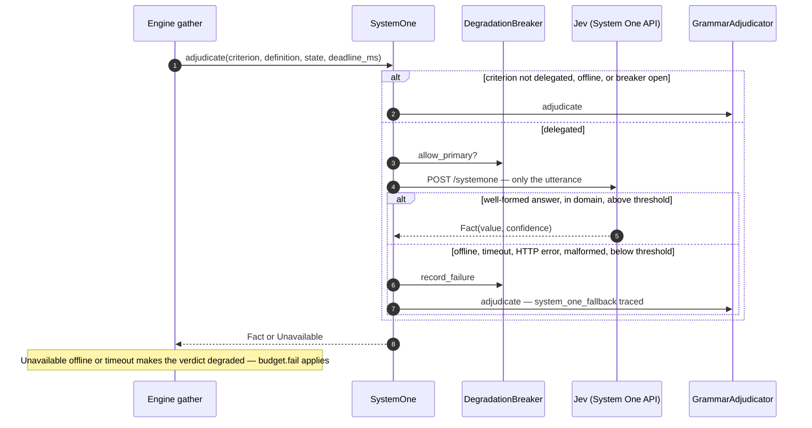
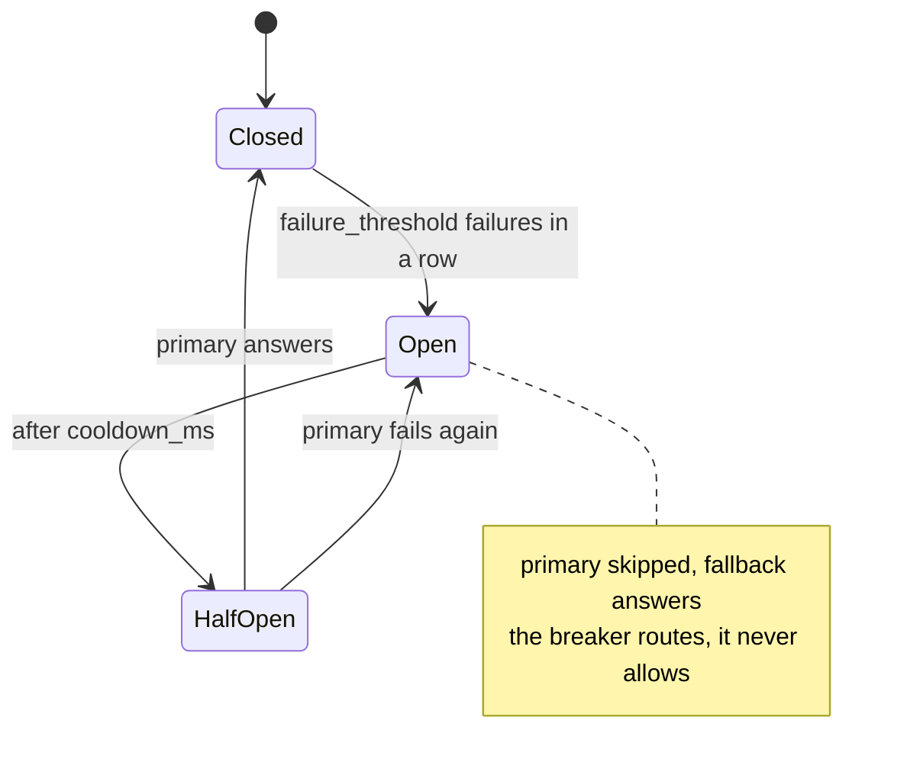
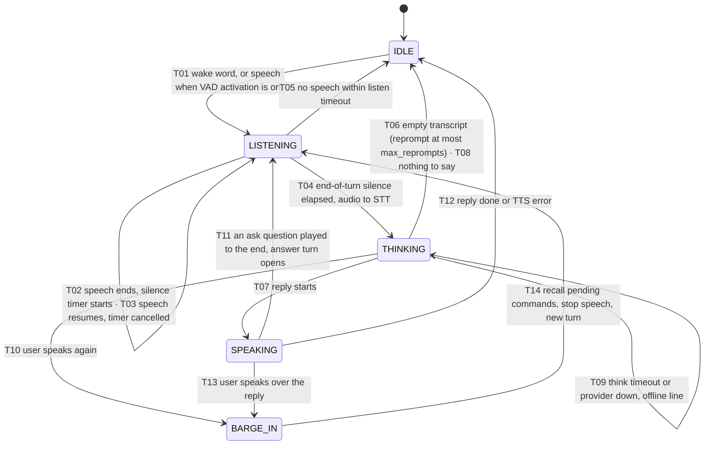
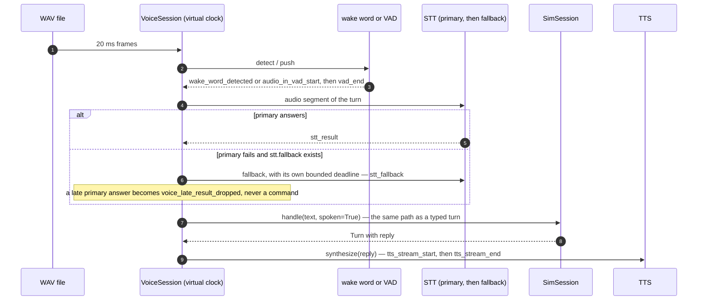
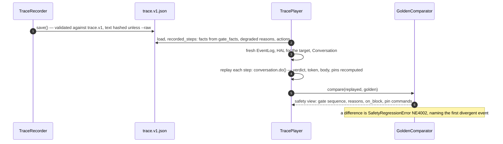
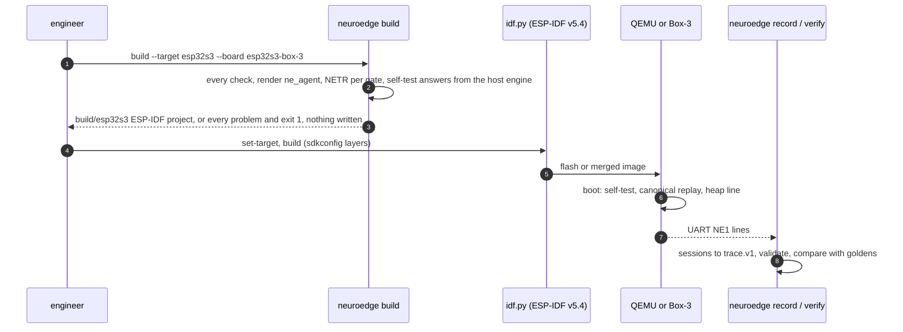

# 06 · Runtime flows (Dynamic views)

> **Scope:** the important flows, each with a sequence or state diagram, calling functions by their
> exact names in the code. **Source:** `sim/session.py`, `actions/`, `engine/gate.py`, `mcp_server.py`,
> `mcp_host.py`, `models/system.py`, `perception/`, `testing/`, `docs/spec/voice_fsm.md`,
> `docs/spec/tool_calling.md`.

Every flow below, wherever it starts, meets at the same segment: `dispatch()` → `Conversation.do`
→ `ActionContractEngine.evaluate` → `TokenLedger` → HAL ([`05`](05-code-gate-hal-c4l4.md) §5). The
diagrams draw that segment once in §1 and call it by name in the other flows.

## 1. A typed command turn

`neuroedge run -c "mở cửa phòng 101"` on `sim`.

```mermaid
sequenceDiagram
    autonumber
    participant CLI as cli run
    participant S as SimSession
    participant G as CommandGrammar
    participant D as dispatch()
    participant C as Conversation
    participant E as Engine
    participant H as SimHAL
    participant T as EventLog
    CLI->>S: SimSession.load() then handle(text) in a fresh event loop
    S->>H: type_text, audio_in — text_input
    S->>G: recognize(utterance)
    G-->>S: Recognition(intent, confidence, slots)
    S->>T: intent_extracted
    S->>S: ToolCall(tool, arguments, source=local_grammar)
    S->>S: gate facts = sim.facts + slot facts + sensor facts
    S->>D: dispatch(conversation, tools, call)
    D->>T: tool_call
    D->>C: do(spec, arguments) with call_source = local_grammar
    C->>E: evaluate — gate_evaluation_begin, gate_facts, gate_evaluation_result
    C->>H: token, body, digital.out — actuator_command
    D-->>S: ToolResult ALLOW or BLOCK
    S->>T: turn_latency (perception, gate, action, other)
    S-->>CLI: Turn, rendered with verdict and pins
```

A sentence that does not match the grammar: with `[system_two]` it goes to the flow in §4; otherwise
`command_not_recognized` and the device speaks the local commands that still work (`offline_help`).

## 2. Ask and confirmation (`on_block: ask`, RFC-0006)

```mermaid
sequenceDiagram
    autonumber
    participant X as any caller
    participant C as Conversation
    participant E as Engine
    participant B as ConfirmationBook
    participant P as person at the device
    X->>C: do(action)
    C->>E: evaluate
    E-->>C: BLOCK, on_block ask, confirms answerable
    C->>B: open() — tool_confirm_requested, TTL = max(p95 x 3, 10 s)
    C-->>X: BLOCK with confirmation (caller is told a person must answer)
    P->>B: yes via local_grammar (typed or spoken) or ui (POST /confirm, same origin)
    B->>B: take(id, source, current gate digest)
    alt source not local_grammar or ui, expired, used, or gate changed
        B-->>P: tool_confirm_rejected, nothing runs
    else accepted
        B-->>C: tool_confirmed
        C->>E: evaluate(confirmed=True) — only the confirms criteria are waived
        E-->>C: ALLOW or still BLOCK on the other criteria
    end
```

- System 2 and the MCP client have **no confirmation tool**; a question created by System 2's own call
  cannot be answered by System 2 (Q-26).
- A spoken "yes" only answers the question of **that very turn** (Q-46).

## 3. MCP calls

```mermaid
sequenceDiagram
    autonumber
    participant CL as MCP client
    participant M as mcp serve (stdio)
    participant S as SimSession
    participant D as dispatch()
    participant UI as sim page (optional)
    CL->>M: tools/list
    M-->>CL: one tool per @action (inputSchema, outputSchema)
    CL->>M: tools/call name, arguments
    M->>M: ToolCall(source=mcp) under the turns lock (one call at a time)
    M->>S: call_tool(call) — utterance empty, gate facts from the session
    S->>D: dispatch — gate, token, HAL as in section 1
    D-->>M: ToolResult
    M-->>CL: CallToolResult — isError only for REJECTED, BLOCK is a normal result
    M->>UI: notify() — the page updates over SSE
```

An MCP call has no spoken words, so `[system_one]` sends nothing to the model: that criterion falls
back to grammar or blocks. A gate can refuse the `mcp` source specifically through the `call_source`
criterion.

## 4. A System 2 (LLM) turn, with an external MCP server

```mermaid
sequenceDiagram
    autonumber
    participant S as SimSession
    participant TH as ToolHost
    participant LLM as SystemTwo (LiteLLM)
    participant OWN as agent's own MCP server
    participant EXT as external MCP server
    participant D as dispatch()
    S->>TH: open for this turn — in-process client to OWN, stdio to EXT (allowlist)
    loop up to mcp.max_rounds (default 4)
        S->>LLM: respond(state: utterance, tools, messages)
        LLM-->>S: text or tool_calls — system_two_call traced, no prompt, no key
        alt a device tool
            S->>TH: call(name, arguments)
            TH->>OWN: tools/call with source system_two
            OWN->>D: dispatch — gate, token, HAL
        else an information tool
            TH->>EXT: tools/call
            EXT-->>TH: result marked untrusted data, only its digest traced
        end
    end
    S->>S: say the reply, or the gate's ask message (the model may not answer it)
```

The provider cannot answer ⇒ `system_two_unavailable`, the device speaks an offline line. If content
from an external MCP server contains an injected command (prompt injection), the call it leads to still
has to pass the gate (`test_mcp_host.py::test_prompt_injection_in_the_news_still_meets_the_gate`).

## 5. The System 1 model and when offline

`SystemOne` is the engine's `FactSource`. With `[system_one]`, it asks the primary model (Jev via the
System One API) for the delegated criteria, within the remaining budget minus 50 ms of reserve; if the
model is not usable, the command grammar decides.

```mermaid
sequenceDiagram
    autonumber
    participant E as Engine gather
    participant S1 as SystemOne
    participant BR as DegradationBreaker
    participant JEV as Jev (System One API)
    participant GR as GrammarAdjudicator
    E->>S1: adjudicate(criterion, definition, state, deadline_ms)
    alt criterion not delegated, offline, or breaker open
        S1->>GR: adjudicate
    else delegated
        S1->>BR: allow_primary?
        S1->>JEV: POST /systemone — only the utterance
        alt well-formed answer, in domain, above threshold
            JEV-->>S1: Fact(value, confidence)
        else offline, timeout, HTTP error, malformed, below threshold
            S1->>BR: record_failure
            S1->>GR: adjudicate — system_one_fallback traced
        end
    end
    S1-->>E: Fact or Unavailable
    Note over E: Unavailable offline or timeout makes the verdict degraded — budget.fail applies
```

```mermaid
stateDiagram-v2
    [*] --> Closed
    Closed --> Open: failure_threshold failures in a row
    Open --> HalfOpen: after cooldown_ms
    HalfOpen --> Closed: primary answers
    HalfOpen --> Open: primary fails again
    note right of Open
        primary skipped, fallback answers
        the breaker routes, it never allows
    end note
```

No fallback can run for a model-decided criterion ⇒ `BLOCK` with `gate_unreachable` (Q-14, the third
I4 exit criterion).

## 6. Voice

### 6.1 The conversation state machine

Normative in `docs/spec/voice_fsm.md` §4 (T01–T14). Every state change writes `voice_state_changed`.
The state machine never evaluates a gate or touches a pin.

```mermaid
stateDiagram-v2
    [*] --> IDLE
    IDLE --> LISTENING: T01 wake word, or speech when VAD activation is on
    LISTENING --> LISTENING: T02 speech ends, silence timer starts · T03 speech resumes, timer cancelled
    LISTENING --> THINKING: T04 end-of-turn silence elapsed, audio to STT
    LISTENING --> IDLE: T05 no speech within listen timeout
    THINKING --> IDLE: T06 empty transcript (reprompt at most max_reprompts) · T08 nothing to say
    THINKING --> SPEAKING: T07 reply starts
    THINKING --> THINKING: T09 think timeout or provider down, offline line
    THINKING --> BARGE_IN: T10 user speaks again
    SPEAKING --> LISTENING: T11 an ask question played to the end, answer turn opens
    SPEAKING --> IDLE: T12 reply done or TTS error
    SPEAKING --> BARGE_IN: T13 user speaks over the reply
    BARGE_IN --> LISTENING: T14 recall pending commands, stop speech, new turn
```

### 6.2 One voice turn from a WAV file

```mermaid
sequenceDiagram
    autonumber
    participant F as WAV file
    participant V as VoiceSession (virtual clock)
    participant W as wake word or VAD
    participant STT as STT (primary, then fallback)
    participant S as SimSession
    participant TTS as TTS
    F->>V: 20 ms frames
    V->>W: detect / push
    W-->>V: wake_word_detected or audio_in_vad_start, then vad_end
    V->>STT: audio segment of the turn
    alt primary answers
        STT-->>V: stt_result
    else primary fails and stt.fallback exists
        V->>STT: fallback, with its own bounded deadline — stt_fallback
        Note over V: a late primary answer becomes voice_late_result_dropped, never a command
    end
    V->>S: handle(text, spoken=True) — the same path as a typed turn
    S-->>V: Turn with reply
    V->>TTS: synthesize(reply) — tts_stream_start, then tts_stream_end
```

**Barge-in** (`docs/spec/voice_fsm.md` §5): the user speaks while the device is thinking or speaking ⇒
the speaker stops, every command **not yet delivered** to a pin is aborted (`actuator_aborted`, reason
`ACTUATOR_ABORTED_BY_BARGE_IN`) and its token is closed. A delivered command (a pulse already running)
runs to the end.

**A broken wake word** (model fails to load, adapter throws) ⇒ `wake_word_unavailable`, no turn opens,
the session keeps running.

Voice sessions today run in **virtual time** from a WAV file; a real-time session with a real
microphone does not exist yet (`TODOS.md` #45).

## 7. The evidence loop: record, replay, compare

*Figure E-06 — A session becomes a trace; the trace is recomputed on each target and compared with the original.*

```mermaid
sequenceDiagram
    autonumber
    participant R as TraceRecorder
    participant F as trace.v1.json
    participant P as TracePlayer
    participant G as GoldenComparator
    R->>F: save() — validated against trace.v1, text hashed unless --raw
    P->>F: load, recorded_steps: facts from gate_facts, degraded reasons, actions
    P->>P: fresh EventLog, HAL for the target, Conversation
    P->>P: replay each step: conversation.do() — verdict, token, body, pins recomputed
    P->>G: compare(replayed, golden)
    G-->>P: safety view: gate sequence, reasons, on_block, pin commands
    Note over G: a difference is SafetyRegressionError NE4002, naming the first divergent event
```

- Replay **calls no model and reads no machine**: the recorded facts are fed back in, while verdicts,
  tokens and pin commands are **recomputed**.
- Comparison is by **decision** (verdict, reason, `on_block`, pin commands), ignoring time and spoken
  words.
- `neuroedge verify --targets sim,linux,esp32s3` does this for every canonical trace on each target; on
  `esp32s3`, the firmware itself replays the three canonical traces at boot and sends the results over
  UART.

## 8. From agent to chip

```mermaid
sequenceDiagram
    autonumber
    participant U as engineer
    participant B as neuroedge build
    participant I as idf.py (ESP-IDF v5.4)
    participant Q as QEMU or Box-3
    participant R as neuroedge record / verify
    U->>B: build --target esp32s3 --board esp32s3-box-3
    B->>B: every check, render ne_agent, NETR per gate, self-test answers from the host engine
    B-->>U: build/esp32s3 ESP-IDF project, or every problem and exit 1, nothing written
    U->>I: set-target, build (sdkconfig layers)
    I->>Q: flash or merged image
    Q->>Q: boot: self-test, canonical replay, heap line
    Q-->>R: UART NE1 lines
    R->>R: sessions to trace.v1, validate, compare with goldens
```

## 9. Lifecycle of a `linux` session

1. `SimSession.load(target="linux")` builds `TypedLinuxHAL` and calls `preflight`: every sensor,
   display and audio device the agent needs is checked **before** any GPIO line is held. Anything
   missing ⇒ three-part error, exit code 1, no line held.
2. Pin commands reach the kernel line through libgpiod v2, looked up by name. A pulse with a duration
   is released by a timer; `run -c` waits for the pulse to finish before exiting.
3. Exit — normal, Ctrl-D, SIGTERM (MCP client stops the server), SIGHUP (terminal closed) — ⇒ every
   line returns to the idle state and is released. SIGKILL cannot be caught: that is why hardware
   safety is still needed (`docs/spec/threat_model.md` §3b).
