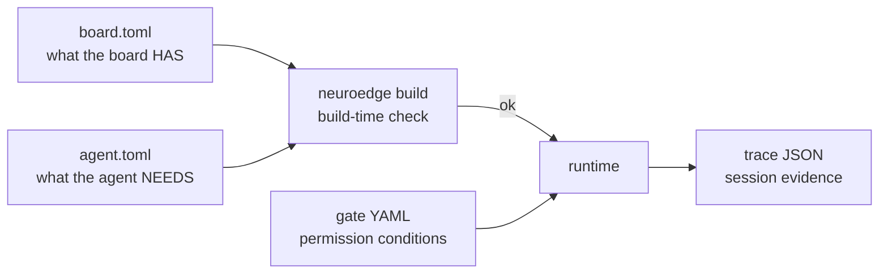

# 07 · Data Contracts

> Mandatory constraints: PRD §10 (DATA-01..DATA-06). Field details: source
> appendices A–C + `schemas/`. This file only draws the relationships.

## 1. Four files + one envelope

| File | Format | One sentence | Version rule |
|:---|:---|:---|:---|
| `board.toml` | TOML (`board.v1`) | Board declares 5 primitives with **logical** pin names | Regular PR (needs real hardware for numbers) |
| `agent.toml` | TOML | Agent declares `[requires]`, gates, `[sim.*]` facts, `[system_two]`, `[mcp.servers]` | Regular PR |
| `<gate>@<semver>.yaml` | YAML (`gate.v1`) | `evaluate/allow_when/on_block/budget` + `arguments`; `allow_when` change = major bump | Golden-gate edit/delete → **RFC** + `digests.lock` |
| `<session>.json` | JSON (`trace.v1`) | 6 event groups + `metadata`; open event `type`s (new events need no RFC) | URL `/v1→/v2`; old traces replay after minor upgrades |
| `ToolCall` envelope | runtime object | `{id, name, arguments, source}` — one path for every caller | Freeze into `schemas/` with the first external client (`TODOS.md` #23) |

## 2. Three two-way checks (contracts cut both ways)

1. **Capability**: `board.toml` (has) ↔ `[requires]` + `@action(requires)`
   (needs) — mismatch fails `build` with code 1, no firmware (DATA-02).
2. **Safety**: `ToolCall` ↔ gate (`arguments` + `allow_when` + `call_source`) —
   unknown → REJECTED, out-of-limits → BLOCK, no pin moves in either case.
3. **Evidence**: traces ↔ golden — replay recomputes, golden compares verdicts
   + pin commands only (DATA-06: no timestamps, no raw content).

DATA-01 (logical names, never physical pin numbers) + DATA-04 (`evaluate`
maps 1-1 onto the 3 `SystemOne` kinds) are the two constraints that keep P-2
and P-4 standing when boards and providers change.
