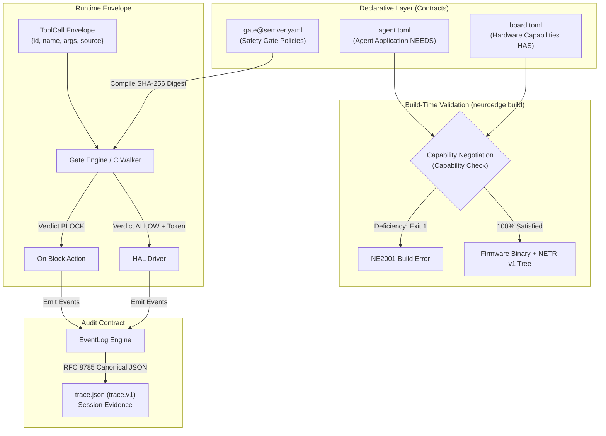
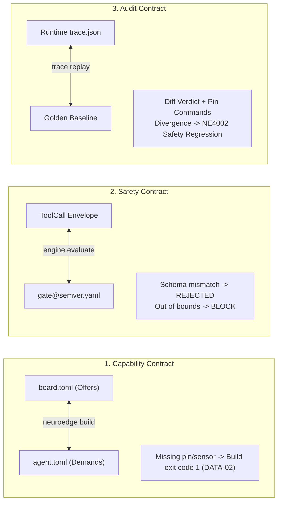

# 07 · Data Contracts & Interface Specifications

> **Status:** `done` · Standardized Declarative Data Contracts  
> **Mandatory Constraints:** PRD §10 (DATA-01..DATA-06) · [RFC-0003](file:///Users/minhlt/Downloads/Projects/neuroedge-init/docs/rfcs/RFC-0003-binary-decision-tree.md), [RFC-0005](file:///Users/minhlt/Downloads/Projects/neuroedge-init/docs/rfcs/RFC-0005-gate-argument-limits.md)  
> **Schema Definitions:** `schemas/board.v1.json`, `schemas/gate.v1.json`, `schemas/trace.v1.json`

---

## 1. Overall Map of 4 Files & 1 Runtime Envelope

The NeuroEdge architecture is built on the principle of **Declarative Contracts**. All interactions between hardware capabilities, agent logic, safety gates, and audit telemetry are governed by four declarative files and one unified runtime envelope:



---

## 2. Canonical Specification of 4 Core Files

### 2.1. `board.toml` (`board.v1`): Hardware Capability Declaration

The board declares its physical capabilities across 5 canonical primitives (Audio In, Audio Out, Digital Out, Sensor Read, Display).

```toml
# board.toml — ESP32-S3 Box-3 Board Specification (Reference)
[board]
id     = "esp32s3-box3"
name   = "ESP32-S3-BOX-3 Development Kit"
target = "esp32s3"
mcu    = "esp32s3"

[capabilities.audio_in]
channels       = 2
sample_rate_hz = 16000
aec            = true       # On-chip Acoustic Echo Cancellation
vad            = true       # Hardware Voice Activity Detection

[capabilities.audio_out]
channels       = 1
sample_rate_hz = 16000

[capabilities.digital_out]
backend = "gpio"
# CONSTRAINT DATA-01: Logical pin names, NEVER physical pin numbers in application code
pins = ["status_led", "porch_light", "relay_ch1", "door_lock"]

[capabilities.sensor_read]
sensors = ["temperature", "humidity", "motion", "ambient_light"]

[capabilities.display]
width  = 320
height = 240
color  = "rgb565"
```

> **Constraint DATA-01:**  
> Application `@action` code and `agent.toml` may only reference pins by their **logical names** (e.g. `"porch_light"`). The mapping from logical names to physical GPIO pin indices is maintained exclusively in board manifests or OEM BSP drivers.

---

### 2.2. `agent.toml`: Agent Requirements & Configuration

Declares all required hardware resources, safety gates, simulation harnesses, and System 2 routing:

```toml
# agent.toml — Smart Home Voice Assistant Configuration
[agent]
name    = "home-voice"
version = "1.0.0"

# DATA-02 Matching: Every entry in requires must be present in board.toml
[requires]
"audio.in"    = { channels = 1 }
"audio.out"   = { sample_rate_hz = 16000 }
"digital.out" = { pins = ["porch_light", "door_lock"] }
"sensor.read" = { sensors = ["motion"] }

[gates]
light_on    = "gates/light_on@1.0.0.yaml"
unlock_door = "gates/unlock_door@1.0.0.yaml"

[targets]
supported = ["sim", "linux", "esp32s3"]

# Simulated Sensor Harness
[sim.sensors]
motion = false

# Sensor to Gate Fact Mapping
[sim.sensor_facts]
room_empty = { sensor = "motion", equals = false }

# Optional Cloud System 2 Configuration
[system_two]
provider    = "litellm"
model       = "anthropic/claude-sonnet-5"
api_key_env = "ANTHROPIC_API_KEY"
timeout_s   = 15

# Model Context Protocol (MCP) Tool Integration (Q-27)
[mcp]
max_rounds = 4

[mcp.servers.weather]
command = "python"
args    = ["mcp/weather_server.py"]
tools   = ["get_forecast"]
```

---

### 2.3. `<gate>@<semver>.yaml` (`gate.v1`): Immutable Safety Gate Contract

A Gate enforces an authorization barrier before any physical hardware state transition:

```yaml
# gates/unlock_door@1.0.0.yaml
schema: "neuroedge.gate/v1"
name: "unlock_door"
version: "1.0.0"

# Strict argument limits per RFC-0005 (Evaluated before criteria)
arguments:
  door_id:
    type: "string"
    enum: ["front_door", "back_door"]
    max_length: 32
  duration_seconds:
    type: "integer"
    minimum: 1
    maximum: 30

# Facts required for evaluation
evaluate:
  user_authorized:
    type: "bool"
    instructions: "Verify user has door unlock authorization"
  security_state:
    type: "choice"
    options: ["disarmed", "stay", "away"]
    instructions: "Home security system arming state"

# Authorization Condition (May only be tightened via inheritance)
allow_when:
  user_authorized: true
  security_state: "disarmed"

# Behavior when blocked
on_block:
  action: "ask"
  confirms: ["user_authorized"]  # RFC-0006: User can confirm in-person on device

# Latency budget and failure mode
budget:
  p95_latency_ms: 250
  fail: "closed"                 # Mandatory fail: closed for hazardous physical actuation
```

#### Gate SemVer Rules (`<gate>@<semver>.yaml`)
- **Major Bump (`X.0.0`):** Any change altering `allow_when`, modifying criterion names, or relaxing arguments. These changes invalidate the SHA-256 `gate_digest` and require an RFC and a `digests.lock` update.
- **Minor Bump (`1.X.0`):** Adding new criteria or tightening argument boundaries (raising `minimum`, lowering `maximum`).
- **Patch Bump (`1.0.X`):** Typo fixes in `instructions` fields that do not alter evaluation logic.

---

### 2.4. `trace.json` (`trace.v1`): Session Audit Telemetry

The execution trace records all session events, formatted via **RFC 8785 JSON Canonicalization Scheme (JCS)**:

```json
{
  "$schema": "https://schema.neuroedge.dev/trace/v1.json",
  "metadata": {
    "session_id": "sess_4f8a12bc9e",
    "timestamp_utc": "2026-09-26T08:15:30Z",
    "target": "esp32s3",
    "board_id": "esp32s3-box3",
    "agent_version": "1.0.0",
    "build_digest": "sha256:7c92b8e391...",
    "device_id": "dev_esp32_mac_aabbccddeeff"
  },
  "events": [
    {
      "offset_ms": 0,
      "type": "lifecycle_session_start",
      "data": { "wake_reason": "vad_trigger" }
    },
    {
      "offset_ms": 120,
      "type": "voice_vad_complete",
      "data": { "speech_duration_ms": 950 }
    },
    {
      "offset_ms": 185,
      "type": "routing_dispatched",
      "data": { "path": "system_1", "tool_name": "light_on" }
    },
    {
      "offset_ms": 210,
      "type": "gate_evaluated",
      "data": {
        "gate_name": "light_on",
        "gate_digest": "sha256:2c20dc42616d...",
        "verdict": "ALLOW",
        "reason": "NONE",
        "p95_remaining_ms": 225
      }
    },
    {
      "offset_ms": 215,
      "type": "actuator_command_executed",
      "data": {
        "pin": "porch_light",
        "logical_pin_index": 4,
        "operation": "digital_out",
        "level": 1
      }
    },
    {
      "offset_ms": 450,
      "type": "voice_tts_complete",
      "data": { "duration_ms": 235 }
    },
    {
      "offset_ms": 455,
      "type": "lifecycle_session_closed",
      "data": { "status": "completed", "total_latency_ms": 455 }
    }
  ]
}
```

---

## 3. Runtime Envelope: `ToolCall` Envelope

All tool invocations (from System 1 grammar, System 2 LLM, MCP Tools, or Test Harness) are normalized into a single envelope:

```json
{
  "id": "call_9a8f21cd",
  "name": "light_on",
  "arguments": {
    "room": "porch",
    "brightness": 100
  },
  "source": "local_grammar"
}
```

### Source Integrity Rules
- The `source` property accepts: `"local_grammar"`, `"system_one"`, `"system_two"`, `"mcp"`, `"test"`.
- **Security Constraint:** The `source` field is injected and stamped exclusively by the runtime Dispatcher. If an external caller (such as an LLM) provides a payload with a pre-filled `"source"` field, the Dispatcher immediately rejects the call with **REJECTED (Protocol Violation)** to prevent caller spoofing.

---

## 4. Three Two-Way Contract Verifications (Bidirectional Checks)

NeuroEdge enforces safety through three independent cross-checks:



1. **Capability Contract:** Verifies hardware capabilities (`board.toml`) against application requirements (`agent.toml [requires]`). If any required hardware primitive is absent, the compiler refuses to emit firmware (`DATA-02`).
2. **Safety Contract:** Verifies tool execution requests (`ToolCall`) against Gate policies. Out-of-bounds arguments are safely converted to `BLOCK` (`argument_out_of_range`).
3. **Audit Contract:** Replays execution traces against golden baseline traces. The replay engine recomputes all verdicts; any discrepancy between targets (Sim vs Linux vs Hardware) triggers a safety regression failure.
