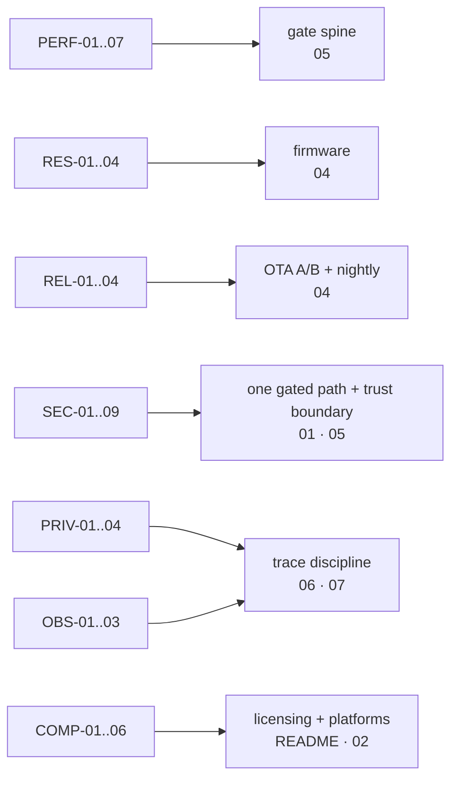

# 08 · NFRs → Architectural Tactics

> Threshold source: PRD §9. Verification paths: PRD appendix A.3. This file
> only connects each NFR to where the architecture answers it — no thresholds
> repeated.

## 1. Performance + resources (the v1.0 critical path)

| NFR | Architectural tactic | Evidence |
|:---|:---|:---|
| PERF-02 local gate P95 | Heapless C walker, in-place walk; host engine walks a compiled tree; per-gate `budget.p95` | Nightly on real boards (A2/A6) |
| PERF-03 cloud gate P95 | Remaining-`p95` deadline for `adjudicate`; timeout → `Unavailable` → gate fail policy | `turn_latency.gate` in traces |
| PERF-04 SystemOne latency | 3 structured kinds, deterministic local-grammar fallback | `turn_latency`, FR-TEL-06 |
| PERF-01/07 voice round-trip P95 | Cloud-first: heavy STT/TTS at providers; chip keeps capture/playback + FSM + gates (P-4) | Real-traffic measurement, streaming vs request-response split |
| RES-02/03 SRAM/PSRAM/firmware budgets | Static PSRAM buffers, const-linked trees in flash, no `malloc` after init (RB-1/2/4) | `memory_probe` at boot + CI flash budgets |
| RES-04 fully safe offline | On-device gates + FSM; local command fallback is P0 (Q-14) | Degradation scenario suite (A4) |

## 2. Reliability + security + privacy + observability

| NFR | Architectural tactic |
|:---|:---|
| REL-02 fail-closed by default | Every `on_block` blocks physically in v1.0 (Q-17); refuse-all HAL; full ledger refuses |
| REL-01 OTA at 1,000-device scale | A/B partitions + boot-loop rollback + RSA/ECDSA signing (FR-OTA); canary orchestration in Fleet (planned) |
| REL-03 nightly on real boards | `nightly-hardware.yml` + gpio-sim/i2c-stub/vkms in CI; every drift blocks release |
| SEC-01 no actuator bypass | Single token-gated path to pins; pentests + code review (A3) |
| SEC-02/03/04/05/06 device + network | Secure Boot + flash encryption, hardware mic-kill, TLS 1.3/mTLS/pinning, per-device certs, signed firmware |
| SEC-07 third-party sandbox | v1.1, attached to Registry (FR-REG-07) |
| SEC-08/09 providers + callers | TLS to providers + provider in traces; MCP stdio-only in v1.0, LLMs/MCP are untrusted callers |
| PRIV-01..04 | No audio stored by default; traces keep decisions; source anonymization via replay-preserving hashes |
| OBS-01..03 | One session = one complete trace; `turn_latency` + `session_summary` (S1/S2 ratio, cost) in every trace |
| COMP-01..06 | PolyForm Noncommercial core, Apache-2.0 standards (Q-45); Python 3.11+; Debian/Ubuntu ARM64+x86-64 |

Known traceability debt (PRD appendix A.3): SEC-02→06 and 08 still need
measurable milestone criteria before v1.0 closes.
