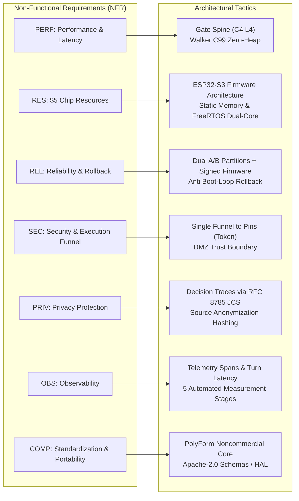

# 08 · Non-Functional Requirements (NFR) → Architectural Tactics

> **Status:** `done` · Standardized Mapping of NFRs to Architectural Engineering Tactics  
> **Reference Documents:** PRD §9, PRD Appendix A.3, [04-component-device-c4l3.md](file:///Users/minhlt/Downloads/Projects/neuroedge-init/docs/architecture/en/04-component-device-c4l3.md), [05-code-gate-hal-c4l4.md](file:///Users/minhlt/Downloads/Projects/neuroedge-init/docs/architecture/en/05-code-gate-hal-c4l4.md)  
> **CI Verification Pipelines:** `ci/nightly-hardware.yml`, `ci/nfr-performance.yml`, `ci/security-audit.yml`

---

## 1. Overall Map of NFRs and Architectural Tactics

The NeuroEdge architecture satisfies seven core non-functional requirement categories (PERF, RES, REL, SEC, PRIV, OBS, COMP) through boundary isolation, zero-heap runtime design, and continuous audit verification:

---

## 2. Performance & Real-Time Constraints (PERF-01..07)

| NFR ID | Quantitative Target | Architectural Tactic | CI / Hardware Verification Mechanism | Failure Action |
| :--- | :--- | :--- | :--- | :--- |
| **PERF-01** | Voice Turn Streaming Latency P95 $\le 850$ ms | Cloud-first architecture: STT/TTS streams over WebSocket/gRPC; Audio DMA feeds directly into I2S RingBuffer. | Audio loopback latency measurement in automated suite `test_voice_e2e.py`. | Latency regression warning; block PR merge if P95 $> 950$ ms. |
| **PERF-02** | Local Gate Evaluation P95 $< 120$ ms ($< 5$ ms target on-chip) | C99 walker (`ne_walker.c`) traverses `NETR v1` directly on memory-mapped Flash with zero heap allocations and $O(1)$ bitmask checks. | Nightly benchmarking on real ESP32-S3 hardware via UART telemetry (`ci/nfr-performance.yml`). | Block release if P95 $> 120$ ms. |
| **PERF-03** | Cloud Gate Evaluation P95 $< 450$ ms | Adjudicator with budget deadline: Subtracts elapsed time from `budget.p95`; timeouts immediately trigger `Unavailable` under fail-closed rules. | Simulated timeout suite in `test_gate_engine.py` with 500 ms artificial network lag. | Automatically degrades verdict to `BLOCK: BUDGET_EXCEEDED`. |
| **PERF-04** | System 1 Pattern Matching P95 $< 100$ ms | Local grammar matching via optimized trie and regular expressions (`system_one/grammar.py`), zero LLM round-trips. | Load test with 10,000 local grammar utterances in `test_grammar_perf.py`. | Fail CI if P95 $> 50$ ms. |
| **PERF-05** | Actuator Abort on Barge-in $\le 20$ ms | VAD interrupt event dispatched via FreeRTOS Event Group to Action Dispatcher; revokes token and triggers HAL emergency stop within $\le 1$ audio frame (20 ms). | Oscilloscope / logic analyzer verification measuring GPIO pin cutoff upon audio interruption trigger. | P0 Critical Bug (Blocks all builds). |
| **PERF-06** | Speaker Mute on Barge-in $< 300$ ms | Immediate flush of I2S DMA RingBuffer on Core 0 as soon as VAD confirms user speech energy. | Acoustic recording measuring residual audio duration after barge-in pulse trigger. | Block firmware release if residual audio exceeds 300 ms. |
| **PERF-07** | Request-Response Voice Turn P95 $\le 1500$ ms | Optimized System 2 pipeline, pre-warmed TLS connections to AI providers, minimal JSON tool envelopes. | Measure round-trip turn metrics in execution trace `turn_latency`. | Performance warning on CI dashboard. |

---

## 3. Resource Management for Low-Cost MCUs (RES-01..04)

| NFR ID | Resource Budget | Architectural Tactic | CI / Hardware Verification Mechanism | Failure Action |
| :--- | :--- | :--- | :--- | :--- |
| **RES-01** | Bill of Materials (BOM) $\le \$5$ USD | Optimized to run on a single ESP32-S3 SoC (Dual-core Xtensa LX7, Wi-Fi 4 + BLE 5) without external NPU coprocessors. | Periodic Bill of Materials review with OEM partners. | Reject heavy third-party dependencies requiring more expensive silicon. |
| **RES-02** | Available Post-Boot Memory: SRAM $\ge 120$ KB, PSRAM $\ge 2$ MB | Static PSRAM allocation for DMA audio buffers during boot; zero dynamic `malloc()` in steady-state loop; `NETR` tree linked as `const` in Flash ROM. | Boot-time `memory_probe` emits actual free heap telemetry in `lifecycle_boot` trace event. | CI build failure if post-boot free heap drops below threshold. |
| **RES-03** | Flash Firmware Binary Size $\le 3.5$ MB | Compiled with `-Os`, dual 3.5 MB A/B partitions, debug symbols stripped from release binaries. | Binary size check script `check_firmware_size.py` runs on build artifacts. | Block PR merge if `.bin` size exceeds 3.5 MB ($3,670,016$ bytes). |
| **RES-04** | 100% Safety Offline | Decision tree walker, Token Ledger, and Voice FSM execute entirely on-chip; offline fallback routes commands to deterministic grammar (P0). | Offline resilience test suite simulating physical network disconnection (`test_offline_resilience.py`). | Any device freeze or erroneous actuation while offline is treated as a P0 blocker. |

---

## 4. Reliability & Operational Integrity (REL-01..04)

| NFR ID | Target Metric | Architectural Tactic | CI / Hardware Verification Mechanism |
| :--- | :--- | :--- | :--- |
| **REL-01** | 1,000-Device Scale OTA: 0 Bricked Units | Dual `ota_0` and `ota_1` partitions with RTC Boot Counter: New firmware must pass 5 sequential self-test checkpoints before calling `esp_ota_mark_app_valid_cancel_rollback()`. | Automated OTA test suite simulating random power cuts on QEMU and hardware test rigs. |
| **REL-02** | System-Wide Fail-Closed Default | Any indeterminate state, missing fact, corrupted tree header, or exhausted token ledger slot results in a deterministic `BLOCK` and HAL refusal. | 100% test coverage for edge and error branches in `tests/test_fail_closed.py`. |
| **REL-03** | Continuous Hardware CI (Nightly) | Dedicated `nightly-hardware.yml` pipeline executing on physical device farms testing GPIO, I2C, SPI, and UART interfaces. | Daily test reports; any execution drift between Sim and physical silicon triggers alerts. |
| **REL-04** | Mean Time Between Failures (MTBF) $\ge 720$ Hours | Zero-leak architecture (no steady-state heap allocations), FreeRTOS Task Watchdog Timer (TWDT) supervising Core 0 and Core 1. | 7-day continuous soak testing in high-temperature environmental test chambers. |

---

## 5. Security & Trust Boundaries (SEC-01..09)

| NFR ID | Security Constraint | Architectural Tactic | Verification Mechanism |
| :--- | :--- | :--- | :--- |
| **SEC-01** | No Actuator Bypass | All HAL actuator methods (`ne_hal_digital_out`,...) mandate a valid `ne_token`. Without an authorized token, pins stay unchanged. | Automated static code analysis prohibiting direct calls to ESP-IDF `gpio_set_level()` outside the HAL driver. |
| **SEC-02** | Hardware Root of Trust | Hardware-enforced ESP32-S3 Secure Boot v2 (RSA-3072 signature scheme) and Flash Encryption (hardware XTS-AES-128). | Factory eFuse provisioning verification and hardware security configuration check scripts. |
| **SEC-03** | Physical Microphone Mute Switch | Hardware circuit breaking power lines directly to the microphone (Hardware Kill-switch), independent of software control. | Electrical schematic and PCB layout audited by hardware security specialists. |
| **SEC-04** | Transport Layer Security | Mandatory TLS 1.3 with Certificate Pinning for public Internet traffic; mTLS for internal administrative cluster traffic. | Traffic inspection using Wireshark/Zeek in staging; automated rejection of unencrypted packets. |
| **SEC-05** | Unique Device Identity | Each device holds a unique cryptographic key pair in an encrypted NVS partition, identified by hardware UUID and MAC hash. | Factory provisioning certificate validation during automated production testing. |
| **SEC-06** | Signed Firmware Images | Firmware binaries and `NETR v1` decision trees are digitally signed; the bootloader rejects unsigned or modified images. | Automated cryptographic signature verification in CI before artifacts are published to OTA registries. |
| **SEC-07** | Third-Party Extension Sandbox | Third-party extensions and plugins run in isolated execution environments (WASM or separate stdio processes) via strict IPC. | Process isolation integration test suite. |
| **SEC-08** | AI Provider Isolation | Host environment variables isolate API keys; authentication tokens are encrypted in transit; traces record provider metadata. | Automated secret scanning detecting leaked credentials in Git commits. |
| **SEC-09** | Untrusted Caller Model | Requests from Cloud LLMs and MCP Servers are treated as untrusted; the runtime Dispatcher stamps the `source` field. | Fuzzing and protocol injection test suite. |

---

## 6. Privacy Protection & Trace Governance (PRIV-01..04)

1. **PRIV-01 (No Raw Audio Retention by Default):** Audio streams are cleared from DMA ring buffers immediately after VAD and STT processing. Raw audio is never stored in Flash or transmitted to cloud storage unless the user explicitly opts into diagnostic mode.
2. **PRIV-02 (Decision-Only Audit Traces):** Audit traces (`trace.json`) record session metadata, safety verdicts (`ALLOW`/`BLOCK`), latency metrics, and actuator pin transitions. Raw conversational transcripts are stripped.
3. **PRIV-03 (Source Anonymization Hashing):** Personally Identifiable Information (PII) is masked using decision-preserving cryptographic hashes, enabling deterministic trace replay while protecting user identity.
4. **PRIV-04 (Data Retention & Deletion):** Cloud audit traces comply with GDPR/CCPA regulations, with automated retention limits set to 30 days unless pinned as an immutable Golden Trace.

---

## 7. Observability & Telemetry (OBS-01..03)

1. **OBS-01 (One Session = One Complete Trace):** Every voice or command interaction from wake to completion is captured within a unique `session_id` and exported as a complete, canonical JSON trace.
2. **OBS-02 (5-Stage Turn Latency Instrumentation):** Each turn automatically records granular execution durations across five sequential stages:
   - `audio_vad_ms`: Voice activity detection and speech completion latency.
   - `stt_recognition_ms`: Speech-to-text conversion duration.
   - `routing_decision_ms`: Dual-system routing classification duration.
   - `gate_evaluation_ms`: Safety decision tree evaluation duration.
   - `hal_execution_ms`: Physical hardware actuation and audio synthesis duration.
3. **OBS-03 (Comprehensive Session Summaries):** Session completion events (`session_summary`) report System 1 vs System 2 routing ratios, total LLM tokens consumed, and estimated operational cost.

---

## 8. Standardization & Portability (COMP-01..06)

1. **COMP-01 (Dual Licensing Architecture):** Core runtime and security components are licensed under **PolyForm Noncommercial 1.0.0**; interface schemas (`schemas/`) and HAL stubs (`hal-stubs/`) are licensed under **Apache-2.0** for commercial OEM adoption (ADR Q-45).
2. **COMP-02 (Host Python Compatibility):** CLI tools and host engines officially support Python $\ge 3.11$ across Linux x86_64 and ARM64 architectures (Debian / Ubuntu / Raspberry Pi OS).
3. **COMP-03 (ESP-IDF Compliance):** Firmware C99 code compiles cleanly without warnings against **ESP-IDF v5.1 LTS** and **v5.3**.
4. **COMP-04 (QEMU Emulation Support):** Full QEMU ESP32 configuration emulating UART, Flash, and GPIO peripherals enables 100% automated CI testing without physical test benches.
5. **COMP-05 (RFC 8785 Canonical JSON):** JCS serialization standard ensures identical SHA-256 hash digests across all operating systems.
6. **COMP-06 (32-Bit MCU Alignment):** The `NETR v1` binary layout and C structs use natural boundary alignment, free from compiler-specific packing quirks.
