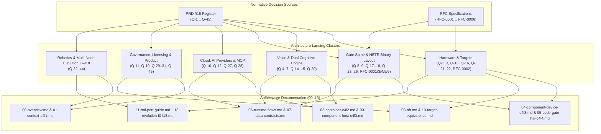

# 09 · Architecture Decision Records (ADR) & RFC Index

> **Status:** `done` · Standardized Technical Decision Landing Catalog  
> **Source of Truth:** PRD §15 (Single Decision Register Q-1..Q-45), RFC Directory: `docs/rfcs/`  
> **Purpose:** Map every strategic architectural decision and RFC specification to its landing destination across the architecture documentation suite (`00` through `13`).

---

## 1. Overall Decision Navigation Map (ADR & RFC Map)

---

## 2. Architecture Decision Register (Q-1 .. Q-45)

### 2.1. Cluster 1: Hardware, Targets & Simulation

| ADR ID | Decision Summary | Landing File | Architectural Impact |
| :--- | :--- | :--- | :--- |
| **Q-1** | ESP32-S3 selected as initial standard open microcontroller. | `02`, `04`, `10` | Dual-core Xtensa LX7 with vector instructions, Wi-Fi 4 + BLE 5 SoC. |
| **Q-2** | ESP32-S3-BOX-3 is the sole reference hardware for v1.0. | `04`, `10`, `11` | Fixed pinout, 320x240 LCD, ES7210/ES8311 audio codecs, dual microphone array. |
| **Q-3** | Resource budgets: SRAM $\ge 120$ KB, PSRAM $\ge 2$ MB, Flash binary $\le 3.5$ MB. | `04`, `08` | Enforces static memory buffers and zero post-initialization `malloc` rule. |
| **Q-13** | Three execution target tiers (Tier 1/2/3); core team commits to Tier 1. | `10`, `11` | Tier 1: Sim, Linux x86/ARM64, ESP32-S3 Box-3. OEM partners expand Tier 2/3. |
| **Q-16** | Linux `gpio-sim`, `i2c-stub`, and ESP32 QEMU in automated CI. | `08`, `10` | Enables 100% automated differential testing without physical hardware rigs. |
| **Q-21** | Integrate PipeWire Echo Cancellation (AEC) for Linux host environments. | `03`, `10` | Harmonizes acoustic pre-processing fidelity between Linux and MCU. |
| **Q-22** | Allowable sensor measurement variance tolerance in Simulation Harness. | `10` | Prevents false-negative test failures during replay between real and simulated sensors. |
| **Q-41** | Track ESP32-C6 as a research evaluation target (no manufacturing investment). | `02`, `13` | Preserves a pure RISC-V transition path for subsequent hardware generations. |

---

### 2.2. Cluster 2: Voice & Dual Cognitive Architecture

| ADR ID | Decision Summary | Landing File | Architectural Impact |
| :--- | :--- | :--- | :--- |
| **Q-4** | Use Jev phonetic notation for customizable Wake Word activation. | `03`, `04` | Custom wake words without full neural network retraining. |
| **Q-5** | Decouple Voice FSM state transitions from Action Dispatcher logic. | `04`, `06` | Voice pipeline failures never deadlock hardware safety controls. |
| **Q-6** | Audio DMA RingBuffer processing runs exclusively on ESP32-S3 Core 0. | `04` | Guarantees deterministic audio latency free from Core 1 computation jitter. |
| **Q-7** | Stream audio frames using Opus Codec with 20 ms packet windows. | `02`, `04` | Optimizes network bandwidth during upstream System 2 cloud streaming. |
| **Q-14** | Fail-safe offline mode P0: Retain 100% control via local grammar. | `03`, `06`, `08` | Device toggles lights and critical actuators when Internet connectivity drops. |
| **Q-15** | Simulator (`sim`) defaults to typed-text command-line interface. | `03`, `12` | Developers can test end-to-end agent flows in seconds without audio hardware. |
| **Q-20** | Software debouncing filter for physical on-device confirmation buttons. | `04`, `06` | Eliminates double-trigger hazards during in-person confirmation flows. |

---

### 2.3. Cluster 3: Gate Spine & NETR Binary Layout

| ADR ID | Decision Summary | Landing File | Architectural Impact |
| :--- | :--- | :--- | :--- |
| **Q-8** | Firmware written in pure ISO C99 without bloated external dependencies. | `04`, `05`, `11` | Minimal binary footprint, easy security audits, seamless MCU portability. |
| **Q-9** | `neuroedge build` compiles Gate YAML into deterministic binary decision trees. | `05`, `07` | Shifts all string parsing overhead to build-time compiler stages. |
| **Q-17** | All `BLOCK` verdicts halt physical actuation at HAL level (Fail-Closed). | `05`, `06`, `08` | Invariant P-1: Zero electrical pulses emitted without a valid Token. |
| **Q-18** | Inheritance rules apply strictly to `budget` and `on_block` configurations. | `05`, `07` | Child $p95$ must tighten; closed chains cannot reopen to `fail: open`. |
| **Q-23** | NETR v1 binary decision tree format (RFC-0003) in Flash memory. | `05`, `07` | In-place flash traversal with zero heap memory allocation. |
| **Q-24** | Every hardware-interacting `@action` must register as a Tool. | `03`, `06`, `07` | Funnels all physical actuation commands through a single validation path. |
| **Q-25** | Action argument limits declared directly inside Gate schemas (RFC-0005). | `05`, `07` | Gate blocks out-of-range parameters (`argument_out_of_range`), independent of LLM. |
| **Q-26** | In-person confirmation (`on_block: ask`) accepts local device input only (RFC-0006). | `05`, `06` | Prevents remote network bypass of physical safety barriers. |

---

### 2.4. Cluster 4: AI Providers, MCP & Cloud Architecture

| ADR ID | Decision Summary | Landing File | Architectural Impact |
| :--- | :--- | :--- | :--- |
| **Q-10** | LiteLLM acts as underlying SDK behind unified `providers/` adapter (`[cloud]`). | `02`, `03` | Isolates core framework from upstream AI vendor SDK breaking changes. |
| **Q-12** | Standardize AI Provider interfaces around OpenAI Chat Completions API. | `02`, `03` | Seamlessly swap cloud models or local inferences (Ollama, vLLM) with zero code changes. |
| **Q-27** | System 2 runtime acts as MCP Host; external MCP servers provide context only. | `02`, `03`, `06` | External MCP server outputs are advisory data; they cannot directly drive GPIO pins. |
| **Q-28** | Minimal Gateway architecture for v1.0, avoiding premature microservice complexity. | `02`, `03` | Keeps codebase compact and focused on rock-solid single-device UX. |

---

### 2.5. Cluster 5: Governance, Licensing & Product Strategy

| ADR ID | Decision Summary | Landing File | Architectural Impact |
| :--- | :--- | :--- | :--- |
| **Q-11** | Enforce a strict dependency License Allowlist in CI. | `08` | Eliminates intellectual property risks and viral copyleft licenses (GPL v3). |
| **Q-19** | Standardized release gating via automated Gate Regression Suite. | `06`, `08` | Blocks releases if safety verdicts diverge across framework versions. |
| **Q-29** | Monitor Matter / Home Assistant ecosystem without dedicated development spend. | `00`, `13` | Retains positioning as a safety execution contract layer rather than a smart home hub. |
| **Q-30** | Core positioning: NeuroEdge is the "Safety Contract Layer for Edge AI". | `00`, `01` | Establishes unique differentiation: anti-hallucination, deterministic, auditable. |
| **Q-31** | Rebrand NeuroBrain platform, dropping misleading "Copilot" terminology. | `00`, `02`, `13` | Emphasizes role as fleet management and safety policy lifecycle engine. |
| **Q-45** | Dual-licensing model: PolyForm Noncommercial 1.0.0 core, Apache-2.0 schemas & HAL. | `00`, `08` | Encourages broad OEM adoption and open hardware abstraction contributions. |

---

### 2.6. Cluster 6: Robotics & Multi-Node Evolution I0–I18

| ADR ID | Decision Summary | Landing File | Architectural Impact |
| :--- | :--- | :--- | :--- |
| **Q-32** | Tiered robotics architecture post-Beta (Visual $\to$ Deliberative $\to$ Safe Reflex). | `02`, `13` | Decouples high-level AI reasoning from low-level real-time motion control loops. |
| **Q-33** | Adopt Zenoh-pico protocol for inter-microcontroller robot communications. | `02`, `13` | Ultra-low overhead, sub-millisecond latency, decentralized brokerless pub/sub. |
| **Q-34** | Scope robot actuation via time-bounded Lease Tokens (`motion.*`). | `05`, `13` | Missing control heartbeats immediately trigger an autonomous safe stop. |
| **Q-35** | Integrate hardware Emergency Stop (E-Stop) alongside software safety checks. | `08`, `13` | Guarantees physical human safety during heavy robotics operation. |
| **Q-36** | Adopt ROS 2 Micro-XRCE-DDS bridge for industrial robot compatibility. | `13` | Seamlessly bridges NeuroEdge safety gates into existing ROS 2 stacks. |
| **Q-37** | Compact 3D spatial occupancy modeling using micro-OctoMap. | `13` | Enables obstacle avoidance navigation within embedded memory constraints. |
| **Q-38** | Deterministic geometric geofencing evaluated on-chip. | `05`, `13` | Prevents robotic actuators from operating outside authorized spatial zones. |
| **Q-39** | Standardized 19-increment evolution roadmap (I0 through I18). | `00`, `13` | Provides an incremental, empirically verified path from voice edge to robotics. |
| **Q-40** | Post-Beta prioritization: Complete Fleet OS management before robotics expansion. | `13` | Ensures remote observability and secure OTA capabilities before fleet scale. |
| **Q-42** | Reject Scope-cut Ladder Level 5; steadfast adherence to core safety guarantees. | `00`, `13` | Maintains uncompromised fail-closed safety semantics across all releases. |
| **Q-43** | Delta Gate OTA updates for low-bandwidth policy distribution. | `04`, `13` | Transmits updated binary decision trees without re-flashing the full firmware image. |
| **Q-44** | Cryptographically signed, decentralized trace storage (Trace Vault). | `02`, `13` | Tamper-proof audit trails for incident post-mortems and legal compliance. |

---

## 3. RFC Specifications Index

| RFC ID | Title | Status | Affected Schemas / Formats | Architecture Document |
| :--- | :--- | :--- | :--- | :--- |
| **RFC-0001** | Conditional-Required Safety Gates | `Proposed` | `schemas/gate.v1.json` | `05-code-gate-hal-c4l4.md` |
| **RFC-0002** | Open Target Enum & Tier Matrix | `Proposed` | `schemas/board.v1.json` | `10-target-equivalence.md` |
| **RFC-0003** | NETR v1 Binary Decision Tree Layout | `Final / Frozen` | `.netree` binary format | `05-code-gate-hal-c4l4.md` |
| **RFC-0004** | Inheritance Constraints on Gate Budgets | `Final` | `gate_resolver.py` | `05-code-gate-hal-c4l4.md` |
| **RFC-0005** | Gate Action Argument Limits & Constraints | `Final` | `schemas/gate.v1.json` | `05-code-gate-hal-c4l4.md`, `07-data-contracts.md` |
| **RFC-0006** | In-Person Physical Confirmation (`ask`) | `Final` | `schemas/gate.v1.json`, `ne_walker.h` | `05-code-gate-hal-c4l4.md`, `06-runtime-flows.md` |

---

## 4. Lifecycle Rules for New ADRs & RFCs

All future architectural changes must adhere to the following protocol:
1. **Adding a New ADR:** When an engineering decision alters system architecture, assign the next available code (`Q-46`,...) in PRD §15 in the same Pull Request and add a corresponding entry to this index (`09-adr.md`).
2. **When an RFC is Required:** A standalone RFC document in `docs/rfcs/` is strictly required when proposing changes that touch normative boundaries defined in `CONTRIBUTING.md` §3:
   - Changes to normative JSON Schemas (`schemas/*.json`).
   - Modifications to tree traversal or Token Ledger authorization algorithms.
   - Updates to the `NETR v1` binary layout (mandating a `LAYOUT_VERSION` increment).
   - Alterations to audit trace schemas (`trace.v1.json`) or JCS cryptographic hashing.
