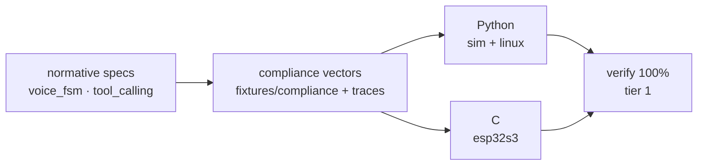

# 10 · Target Equivalence

> Rule: same agent code → same verdict sequence on every target (FR-TGT-04,
> P-2). Commitment tiered by target (FR-TGT-08, Q-13).

## 1. Implementation matrix (5 primitives × 3 tier-1 targets)

Per-cell detail: `simulation_coverage.md` §2. Summary: `sim` is a real target
via typed text; `linux` matches `sim` via gpiod/hwmon/IIO/framebuffer;
`esp32s3` gates via the C walker, full HAL planned (`TSK-S4-01`). All three
boards share one logical pin-name set (KL-2); `sim-default` is never richer
than Box-3 (invariant 7).

## 2. Three equivalence guards

1. **Spec first, two implementations**: the voice FSM and Gated Tool Profile
   are the truth; Python and C/C++ both comply, sharing no code (`Q-8`).
2. **Shared vectors**: voice scenarios + 3 golden traces
   (`happy-path`, `unverified_attempt`, `network_offline`) — editing golden
   traces needs an **RFC**.
3. **`verify` runs on every tier-1 target**: drift → `SafetyRegressionError`
   (NE4002); zero artifacts → `VerificationError` (NE4004), never a pass.

## 3. Layered simulation (Q-21) and target tiers

- One proven open tool per layer: `SimHAL` (logic) · gpio-sim (linux GPIO) ·
  file/PCM backend (CI audio) · i2c-stub+lm75 (sensors) · LVGL image compare
  (display) · firmware C compiled on host (truth tables every PR) · QEMU
  (boot/logic) · real boards (audio, display, memory, nightly).
- Tiers 2 (core-maintained, verdict-domain verify) and 3 (community ports,
  self-checked via compliance suite) open only after I8 via RFC-0002 PR2 — the
  100% `verify` bar binds tier 1 only.
