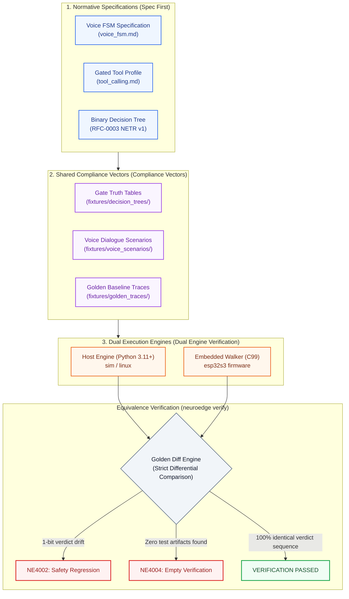
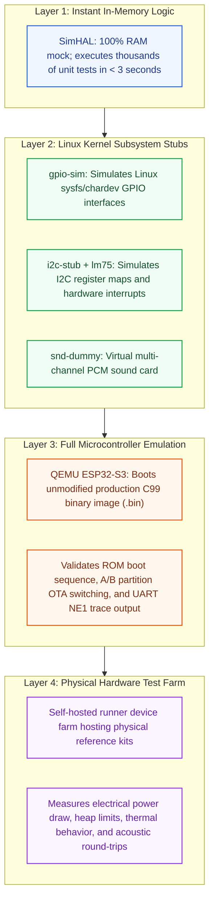

# 10 · Target Equivalence

> **Status:** `done` · Standardized Cross-Environment Execution Equivalence  
> **Core Principle:** Invariant P-2 & FR-TGT-04 — Same declarative agent code $\to$ 100% identical gate verdict sequences and actuator pin transitions across all target environments.  
> **Reference Documents:** [E-07](../assets/svg/E-07-target-matrix.svg), `docs/standards/simulation_coverage.md`, [09-adr.md](file:///Users/minhlt/Downloads/Projects/neuroedge-init/docs/architecture/en/09-adr.md) (ADR Q-13, Q-16, Q-21, Q-22), [RFC-0002](file:///Users/minhlt/Downloads/Projects/neuroedge-init/docs/rfcs/RFC-0002-open-target-enum-and-tier-matrix.md)

---

## 1. Overall Map of the Three Equivalence Defense Layers

The paramount goal of NeuroEdge is to eliminate the gap between simulation and physical production hardware. The system enforces execution parity through three independent defense layers:



---

## 2. Implementation Matrix (5 Primitives $\times$ 3 Tier-1 Targets)

Version 1.0 commits to complete Tier 1 support across 5 abstract hardware primitives:

| Primitive | `sim` (In-Memory Simulation) | `linux` (Host x86_64 / ARM64) | `esp32s3` (ESP32-S3-BOX-3) |
| :--- | :--- | :--- | :--- |
| **`audio.in`** | Mock buffer (WAV / Raw PCM); command-line typed text simulates speech recognition. | PipeWire / ALSA driver with PipeWire Echo-Cancellation (AEC) filter. | Dual ES7210 codec via I2S DMA, hardware AEC, and integrated VAD on Core 0. |
| **`audio.out`** | Virtual audio buffer or stdout terminal printing; sample-accurate duration timing. | ALSA / PulseAudio / PipeWire through system speakers, 3.5mm jack, or HDMI. | ES8311 codec via I2S DMA with onboard NS4150 power amplifier. |
| **`digital.out`** | `SimDigitalOut`: Boolean state array in RAM; audits pin transitions to event log. | Linux Kernel Subsystem `libgpiod` / `gpio-sim` (software simulated pins). | ESP-IDF GPIO Driver (`gpio_set_level`) driving physical relays and power MOSFETs. |
| **`sensor.read`** | `SimSensorRead`: Returns values declared in `[sim.sensors]` or test harness scripts. | Linux `hwmon` / `iio` (Industrial I/O) or `i2c-stub` simulating LM75/BMP280 ICs. | Hardware I2C / SPI bus drivers (querying SHTC3 temperature/humidity, ICM-42607 IMU). |
| **`display`** | Headless virtual canvas or terminal ANSI output; renders PNG frames for visual diffs. | Linux Framebuffer (`/dev/fb0`) or DRM/KMS, simulated via SDL2 window. | SPI 2.4-inch color LCD (ST7789, $320 \times 240$, RGB565) driven via LVGL graphics. |

### 2.1. Logical Pin Naming (KL-2) & Invariant 7

1. **Uniform Logical Names (KL-2):** All three targets must share a single, canonical set of logical pin identifiers (e.g. `"status_led"`, `"porch_light"`, `"door_lock"`).
2. **Invariant 7 (No Simulation Favoritism):** The default simulator board profile (`sim-default`) **must never be richer in capabilities or pin offerings** than the reference physical ESP32-S3-BOX-3 board. If the physical board lacks a given hardware peripheral, `sim-default` must not provide it out-of-the-box, preventing architectural software illusions.

---

## 3. Target Tier Classification (per ADR Q-13 & RFC-0002)

| Dimension | Tier 1: Core | Tier 2: Reference | Tier 3: Community / OEM |
| :--- | :--- | :--- | :--- |
| **Target Platforms** | `sim`, `linux` (Debian/Ubuntu), `esp32s3` (ESP32-S3-BOX-3). | Evaluation targets: STM32F4/H7, Raspberry Pi Pico W, ESP32-C6. | Custom partner boards, emerging RISC-V architectures. |
| **Maintenance Ownership** | NeuroEdge Core Engineering Team. | Core team maintains infrastructure; community contributes drivers. | Third-party OEM or open-source community contributors. |
| **CI Gating** | 100% automated test execution in **every Pull Request** (`ci/pr-checks.yml`). | Automated verification in Release candidates and Nightly builds. | Self-verified via `neuroedge hal test` compliance suite. |
| **Equivalence Commitment** | 100% bitwise parity on safety verdicts and actuator pin sequences. | Verdict Domain Equivalence guaranteed. | Self-certified compliance against shared test vectors. |
| **Divergence Impact** | Blocks release (P0 Critical Blocker). | Warning triage; resolved in subsequent sprint cycle. | Handled by partner OEM driver maintainers. |

---

## 4. Layered Simulation Stack

To achieve high hardware reliability without requiring physical laboratory access for routine development, NeuroEdge implements a layered simulation hierarchy per ADR Q-21:



### 4.1. Sensor Tolerance Bounds (ADR Q-22)

- In physical deployments, sensor signals exhibit environmental noise and analog conversion delays.
- During differential trace replay between Simulation and Hardware:
  - **Gate Decisions:** Must achieve **100% exact parity** (`ALLOW` is `ALLOW`, `BLOCK` is `BLOCK`).
  - **Sensor Numeric Values:** An analog tolerance band of $\pm 2\%$ is permitted for ADC and environmental measurements, preventing false-positive test alarms caused by ambient room fluctuations.

---

## 5. Automated Verification CLI (`neuroedge verify`)

The `neuroedge verify` command serves as the final barrier ensuring execution integrity:

```bash
# Verify equivalence between active code and golden reference traces
neuroedge verify --agent fixtures/agents/home-voice --golden fixtures/golden_traces/
```

### Pass/Fail Exit Criteria:
1. **NE4002 (`SafetyRegressionError`):** Triggered when any divergence occurs in the safety verdict sequence (e.g., golden trace records `BLOCK` but firmware returns `ALLOW`). This is treated as a fatal safety violation, immediately terminating with exit code `1`.
2. **NE4004 (`VerificationError`):** Triggered when the verification scanner finds zero test artifacts or encounters an empty trace directory. The system **never silently passes an empty verification**, immediately alerting developers in CI.
