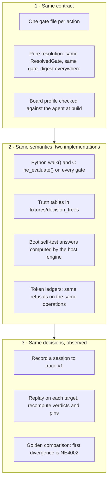

# 10 · Target equivalence

> **Scope:** why the same agent and the same gate give the same decision on `sim`, `linux` and
> `esp32s3`, how that is proven, and what it does **not** promise. **Sources:** P-2 (PRD §1.5),
> FR-TGT, `docs/spec/simulation_coverage.md`, `python/neuroedge/testing/`, `targets/esp32s3/main/`.

## 1. What equivalence means

Two runs are **equivalent** when, with the same input facts, they give the same **decision sequence**:
same gate, same verdict, same reason, same `on_block` action, same pin command (pin, operation,
duration). Not compared: time, speech, audio, frames.

Agent code **must not branch by target** (P-2). Differences between environments live entirely in the
HAL and the board profile.

## 2. Three defense layers

```mermaid
flowchart TB
    subgraph L1["1 · Same contract"]
        A1["One gate file per action"]
        A2["Pure resolution: same ResolvedGate, same gate_digest everywhere"]
        A3["Board profile checked against the agent at build"]
    end
    subgraph L2["2 · Same semantics, two implementations"]
        B1["Python walk() and C ne_evaluate() on every gate"]
        B2["Truth tables in fixtures/decision_trees"]
        B3["Boot self-test answers computed by the host engine"]
        B4["Token ledgers: same refusals on the same operations"]
    end
    subgraph L3["3 · Same decisions, observed"]
        C1["Record a session to trace.v1"]
        C2["Replay on each target, recompute verdicts and pins"]
        C3["Golden comparison: first divergence is NE4002"]
    end
    L1 --> L2 --> L3
```

| Layer | Guarantee | Evidence |
|:---|:---|:---|
| **1 · Same contract** | Every target loads the same resolved policy | Resolution is a pure function (invariant 4); `gate_digest` is identical in the trace, in `NETR`, in the token |
| **2 · Same semantics** | Python and C decide the same on every fact | `test_c_walker.py` (every gate, every truth-table row, fuzz); `test_c_token.py`; the firmware's own boot self-test |
| **3 · Same decisions, observed** | One real session gives the same decisions when replayed on another target | `neuroedge verify --targets sim,linux,esp32s3`; `GoldenComparator` |

## 3. Five primitives × three targets matrix

*Figure E-07 — Each cell: the backend that runs it, where it is checked automatically, status.*

| Primitive | `sim` (`sim-default`) | `linux` (`linux-rpi5`) | `esp32s3` (`esp32s3-box-3`) |
|:---|:---|:---|:---|
| `digital.out` | `SimHAL`, one-time token — PR | libgpiod v2, look up line by name — PR on gpio-sim | C walker + token ledger — host and QEMU; real pin `planned` (TSK-S4-01) |
| `audio.in` | typed text into the grammar; WAV → VAD → STT — PR | WAV file — PR; real microphone via PipeWire — only goes as far as opening the device | `planned` (I5) |
| `audio.out` | sentence to speak; TTS → speaker timeline → WAV — PR | WAV file — PR; real speaker — not checked on hardware | `planned` (I5) |
| `sensor.read` | simulated reading — PR | sysfs hwmon/IIO — PR on `i2c-stub` + `lm75` | `planned` (TSK-S4-03) |
| `display` | in-memory frame, digest — PR | framebuffer — PR on `vfb`/`vkms` | LVGL UI: golden image on host — PR; real panel `planned` |

Three cells can only be checked on a board: `audio.in` and `audio.out` of `esp32s3`, and the acoustics
of `linux`. They wait for a nightly runner on real hardware (TSK-S4-05, TSK-I2-01).

## 4. Board profile rules

- **`sim` may not be richer than the reference board** (invariant 7). `sim-default` copies Box-3's
  capabilities exactly: an agent that runs on `sim` can also declare for `esp32s3`.
- **The build checks both directions**: every primitive the agent needs (`[requires]`, each
  `@action(requires=…)`) must exist on the board, with the right pin name, the right sensor, enough
  sample rate, echo cancellation if the agent demands it. Missing ⇒ `NE3001`, the build stops, writes
  nothing. Example: `villa-concierge` demands `aec = true` so it is rejected on `linux-rpi5` until the
  Pi measures echo cancellation (`simulation_coverage.md` §6.2).
- **Pin names are logical** (`door_lock`, `porch_light`, `gate_relay`); GPIO numbers belong to each
  target's HAL.
- The target list is frozen at the three tier-1 targets until RFC-0002 (I11).

## 5. What `verify` does on each target

| Target | Replay method | Needs |
|:---|:---|:---|
| `sim` | `TracePlayer` on `SimHAL` | nothing |
| `linux` | `TracePlayer` on `LinuxHAL`, real GPIO line | a real line or gpio-sim (`scripts/setup_gpio_sim.sh`) |
| `esp32s3` | **The firmware itself** replays the three normative traces at boot (`trace_vectors.c`) and sends results over UART; the host reads (`--port`) and compares against golden | firmware running, on QEMU or a board |

Firmware replaying a trace or a gate **older than** the checkout ⇒ `NE4003` (old firmware), no
comparison. One artifact kind scanned to 0 files ⇒ `NE4004`, exit code 1: there is no empty "PASS".

## 6. What equivalence does not promise

- **Time.** `verify` compares decisions, not time yet (TSK-S4-04).
- **Operation and duration on chip.** On `esp32s3`, `operation` and `duration_ms` of a pin command today
  come from a table built on host; the chip only decides whether to fire and which pin (`TODOS.md` #37).
- **Audio quality** in real acoustics.
- **Tier-2 and tier-3 targets** (`simulation_coverage.md` §7).
