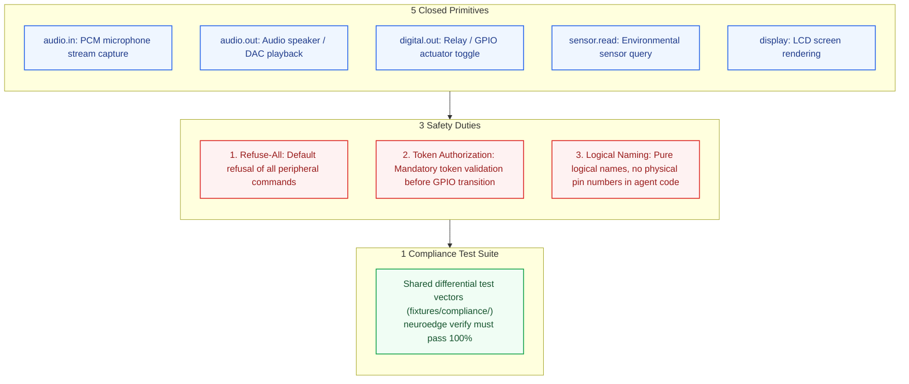
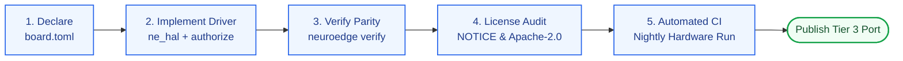

# 11 · OEM HAL Porting Guide

> **Status:** `done` · Standardized Hardware Abstraction Layer (HAL) Integration Guide  
> **Target Audience:** Embedded firmware engineers, Original Equipment Manufacturers (OEMs), and custom hardware board developers (U5).  
> **Objective:** Deliver the normative "5 + 3 + 1" porting contract, canonical `board.toml` templates, C99 interface stubs (`hal-stubs`), and the 5-step compliance checklist.  
> **Intellectual Property Policy:** OEM partners retain 100% copyright ownership of their BSP drivers and board definitions in separate repositories; NeuroEdge indexes them in the Gate Registry (ADR Q-45).

---

## 1. Normative Porting Contract (The 5 + 3 + 1 Contract)

To uphold architectural invariants **P-1 (Fail-Closed Default)** and **P-2 (Target Equivalence)**, any Tier 3 hardware port must strictly fulfill the "5 + 3 + 1" contract:



---

## 2. Canonical C HAL Interface Specification (`ne_hal.h`)

All embedded C99 ports must implement the standardized interface declared in `ne_hal.h`. Implementations must compile cleanly with zero steady-state heap allocations post-initialization:

```c
/* ne_hal.h — NeuroEdge Hardware Abstraction Layer Interface */
#ifndef NE_HAL_H
#define NE_HAL_H

#include <stdint.h>
#include <stdbool.h>
#include <stddef.h>
#include "ne_token.h"

#ifdef __cplusplus
extern "C" {
#endif

/* 1. Initialize all peripheral hardware per board.toml configuration */
ne_status ne_hal_init(void);

/* 2. Control Digital Out Actuators (Relays, LEDs, Solenoid Locks)
 * MANDATORY: Must invoke ne_token_authorize() before toggling GPIO state.
 * If token is invalid -> HAL MUST REFUSE and return an error code.
 */
ne_status ne_hal_digital_out(const char *pin_name, uint8_t level, const ne_token *token);

/* 3. Read Environmental Sensors (Temperature, Humidity, Motion) */
ne_status ne_hal_sensor_read(const char *sensor_name, double *out_value);

/* 4. Capture Microphone Audio (16 kHz, 16-bit Mono PCM frames) */
ne_status ne_hal_audio_in_read(int16_t *buffer, size_t samples, size_t *samples_read);

/* 5. Stream Audio to Speaker (I2S DMA streaming) */
ne_status ne_hal_audio_out_write(const int16_t *buffer, size_t samples, size_t *samples_written);

/* 6. Flush Visual Framebuffer to Display (Optional) */
ne_status ne_hal_display_flush(uint16_t x1, uint16_t y1, uint16_t x2, uint16_t y2, const void *color_buf);

#ifdef __cplusplus
}
#endif

#endif /* NE_HAL_H */
```

### 2.1. Reference Driver Stub: Token-Gated Pin Actuation

```c
/* Example implementation of ne_hal_digital_out on a custom OEM board */
ne_status ne_hal_digital_out(const char *pin_name, uint8_t level, const ne_token *token) {
    if (!pin_name || !token) {
        return NE_ERR_ARGUMENT;
    }

    /* 1. Map logical pin name to physical board GPIO index */
    int gpio_num = bsp_lookup_gpio(pin_name);
    if (gpio_num < 0) {
        return NE_ERR_STRUCTURE; /* Pin name not supported on this board */
    }

    /* 2. ENFORCE SAFETY CONTRACT: Authorize token against Ledger */
    uint32_t now_ms = bsp_get_time_ms();
    ne_token_reason auth_res = ne_token_authorize(&g_ledger, token, (uint32_t)gpio_num, now_ms);
    
    if (auth_res != NE_TOKEN_AUTHORIZED) {
        /* Emit audit telemetry recording the refused actuation */
        ne_telemetry_emit_rejected(pin_name, auth_res);
        return NE_ERR_LIMITS; /* REFUSE ACTUATION - FAIL CLOSED */
    }

    /* 3. Token verified: Drive physical hardware line */
    bsp_gpio_set_level(gpio_num, level);
    ne_telemetry_emit_actuator_executed(pin_name, level);
    
    return NE_OK;
}
```

---

## 3. Canonical `board.toml` Template for Custom Hardware

OEM partners create a `board.toml` in their BSP repository root. All pins must receive meaningful logical names, never exposing physical hardware pin numbers:

```toml
# board.toml — OEM Board Manifest Template
[board]
id     = "acme-smart-hub-v2"
name   = "ACME Smart Home Gateway v2.0"
target = "acme_mcu"          # Custom OEM target identifier (RFC-0002)
mcu    = "cortex-m7"         # Microcontroller family or SoC architecture

# Audio Input (Omit section if board lacks microphones)
[capabilities.audio_in]
channels       = 1
sample_rate_hz = 16000
aec            = true        # Hardware acoustic echo cancellation supported
vad            = true        # Hardware voice activity energy detection supported

# Audio Output
[capabilities.audio_out]
channels       = 1
sample_rate_hz = 16000

# Actuator Pins (Digital Out)
[capabilities.digital_out]
backend = "gpio"
# CONSTRAINT DATA-01: Logical names only
pins = [
    "status_led_red",
    "status_led_green",
    "relay_pump",
    "relay_heater",
    "alarm_buzzer"
]

# Onboard Sensors (Sensor Read)
[capabilities.sensor_read]
sensors = [
    "water_temperature",
    "water_pressure",
    "ambient_temp",
    "leak_detected"
]

# LCD Display (Optional)
[capabilities.display]
width  = 480
height = 320
color  = "rgb565"
```

---

## 4. 5-Step Porting Verification Checklist

For a HAL port to achieve certified Tier 3 status in the ecosystem, OEM partners must satisfy all five verification steps:



| Step | Milestone | Acceptance Criteria |
| :---: | :--- | :--- |
| **1** | Board Capability Declaration | `neuroedge board show` parses manifest; `neuroedge build` compiles firmware for sample `home-voice` agent without errors. |
| **2** | Safety Boundary Audit | Internal penetration testing: Confirms zero execution paths exist to toggle GPIO pins without passing through `ne_token_authorize()`. |
| **3** | Compliance Suite Execution | `neuroedge verify --target acme_mcu` achieves **100% exact verdict parity** across all 3 golden traces (`happy-path`, `unverified_attempt`, `network_offline`). |
| **4** | Intellectual Property Compliance | Includes a `NOTICE` file declaring authorship; HAL glue code is released under **Apache-2.0** (avoiding viral copyleft licenses). |
| **5** | Continuous Nightly Testing | Automated test suite executes nightly on physical hardware rigs; test logs and pass rates are made publicly accessible to developers. |

---

## 5. Intellectual Property & Governance (Asset Governance)

- **Driver Ownership:** OEM partners retain 100% proprietary copyright ownership of their BSP code and `board.toml` manifests. Drivers may be maintained in public or private partner repositories.
- **Linkage Architecture:** The NeuroEdge runtime interfaces with OEM hardware drivers exclusively across public C headers (`ne_hal.h`, `ne_token.h`). This clean boundary protects partner hardware trade secrets while maintaining inviolable fail-closed safety guarantees.
