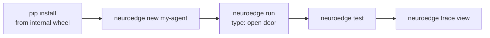

# 12 · Day-One Quickstart (new devs)

> Goal: from a clean machine to a gated agent on `sim` in < 10 minutes (the
> Journey 1 rhythm, PRD §2.3). Canonical command syntax: `CHANGELOG.md` §2.3.



## 1. Four commands (first 15 minutes)

```bash
neuroedge new my-agent && cd my-agent
neuroedge run -c "mở cửa phòng 101"     # ALLOW: door_lock PULSED 30s
neuroedge run -c "mở cửa phòng 202"     # BLOCK room_matches → reception
neuroedge test                          # green Action CI: asserts + golden
```

No network, no keys, no hardware (`Q-15`): default input is typed text → the
local command grammar. Voice and real LLMs are optional (the
`neuroedge[cloud]` extra, keys via environment variables).

## 2. Minimum concept map (enough to not get lost)

| You meet | One sentence | Read next |
|:---|:---|:---|
| `agent.toml` | What the agent needs: actions, gates, simulation facts | `07-data-contracts.md` |
| `*.gate.yaml` | One action's contract: `evaluate/allow_when/on_block/budget` | `05-code-gate-hal-c4l4.md` |
| `board.toml` | What the board has: 5 primitives, logical pin names | `07`, `10-target-equivalence.md` |
| `neuroedge build` | Agent ↔ board check at build time, fails early with 3-part errors | `05` |
| `c.do()` / `c.say()` | Speech bypasses gates; touching physics requires `c.do()` | `05`, `06-runtime-flows.md` |
| `traces/*.json` | Every session's trace; replay recomputes, golden compares decisions | `06` |
| `neuroedge verify` | Same traces, same decisions on every tier-1 target | `10` |

## 3. When stuck (3-part errors: where → what to do)

Every error carries **where · why · how** (FR-DX-04, `NE…` codes in PRD
appendix B). First three you'll meet:

| Code | When | Fix |
|:---|:---|:---|
| NE3001/NE3002 | `build` capability mismatch | Read `where`: what's missing → fix `board.toml` or `[requires]` |
| NE2002/NE2003 | red `gate lint` | Read `why`: bad field vs loosened inheritance → fix the gate, not the engine |
| NE4001 | red `trace validate` | Read the bad field path → fix the trace or re-`record` |

Not-yet-implemented targets/commands exit 2 and name the task that will build
them — that's not your bug.
