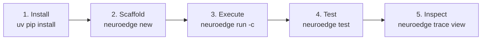
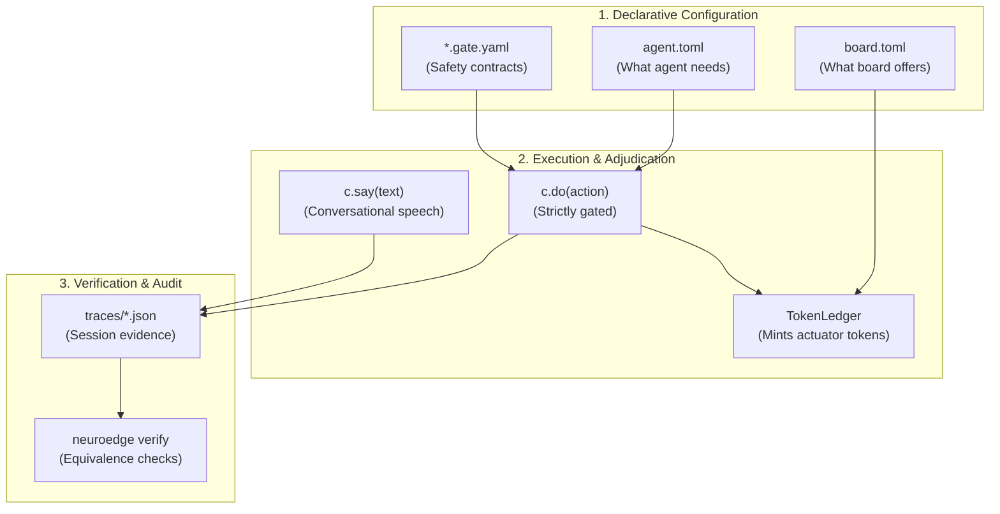

# 12 · Day-One Developer Quickstart

> **Status:** `done` · Standardized Onboarding Guide for New Developers  
> **Target Audience:** Newly onboarded software engineers and AI developers (Personas U1 & U2).  
> **Objective:** Guide developers from a fresh machine to a running, safety-gated agent on the simulator (`sim`) with audited traces in **under 10 minutes**.  
> **Zero Hardware Prerequisite:** No microphone, no cloud API keys, and no physical embedded boards required (ADR Q-15).

---

## 1. The First 10 Minutes (From Zero to Safety-Gated Agent)



### Step 1: Install NeuroEdge CLI

Prerequisites: Python $\ge 3.11$ on macOS or Linux (x86_64 / ARM64).

```bash
# Create a dedicated virtual environment and install core package
python3 -m venv .venv && source .venv/bin/activate
pip install -e "python/"

# Verify installation success
neuroedge --version
# Expected output: neuroedge-cli v0.1.0 (target: sim, linux, esp32s3)
```

---

### Step 2: Scaffold a New Agent Project

```bash
neuroedge new smart-home && cd smart-home
```

Project scaffold created:

```text
smart-home/
├── agent.toml            # Declares agent configuration, requirements, and gates
├── board.toml            # Declares simulation board capabilities (sim-default)
├── actions/
│   └── home.py           # Action execution c.do() and speech c.say() handlers
├── gates/
│   └── light_on@1.0.0.yaml # Binary decision tree guarding light actuation
└── tests/
    └── test_home.py      # Automated Action CI verification test suite
```

---

### Step 3: Run Interactive Turns on Simulator (`sim`)

The `neuroedge run` command defaults to typed-text input on the local machine simulator, exercising the System 1 local grammar:

```bash
# 1. Test a safe command (Criteria satisfied -> ALLOW)
neuroedge run -c "turn on the living room light"
```

**Terminal Output (ALLOW Case):**

```text
[neuroedge:sim] Booting session sess_8f21ab...
[routing] System 1 (local_grammar) matched: light_on(room="living")
[gate:light_on] Evaluating facts: {room_empty: false} -> ALLOW (reason: NONE, p95: 1.2ms)
[ledger] Minted token nonce=4a8f... TTL=360ms pins=[porch_light]
[hal:sim] digital_out(pin="porch_light", level=HIGH) -> PIN ACTIVATED
[speech] c.say("Living room light turned on.")
[session] Closed with status: COMPLETED in 48ms (Turn Latency: S1=48ms)
```

Now execute a command that violates safety policy:

```bash
# Simulate room occupancy while requesting light turn-off
neuroedge run -c "turn off the bedroom light" --sensor room_empty=false
```

**Terminal Output (BLOCK Case):**

```text
[neuroedge:sim] Booting session sess_9c32de...
[routing] System 1 (local_grammar) matched: light_off(room="bedroom")
[gate:light_off] Evaluating facts: {room_empty: false} -> BLOCK (reason: CONDITION_NOT_MET)
[gate:light_off] on_block triggered: deny
[hal:sim] REFUSED: Zero pins toggled (Fail-Closed default enforced)
[speech] c.say("Cannot turn off light while room is occupied.")
[session] Closed with status: BLOCKED in 32ms
```

---

### Step 4: Run Automated Action CI Tests

```bash
neuroedge test
```

```text
============================= test session starts ==============================
tests/test_home.py::test_light_on_allow PASSED                            [ 50%]
tests/test_home.py::test_light_off_blocked_when_occupied PASSED          [100%]

--------------------------------------------------------------------------------
Verification: Golden trace matching PASS (2/2 traces match bitwise)
Memory probe: Peak simulation heap = 1.4 MB (Safe under 120 KB SRAM limit)
============================== 2 passed in 0.42s ===============================
```

---

### Step 5: Inspect Audit Trace Telemetry

```bash
neuroedge trace view --last
```

Displays the cryptographic digest, fact evaluations, and actuator transitions per RFC 8785:

```text
Session ID    : sess_8f21ab
Target        : sim
Board         : sim-default (Logical pins: porch_light, door_lock)
Verdict Chain : ALLOW (Gate: light_on@1.0.0, SHA256: 2c20dc42...)
Actuation     : digital_out(porch_light, HIGH) at offset +42ms
Total Turn    : 48ms (System 1: 100%, System 2: 0%)
Audit Trace   : traces/sess_8f21ab.json [VALID]
```

---

## 2. Minimum Concept Map (Mental Model)

To avoid cognitive overload, new developers only need to understand six core building blocks:



| Concept | Core Meaning in One Sentence | Deep-Dive Reference |
| :--- | :--- | :--- |
| `agent.toml` | Declares all required hardware peripherals, safety gates, and simulation fact fixtures. | [07-data-contracts.md](file:///Users/minhlt/Downloads/Projects/neuroedge-init/docs/architecture/en/07-data-contracts.md) |
| `*.gate.yaml` | The immutable safety contract for an action: specifies `evaluate`, `allow_when`, and `on_block`. | [05-code-gate-hal-c4l4.md](file:///Users/minhlt/Downloads/Projects/neuroedge-init/docs/architecture/en/05-code-gate-hal-c4l4.md) |
| `board.toml` | Declares the 5 hardware primitives using logical pin identifiers (never physical pin numbers). | [10-target-equivalence.md](file:///Users/minhlt/Downloads/Projects/neuroedge-init/docs/architecture/en/10-target-equivalence.md) |
| `c.do()` | Executes physical actuation: **Always gated**, runs only when authorized by an ephemeral Token. | [03-component-host-c4l3.md](file:///Users/minhlt/Downloads/Projects/neuroedge-init/docs/architecture/en/03-component-host-c4l3.md) |
| `c.say()` | Synthesizes conversational speech: **Bypasses gates**, immediately interruptible via barge-in. | [06-runtime-flows.md](file:///Users/minhlt/Downloads/Projects/neuroedge-init/docs/architecture/en/06-runtime-flows.md) |
| `traces/*.json` | Tamper-evident execution trace; replay recomputes all verdicts from recorded raw facts. | [07-data-contracts.md](file:///Users/minhlt/Downloads/Projects/neuroedge-init/docs/architecture/en/07-data-contracts.md) |
| `neuroedge verify`| Differential testing tool: guarantees identical verdict sequences across Sim and physical MCUs. | [10-target-equivalence.md](file:///Users/minhlt/Downloads/Projects/neuroedge-init/docs/architecture/en/10-target-equivalence.md) |

---

## 3. Diagnostic & Error Triage Guide (NE Codes)

All NeuroEdge diagnostic errors follow a standardized 3-part layout: **`where` · `why` · `how to fix`** (FR-DX-04). Triage table for rapid troubleshooting:

| Error Code | Error Type | When Does It Occur? | Root Cause | Immediate Fix |
| :---: | :--- | :--- | :--- | :--- |
| **NE1001** | `TokenContractError` | Direct invocation of HAL functions without a valid token. | Developer bypassed safety protocol: tried to drive pins without `c.do()`. | Refactor `@action` code: route actuation exclusively through `c.do(gate="...")`. |
| **NE1002** | `TokenReplayError` | Re-using a spent token or presenting an expired token. | Replay attempt or action execution exceeded $p95 \times 3$ TTL deadline. | Do not cache tokens in global variables; issue a fresh `c.do()` per physical action. |
| **NE2001** | `CapabilityMismatchError` | During `neuroedge build`. | `agent.toml` requires a peripheral (e.g. `pins = ["door_lock"]`) missing in `board.toml`. | Add the missing peripheral to `board.toml` or remove it from `[requires]` in `agent.toml`. |
| **NE2002** | `GateSchemaError` | During `neuroedge gate lint`. | YAML syntax error, missing mandatory field, or schema violation against `gate.v1`. | Inspect the indicated line; align with schema defined in `schemas/gate.v1.json`. |
| **NE2003** | `GateInheritanceError` | In gate inheritance (`extends`). | Child gate redefined an inherited criterion (violates P-1) or relaxed budget $p95$. | Child gates may only tighten conditions (`allow_when`), never redefine ancestor criteria. |
| **NE2004** | `ConfirmationExpiredError` | Gate blocked with `on_block: ask`. | User did not press the physical confirmation button on device within 10 seconds. | Confirm on the physical device in time or extend the timeout in test fixtures. |
| **NE3001** | `UnsupportedTargetError` | Running `neuroedge build --target`. | Requested target is not listed in the agent's `supported` targets list. | Verify supported target platforms (`sim`, `linux`, `esp32s3`). |
| **NE3002** | `LogicalPinConflictError` | Firmware build compilation. | Two distinct logical pin names map to the identical physical GPIO index in `board.toml`. | Correct board GPIO mapping so that every logical pin holds an exclusive physical line. |
| **NE4001** | `TraceValidationError` | Running `neuroedge trace validate`. | Audit trace file corrupted, invalid JSON structure, or non-monotonic timestamps. | Re-run `neuroedge record` to generate a fresh, compliant trace file. |
| **NE4002** | `SafetyRegressionError` | Running `neuroedge verify`. | Safety verdict divergence between current code and golden trace (e.g., `BLOCK` became `ALLOW`). | **CRITICAL SAFETY VIOLATION:** Revert recent logic changes; never loosen safety rules. |
| **NE4004** | `EmptyVerificationError` | Running `neuroedge verify`. | Trace directory is empty or path points to zero test artifacts. | Provide a valid path to an existing directory containing recorded `.json` traces. |

> **Exit Code 2 (Task In-Progress Protocol):**  
> If you execute a command or target currently under active roadmap development, the CLI cleanly exits with **Exit Code 2** and reports the specific Jira/GitHub Task ID (e.g. `TSK-S4-01`) assigned to build it. This is expected behavior, not a regression!
