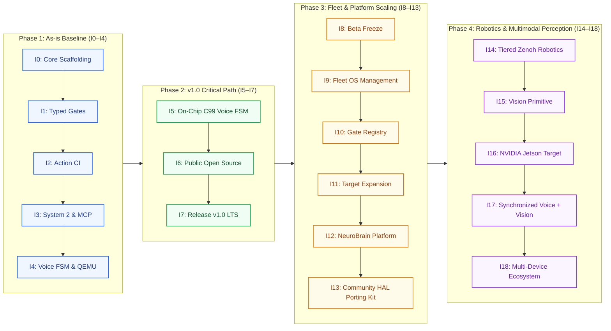
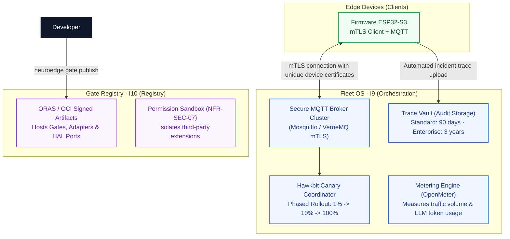
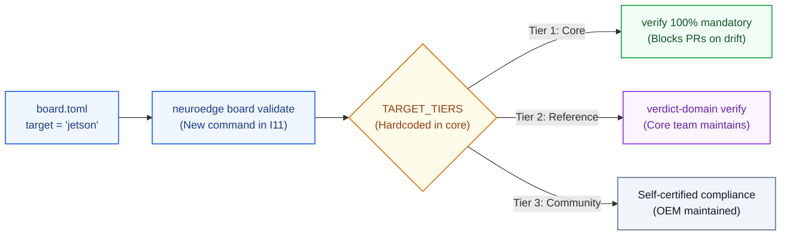
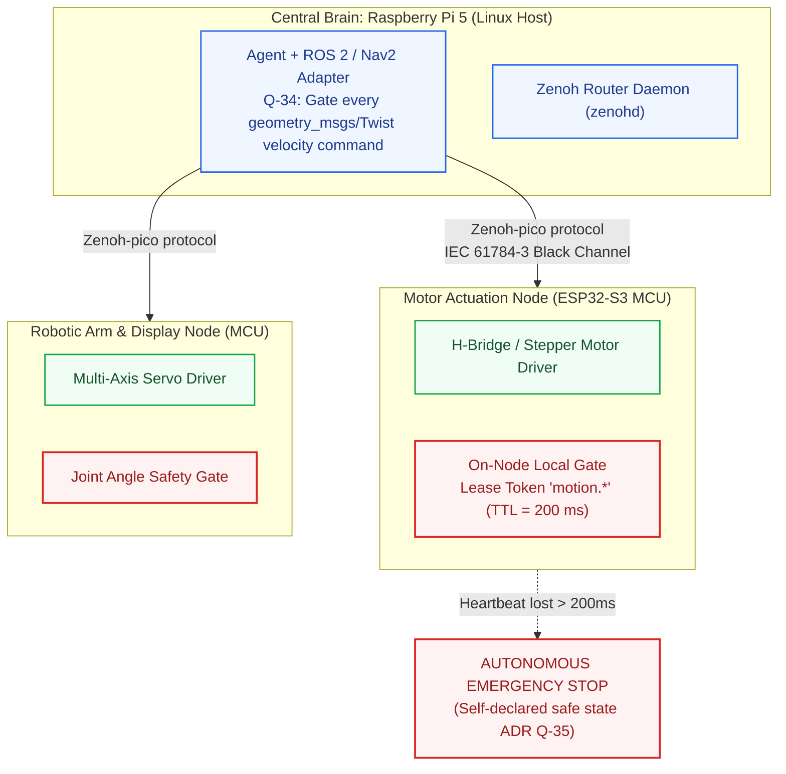

# 13 · Architectural Evolution I0–I18 (As-is vs Planned)

> **Status:** `done` · Standardized Architectural Evolution across 19 Increments  
> **Organizational Principle:** Schedule dates and Jira/task statuses are defined exclusively in PRD §0.2. This document focuses strictly on **architectural variation points** across increments.  
> **Reference Documents:** [E-08-roadmap-timeline](../assets/svg/E-08-roadmap-timeline.svg), [02-container-c4l2.md](file:///Users/minhlt/Downloads/Projects/neuroedge-init/docs/architecture/en/02-container-c4l2.md), [04-component-device-c4l3.md](file:///Users/minhlt/Downloads/Projects/neuroedge-init/docs/architecture/en/04-component-device-c4l3.md)

---

## 1. 19-Increment Evolution Roadmap Map (I0–I18 Roadmap Map)



---

## 2. As-is Baseline: Completed Increments I0–I4 (Code Exists & Verified)

| Increment | Production Codebase | Key Architectural Transitions | Verification Evidence |
| :--- | :--- | :--- | :--- |
| **I0: Scaffolding** | `python/neuroedge/cli.py` | Established modular CLI hierarchy, clear directory boundaries, differential testing foundation. | 100% test pass on CI. |
| **I1: Typed Gates** | `engine/gate.py`, `gate_resolver.py` | Schema validation against `gate.v1`, multi-level acyclic inheritance ($\le 3$ levels), enforcement of P-1, P-2, and RFC-0005 argument narrowing. | Over 120 unit tests validating gate merging and cycle detection. |
| **I2: Action CI** | `actions/conversation.py`, `actions/token.py` | Defined `@action` interface, single-use `TokenLedger` minting, audit session recording (`record`), and deterministic replaying (`replay`). | Golden trace comparison catching intentional safety regressions. |
| **I3: System 2 & MCP** | `providers/adapter.py`, `mcp/` | Integrated LiteLLM behind unified provider adapters (`[cloud]`), System 2 acting as MCP Host querying tools via stdio IPC (Q-27). | Integration tests mocking OpenAI and Anthropic cloud providers. |
| **I4: Voice FSM & QEMU** | `voice/fsm.py`, `targets/esp32s3/` | Python Voice FSM with barge-in interruption, C99 binary decision tree walker `ne_walker` traversing `NETR v1` on QEMU ESP32 over UART telemetry. | Differential test suites `test_c_walker.py` and `test_c_token.py` achieve 100% bitwise parity. |

---

## 3. v1.0 Critical Path: Planned I5–I7

| Increment | Core Architectural Transitions | Technical Risk Mitigation Tactics |
| :--- | :--- | :--- |
| **I5: Real-Time On-Chip Voice** | - Second C99 implementation of Voice FSM running concurrently on ESP32-S3 Core 1.<br/>- Audio I2S DMA RingBuffer processing isolated on Core 0.<br/>- Low-latency Opus streaming over WebSocket/TLS to upstream AI providers. | **Risk R-1 (MCU Memory Exhaustion):** Pre-allocate all DMA audio buffers statically in PSRAM; if memory limits trip, re-architect via an ADR (Q-44) without ever compromising voice capability. |
| **I6: Public Open Source** | - Publish canonical JSON Schemas to public endpoints (`schema.neuroedge.dev`).<br/>- Establish Software Bill of Materials (SBOM) and SLSA cryptographic provenance.<br/>- Publish official Python packages to PyPI. | Comprehensive audit of third-party dependencies, guaranteeing dual-license compliance (PolyForm Noncommercial / Apache-2.0). |
| **I7: Release v1.0 LTS** | - Dual-partition A/B OTA updates with cryptographic signature verification and automated boot-loop rollback.<br/>- Enable hardware Secure Boot v2 and XTS-AES Flash Encryption.<br/>- Pass 24/7 soak testing on reference hardware rigs (A1–A9). | Close all security audit criteria debts (SEC-02 $\to$ SEC-06, SEC-08) in PRD Appendix A.3 prior to release. |

---

## 4. Post-Beta Evolution Details: Planned I8–I18

### 4.1. I8: Beta Release Freeze
- **Architectural Scope:** Freeze the `1.0.x` release line. This maintenance branch only accepts critical security fixes (P0/P1) and safety regression remedies.
- **Prerequisites:** Satisfy all nine field verification criteria A1–A9 for v1.0.

---

### 4.2. I9–I10: Fleet OS & Gate Registry



- **I9 (Fleet OS):** Exposes a unified endpoint and credential set across an entire device fleet. Orchestrates Canary OTA deployments (1% $\to$ 10% $\to$ 100%) with automated halt conditions when anomaly rates exceed $0.1\%$.
- **I10 (Gate Registry):** Manages cryptographic versioning for Gates, Adapters, and OEM HAL ports using signed OCI container artifacts. Third-party extensions execute inside isolated permission sandboxes.

---

### 4.3. I11: Target Expansion (RFC-0002)



- Expands the board schema's `target` enum across Tier 1, 2, and 3 classifications while preserving strict backward compatibility.

---

### 4.4. I12: NeuroBrain Hardware Lab Platform

```mermaid
flowchart TB
    classDef act fill:#0f172a,stroke:#0f172a,color:#ffffff,stroke-width:1.5px;
    classDef brain fill:#faf5ff,stroke:#9334e6,color:#6b21a8,stroke-width:1.5px;
    classDef gated fill:#eff6ff,stroke:#2563eb,color:#1e3a8a,stroke-width:1.5px;
    classDef gate fill:#fef2f2,stroke:#dc2626,color:#991b1b,stroke-width:2px;
    classDef hal fill:#f0fdf4,stroke:#16a34a,color:#14532d,stroke-width:1.5px;
    classDef dut fill:#fff7ed,stroke:#ea580c,color:#7c2d12,stroke-width:1.5px;

    ENG_TEAM["Hardware Engineering Team"]:::act -->|Technical Dialogue| BRAIN["neuroedge.brain<br/>(Circuit Analysis Engine)"]:::brain
    BRAIN -->|MANDATORY VIA dispatch()| ACT["Actions / Gated Tools<br/>(call_source = 'brain')"]:::gated
    ACT --> GATE["Gate Engine -> Decision Tree"]:::gate --> HAL["HAL Drivers"]:::hal
    BRAIN -.->|Read-Only I2C Bus Sniffer| HW["Device Under Test (DUT)"]:::dut
```

> **Architectural Invariant B-1:**  
> The `neuroedge.brain` engine **must never directly invoke HAL drivers**. Any electrical power delivery, test pulses, or bus transitions generated during diagnostic dialogues must pass through an authorized Gate barrier identical to human operations.

---

### 4.5. I13: Community Porting Kit
- Provides canonical documentation, C interface stubs, and automated compliance vectors for OEM partners bringing NeuroEdge to custom silicon (tightly integrated with [11-hal-port-guide.md](file:///Users/minhlt/Downloads/Projects/neuroedge-init/docs/architecture/en/11-hal-port-guide.md)).

---

### 4.6. I14: Tiered Multi-Node Robotics Architecture



- **Time-Bounded Motion Lease Tokens (`motion.*`):** Every robotic velocity command holds a strictly enforced 200 ms TTL. If network communications drop between the central brain and motor nodes, the node autonomously engages an emergency stop.
- **Dual Safety Barriers:** Integrates a physical hardware Emergency Stop (Hard E-Stop) cutting actuator motor power lines in parallel with software gate checks.

---

### 4.7. I15–I17: Vision & Multimodal Perception
- **I15 (`vision.in` Primitive):** Normative RFC defining image and video context ingestion. Camera outputs are quantized into deterministic facts (`bool/level/choice`) via System 1 models before reaching safety gates.
- **I16 (NVIDIA Jetson Platform):** Establishes Jetson Orin Nano / Nano as a Tier 2 reference target, utilizing dedicated NPU hardware for on-device VLM inference.
- **I17 (Multimodal Synchronization):** Unifies audio streams and video feeds into a single cohesive state machine, enabling multimodal interactions ("Turn on that green desk lamp over there").

---

### 4.8. I18: Multi-Device Ecosystem & Autonomous Certification
- Releases cross-language SDKs (Python, C/C++, Rust, TypeScript).
- Opens free, self-service automated compliance portals for third-party HAL ports.
- Upholds foundational principles: Foundational safety features remain unmonetized, ensuring that physical safety contracts are accessible to all AI hardware builders.
