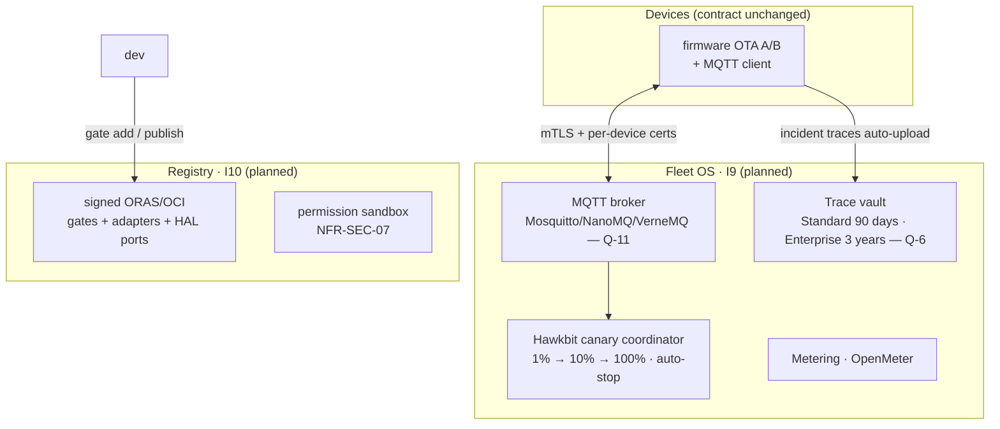
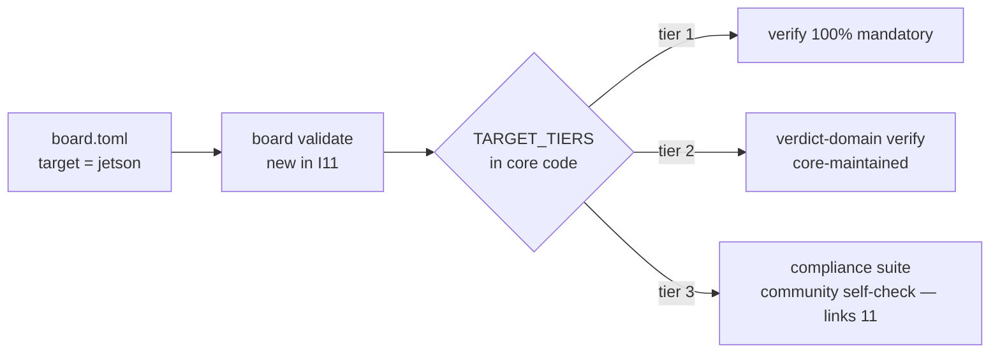
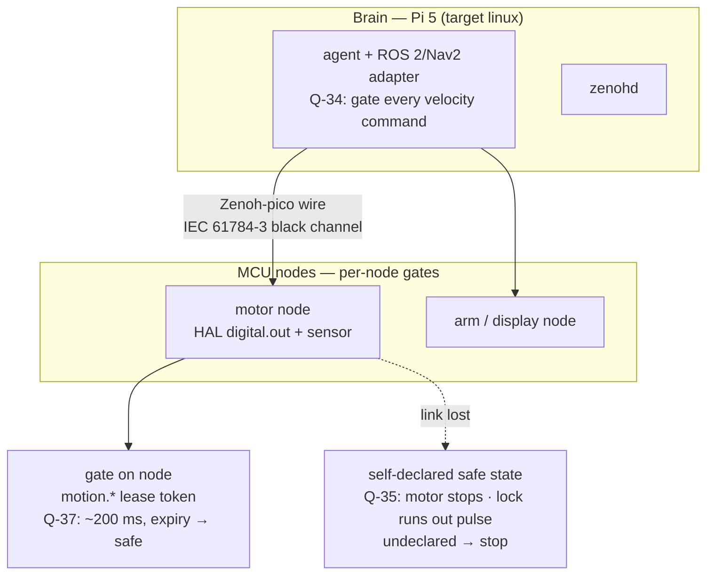

# 13 · Evolution I0–I18 (as-is vs planned)

> Dates/tags: roadmap §0.2 (only place). Below says only *what changes
> architecturally* per stage — no dates or task statuses copied.


## 1. As-is: I0–I4 (done, code exists)

Typed gates + safe inheritance, `sim`+`linux` parity, Action CI
(record/replay/assert/golden), MCP + System 2 via LiteLLM, Python voice FSM +
barge-in, C walker/token/UART on QEMU. The 2026-10-25 demand gate (Q-20)
decides Go/Adjust/Stop for I3–I7.

## 2. Planned: I5–I7 (v1.0)

| Increment | Architectural change | Held risk |
|:---|:---|:---|
| I5 voice on chip | Second C/C++ FSM implementation (XiaoZhi/Pipecat ports, same vectors); Opus streaming to providers | R-1 memory (TSK-S1-10 spike; on miss open a `Q-N` replan, never cut voice — Q-44) |
| I6 public | Schemas at public URLs; SBOM + provenance; first PyPI | Commercial license terms (`TODOS.md` #44) |
| I7 v1.0 | Signed OTA A/B + rollback; Secure Boot + flash encryption; 24h stability; A1–A9 complete | SEC-02→06/08 criteria debt (appendix A.3) must close first |

## 3. Planned: after Beta (stage-by-stage detail)

Summary:

| Stage | Architectural variation point | Opens when |
|:---|:---|:---|
| I8 Beta | Frozen `1.0.x` line (blockers + safety only); RFCs/specs still merge (R12) | I7 hits A1–A9 |
| I9–I10 Fleet + Registry | One endpoint/credential per fleet; declared failover; canary OTA; signed ORAS registry; metering | Beta hits B1 + B2 (Q-41) |
| I11 open targets | Tiered `target` enum + `TARGET_TIERS` + `board validate` (RFC-0002 PR2) | I8 |
| I12 NeuroBrain | `neuroedge.brain` via `dispatch()` only (B-1); gated lab actions; safety envelope | I11 (+ I2/I3) |
| I13 port kit | Tier-3 docs + vectors + port frame (links `11`) | I11 |
| I14 tiered robot | Per-node HAL + gates; Zenoh-pico wire (Q-36); `motion.*` lease tokens (Q-37); ROS 2/Nav2 gating every velocity command (Q-34); per-mechanism safe states (Q-35) | I13 (+ I4/I7/I11/I12) |
| I15–I17 vision | `vision.in` via its own RFC; tier-2 `jetson`; multimodal gates | Measured camera demand |
| I18 ecosystem | Multi-device SDK, HAL port index, free self-checked certification | I13 (+ I9/I10) |

Full per-stage design lives in the design notes
(`neuroedge-roadmap-phase1-5.md`, `neuroedge-roadmap-phase2.md`,
`draft-ke-hoach-mo-rong-robot-fofoca.md`, `draft-rfc-node-giao-thuc-dieu-phoi.md`) —
below only models where the architecture changes, enough for devs to see the
boundary before opening an RFC.

### 3.1 I9–I10 — Fleet OS + Gate Registry (C4 L2 planned)



- Reserved since today: `gate publish` prints JCS digests + `digests.lock`
  (I10's condition is a signed registry, not changed gate semantics);
  `device_id` in trace `metadata`; FR-OTA already pinned.
- The public API AURA consumes (Block 4) is this layer's public API.

### 3.2 I11 — Open the target list (RFC-0002 PR2)



- Only the `target` **enum** + tier table in core code opens; the `vision.in`
  primitive splits into its own RFC (I15). Schemas stay frozen until the RFC
  is approved (roadmap §2.3).
- One recorded issue to expect: once `vision.in` exists, `sim` must not be
  richer than the reference board ⇒ a 1-1 `sim-vision` profile (`TODOS.md` #14).

### 3.3 I12 — NeuroBrain (C4 L2 planned)

```mermaid
flowchart TB
    U[circuit-building group] -->|conversation| BRAIN[neuroedge.brain<br/>planned]
    BRAIN -->|via dispatch() only| ACT[actions/tools<br/>call_source = brain? — see note]
    ACT --> ENG[engine → gate] --> HAL[HAL]
    BRAIN -.->|I2C read-only · N2 safety envelope| HW[lab hardware]
```

- **Invariant B-1**: `neuroedge.brain` never calls HAL directly — every
  physical effect of circuit-building conversation goes through the same gate.
  If a `call_source = brain` value is needed, that changes the Gated Tool
  Profile ⇒ it must go through the spec/corpus (`docs/spec/tool_calling.md`
  §9) in the same PR — never silently.
- Block N0–N7 details, gated bring-up: `neuroedge-roadmap-phase1-5.md`.

### 3.4 I13 — Community port kit (C4 L3 planned)

Docs + vectors + a port frame for tier 3: exactly the contract in
`11-hal-port-guide.md` (5 primitives + 3 safety duties + 1 compliance suite),
plus the process for publishing port-scope `verify` results.

### 3.5 I14 — Tiered robot (C4 L2 planned)



- **Gates stay pure**: lease counting lives in HAL/runtime, gates gain no new
  semantics; multi-node traces extend `trace.v1` via optional fields (no
  `trace.v2`, Q-32).
- RFC-node, RFC-motion, RFC-pin-extends get numbers when the PR opens (drafts
  exist).

### 3.6 I15–I17 — Vision (C4 L3 planned)

- The `vision.in` primitive gets **its own RFC** (RFC-0002 §9.1): vision
  results are context only; agents must reduce them to `bool/level/choice`
  via `SystemOne` — the rule engine stays 100% deterministic until a dedicated
  semantics RFC exists.
- MCU memory budget must be measured before declaring `vision_in` on
  `esp32s3`; `jetson` is tier 2, real-time; I17 merges voice + vision into one
  state machine with multimodal gates. Details: `neuroedge-roadmap-phase2.md` V1a/V1b/V2/V3.

### 3.7 I18 — Device ecosystem

Multi-device SDK, indexed HAL-port index, **free, self-checked** certification
(distinct from the paid certification line, which stays blocked — PRD §14).
Opens when: ≥ 3 tier-3 ports pass the compliance suite.

Off-roadmap: field AURA (public APIs only), Marketplace (blocked until G1–G4).
