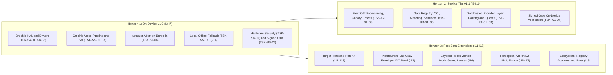
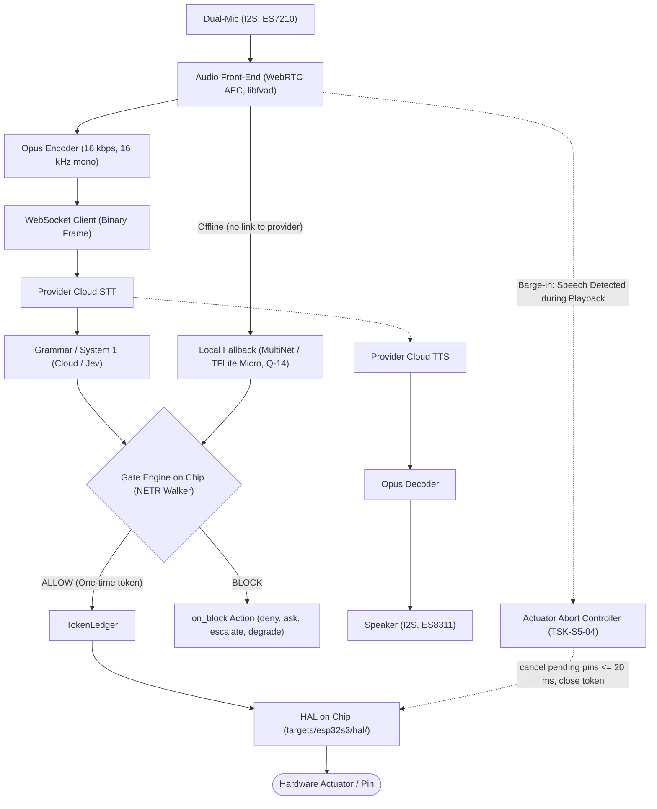
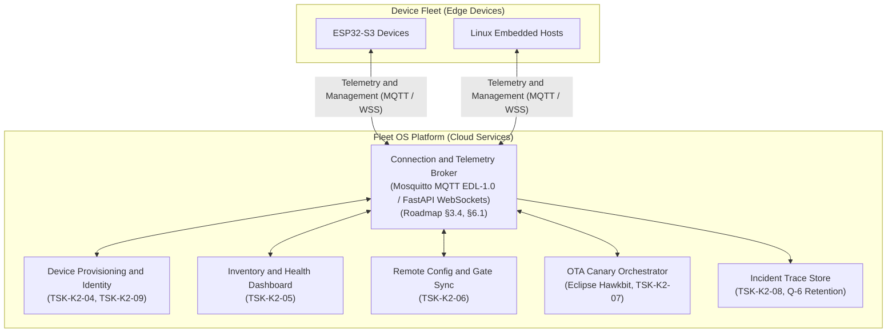
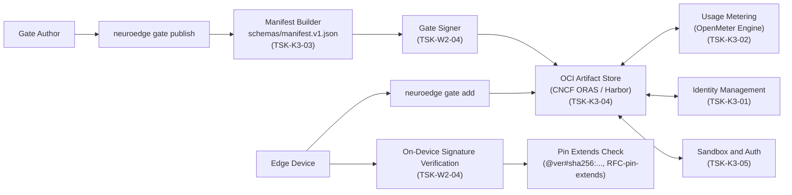
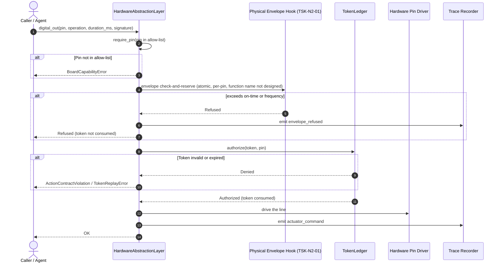
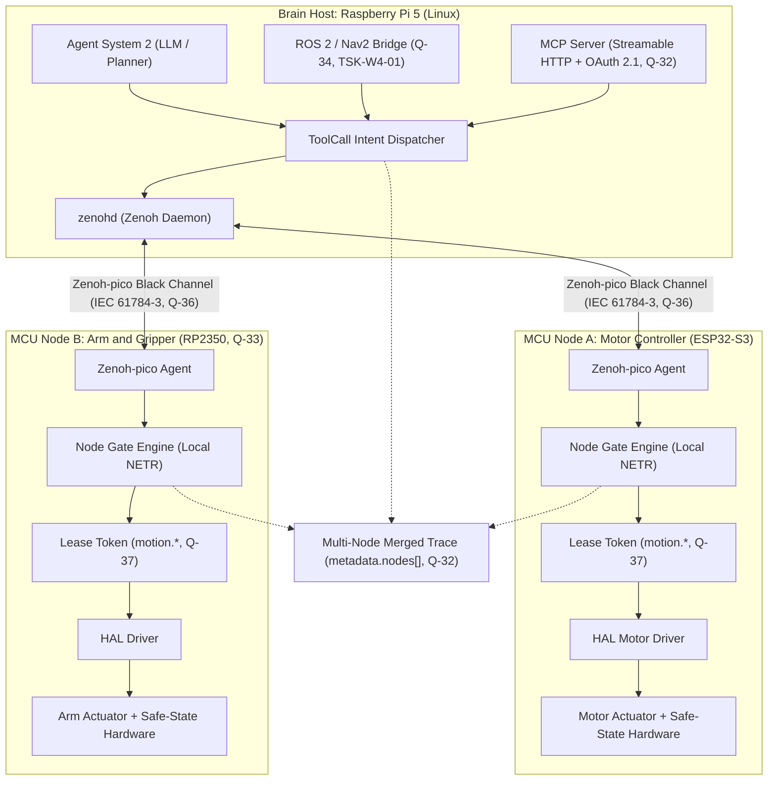
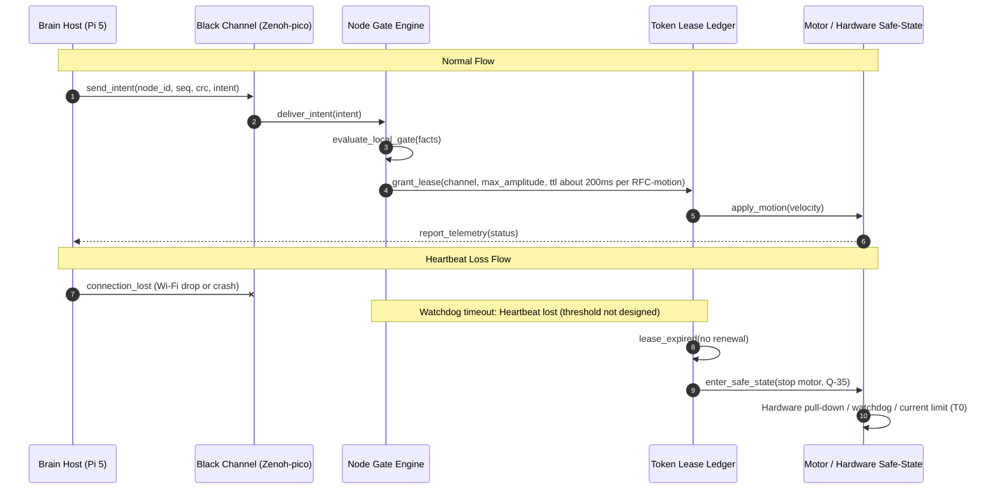
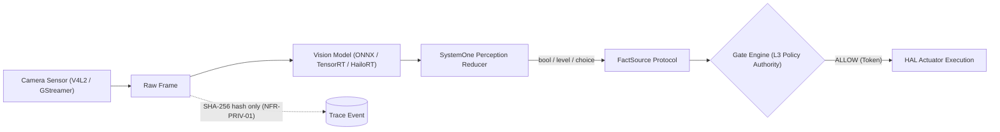

# 15 · Target Architecture by Horizon

> **Scope:** target architecture (to-be architecture) of NeuroEdge across three development horizons. **Source of truth:**
> [`neuroedge-roadmap.md`](../../../roadmap/neuroedge-roadmap.md) §2.1, §3, §4.4–§4.8, §5, §6, §7, Appendix D;
> [`neuroedge-prd.md`](../../../roadmap/neuroedge-prd.md) §15, Appendix D.2;
> [`neuroedge-proposal.md`](../../../roadmap/neuroedge-proposal.md) §3.1, §6;
> [`neuroedge-design-neurobrain.md`](../../../roadmap/neuroedge-design-neurobrain.md);
> [`neuroedge-design-phase2.md`](../../../roadmap/neuroedge-design-phase2.md);
> [`draft-ke-hoach-mo-rong-robot-fofoca.md`](../../../roadmap/draft-ke-hoach-mo-rong-robot-fofoca.md) §2, §4, Appendix A;
> [`draft-rfc-node-giao-thuc-dieu-phoi.md`](../../../roadmap/draft-rfc-node-giao-thuc-dieu-phoi.md) §3.
> **Status conventions:** `done` / `partial` / `planned`.

**What this chapter is for:** This chapter is for software architects, embedded engineers, and systems engineers who need to understand the target architecture (to-be architecture) of NeuroEdge across each development stage. The document answers the questions: *Which components, drivers, protocols, and services does each horizon add? How are safety boundaries and the safe-by-default mechanism ([fail-closed](../../user/thuat-ngu.md): block if gate cannot evaluate; when offline, the gate still evaluates with local fallback, blocking only when fallback is absent or fails to run — Q-14) maintained when scaling from a single chip to multi-node robot systems and cloud computing?* Before reading, readers should understand the high-level picture in [`00`](00-overview.md) and the evolution status in [`13`](13-evolution-i0-i18.md). After this chapter, read [`16`](16-ecosystem-landscape.md) to see the landscape of parties in the extended ecosystem.

---

## 1. Three horizons

The architecture evolution roadmap of NeuroEdge is divided into three **horizons** (architecture development phases with defined capability boundaries and execution environments):

| Horizon | Increments | Architecture changes (What it is & Why it is needed) | Design location |
|:---|:---|:---|:---|
| **Horizon 1 (H1)** — On-device v1.0 | I3–I7 | Complete firmware on ESP32-S3 chip: bring the 5-primitive HAL onto real chip, hardware drivers (I2S codec, ST7789 LCD, GPIO), real-time voice pipeline (AEC, VAD, Opus streaming), C99 voice state machine, barge-in actuator command abort mechanism (`actuator_abort.c`), WebSocket streaming client to cloud, local fixed command recognition fallback when offline ([`Q-14`](../../../roadmap/neuroedge-prd.md#15-sổ-quyết-định)), device security (Secure Boot, flash encryption, physical mic cutoff, anti-rollback eFuse), LVGL interface connected to display driver. Prerequisite for the "talking to a $5 chip" demo (roadmap §4.6): voice on Box-3, gate on chip. | Roadmap [§4.4–§4.8](../../../roadmap/neuroedge-roadmap.md#44-i3--gate-trên-box-3-thật), PRD [Appendix D.2](../../../roadmap/neuroedge-prd.md#d2-giao-thức-truyền-dẫn--định-dạng-vết-ghi-wire-protocol), [`04`](04-component-device-c4l3.md) |
| **Horizon 2 (H2)** — Service tier v1.1 | I9–I10 | Two new server-side containers appear: **Fleet OS** (identity provisioning, inventory ledger, health monitoring, remote config and gate sync, canary rollout (releasing in progressively larger waves up to the whole fleet) campaign orchestration via Eclipse Hawkbit, centralized incident trace collector store, certificate revocation) and **Gate Registry** (public OCI (Open Container Initiative artifact packaging standard) registry via CNCF ORAS/Harbor, stable identifiers, metering system via OpenMeter, permissions sandbox, manifest (package descriptor) `schemas/manifest.v1.json`, signed gates with on-chip signature verification, pinning `extends` by digest). Self-hosted provider abstraction layer completed (multi-provider routing, failover, quota). Needed to manage large-scale device fleets without compromising the safety autonomy of each device. | Roadmap [§6](../../../roadmap/neuroedge-roadmap.md#6-tầng-dịch-vụ-v11-i9i10), Proposal [§6](../../../roadmap/neuroedge-proposal.md#6-mặt-phẳng-thương-mại-fleet-os), PRD [`Q-6`](../../../roadmap/neuroedge-prd.md#15-sổ-quyết-định), [`Q-28`](../../../roadmap/neuroedge-prd.md#15-sổ-quyết-định), [`02`](02-container-c4l2.md) §5 |
| **Horizon 3 (H3)** — Post-Beta extensions | I11–I18 | Expand target list across 3 [target tiers](../../user/thuat-ngu.md) (I11, I13); **NeuroBrain** (I12) for hardware bring-up via conversation, isolated `brain/` package, gated lab actions, [physical safety envelope](../../user/thuat-ngu.md) in HAL, read-only I2C bus, event triggers; **Layered robot** (I14) coordinating Pi 5 brain and multiple MCU nodes (ESP32-S3, RP2350) over Zenoh-pico [black channel](../../user/thuat-ngu.md), each node evaluates gates locally, [lease tokens](../../user/thuat-ngu.md) (lease) for `motion.*`, safe state on link loss, ROS 2/Nav2 bridge; **Vision** (I15–I17) extending L2 perception on Linux/Jetson, reduced via [SystemOne](../../user/thuat-ngu.md), discrete NPU; **Ecosystem** (I18) sharing adapters and HAL ports on Registry. Needed for NeuroEdge to expand to complex motion systems, robotic arms, and multisensory systems. | Roadmap [§7](../../../roadmap/neuroedge-roadmap.md#7-hướng-mở-rộng-sau-beta-i11i18), [`neuroedge-design-neurobrain.md`](../../../roadmap/neuroedge-design-neurobrain.md), [`neuroedge-design-phase2.md`](../../../roadmap/neuroedge-design-phase2.md), [`draft-ke-hoach-mo-rong-robot-fofoca.md`](../../../roadmap/draft-ke-hoach-mo-rong-robot-fofoca.md), [`draft-rfc-node-giao-thuc-dieu-phoi.md`](../../../roadmap/draft-rfc-node-giao-thuc-dieu-phoi.md) |

*Figure E-10 — Four bands: status on main and three horizons; dashed boxes are planned. Generated by scripts/gen_architecture_diagrams.py.*

*How to read Figure E-10:* The figure shows four horizontal bands corresponding to the code status on the `main` branch and three planned consecutive horizons. Solid boxes have code (◐ is partial), dashed boxes are planned. Connecting labels between bands (same walker + ledger, verify on chip, no paid safety) show that subsequent horizons reuse the walker, token ledger, and gate of earlier horizons.

Development relationship diagram between the three horizons:

*How to read the diagram:* Three rectangular boxes represent the three architecture horizons. Arrows from H1 to H2 and H3 show that all safety mechanisms and target equivalence of Horizon 1 are mandatory prerequisites before activating the cloud service tier (H2) or multi-node/vision extensions (H3). Key point to remember: adding management services or layered robots never degrades or breaks the on-device safety guarantees packaged in H1.

---

## 2. Horizon 1 — on-device v1.0 (I3–I7)

### 2.1 Planned firmware components

On the ESP32-S3 microcontroller, components with code already in `main` include the walker `components/ne_gate/`, trace formatter `components/ne_trace/`, agent-specific generated code `components/ne_agent/`, and update module `components/ne_ota/` (already running on Espressif QEMU, details in [`04`](04-component-device-c4l3.md) §3). The table below plans the components to add and complete on real hardware from tasks I3–I7:

| Component (planned path) | What it is & Why it is needed | Governing task | Open-source reuse (Roadmap §3) | Status |
|:---|:---|:---|:---|:---:|
| `targets/esp32s3/hal/` | Implement 5 HAL primitives on ESP-IDF; needed to provide standard physical pin interfaces equivalent to `sim` and `linux`. | [`TSK-S4-01`](../../../roadmap/neuroedge-roadmap.md#44-i3--gate-trên-box-3-thật) | ESP-IDF (toolchain) — roadmap §4.4 | `planned` |
| `targets/esp32s3/drivers/` | Real peripheral drivers: I2S codec ES8311/ES7210, ST7789 LCD, GPIO; needed to directly control hardware registers of Box-3. | [`TSK-S4-03`](../../../roadmap/neuroedge-roadmap.md#44-i3--gate-trên-box-3-thật) | Port drivers directly from XiaoZhi ESP32 (roadmap [§3.4](../../../roadmap/neuroedge-roadmap.md#34-ma-trận-tích-hợp-theo-khối), [§3.5](../../../roadmap/neuroedge-roadmap.md#35-năm-dự-án-port-trực-tiếp)) | `planned` |
| `targets/esp32s3/drivers/audio_path.c` | Capture/playback audio path; needed to connect I2S streams from codec into ring buffers without running STT/TTS on-device. | [`TSK-S5-02`](../../../roadmap/neuroedge-roadmap.md#46-i5--thoại-trên-box-3) | Port codec configuration and I2S clock from XiaoZhi ESP32 (roadmap [§3.5](../../../roadmap/neuroedge-roadmap.md#35-năm-dự-án-port-trực-tiếp)) | `planned` |
| `targets/esp32s3/audio/` | Integrate WebRTC AEC, libfvad (VAD), Opus streaming; needed to cancel echo, filter silence, and compress real-time audio streams. | [`TSK-S5-01`](../../../roadmap/neuroedge-roadmap.md#46-i5--thoại-trên-box-3) | WebRTC AEC, libfvad, Opus; port pipeline from Pipecat (roadmap [§3.4](../../../roadmap/neuroedge-roadmap.md#34-ma-trận-tích-hợp-theo-khối), [§3.5](../../../roadmap/neuroedge-roadmap.md#35-năm-dự-án-port-trực-tiếp)) | `planned` |
| `targets/esp32s3/fsm/voice_fsm.c` | C/C++ implementation of the 5-state voice state machine; needed to accurately synchronize conversational behavior with the host Python version. | [`TSK-S5-03`](../../../roadmap/neuroedge-roadmap.md#46-i5--thoại-trên-box-3) | Canonical specification [`voice_fsm.md`](../../spec/voice_fsm.md), pass compliance vector suite TSK-S3-10 (roadmap [§3.8](../../../roadmap/neuroedge-roadmap.md#38-bảo-toàn-tương-đương-target-khi-có-hai-ngôn-ngữ)) | `planned` |
| `targets/esp32s3/fsm/actuator_abort.c` | Mechanism to abort unexecuted actuator commands upon barge-in (≤ 20 ms, close token); needed to prevent physical command leaks when the user changes their mind. | [`TSK-S5-04`](../../../roadmap/neuroedge-roadmap.md#46-i5--thoại-trên-box-3) | Barge-in mechanism from Pipecat (roadmap [§3.5](../../../roadmap/neuroedge-roadmap.md#35-năm-dự-án-port-trực-tiếp)), contract [`voice_fsm.md`](../../spec/voice_fsm.md) §5 | `planned` |
| `targets/esp32s3/audio/provider_client.c` | Audio streaming client pushing Opus frames to STT, receiving TTS stream via WebSocket; needed for low-latency network communication with cloud provider. | [`TSK-S5-06`](../../../roadmap/neuroedge-roadmap.md#46-i5--thoại-trên-box-3) | Binary WebSocket streaming loop from XiaoZhi ESP32 (roadmap [§3.5](../../../roadmap/neuroedge-roadmap.md#35-năm-dự-án-port-trực-tiếp)) | `planned` |
| `targets/esp32s3/fallback/` | Local offline fixed command recognizer; needed to maintain safe command capability when Internet connection is lost ([`Q-14`](../../../roadmap/neuroedge-prd.md#15-sổ-quyết-định)). | [`TSK-S5-07`](../../../roadmap/neuroedge-roadmap.md#46-i5--thoại-trên-box-3) | ESP-SR MultiNet or TFLite Micro / ESP-NN (roadmap [§4.6](../../../roadmap/neuroedge-roadmap.md#46-i5--thoại-trên-box-3)) | `planned` |
| `targets/esp32s3/security/` | Hardware security block: Secure Boot, flash encryption, physical mic cutoff button, eFuse; needed to prevent unauthorized firmware flashing and eavesdropping. | [`TSK-S6-05`](../../../roadmap/neuroedge-roadmap.md#48-i7--v10) | ESP-IDF (specific component not selected yet) | `planned` |
| `targets/esp32s3/ui/` | 9 screens built and golden images compared on host (TSK-S4-10 done); not linked into firmware yet, awaiting display driver (TSK-S4-01). Needed to show status and confirmation notices. | [`TSK-S4-01`](../../../roadmap/neuroedge-roadmap.md#44-i3--gate-trên-box-3-thật), [`TSK-S4-10`](../../../roadmap/neuroedge-roadmap.md#44-i3--gate-trên-box-3-thật) | LVGL v9 embedded graphics library (roadmap [§3.4](../../../roadmap/neuroedge-roadmap.md#34-ma-trận-tích-hợp-theo-khối)) | `partial` |
| `targets/esp32s3/sdkconfig.defaults` | Configuration file already in repo; memory optimization configuration reaching budget SRAM ≥ 120 KB, PSRAM ≥ 2 MB ([`Q-3`](../../../roadmap/neuroedge-prd.md#15-sổ-quyết-định)) for voice path is the planned part. | [`TSK-S5-05`](../../../roadmap/neuroedge-roadmap.md#46-i5--thoại-trên-box-3) | ESP-IDF Kconfig | `planned` |

### 2.2 On-chip voice pipeline

The real-time voice pipeline on the ESP32-S3 chip operates on a cloud-first cycle ([`CR-1.0`](../../../roadmap/neuroedge-roadmap.md#46-i5--thoại-trên-box-3)), keeping STT, TTS, and language inference at cloud providers to offload compute resources from the microcontroller:

*How to read the diagram:* Solid arrows indicate two execution paths: the main online path (via Opus encoder, WebSocket to cloud STT and System 1) and the offline fallback path (when connection is lost, AFE routes audio directly to local command recognizer MultiNet/TFLite Micro). Both paths converge at the local Gate Engine on-chip to control pin actuation. Dashed arrows show connections to TTS and the barge-in flow. Key point to remember: safety evaluation always takes place on the microcontroller; when offline, the device does not hang but automatically transitions to local fallback.

- **Audio front-end processing (AFE):** I2S microphone signals through the ES7210 codec feed into the AFE block (WebRTC AEC and libfvad) to cancel speaker echo and detect voice activity (VAD). 20 ms audio frames are compressed with Opus then transmitted to the provider cloud over binary WebSocket.
  *The sources disagree: `docs/spec/simulation_coverage.md` §2 and TSK-S4-11 state ESP-SR AFE (AEC, VAD); choose one when doing TSK-S5-01.*
- **Intent and safety processing:** Post-STT text passes to grammar/System 1. If offline, the system switches to the local fixed command recognizer (offline fallback per [`Q-14`](../../../roadmap/neuroedge-prd.md#15-sổ-quyết-định)). Generated facts convert into tool calls fed into the Gate Engine's `NETR` walker running directly on the MCU. Only when the gate returns `ALLOW` is a single-use token issued for HAL to actuate physical pins.
- **Barge-in and command abort:** When the user interrupts while the speaker is playing, VAD voice detection immediately triggers the abort controller (`actuator_abort.c`): it immediately cancels all pending actuator commands (≤ 20 ms), closes the token of the aborted command, then stops TTS (< 300 ms from when the user starts speaking) — the abort step does not wait for the TTS stop step ([`voice_fsm.md`](../../spec/voice_fsm.md) §5.2).
- **Not designed yet (state plainly):** The FreeRTOS multitasking model for the entire voice pipeline — including number of FreeRTOS tasks, priority of each task, queue structures (FreeRTOS queues), and core affinity strategy across the two cores of ESP32-S3 — is **not designed yet** (as noted in [`04`](04-component-device-c4l3.md) §2). The current design only identifies functional blocks and sets timing constraints (abort undelivered actuator commands ≤ 20 ms, memory budget per [`Q-3`](../../../roadmap/neuroedge-prd.md#15-sổ-quyết-định)).

### 2.3 Planned protocols

Transport protocols are planned using open standards and optimized for microcontroller resources (PRD [Appendix D.2](../../../roadmap/neuroedge-prd.md#d2-giao-thức-truyền-dẫn--định-dạng-vết-ghi-wire-protocol), roadmap [Appendix D](../../../roadmap/neuroedge-roadmap.md#phụ-lục-d--giao-thức-truyền-dẫn)):

1. **Wi-Fi / LAN network protocols:**
   - **Transport channel:** Secure `WebSocket` (WSS).
   - **Binary Frame:** transports Opus Voice Mode audio stream (16 kbps, 16 kHz mono, frame size 20 ms = 320 samples). Every target adheres to this same format. `sim` replays WAV files through this exact encoding pipeline to preserve equivalence with the real chip. Status: `planned`.
   - **Text Frame:** transports JSON trace events (PRD Appendix D.2). Status: `planned`.
2. **UART serial port protocol:**
   - **Baud rate:** **not finalized yet** — PRD Appendix D.2 states 921600, but `sdkconfig.defaults` does not set it (ESP-IDF defaults to 115200) and Box-3 can route console via USB-Serial-JTAG; finalize when the board arrives ([`TODOS.md`](../../../TODOS.md) #35, [`TSK-S4-12`](../../../roadmap/neuroedge-roadmap.md#44-i3--gate-trên-box-3-thật)).
   - **Trace format:** JSON Lines, each line carrying a fixed `NE1 ` prefix to separate from firmware logs. The `NE1 ` line trace format is complete on host and QEMU ([`TSK-S4-09`](../../../roadmap/neuroedge-roadmap.md#44-i3--gate-trên-box-3-thật), `docs/spec/simulation_coverage.md` §4).
   - **Binary framing:** When binary data transfer is needed, the framing protocol uses `SLIP` (Serial Line Internet Protocol) per PRD Appendix D.2. Status: `planned`.

### 2.4 Device security

The hardware security architecture in Horizon 1 forms an integrity protection perimeter for the device:

- **Secure Boot:** enable Secure Boot on ESP32-S3 ([`TSK-S6-05`](../../../roadmap/neuroedge-roadmap.md#48-i7--v10), NFR-SEC-02); signature algorithm not selected yet (NFR-SEC-02 does not specify an algorithm; RSA-3072 today is the OTA image signature per FR-OTA-03, [`TSK-S6-03`](../../../roadmap/neuroedge-roadmap.md#48-i7--v10)). Without Secure Boot, a person with a cable can still change firmware (roadmap [`TSK-S6-03`](../../../roadmap/neuroedge-roadmap.md#48-i7--v10)).
- **Flash encryption:** enable flash encryption on ESP32-S3 ([`TSK-S6-05`](../../../roadmap/neuroedge-roadmap.md#48-i7--v10), NFR-SEC-02); algorithm and key management are not designed yet.
- **Physical mic cutoff button:** reference board has a physical mic cutoff button ([`TSK-S6-05`](../../../roadmap/neuroedge-roadmap.md#48-i7--v10), NFR-SEC-03); power cutoff or signal cutoff is not designed yet.
- **Anti-rollback eFuse:** prevent downgrade via eFuse accompanying Secure Boot ([`TSK-S6-05`](../../../roadmap/neuroedge-roadmap.md#48-i7--v10); roadmap [`TSK-S6-03`](../../../roadmap/neuroedge-roadmap.md#48-i7--v10)). Today downgrade is only blocked by a mark in NVS — meaning software protection.
- **OTA update mechanism:** Device-level OTA updates — dual A/B partitions (`ota_0`, `ota_1`), RSA-3072 signature verification on downloaded images, and automatic rollback upon bootloop detection or self-test failure — already have implementations on QEMU and are detailed in [`04`](04-component-device-c4l3.md) §6.

---

## 3. Horizon 2 — service tier v1.1 (I9–I10)

### 3.1 Fleet OS

Fleet OS is the **only commercial service** of NeuroEdge (Proposal [§6.2](../../../roadmap/neuroedge-proposal.md#62-tầng-quản-trị-đội-thiết-bị-fleet-management-os--5-năng-lực-chính), Roadmap [§6.1](../../../roadmap/neuroedge-roadmap.md#61-i9--lớp-provider-v11-và-fleet-os)), providing centralized management infrastructure for remote device fleets:

*How to read the diagram:* The Device Fleet block on the left consists of independently running edge devices. The Fleet OS block on the right is the cloud services cluster. Bidirectional arrows between devices and broker show telemetry and configuration command channels. Sources only list modules (TSK-K2-04…09) and choose an MQTT broker or FastAPI WebSockets for connection and telemetry; how modules connect with each other is not designed yet. Key point to remember: Fleet OS only acts as the management plane; edge devices retain full autonomy over safety evaluation for each actuator.

- **Fleet OS components and tasks:**
  - `services/fleet/provisioning.py` ([`TSK-K2-04`](../../../roadmap/neuroedge-roadmap.md#61-i9--lớp-provider-v11-và-fleet-os)): Automated identity provisioning and device certificate enrollment. Certificate revocation when a device is compromised implemented in `services/fleet/` ([`TSK-K2-09`](../../../roadmap/neuroedge-roadmap.md#61-i9--lớp-provider-v11-và-fleet-os), NFR-SEC-05).
  - `services/fleet/inventory.py` ([`TSK-K2-05`](../../../roadmap/neuroedge-roadmap.md#61-i9--lớp-provider-v11-và-fleet-os)): Device inventory ledger, tracking live/dead status (online/offline), firmware version, Wi-Fi RSSI, chip temperature. Useful dashboard starting from $n=1$.
  - `services/fleet/config_sync.py` ([`TSK-K2-06`](../../../roadmap/neuroedge-roadmap.md#61-i9--lớp-provider-v11-và-fleet-os)): Remote sync of config, secrets, and safety gate updates across the fleet without re-flashing firmware.
  - `services/fleet/canary.py` ([`TSK-K2-07`](../../../roadmap/neuroedge-roadmap.md#61-i9--lớp-provider-v11-và-fleet-os)): Staged firmware rollout campaign orchestration (canary 1% → 10% → 100%) inherited from Eclipse Hawkbit, automatically aborting campaigns and rolling back when error rates exceed threshold (target 1,000 devices / 0 bricks).
  - `services/fleet/trace_collector.py` ([`TSK-K2-08`](../../../roadmap/neuroedge-roadmap.md#61-i9--lớp-provider-v11-và-fleet-os)): Automatically uploads incident trace files to the centralized repository when a device encounters an error.
- **Data boundaries to Fleet OS:**
  - **Data allowed into Fleet OS:** Health telemetry (online/offline, firmware version, RSSI, chip temperature — FR-FLT-03) and incident trace files (FR-FLT-05); traces contain only decisions, no raw data (NFR-PRIV-03). Retention period per [`Q-6`](../../../roadmap/neuroedge-prd.md#15-sổ-quyết-định): Fleet Standard retains 90 days; Fleet Enterprise retains 3 years (NFR-PRIV-03).
  - **Data not sent to Fleet OS:** Audio does not enter Fleet OS trace storage ([`Q-6`](../../../roadmap/neuroedge-prd.md#15-sổ-quyết-định), NFR-PRIV-03: traces contain only decisions, no raw data). Connection and telemetry channel: permissive license MQTT broker (Mosquitto EDL-1.0, NanoMQ or VerneMQ — [`Q-11`](../../../roadmap/neuroedge-prd.md#15-sổ-quyết-định)) or FastAPI WebSockets (roadmap [§3.4](../../../roadmap/neuroedge-roadmap.md#34-ma-trận-tích-hợp-theo-khối), [§6.1](../../../roadmap/neuroedge-roadmap.md#61-i9--lớp-provider-v11-và-fleet-os)). Audio does not pass through Fleet OS: the device's audio WebSocket terminates at the self-hosted provider layer (§3.3, FR-GW-04) — [`Q-47`](../../../roadmap/neuroedge-prd.md#15-sổ-quyết-định).

### 3.2 Gate Registry and the rails

Gate Registry (Roadmap [§6.2](../../../roadmap/neuroedge-roadmap.md#62-i10--registry-và-các-đường-ray), [`TSK-K3-*`](../../../roadmap/neuroedge-roadmap.md#62-i10--registry-và-các-đường-ray)) provides infrastructure to distribute, authenticate, and govern safety gate packages through open industry standards:

*How to read the diagram:* The upper half is the policy supply chain (authors publish via manifests, sign digitally, and store in OCI registries). The lower half is the consumption chain (devices pull gates, verify signatures on-chip, and check inherited digest pinning). OpenMeter and Sandbox act as metering and security control rails. Key point to remember: safety gates are packaged and verified as standardized OCI artifacts; devices execute gates only when cryptographic digital signatures are valid.

- **OCI storage infrastructure:** Built on CNCF ORAS and Harbor to store gate artifacts as standardized OCI images ([`TSK-K3-04`](../../../roadmap/neuroedge-roadmap.md#62-i10--registry-và-các-đường-ray), FR-REG-01).
- **Stable identifiers:** Stable identifiers for devices, agents, and gates ([`TSK-K3-01`](../../../roadmap/neuroedge-roadmap.md#62-i10--registry-và-các-đường-ray), FR-REG-05); format not designed yet. Existing convention (PRD Appendix C): gates on Registry `neuroedge://gates/<nhóm>/<tên>@<semver>`, agents `<tên>@<semver>`.
- **Usage metering:** Integrates OpenMeter to aggregate events and reconcile agent calls and gate evaluations, compatible with Stripe Billing gateway interface ([`TSK-K3-02`](../../../roadmap/neuroedge-roadmap.md#62-i10--registry-và-các-đường-ray), FR-REG-06, FR-TEL-04).
- **Permissions and sandbox mechanism:** Establishes isolated execution environments and permissions enforcement when running agents or third-party code on devices with actuators ([`TSK-K3-05`](../../../roadmap/neuroedge-roadmap.md#62-i10--registry-và-các-đường-ray), FR-REG-07).
- **Manifest schema:** Standardized definition of package manifest file `schemas/manifest.v1.json` and SemVer versioning standards ([`TSK-K3-03`](../../../roadmap/neuroedge-roadmap.md#62-i10--registry-và-các-đường-ray), FR-REG-02, FR-GATE-10).
- **Adapter sharing repository:** Shares community-contributed provider connection adapters using the shared OCI infrastructure ([`TSK-K3-06`](../../../roadmap/neuroedge-roadmap.md#62-i10--registry-và-các-đường-ray), FR-REG-08).
- **Gate signing and on-device verification:** Digitally signs gate artifacts and verifies signature validity directly on edge devices prior to memory loading ([`TSK-W2-04`](../../../roadmap/neuroedge-roadmap.md#62-i10--registry-và-các-đường-ray), FR-REG-04).
- **Pin `extends` by digest:** Enforces pinning inherited identifiers by content hash (`@<ver>#sha256:...`) to prevent parent gate tampering attacks on the Registry, implemented via `RFC-pin-extends` ([`TSK-S3-21`](../../../roadmap/neuroedge-roadmap.md#62-i10--registry-và-các-đường-ray), FR-GATE-05, FR-GATE-06).

### 3.3 Self-hosted provider layer

The provider abstraction layer (FR-GW) is a **core self-hosted component**, not a commercial or fee-charging service operated by NeuroEdge (Proposal [§6.1](../../../roadmap/neuroedge-proposal.md#61-lớp-trừu-tượng-nhà-cung-cấp-provider-abstraction-layer--6-năng-lực-tự-vận-hành), Roadmap [§6.1](../../../roadmap/neuroedge-roadmap.md#61-i9--lớp-provider-v11-và-fleet-os)).

Per decision [`Q-28`](../../../roadmap/neuroedge-prd.md#15-sổ-quyết-định), the scope is clearly divided between two release milestones:
- **v1.0 (Block 1a, TSK-S2-11):** Deliver at the minimum level for single-device needs:
  - Configure a single `[system_two]` table in `agent.toml` (`provider`, `model`, `api_base`, `api_key_env`) serving every provider supported by LiteLLM or a custom adapter. API keys are read from environment variables, strictly never in code, configuration files, or gates.
  - Basic failover contract in source code (`SystemTwo(provider=..., fallback=...)`): if the primary provider errors, switch to fallback; if no options remain, return `Unavailable` and the gate applies its `fail` policy (defaults to `closed`).
- **v1.1 (Block 2, TSK-K2-01→03):** Complete fleet-level capabilities:
  - `python/neuroedge/models/providers/auth.py` ([`TSK-K2-01`](../../../roadmap/neuroedge-roadmap.md#61-i9--lớp-provider-v11-và-fleet-os)): Aggregate a single shared endpoint and credential for the entire device fleet; keys are user-managed and rotatable without re-flashing firmware (FR-GW-01, FR-GW-02).
  - `python/neuroedge/models/providers/routing.py` ([`TSK-K2-02`](../../../roadmap/neuroedge-roadmap.md#61-i9--lớp-provider-v11-và-fleet-os)): Declare multiple providers and failover policies directly in the `agent.toml` configuration without writing code; enforce quotas per device to prevent loops exhausting budgets (FR-GW-03, FR-GW-05, FR-TEL-06).
  - `python/neuroedge/models/providers/traces.py` ([`TSK-K2-03`](../../../roadmap/neuroedge-roadmap.md#61-i9--lớp-provider-v11-và-fleet-os)): Edge-optimized protocol and automatic export of uniformly formatted JSON trace files for each session (FR-GW-04, FR-GW-06, FR-GW-07).

**Role of LiteLLM:** LiteLLM is used as an **in-process routing library (SDK)** via the optional extra `neuroedge[cloud]` ([`Q-10`](../../../roadmap/neuroedge-prd.md#15-sổ-quyết-định), [`Q-11`](../../../roadmap/neuroedge-prd.md#15-sổ-quyết-định)). LiteLLM is **not a gateway or proxy server** operated by NeuroEdge. NeuroEdge does not sit between token streams and does not resell inference tokens (PRD §1.4 N4). Users configure, hold keys, and pay inference fees directly to AI model providers.

### 3.4 Boundary: Core ↔ commercial services

To guarantee transparency and avoid "open-core" ambiguity, the boundary between the source-available Core and the commercial Fleet OS service is fixed immutably per Proposal [§6.4](../../../roadmap/neuroedge-proposal.md#64-phân-định-ranh-giới-giữa-lõi-và-dịch-vụ-thương-mại):

| Criterion | Source-available Core ([`Q-45`](../../../roadmap/neuroedge-prd.md#15-sổ-quyết-định)) | Fleet OS commercial service (Cloud) |
|:---|:---|:---|
| **Core feature definition** | All on-device logic, safety mechanisms, perception runtime, and CI testing | Remote orchestration infrastructure, centralized storage, and device fleet management dashboard |
| **OTA update mechanism** | **Device-level (On-device OTA Agent):** • Pulls firmware over open HTTP endpoints • Dual A/B partitions (Dual-partition scheme) • Automatic local rollback upon bootloop detection • Cryptographic signature verification (RSA/ECDSA) on-chip | **Fleet-level (Fleet Rollout Orchestration):** • Staged rollouts (Canary 1% → 10% → 100%) • Campaign management • Automatically aborts campaigns and rolls back when fleet-wide error rates exceed threshold • Centralized firmware storage repository |
| **Error recording & replay** | Record traces to local JSON files (`traces/*.json`); run `neuroedge replay` on a local machine | Automatically upload JSON trace files during remote incidents; centralized trace repository and cloud regression analysis tools |
| **Offline operation** | Safety functions (gate, state machine, fail-closed) run 100% offline; perception degrades to local fixed command recognizer ([`Q-14`](../../../roadmap/neuroedge-prd.md#15-sổ-quyết-định)) — STT, TTS, and LLM inference require connection to provider cloud | Requires connectivity to sync telemetry and receive orchestration commands |
| **Account requirements** | None whatsoever, install and run immediately | Requires organizational authentication account |
| **Self-hosting capability** | Fully supported via open interfaces (pluggable backend) | Customers self-host their own infrastructure or use turnkey cloud services |
| **AI provider connection layer** | Self-hosted abstraction layer: users configure providers, hold keys, and pay inference fees to providers themselves | Not commercialized — NeuroEdge does not resell tokens |
| **Third-party adapters and HAL ports** | Authors retain full copyright and choose their own license; code resides in authors' own repositories, NeuroEdge only indexes in Registry. Safety responsibility rests with device operators. The control checkpoints are the Compliance Test Suite, permissions sandbox, and build-time capability checks | Not commercialized. Fleet OS displays compliance status of adapters running across the device fleet, but does not sell, endorse, or lock any adapter behind a paywall |
| **Gate & trace format licensing** | Apache-2.0 open standard ([`Q-45`](../../../roadmap/neuroedge-prd.md#15-sổ-quyết-định)) via RFC process, committed to transfer to a neutral organization | Inherits open standard, creates no proprietary variants |

**Non-goals:**
1. **No account required for safety:** All safety functions — gate evaluation, single-use token issuance, and fail-closed enforcement at the HAL — run 100% independently on-device without creating accounts or connecting to NeuroEdge servers (proposal §6.4; [`P-3`](../../../roadmap/neuroedge-prd.md#15-năm-nguyên-tắc-thiết-kế-bất-biến): safety features are not split into paid add-ons).
2. **No resale of inference tokens:** NeuroEdge does not act as an AI token reseller (PRD §1.4 N4); users pay model providers directly based on actual usage.

---

## 4. Horizon 3 — post-Beta extensions (I11–I18)

### 4.1 Expand target list and tiers (I11, I13)

To expand the hardware portfolio without degrading quality commitments, NeuroEdge tiers its target commitments into 3 **target tiers** (levels of quality commitment, testing frequency, and technical support from the team for each environment, [`Q-13`](../../../roadmap/neuroedge-prd.md#15-sổ-quyết-định), Proposal [§3.2](../../../roadmap/neuroedge-proposal.md#phân-tầng-cam-kết-theo-bậc-target), FR-TGT-08, [RFC-0002](../../rfc/0002-mo-rong-target-va-nguyen-thuy-thi-giac.md)):

| Tier | Applicable target | Maintenance responsibility | Verification commitment |
|:---:|:---|:---|:---|
| **Tier 1 — Official** | `sim`, `linux`, `esp32s3` | Core team | `neuroedge verify` reaches **100%**; automated nightly testing on real physical boards; mandatory declaration of all 5 base HAL primitives (FR-HAL-01). |
| **Tier 2 — Extended** | `jetson` (I16) | Core team | `neuroedge verify` reaches 100% across verdict domain; hardware testing on release cadences (does not run nightly). |
| **Tier 3 — Community** | `rp2350`, `stm32` (I13, I14) | Open-source community | Contributors port and verify themselves via independently running **Compliance Test Suite**. Core team makes no quality commitment and does not block releases for this tier (*exception:* RP2350 as node for layered robot is ported directly by core team per [`Q-33`](../../../roadmap/neuroedge-prd.md#15-sổ-quyết-định)). |

At increment I11 ([`TSK-V1a-*`](../../../roadmap/neuroedge-roadmap.md#71-i11--mở-danh-sách-target)), the `target` enum is extended in `schemas/board.v1.json` and `schemas/trace.v1.json`, while capability mapping table `TARGET_TIERS` is introduced into core source code (`python/neuroedge/hal/board.py`).

At increment I13 ([`TSK-P1-*`](../../../roadmap/neuroedge-roadmap.md#73-i13--bộ-port-cộng-đồng)), the core team publishes the **Community Porting Kit** (`docs/porting/`, `targets/_template/`) with language-independent compliance test vectors packaged to run outside the repository (`fixtures/compliance/portable/`) and CLI tool `neuroedge board check <path>` ([`TSK-P1-05`](../../../roadmap/neuroedge-roadmap.md#73-i13--bộ-port-cộng-đồng)) for external parties to verify compatibility.

### 4.2 NeuroBrain (I12)

NeuroBrain ([`Q-31`](../../../roadmap/neuroedge-prd.md#15-sổ-quyết-định), Roadmap [§7.2](../../../roadmap/neuroedge-roadmap.md#72-i12--neurobrain), [`neuroedge-design-neurobrain.md`](../../../roadmap/neuroedge-design-neurobrain.md)) provides contracted hardware bring-up via conversation with large language models (LLMs).

- **`brain/` package and invariant B-1:** All interactive logic of NeuroBrain is isolated in the `python/neuroedge/brain/` package. Per **invariant B-1**, `brain/` is permitted to interact with hardware solely through `dispatch()` → `c.do()` → gate. Calling HAL methods or importing `hal.linux`/`hal.sim` is strictly prohibited. This invariant is automatically checked in CI using AST and import scanning tests (`tests/test_brain_boundary.py`, [`TSK-N1-07`](../../../roadmap/neuroedge-roadmap.md#72-i12--neurobrain)).
- **Controlled Lab Actions:** Defines template `@action` `lab_pulse` ([`TSK-N1-01`](../../../roadmap/neuroedge-roadmap.md#72-i12--neurobrain)) with pulse parameter `duration_ms ≤ 2000`. The `[lab] enabled` configuration flag in `agent.toml` defaults to off ([`TSK-N1-02`](../../../roadmap/neuroedge-roadmap.md#72-i12--neurobrain)). The `neuroedge build --release` command refuses to compile if this flag is enabled ([`TSK-N1-03`](../../../roadmap/neuroedge-roadmap.md#72-i12--neurobrain)). Lab command results always return accompanied by `gate explain` for the LLM to self-correct parameters ([`TSK-N1-04`](../../../roadmap/neuroedge-roadmap.md#72-i12--neurobrain)).
- **Physical Safety Envelope Hook:**
  Physical safety envelopes (on-time duration limits and maximum frequency per GPIO pin) are declared in `board.v1` and enforced by a hook placed in `HardwareAbstractionLayer.digital_out` ([`TSK-N2-01`](../../../roadmap/neuroedge-roadmap.md#72-i12--neurobrain), [`TSK-N2-02`](../../../roadmap/neuroedge-roadmap.md#72-i12--neurobrain)).
  - **Mandatory execution order:** `pin check (require_pin)` → `envelope` → `authorize` → `record`.
  - **Handling envelope violations:** If an action exceeds physical envelope limits, the command is refused (error class name not designed yet) and an `envelope_refused` event is emitted to the trace. At this point, the **verdict token is NOT consumed** because it has not entered the `authorize()` function.

Sequence diagram of physical envelope hook execution:

*How to read the diagram:* Arrows show the four-step verification order before physical current is driven to the microcontroller pin. Step 2 (envelope) and step 3 (token ledger) are two independent safety checkpoints. Key point to remember: the physical safety envelope is checked before token consumption; if the envelope refuses due to exceeding total on-time or frequency, the token is not consumed (TSK-N2-01); sources say nothing further on whether the token remains reusable.

- **Read-only I2C bus (Block N3):** scan via read-byte, no quick-write; read chip ID; if unrecognized, record "unrecognized", do not guess ([`TSK-N3-01`](../../../roadmap/neuroedge-roadmap.md#72-i12--neurobrain)).
- **Event triggers (Block N6):** Adds value `call_source = "trigger"` ([`TSK-N6-01`](../../../roadmap/neuroedge-roadmap.md#72-i12--neurobrain)). Invariant rule: `trigger ∉ HUMAN_SOURCES`, triggers cannot confirm `on_block: ask` questions ([`Q-26`](../../../roadmap/neuroedge-prd.md#15-sổ-quyết-định), [`TSK-N6-02`](../../../roadmap/neuroedge-roadmap.md#72-i12--neurobrain)). Debounce and rate-limiting ceiling mechanisms apply ([`TSK-N6-03`](../../../roadmap/neuroedge-roadmap.md#72-i12--neurobrain)).
- **NeuroBrain on ESP32-S3 (Block N7):** Reuses the C walker and token ledger to evaluate lab actions on-chip ([`TSK-N7-01`](../../../roadmap/neuroedge-roadmap.md#72-i12--neurobrain)); the safety envelope is enforced in C firmware ([`TSK-N7-02`](../../../roadmap/neuroedge-roadmap.md#72-i12--neurobrain)).
- **Role of RFC-0007:** RFC-0007 ([`TSK-N0-03`](../../../roadmap/neuroedge-roadmap.md#72-i12--neurobrain)) is a placeholder RFC for the `digital.in` primitive, read-only I2C bus, and envelope declaration in `board.v1`. This RFC **preserves 100% of the `schemas/gate.v1.json` structure**.

### 4.3 Layered robot (I14)

For complex robot systems such as the FOFOCA robot (Roadmap [§7.4](../../../roadmap/neuroedge-roadmap.md#74-i14--robot-phân-tầng), [`draft-ke-hoach-mo-rong-robot-fofoca.md`](../../../roadmap/draft-ke-hoach-mo-rong-robot-fofoca.md), [`draft-rfc-node-giao-thuc-dieu-phoi.md`](../../../roadmap/draft-rfc-node-giao-thuc-dieu-phoi.md)), the architecture cleanly divides between the **Coordinating Brain** and **Actuator Control Nodes**:

*How to read the diagram:* The upper block is the Pi 5 brain acting as agent host planner, receiving requests from MCP or the ROS 2 bridge and dispatching intents onto the wire. Lower blocks are independent microcontrollers directly driving motors or robotic arms. The Zenoh-pico transport is treated as an untrusted black channel. Key point to remember: there is no centralized gate on Pi 5; each microcontroller node evaluates gates locally using local facts and issues its own lease tokens.

- **Coordination model:** The Brain (Raspberry Pi 5) runs the Agent, network MCP server (Streamable HTTP + OAuth 2.1 per [`Q-32`](../../../roadmap/neuroedge-prd.md#15-sổ-quyết-định), [`TSK-P2-04`](../../../roadmap/neuroedge-roadmap.md#74-i14--robot-phân-tầng)), and ROS 2/Nav2 bridge ([`Q-34`](../../../roadmap/neuroedge-prd.md#15-sổ-quyết-định), [`TSK-W4-01`](../../../roadmap/neuroedge-roadmap.md#74-i14--robot-phân-tầng)). Only **intents** are transmitted on the wire. Each MCU node (ESP32-S3 or RP2350 per [`Q-33`](../../../roadmap/neuroedge-prd.md#15-sổ-quyết-định), [`TSK-W3-07`](../../../roadmap/neuroedge-roadmap.md#74-i14--robot-phân-tầng)) **evaluates its own gate locally** using local facts, issuing and consuming its own tokens. **Centralized gate models on the brain are strictly prohibited** (rule BT2, RFC-node §3.1).
- **Black Channel transport over Zenoh-pico:** Uses Zenoh-pico (Apache-2.0 branch) on MCUs and `zenohd` on Pi ([`Q-36`](../../../roadmap/neuroedge-prd.md#15-sổ-quyết-định), [`TSK-W3-01`](../../../roadmap/neuroedge-roadmap.md#74-i14--robot-phân-tầng)). The entire transport layer is treated as an untrusted "black channel" per IEC 61784-3 ([`TSK-W3-03`](../../../roadmap/neuroedge-roadmap.md#74-i14--robot-phân-tầng)). Each coordination message carries protection fields per RFC-node §3.3:
  - `node_id` / `conn_id`: node and connection identifiers, preventing cross-node spoofing;
  - `seq`: packet sequence number, preventing replay attacks and out-of-order delivery;
  - `crc`: bit-level integrity check over physical channel;
  - `epoch` / `boot_id` / `ttl`: prevents using stale, expired intents;
  - `heartbeat`: periodic heartbeat signal between Pi and nodes.
- **Lease Tokens for `motion.*`:** Unlike single-pulse pin tokens, motor motion commands `motion.*` use short-term lease tokens (~200 ms) ([`Q-37`](../../../roadmap/neuroedge-prd.md#15-sổ-quyết-định), [`TSK-W1-03`](../../../roadmap/neuroedge-roadmap.md#74-i14--robot-phân-tầng)). Each new command passed by the gate extends the lease duration. When commands stop, the token expires automatically and the actuator returns to its safe state ([`Q-35`](../../../roadmap/neuroedge-prd.md#15-sổ-quyết-định)); specific numbers are finalized in RFC-motion ([`TSK-W1-03`](../../../roadmap/neuroedge-roadmap.md#74-i14--robot-phân-tầng)).
- **Safe State on Link Loss:** Each actuator declares its safe state in configuration (e.g., motor, gripper stops immediately; door lock finishes pulse then locks; lights remain unchanged — [`Q-35`](../../../roadmap/neuroedge-prd.md#15-sổ-quyết-định)). If undeclared, the system defaults to stopping (fail-closed, [`Q-35`](../../../roadmap/neuroedge-prd.md#15-sổ-quyết-định)). Loss of heartbeat connection (heartbeat loss) is treated as a shutdown-style stop event recorded in traces for replayability.
- **Cross-chip barge-in budget:** The voice state machine runs on Pi, while pending commands may reside on nodes; RFC-node must define Pi → node abort messages and their timing budget (not designed yet). [`Q-36`](../../../roadmap/neuroedge-prd.md#15-sổ-quyết-định) sets a p99 Pi → node latency threshold ≤ 20 ms for spike W3-1.
- **Multi-node merged trace:** Applies Option A per [`Q-32`](../../../roadmap/neuroedge-prd.md#15-sổ-quyết-định) ([`TSK-W3-04`](../../../roadmap/neuroedge-roadmap.md#74-i14--robot-phân-tầng)): adds optional field `metadata.nodes[]` and convention for embedding `data.node_id` in trace events, without breaking or altering the `schemas/trace.v1.json` structure. The `neuroedge verify` command is extended to verify consistency across nodes ([`TSK-W3-06`](../../../roadmap/neuroedge-roadmap.md#74-i14--robot-phân-tầng)).

Sequence diagram of command issuance and link loss handling on layered robots:

*How to read the diagram:* The upper half is the normal cycle (brain sends intents, node gate evaluates locally and issues short-term lease tokens). The lower half depicts the network disconnection scenario: when heartbeats are lost, the node rejects new intents; leases are not renewed and thus expire, returning actuators to their declared safe states (Q-35); tier T0 (pull-down, watchdog, current limiting) maintains safety even if software crashes. Key point to remember: safe stopping of robots during network loss is guaranteed by token expiry and baseline hardware, independent of packets sent from the brain.

### 4.4 Vision (I15–I17)

Vision extends NeuroEdge perception capabilities from audio to imagery (Roadmap [§7.5–§7.7](../../../roadmap/neuroedge-roadmap.md#75-i15--thị-giác-trên-linux), [`neuroedge-design-phase2.md`](../../../roadmap/neuroedge-design-phase2.md) §6–§8):

*How to read the diagram:* Solid arrows represent the data processing pipeline: camera sensors capture frames, vision models perform inference, and the SystemOne reducer converts tensors into discrete facts (`bool`, `level`, `choice`) fed into FactSource for the Gate Engine. Dashed arrows show privacy protection. Key point to remember: vision models are solely L2 perception fact sources; Gate Engine L3 retains independent action verdict authority; traces strictly never contain raw frames.

- **Principle of L2 vs L3 authority:** Vision is an L2 perception input, strictly **never an L3 verdict authority** (`neuroedge-design-phase2.md` §2.1). All inferences from camera frames must pass through a `SystemOne` to reduce down to three primitive data types that the Gate Engine already evaluates: `bool`, `level`, or `choice` (`neuroedge-design-phase2.md` §2.2). The Gate Engine preserves determinism and remains independent of image tensors.
- **Software components:** The vision module resides in package `python/neuroedge/perception/vision/` ([`TSK-V1b-03`](../../../roadmap/neuroedge-roadmap.md#75-i15--thị-giác-trên-linux)). The `sim` environment provides a virtual camera replaying image sequences for Action CI regression testing without physical cameras ([`TSK-V1b-02`](../../../roadmap/neuroedge-roadmap.md#75-i15--thị-giác-trên-linux), [`TSK-V1b-04`](../../../roadmap/neuroedge-roadmap.md#75-i15--thị-giác-trên-linux)).
- **Hardware accelerators:**
  - On `linux` (Raspberry Pi 5): uses GStreamer and V4L2 for frame capture pipelines; Ultralytics YOLO and ONNX Runtime for models; connects discrete NPUs via HailoRT (Hailo-8) and Edge TPU runtime (Coral) ([`TSK-V1b-05`](../../../roadmap/neuroedge-roadmap.md#75-i15--thị-giác-trên-linux)).
  - On `jetson` (Tier 2, I16): integrates JetPack and TensorRT for GPU acceleration; DeepStream processes real-time multi-camera pipelines ([`TSK-V2-01`](../../../roadmap/neuroedge-roadmap.md#76-i16--thị-giác-trên-jetson), [`TSK-V2-02`](../../../roadmap/neuroedge-roadmap.md#76-i16--thị-giác-trên-jetson)).
  - Multimodal (I17): fuses voice, vision, and sensor perception in a single state machine (`perception/fusion/`, [`TSK-V3-01`](../../../roadmap/neuroedge-roadmap.md#77-i17--đa-phương-thức)); multimodal gates require `RFC visual-evidence gate semantics` ([`TSK-V3-04`](../../../roadmap/neuroedge-roadmap.md#77-i17--đa-phương-thức)).
- **Data privacy:** Strictly adheres to NFR-PRIV-01 and NFR-PRIV-03 (`neuroedge-design-phase2.md` §2.3, [`TSK-V1b-08`](../../../roadmap/neuroedge-roadmap.md#75-i15--thị-giác-trên-linux)). Trace files **strictly never embed raw frames**. Traces default to storing only SHA-256 hashes (`vision_ref`) and frame dimensions. Recording raw images is enabled only with explicit flag `metadata.raw_capture`.

### 4.5 Ecosystem (I18)

The device ecosystem at increment I18 (Roadmap [§7.8](../../../roadmap/neuroedge-roadmap.md#78-i18--hệ-sinh-thái-thiết-bị), [`TSK-P2-*`](../../../roadmap/neuroedge-roadmap.md#78-i18--hệ-sinh-thái-thiết-bị), `neuroedge-design-phase2.md` §9.2) expands the hardware and extensions network:

- **Adapter and HAL Port Repository:** Operates on the existing Gate Registry OCI infrastructure to share community-contributed adapters and HAL ports (`services/registry/ports.py`, [`TSK-P2-01`](../../../roadmap/neuroedge-roadmap.md#78-i18--hệ-sinh-thái-thiết-bị)).
- **Gating condition:** Increment I18 is unlocked only when there are **at least 3 Tier 3 ports** independently completed by the community (PRD §14, Roadmap [§7.8](../../../roadmap/neuroedge-roadmap.md#78-i18--hệ-sinh-thái-thiết-bị)).
- **Compliance monitoring:** The Fleet OS Dashboard displays compliance status and versions of adapters operating across the device fleet (`services/fleet/compliance_view.py`, [`TSK-P2-02`](../../../roadmap/neuroedge-roadmap.md#78-i18--hệ-sinh-thái-thiết-bị)).
- **Free self-attested certification:** Free, self-attested hardware certification ([`TSK-P2-03`](../../../roadmap/neuroedge-roadmap.md#78-i18--hệ-sinh-thái-thiết-bị)) and self-attested "NeuroEdge-gated" certification for third-party runtimes and MCP servers ([`TSK-P2-06`](../../../roadmap/neuroedge-roadmap.md#78-i18--hệ-sinh-thái-thiết-bị)): third parties run compliance test vectors and publish results themselves. NeuroEdge charges no certification fees and provides no quality endorsements, avoiding legal liabilities for the project. Never build a standalone Marketplace before achieving milestones G1–G4 (Block 5 beyond roadmap). The full ecosystem landscape (parties, shared assets, platforms, value loops) is presented in chapter [`16`](16-ecosystem-landscape.md).

---

## 5. What remains unchanged across all horizons

Whether the architecture expands from a single microcontroller to multi-node layered robot systems or adds vision and cloud services, the following six points (synthesized from invariants and architectural properties) hold across all horizons:

1. **Single path to a pin:** Every physical action must pass through the closed chain: `dispatch()` → `c.do()` → gate evaluate → single-use token → HAL `authorize()`. There are no shortcuts to actuators ([`Q-24`](../../../roadmap/neuroedge-prd.md#15-sổ-quyết-định)).
2. **Fail-closed by default:** Inability to evaluate gates — timeout, offline without local fallback, camera loss, missing or wrongly typed facts — results in `BLOCK`; only gates self-declaring `fail: open` permit actions ([`00`](00-overview.md) §2, CHANGELOG §3.3 #2). Loss of node heartbeats returns actuators to their safe state (Q-35).
3. **Gate is data:** Safety gates are always versioned data, canonically identified by `neuroedge://`, hashed with JCS SHA-256, compiled into deterministic decision trees, and inheritance rules may only tighten policies ([`Q-18`](../../../roadmap/neuroedge-prd.md#15-sổ-quyết-định)).
4. **Replay recomputes:** Trace files contain sufficient facts to recompute the entire verdict sequence in the Action CI test environment without calling AI models again or touching physical hardware.
5. **One trace per session:** Each interaction session generates exactly one complete trace file (NFR-OBS-01, FR-ACE-06).
6. **Same decision on every target:** Target equivalence ensures agent code never branches by target; the same scenario of facts yields completely consistent verdicts and reactions across `sim`, `linux`, and `esp32s3` ([`Q-8`](../../../roadmap/neuroedge-prd.md#15-sổ-quyết-định), P-2, proposal §3.2).

Sources for each point: [`00`](00-overview.md) §2, §4; [`CHANGELOG.md`](../../../CHANGELOG.md) §3.3 (ten invariants — a different, more detailed list).

---

## 6. Sources

1. **Development roadmap:**
   - [`neuroedge-roadmap.md`](../../../roadmap/neuroedge-roadmap.md) (§2.1 Dependency graph, §3 OSS reuse strategy, §3.8 Preserving target equivalence, §4.4–§4.8 Task table I3–I7, §5 I8 Developer Beta, §6 I9–I10 Service tier v1.1, §7 I11–I18 Post-Beta extensions, Appendix D Wire protocols).
2. **Product requirements document:**
   - [`neuroedge-prd.md`](../../../roadmap/neuroedge-prd.md) (§1.4 Non-goals N4; §9 Non-functional requirements; §15 Decision log: `Q-3`, `Q-6`, `Q-8`, `Q-10`, `Q-11`, `Q-12`, `Q-13`, `Q-14`, `Q-18`, `Q-24`, `Q-26`, `Q-28`, `Q-31`, `Q-32`, `Q-33`, `Q-34`, `Q-35`, `Q-36`, `Q-37`, `Q-45`; Appendix D.2 Wire protocol).
3. **Platform architecture proposal:**
   - [`neuroedge-proposal.md`](../../../roadmap/neuroedge-proposal.md) (§3.1 5-layer block diagram L0–L4 and Action CI axis; §3.2 Target equivalence and target tier hierarchy; §6 Commercial plane Fleet OS; §6.4 Core ↔ Commercial service boundary matrix).
4. **Detailed design notes:**
   - [`neuroedge-design-neurobrain.md`](../../../roadmap/neuroedge-design-neurobrain.md) (NeuroBrain Phase 1.5 design notes, invariant B-1, physical safety envelope hook, Appendix A ESP-Claw).
   - [`neuroedge-design-phase2.md`](../../../roadmap/neuroedge-design-phase2.md) (Phase 2 design notes: L2 vision, target tiering, NPU acceleration).
   - [`draft-ke-hoach-mo-rong-robot-fofoca.md`](../../../roadmap/draft-ke-hoach-mo-rong-robot-fofoca.md) (§2 Invariants and RFC list, §4 7-layer robot target architecture, Appendix A RFC framework).
   - [`draft-rfc-node-giao-thuc-dieu-phoi.md`](../../../roadmap/draft-rfc-node-giao-thuc-dieu-phoi.md) (§3 Proposed changes for node coordination protocol, black channel, lease tokens).
5. **Related architecture chapters in this document:**
   - [`00 · Architecture Overview`](00-overview.md) (§2 The system in one picture, §4 Architectural characteristics).
   - [`02 · Container Architecture`](02-container-c4l2.md) (§5 Planned containers).
   - [`04 · ESP32-S3 firmware components`](04-component-device-c4l3.md) (§3 Component inventory, §6 Signed OTA updates).
   - [`05 · Detailed Gate and HAL Design`](05-code-gate-hal-c4l4.md) (§5 From verdict to pin).
   - [`13 · Evolution I0–I18: Current State and Plan`](13-evolution-i0-i18.md) (§2 Changes across stages, §3 Variation points already in place).
   - [`16 · Ecosystem Landscape`](16-ecosystem-landscape.md).
