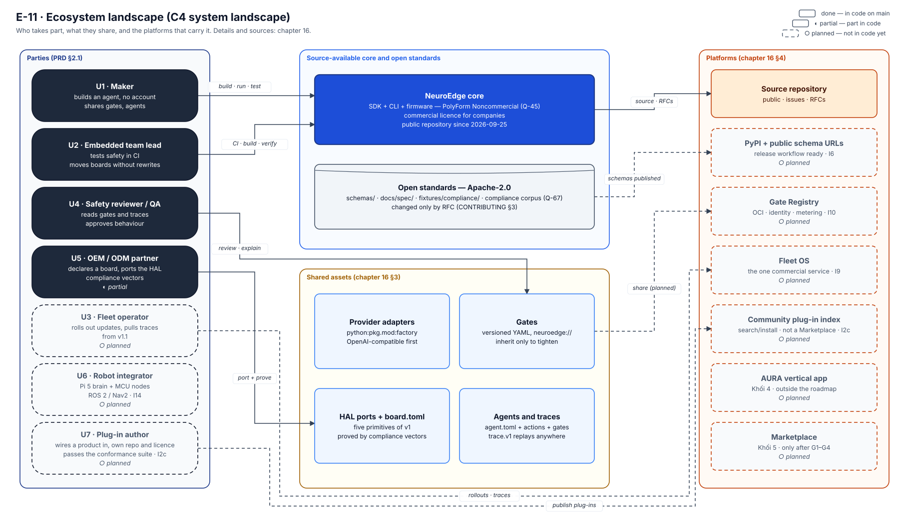
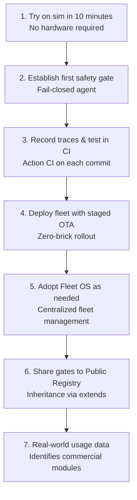

# 16 · Ecosystem (C4 system landscape)

> **Scope:** panoramic view of the ecosystem (C4 system landscape) — all parties, shared assets, distribution and operational platforms, along with value flows between them in current state and future plans. **Sources:** [`neuroedge-proposal.md`](../../../roadmap/neuroedge-proposal.md) §1.5, §1.6, §1.7, §6, §8.4–§8.9, §9; [`neuroedge-roadmap.md`](../../../roadmap/neuroedge-roadmap.md) §4.3.3 (I2c), §6.2 (I10), §7.3 (I13), §7.8 (I18), §8; [`neuroedge-prd.md`](../../../roadmap/neuroedge-prd.md) §1.4, §1.5 (P-3, P-5), §2.1 (U1–U7), §3, §7.3 (FR-EXT), §14, §15 (Q-11, Q-13, Q-32..Q-38, Q-45, Q-67); [`neuroedge-design-phase2.md`](../../../roadmap/neuroedge-design-phase2.md) §9; [`neuroedge-design-open-platform.md`](../../../roadmap/neuroedge-design-open-platform.md); [`thi-truong-tich-hop-2026-10-04.md`](../../reports/thi-truong-tich-hop-2026-10-04.md); [`LICENSING.md`](../../../LICENSING.md); [`TODOS.md`](../../../TODOS.md) #32, #33. Label conventions `done` / `partial` / `planned`: [`README.md`](../README.md).

**What this chapter is for:** This chapter is for all parties in the NeuroEdge ecosystem — from independent developers (makers), embedded engineers, OEM partners, fleet operators, safety reviewers, third-party plug-in authors to investors and commercial partners. The document answers core architectural questions: Which parties make up the entire NeuroEdge ecosystem? What types of assets are shared and protected? Which platforms distribute those assets? How does value circulate between the community and enterprises? And where lies the boundary between the source-available core (free for non-commercial purposes, enterprises require a commercial license — Q-45) and the Fleet OS commercial service?

- **Read first:** [`00`](00-overview.md) (system overview), [`01`](01-context-c4l1.md) (C4 L1 context), and [`07`](07-data-contracts.md) (data contracts).
- **Read next:** [`13`](13-evolution-i0-i18.md) (evolution I0–I18) and corresponding target architecture design sections in [`15`](15-target-architecture.md) (§3.1 Fleet OS, §3.2 Registry, §3.4 core ↔ commercial boundary, §4.1 port kit, §4.5 device ecosystem).

## 1. The picture

*Figure E-11 — Parties, shared assets, and platforms; dashed lines are planned. Generated by scripts/gen_architecture_diagrams.py.*

**How to read diagram E-11:** Figure E-11 sketches all participating parties around central distribution and operational platforms. The diagram has four columns: parties (PRD §2.1), source-available core and Apache-2.0 open standards, shared assets (§3), and platforms (§4). Solid lines indicate interactions already implemented and running in current source code (`done`); dashed lines indicate planned expansion interactions (`planned`). Core takeaway for readers: The NeuroEdge safety core acts as the central enforcer of every physical hardware control command, completely independent of where assets come from. Detailed to-be designs are planned in [`15`](15-target-architecture.md) (§3.1 Fleet OS, §3.2 Registry, §3.4 core ↔ commercial service boundary, §4.1 port kit, §4.5 device ecosystem).

The diagram below details the flows of shared assets circulating between parties and platforms:

```mermaid
flowchart TD
    subgraph Parties["Ecosystem Parties"]
        DEV["Maker / App Developer (U1, U2)"]
        OEM["OEM Partner (U5)"]
        PORTER["Community Porter (U5 / tier 3)"]
        QA["Safety Reviewer / QA (U4)"]
        FLEET_OP["Fleet Operator (U3)"]
        ROBOT["Robot Integrator (U6)"]
        PLUG["Plug-in Author, third party (U7)"]
        PROVIDERS["Model / Speech Providers"]
    end

    subgraph Platforms["Platforms & Distribution"]
        REPO["Public source repo (done) · schema URLs (planned I6)"]
        PYPI["PyPI Package (planned I6)"]
        IDX["Community Plug-in Index (planned I2c)"]
        REG["Gate Registry (planned I10)"]
        FLT["Fleet OS (planned I9)"]
        MKT["Marketplace (planned Block 5)"]
        AURA["AURA Vertical App (planned Block 4)"]
    end

    %% Today flows (solid)
    DEV -->|"reads schemas & specs"| REPO
    OEM -->|"declares board capability (board.toml)"| REPO
    OEM -->|"runs compliance vectors"| REPO
    QA -->|"audits gates & trace replays"| REPO
    PROVIDERS -->|"OpenAI-compatible & decision endpoints"| DEV

    %% Planned flows (dashed)
    DEV -.->|"installs SDK & CLI (planned I6)"| PYPI
    DEV -.->|"publishes & inherits gates (planned I10)"| REG
    DEV -.->|"shares provider adapters (planned I10)"| REG
    DEV -.->|"packages agents (planned I10)"| REG
    DEV -.->|"connects devices & syncs incident traces (planned I9)"| FLT

    PORTER -.->|"downloads port kit (planned I13) & compliance vectors"| REPO
    PORTER -.->|"submits HAL ports & board profiles (planned I18)"| REG

    QA -.->|"verifies signed gates (planned I10)"| REG

    FLEET_OP -.->|"deploys staged OTA & remote config (planned I9)"| FLT
    FLEET_OP -.->|"analyzes incident traces (planned I9)"| FLT

    ROBOT -.->|"builds node firmware and ROS 2 bridge (planned I14)"| REPO

    PLUG -.->|"reads public SDK docs & runs compliance suite (planned I2c)"| REPO
    PLUG -.->|"publishes plug-ins with conformance result (planned I2c)"| IDX
    DEV -.->|"searches & installs plug-ins (planned I2c)"| IDX

    REG -.->|"curates verified assets (planned Block 5)"| MKT
    AURA -.->|"consumes core SDK & reference gates (planned Block 4)"| REPO
    AURA -.->|"contributes real-world proven gates (planned Block 4)"| REG
```

**How to read the flow diagram:** Nodes in the Parties group are entities creating or receiving value; nodes in the Platforms group are channels for code and data distribution and operational orchestration. Solid lines apply only to workflows running in practice today on the source repository and simulation environments (`sim`/`linux`). Dashed lines are plans: I2c, I6, I9, I10, I13, I14, I18, along with Block 4 (AURA) and Block 5 (Marketplace) outside the roadmap. The three I2c flows: a plug-in author (U7) reads the public docs and runs the compliance suite, then publishes the plug-in to the community index; users search and install plug-ins from there — this index is not a Marketplace (PRD §14). The core point: Every extension asset (gate, adapter, port, plug-in) must pass through a validation checkpoint before deployment to real devices.

## 2. Parties

Comparison table of each party, what they build or use, the value received, and how NeuroEdge serves them from present to future (mapped to user codes `U1`–`U7` in [`neuroedge-prd.md`](../../../roadmap/neuroedge-prd.md) §2.1):

| Party | Builds or uses | Value received | How NeuroEdge serves: Today → Planned |
|:---|:---|:---|:---|
| **Maker & Independent Inventor** (`U1`) | Builds first agent (`agent.toml`, action, gate YAML); uses simulation environment (`sim`) or personal board | Under 10-minute experience (TTFV < 10'), no account barriers, no advance hardware purchase needed; *fail-closed* mechanism (blocks by default on error or uncertainty) protects safety of actuators | **Today (`done`):** `neuroedge` source library, CLI (`new`, `run`, `test`, `record`, `replay`), `sim` and `linux` (`gpio-sim`) targets, QEMU for `esp32s3`. → **Planned (`planned`):** One-command install via PyPI (I6, [`neuroedge-roadmap.md`](../../../roadmap/neuroedge-roadmap.md) §4.7); rich sample gate catalog on Registry (I10). |
| **Embedded Lead / App Developer** (`U2`) | Develops commercial products; configures gates, connects sensors/actuators; runs Action CI in CI/CD pipelines | Automates safety testing before flashing chips; switches boards without rewriting business logic (principle P-2); reuses verified safety policies | **Today (`done`):** Action CI test suite, gate truth table, closed bidirectional counter-example corpus, equivalent Python/C targets. → **Planned (`planned`):** Pull gates via `gate add` from signed Gate Registry (I10, [`15`](15-target-architecture.md) §3.2); pin `extends` with JCS SHA-256 digest (TSK-S3-21); purchase commercial license for enterprises (Q-45). |
| **Fleet Operator** (`U3`) | Manages, monitors, and updates software for fleets of 100–10,000 devices in the field | Staged OTA rollout in *canary* waves (progressive deployment 1% → 10% → 100%) preventing mass bricking risk; updates gates remotely without reflashing firmware; remote incident diagnosis via traces downloaded to local machine (MTTR < 10 minutes) | **Today (`partial`):** Device-level dual-partition A/B signed OTA with rollback on QEMU (`targets/esp32s3/components/ne_ota/`); local JSON traces. → **Planned (`planned`):** **Fleet OS** commercial service layer (I9, [`15`](15-target-architecture.md) §3.1) integrating Eclipse Hawkbit for canary orchestration, MQTT broker for telemetry/remote config, centralized incident trace repository and analytics (FR-FLT-01..06, TSK-K2-04..09). |
| **Safety Reviewer & QA** (`U4`) | Evaluates, approves gate conditions; investigates incident traces and audits compliance | Reads and understands YAML safety policies without reading source code; guarantees invariance (inheritance only tightens); deterministic bug reproduction from traces | **Today (`done`):** CLI commands `neuroedge gate lint`, `gate explain`, `trace validate`, `trace view`, `replay`. → **Planned (`planned`):** Verifies OCI/ORAS cryptographic digital signatures on gates and traces (TSK-W2-04, I10); displays compliance status of running adapters across fleets (TSK-P2-02, I18). |
| **Hardware Partner (OEM / ODM)** (`U5`) | Manufactures boards, hardware modules; declares board capability profile (`board.toml`); per-pin safety envelope is `done` on `sim` and `linux` (RFC-0007, I2a), `esp32s3` at I3a | Brings hardware into the agent ecosystem without vendor lock-in to a chip line; standardizes actuation capabilities | **Today (`partial`):** `board.v1.json` schema (with the envelope and extension-primitive blocks), four reference-board profiles for the three tier-1 targets (`boards/sim-default.toml`, `sim-rpi5.toml`, `linux-rpi5.toml`, `esp32s3-box-3.toml`), porting guide ([`11`](11-hal-port-guide.md)). → **Planned (`planned`):** Open `target` enum by *target tier* via RFC-0002 — signed 2026-10-04, its code moved into I2c ([`neuroedge-roadmap.md`](../../../roadmap/neuroedge-roadmap.md) §4.3.3; I11 merged into I2c, Q-67); `neuroedge board validate` and `board show` tools (TSK-V1a-05); `--board <path>` for out-of-repo community boards, self-certified and never a reference board (TSK-I2c-05). |
| **Community Porter** (`U5` / tier 3) | Writes C/Python HAL ports for new microcontrollers or SBCs outside tiers 1/2 (STM32, RP2350… — note RP2350 as a layered robot node is ported by the core team per Q-33; generic tier-3 port is by the community) | Language-independent port kit, thorough documentation, transparent self-check process to obtain tier-3 recognition without core team intervention | **Today (`partial`):** Five basic HAL primitive contracts ([`11`](11-hal-port-guide.md) §2); framework-independent C99 core. → **Planned (`planned`):** Community port kit (Block P1, I13, [`15`](15-target-architecture.md) §4.1) including `fixtures/compliance/portable/` (TSK-P1-01), template scaffold `targets/_template/` (TSK-P1-03), `neuroedge board check` command (TSK-P1-05), HAL port sharing repository on Registry (TSK-P2-01, I18), free self-check certification (TSK-P2-03). |
| **Layered Robot Integrator** (`U6`) | Integrates mobile robots/arms comprising a brain SBC (Pi 5) and multiple actuator microcontrollers (ESP32-S3, RP2350) connected to ROS 2/Nav2 | Every velocity and motion command passes through a gate at each local node; uses *lease tokens* to stop automatically if communication is lost; actuators return autonomously to a safe state (fail-closed, Q-35) | **Today (`planned`):** Architectural design in `draft-ke-hoach-mo-rong-robot-fofoca.md` and `draft-rfc-node-giao-thuc-dieu-phoi.md`. → **Planned (`planned`):** Increment I14 ([`15`](15-target-architecture.md) §4.3) with Zenoh-pico wire as a *black channel* (untrusted transport channel, Q-36), `motion.*` primitives and lease tokens (Q-37), RFC-node (TSK-W3-02), merged multi-node traces (TSK-W3-04), ROS 2/Nav2 bridge gating every velocity command (Q-34, TSK-W4-01), RP2350 node ported by core team (Q-33, TSK-W3-07). |
| **Third-party Plug-in Author** (`U7`) | A new AI-device vendor, the community of an ecosystem (Muse Gadgets, Home Assistant, xiaozhi…) or a maker writing a bridge for a product they already use; writes plug-ins in their own repository, under their own licence | Wires their product to the safety layer from public docs alone, without touching the core or waiting for the core team; proves it correct with the compliance suite (Q-67) | **Today (`planned`):** no plug point exists for this group yet — the contracts are open (schemas, specifications and the compliance corpus under Apache-2.0) and the only plug point open today is the model provider (`python:pkg.mod:factory`, FR-MDL-08). → **Planned (`planned`):** I2c ([`neuroedge-roadmap.md`](../../../roadmap/neuroedge-roadmap.md) §4.3.3, [`neuroedge-design-open-platform.md`](../../../roadmap/neuroedge-design-open-platform.md)): `neuroedge.guard`, the Extension SDK `neuroedge.sdk` with six plug-in kinds, `neuroedge conformance`, `proxy mcp` and `proxy http`, `plugin search/install` on a community index; the A13 test is a `neuroedge-muse` bridge (TSK-I2c-17). |
| **AI Model & Speech Providers** (External) | Provides LLM inference services (System 2), System One (Jev), ASR, and TTS | NeuroEdge users connect directly, paying token/inference costs directly to providers (NeuroEdge does not resell tokens, PRD §1.4 N4) | **Today (`done`):** *FactSource* interface (fact source provides observations only, never grants ALLOW), standard OpenAI API integration (`models/providers/openai_chat.py`, `perception/providers/openai_audio.py`), System One API on OpenRouter (`systemone_api.py`), LiteLLM library (`litellm_provider.py`, Q-10). → **Planned (`planned`):** Complete provider abstraction layer for fleets (FR-GW, v1.1, TSK-K2-01..03); community-contributed provider adapter repository (TSK-K3-06, I10). |

## 3. Shared assets

Inventory table of all data and source code assets circulating between parties in the ecosystem:

| Shared asset | Defining contract | How shared today | How shared in future (Registry, digital signature, digest pin) | License of asset (Q-45, Q-11) |
|:---|:---|:---|:---|:---|
| **Safety gate** (`gate.v1`) | [`07`](07-data-contracts.md) §2, [`schemas/gate.v1.json`](../../../schemas/gate.v1.json), RFC-0001, RFC-0004, RFC-0005, RFC-0006 | Local copy available: resolved from `gates/`, RFC 8785 + SHA-256 digest; not signed, not fetched remotely (`python/neuroedge/cli/main.py`) | Signed, fetched from Gate Registry (I10); cryptographic digital signing per *OCI (Open Container Initiative)* standards and signature verification on device (TSK-W2-04); pin inheritance via JCS SHA-256 digest with `@<ver>#sha256:...` syntax (TSK-S3-21) | Format and schema under **Apache-2.0** (Q-45). Files in repo's `gates/` under PolyForm Noncommercial 1.0.0 ([`LICENSING.md`](../../../LICENSING.md)); third-party gate license: **no source yet** |
| **Provider adapter** (`python:`) | `FactSource` / `Provider` protocol ([`03`](03-component-host-c4l3.md) §3.4), [`docs/spec/tool_calling.md`](../../spec/tool_calling.md) spec, `agent.toml` configuration | Python source code in repo (`neuroedge.models.providers`), adapter loaded via `provider = "python:pkg.mod:factory"` (Python module import) | Adapter repository sharing OCI Registry infrastructure (TSK-K3-06, I10; TSK-P2-01, I18); runs via permission sandbox (TSK-K3-05) and compliance test suite; displays compliance status on Fleet Dashboard (TSK-P2-02) | Author retains copyright and chooses license (proposal §6.4); if bundled into distribution package, must be on Q-11 allowlist (MIT, BSD, Apache-2.0, ISC, PSF, CNRI-Python, MPL-2.0, Zlib, CC0-1.0; forbidden: GPL, SSPL, BSL) |
| **HAL port + Board profile** (HAL port + `board.toml`) | [`07`](07-data-contracts.md) §4, [`schemas/board.v1.json`](../../../schemas/board.v1.json), five HAL primitive contracts ([`11`](11-hal-port-guide.md) §2), RFC-0002 | C/Python code in `python/neuroedge/hal/` and `targets/esp32s3/` directory trees, configuration files in `boards/*.toml` | Standalone port kit (TSK-P1-01..05, I13); community-contributed HAL port repository on Registry infrastructure (TSK-P2-01, I18); self-checked with `neuroedge board check` and free self-certification results published (TSK-P2-03) | Port author retains copyright and chooses license (proposal §6.4, `LICENSING.md` citing `NOTICE`); must comply with Q-11 allowlist if bundled with core source code |
| **Third-party plug-in** (bridge, fact source, actuator, board, template, exporter) | RFC-0016 (Extension SDK `neuroedge.sdk`), RFC-0017 (namespaced `source`), RFC-0018 (remote actuators) — drafts; [`neuroedge-design-open-platform.md`](../../../roadmap/neuroedge-design-open-platform.md) §4 | None yet: the only open plug point is the model provider (`python:`) | A Python package in the author's repository, declared through entry points, loaded only when the operator enables it; `neuroedge conformance <package>` gives a machine-readable result; found and installed with `neuroedge plugin search/install` from the community index (I2c). A plug-in is executable code running in-process, trusted by the operator (NFR-SEC-10); safety stays with the core — a bridge has no HAL handle, an actuator is driven only after a token and the envelope (FR-EXT-03) | Plug-in code lives in the author's repository, **under the author's licence**; NeuroEdge claims no copyright (Q-67, [`LICENSING.md`](../../../LICENSING.md)). *Using* a plug-in with the runtime still follows the runtime's terms |
| **Complete agent** (`agent.toml` + logic) | [`07`](07-data-contracts.md) §3 (`agent.toml`), agent directory structure (actions, gates, prompts), package *manifest* (TSK-K3-03) | Sample projects in repo (`fixtures/agents/home-voice/`, `python/neuroedge/templates/`), distributed via git repo | Packaged per SemVer standard manifest (`schemas/manifest.v1.json` planned, TSK-K3-03, I10), distributed via OCI Registry with stable identifiers (TSK-K3-01); future transactions via Marketplace (Block 5) | Third-party agents: licence has no source yet; sample agents in repo under PolyForm Noncommercial 1.0.0 (Q-45), except `fixtures/agents/` used by the compliance corpus: Apache-2.0 (Q-67) |
| **Execution trace** (`trace.v1`) | [`07`](07-data-contracts.md) §7, [`schemas/trace.v1.json`](../../../schemas/trace.v1.json), RFC-0008 (carries `gate_digest`) | Local JSON files (`traces/*.json`, `fixtures/traces/`), audited via Action CI | Device automatically pushes incident traces to centralized Fleet OS repository over WebSocket/MQTT (FR-FLT-05, TSK-K2-08, I9); cryptographic digital signing of traces (TSK-W2-04, `TODOS.md` #1); merged multi-node traces (TSK-W3-04, I14) | Schema under **Apache-2.0** (Q-45). Trace data records decisions only, no raw data (NFR-PRIV-03, Q-6) |
| **Compliance vector suite** (Compliance Vectors) | [`docs/spec/voice_fsm.md`](../../spec/voice_fsm.md) §9, [`docs/spec/tool_calling.md`](../../spec/tool_calling.md) §9, gate truth table | Directories `fixtures/compliance/voice/`, `fixtures/tool_calls/`, `fixtures/contracts/`, `fixtures/traces/` running in pytest; only `fixtures/traces/` runs on both host and QEMU | Packaged into language-independent test suite runnable outside repo (`fixtures/compliance/portable/`, TSK-P1-01, I13); "NeuroEdge-gated" self-checking corpus for third-party runtimes (TSK-P2-06, moved to I2c) | `fixtures/compliance/`, `fixtures/tool_calls/`, `fixtures/contracts/`, `fixtures/traces/` and the `fixtures/agents/` the corpus uses: **Apache-2.0** (Q-45, Q-67; [`LICENSING.md`](../../../LICENSING.md)) |
| **Standard data schemas** (Schemas) | seven schemas in `schemas/` — `gate.v1`, `trace.v1`, `board.v1`, `tool-call.v1`, `tool-result.v1`, `error.v1`, `error-codes.v1` (RFC-0015) — and `manifest.v1.json` (planned, TSK-K3-03, I10) | JSON Schema files in `schemas/` directory within git repo | Published at official public URLs (`https://schema.neuroedge.dev/...`) at I6 (Q-39); registered in global public SchemaStore (FR-TRC-10) for automatic IDE recognition; governance transfer commitment to neutral organization at G1 (proposal §1.5) | **Apache-2.0** (Q-45, [`LICENSING.md`](../../../LICENSING.md)) |

## 4. Platforms

The ecosystem operates on the following platforms and distribution channels (each row specifies nature and why it is needed in the ecosystem):

| Platform | Nature & Why needed in the ecosystem | Status | Increment | Future architecture details |
|:---|:---|:---:|:---:|:---|
| **Public Source Repo & Schemas URL** | Public source code repository (source-available, Q-45) and documentation publishing point; needed to provide transparent specifications, accept RFCs, and distribute industry standards | `partial` | I6 | Made public since 2026-09-25 (Q-45); `schema.neuroedge.dev` URL at I6 (TSK-I6-02, [`neuroedge-roadmap.md`](../../../roadmap/neuroedge-roadmap.md) §4.7); SchemaStore registration at I7 (TSK-S6-07, FR-TRC-10) |
| **PyPI Distribution Package (`neuroedge`)** | Official Python library distribution channel; needed for developers to install SDK and CLI in a single frictionless command (`pip install neuroedge`) | `planned` | I6 | Completed upon achieving voice demo across all three tier-1 environments ([`neuroedge-roadmap.md`](../../../roadmap/neuroedge-roadmap.md) §4.7, Q-39) |
| **Extension SDK (`neuroedge.sdk`) and plug-in compliance suite** | A plug point with its own version and stability promise, stricter than the package's `0.x`: six kinds (bridge, fact source, actuator, board, template, exporter) loaded through entry points, `neuroedge conformance <package>` giving a machine-readable result; needed for third parties to wire NeuroEdge to a new product without touching the core | `planned` | I2c | RFC-0016 → RFC-0018 (drafts); [`neuroedge-roadmap.md`](../../../roadmap/neuroedge-roadmap.md) §4.3.3; [`neuroedge-design-open-platform.md`](../../../roadmap/neuroedge-design-open-platform.md) §3, §4 |
| **Community Plug-in Index** | A separate index repository (Apache-2.0) for `neuroedge plugin search/install`, showing compliance results; the "NeuroEdge-gated" badge is granted only when a plug-in passes the compliance suite. **Not a Marketplace:** no fees, no paid ranking, no endorsement (PRD §14, FR-EXT-08); needed to find and install plug-ins without waiting for the core team | `planned` | I2c | TSK-I2c-18 ([`neuroedge-roadmap.md`](../../../roadmap/neuroedge-roadmap.md) §4.3.3); the index repository lives outside this repository |
| **Fleet Management OS (Fleet OS)** | Only commercial service in Block 2: device lifecycle management, staged OTA (Eclipse Hawkbit), telemetry/remote config via MQTT and FastAPI WebSockets, incident trace repository and analytics; needed to manage devices at scale without bricking machines | `planned` | I9 | See [`15`](15-target-architecture.md) §3.1 (proposal §6.2; roadmap §6.1) |
| **Gate Registry & Platform Rails (Gate Registry)** | Free OCI Registry infrastructure (CNCF ORAS/Harbor) storing, sharing, and pinning safety gates, provider adapters; stable identifier management, metering (OpenMeter), and permission sandboxes; needed to create network effects for safety sharing | `planned` | I10 | See [`15`](15-target-architecture.md) §3.2 (proposal §8.5; roadmap §6.2) |
| **Community Port Kit** | Independently packaged documentation, templates, and compliance vector suite; needed for external developers to bring NeuroEdge to new microcontrollers (tier 3) without core team intervention | `planned` | I13 | See [`15`](15-target-architecture.md) §4.1 (phase 2 §9.1; roadmap §7.3) |
| **Device Ecosystem (I18)** | Community adapter and HAL port repository and compliance status display on Fleet Dashboard (the "NeuroEdge-gated" self-check certification process has moved up to I2c, Q-67); needed to broaden safe hardware coverage | `planned` | I18 | See [`15`](15-target-architecture.md) §4.5 (phase 2 §9.2; roadmap §7.8) |
| **Commercial Marketplace (Marketplace)** | Paid commercial marketplace (Block 5) for field-proven vertical gates, custom wake words, certified boards, and expert services; payment design: no source yet; needed to monetize high-value assets | `planned` | Block 5 (outside roadmap) | Blocked in PRD §14; activated only after satisfying all 4 quantitative milestones G1–G4 (proposal §8.7, §8.8) |
| **AURA Vertical App** | Turnkey reference app (full-stack vertical app) for hospitality (Block 4), using 100% public APIs; needed to prove field feasibility, seed real-world gates, and generate early project revenue | `planned` | Block 4 (outside roadmap) | Implemented after Developer Beta (I8), once APIs stabilize and a real-world partner exists (proposal §7, §8.6; PRD §3.1) |

## 5. Value loop

The value loop and network effects from safety configuration sharing consist of exactly 7 sequential steps without backward branches, strictly following [`neuroedge-proposal.md`](../../../roadmap/neuroedge-proposal.md) §1.7:

**How to read the loop diagram:** The process consists of 7 steps proceeding directly from developer personal experience (step 1) to generating real-world market data (step 7). There are no backward arrows (proposal §1.7). The proposal names only two key points: steps 2 and 3 establish technical differentiation; step 6 creates network effects before opening the Marketplace (Marketplace opens only after G1–G4, proposal §8.7–§8.8).

### Platform assignment and step-by-step status

| Step in loop | Responsible platform | Status | Technical notes |
|:---|:---|:---:|:---|
| **1. Try on `sim` in 10 minutes** | `neuroedge` package (CLI, `SimHAL`) | `partial` | Run test agent in simulation environment within 10 minutes, no hardware purchase required; TTFV < 10 minutes not measured yet — TSK-I1-02 deferred |
| **2. Write the first gate** | Core gate engine (`gate.v1`) | `done` | Establish first safety gate — agent automatically rejects hazardous tasks (fail-closed) |
| **3. Record traces + Action CI** | Action CI (`EventLog`, `TraceRecorder`, `replay`) | `done` | Record real-world execution logs on board (JSON files), automated testing in CI on each commit |
| **4. Deploy fleet with staged OTA** | Device-level OTA Agent → Fleet Rollout Engine | `partial` | Deploy device fleet (10 ➔ 100 ➔ 1,000 machines), staged OTA updates with zero risk; device-level signed A/B OTA runs on QEMU (`targets/esp32s3/components/ne_ota/`), staged orchestration belongs to Fleet OS (I9) |
| **5. Adopt Fleet OS as needed** | **Fleet OS** (Hawkbit + MQTT + FastAPI WebSockets) | `planned` (I9) | Use centralized management suite (Fleet Management OS) as needed; health monitoring, incident trace store, remote gate updates |
| **6. Share gates to Public Registry via `extends`** | **Gate Registry** (OCI/ORAS) | `planned` (I10) | Share completed safety gates to Public Registry (inheritance via `extends`) |
| **7. Identify commercial demand via usage data** | OpenMeter metering & Registry analytics | `planned` (I10) | Real-world gate usage data helps accurately identify modules with high commercial demand |

> [!NOTE]
> The commercial marketplace (Marketplace, Block 5) is activated only after the ecosystem passes all 4 quantitative market validation milestones G1–G4 ([`neuroedge-proposal.md`](../../../roadmap/neuroedge-proposal.md) §8.7–§8.8).

### Two key inflection points and the nature of two shared asset types

Per [`neuroedge-proposal.md`](../../../roadmap/neuroedge-proposal.md) §1.7:
1. **Steps 2 and 3 create differentiated technical value that other solutions do not yet meet (proposal §1.7):** Safety contracts are tested in CI before flashing chips.
2. **Step 6 creates natural network effects before opening the commercial Marketplace:** Safety gates are ideal resources to share: lightweight (YAML files), transparent, free of legal risk, and helping elevate safety standards for the entire user community.

**Difference between sharing Gates and sharing Adapters/HAL Ports:**
Starting from Phase 2 (proposal §1.7, §8.9), the community also shares *executable code* — provider adapters and HAL ports. The rationale justifying gate sharing does not transfer to this asset category:
- **Safety gate:** YAML declarative data, processed through a resolver enforcing five inheritance principles, low risk. The checkpoint is `neuroedge gate lint`.
- **Adapter and HAL port:** Executable code (Python, C/C++) running directly on devices with physical actuators, high risk. The checkpoint must consist of **three layers**:
  1. *Compliance test suite* (TSK-P1-01, I13) to self-prove target equivalence;
  2. *Permission sandbox* (TSK-K3-05, I10) to restrict access to sensitive actuator pins;
  3. *Build-time capability reconciliation* (`neuroedge build`, TSK-S2-02, already present) to block board incompatibilities.

Core invariant: Wherever an adapter or HAL port comes from, **every command to an actuator must still pass through a gate**, and the gate still runs in the NeuroEdge-controlled core. A flawed port may cause a device not to run; it cannot cause the device to act when the gate says no.

From Q-67, a **third-party plug-in** (bridge, fact source, actuator, board, template, exporter — I2c, `planned`) is the same kind of executable asset: a Python package in the author's repository, under the author's licence, running in-process and trusted by the operator (NFR-SEC-10). Its checkpoint is the per-kind compliance suite (`neuroedge conformance`) plus the structural invariants of FR-EXT-03; plug-in signing comes with the registry (I10).

## 6. Open standards and governance

NeuroEdge strategy: public source code is the distribution funnel, data format is the industry standard ([`neuroedge-proposal.md`](../../../roadmap/neuroedge-proposal.md) §1.5).

### What open standards are

Per decision **Q-45** ([`neuroedge-prd.md`](../../../roadmap/neuroedge-prd.md) §15, [`LICENSING.md`](../../../LICENSING.md)):
- NeuroEdge source code (Python runtime, CLI, firmware, services, tools, tests) is released under **PolyForm Noncommercial 1.0.0** (source-available); third-party plug-ins and adapters live in the author's repository, under the author's licence (Q-67).
- All **open standards remain under the Apache-2.0 license**:
  - `schemas/`: seven schemas `gate.v1`, `trace.v1`, `board.v1`, `tool-call.v1`, `tool-result.v1`, `error.v1`, `error-codes.v1` (RFC-0015), and `manifest.v1.json` (planned, TSK-K3-03, I10).
  - `docs/spec/` (entire directory): [`tool_calling.md`](../../spec/tool_calling.md), [`voice_fsm.md`](../../spec/voice_fsm.md), [`simulation_coverage.md`](../../spec/simulation_coverage.md), [`threat_model.md`](../../spec/threat_model.md), [`ui.md`](../../spec/ui.md), [`hal_mcu_review.md`](../../spec/hal_mcu_review.md).
  - `fixtures/compliance/`: compliance vector suites and normative test corpora.
  - The compliance corpus `fixtures/tool_calls/`, `fixtures/contracts/`, `fixtures/traces/` and the `fixtures/agents/` the corpus uses (Q-67, [`LICENSING.md`](../../../LICENSING.md)).
This ensures third parties are free to implement standards and run compliance suites without requiring a commercial NeuroEdge license.

### Standard change process (RFC and Semantic Versioning)

Every change to open standards must follow the transparent RFC-and-freeze process per [`CONTRIBUTING.md`](../../../CONTRIBUTING.md) §3:
- **Changes strictly requiring an RFC:**
  1. Modifying any file in `schemas/*.json`;
  2. Modifying gate resolution semantics (`engine/gate_resolver.py`, `engine/constraints.py`);
  3. Modifying the three normative traces in `fixtures/traces/*.json`;
  4. Modifying or deleting locked gates in `digests.lock` (`gates/`, `fixtures/gates/valid/`, `fixtures/gates/registry/`);
  5. Changing the `NETR` binary layout of the on-device tree (incrementing layout version, RFC-0003).
- **RFC status:**
  - RFC 0001 → RFC-0013: accepted ([`docs/rfc/README.md`](../../rfc/README.md); 0003 narrowed; RFC-0002 signed 2026-10-04, its code moved into I2c — Q-67). RFC-0007 and RFC-0009 → RFC-0013 are the six I2a RFCs, accepted 2026-10-01 (`digital.in`, read-only I2C, `analog.in` and envelope fields in `board.v1`, TSK-N0-03; the `numeric` criterion; PWM; `motion.*`; `vision.in`; board-optional primitives — Q-53), with the host part implemented on `sim` and `linux` and `esp32s3` left for I3a. RFC-0008 accepted and implemented (normative traces carry `gate_digest`; `verify` rejects on mismatch, `replay` warns). RFC-0014 (facts from an external process) accepted, code in I2c (Q-67); RFC-0015 (contracts for integrators) accepted and implemented.
  - RFC-0016, RFC-0017, RFC-0018 (I2c, Q-67): accepted 2026-10-04 (Q-68), no code yet — standalone core and Extension SDK; namespaced call source (`bridge:<id>`); remote actuators and the self-off level.
  - Planned unnumbered RFCs: RFC-node (multi-node coordination protocol, TSK-W3-02), RFC-pin-extends (working name; pinning `extends` by digest, TSK-S3-21 — scheduled in I2c), RFC visual-evidence gate semantics (visual evidence semantics in gates, TSK-V3-04), RFC mobile-robot safety (mobile robot safety layer, TSK-W4-07).
- **Backward compatibility commitment:** Strictly adhere to SemVer 2.0; never break backward compatibility of published safety gates.

### Schema `$id` URL publishing and SchemaStore integration

- Standard JSON Schemas are identified by fixed URIs:
  - `gate.v1`: `$id = "https://schema.neuroedge.dev/gate/v1.json"`
  - `board.v1`: `$id = "https://schema.neuroedge.dev/board/v1.json"`
  - `trace.v1`: `$id = "https://schema.neuroedge.dev/trace/v1.json"`
- Hosted publicly at I6 (TSK-I6-02, not started; [`neuroedge-roadmap.md`](../../../roadmap/neuroedge-roadmap.md) §4.7).
- **Public SchemaStore registration** (FR-TRC-10, proposal §3.7; TSK-S6-07, I7): Schemas are registered into SchemaStore so VS Code and other IDEs recognize them automatically, providing auto-complete and direct linting when users edit gate/board/trace files without needing to install NeuroEdge CLI tools.

### Commitment to transfer governance to neutral organization at milestone G1

Exact quotation of commitment from [`neuroedge-proposal.md`](../../../roadmap/neuroedge-proposal.md) §1.5:

> *"Upon reaching Market Validation Milestone G1 (10,000 active devices, stable developer community), NeuroEdge commits to **transferring full governance of the Gate technical specification and JSON trace schema to a neutral organization** (such as the Linux Foundation or Eclipse Foundation). NeuroEdge will continue to compete and generate commercial value through commercial licensing of the core and quality of **Fleet OS** services, rather than proprietary control of the standard format."*

Note: Organizations mentioned in the commitment (Linux Foundation, Eclipse Foundation) are illustrative examples of a neutral governance model; no specific organization has been officially chosen at the current stage.

## 7. Commercial model and boundaries

NeuroEdge's business model explicitly delineates who pays for what, ensuring safety features are never locked behind paywalls:

### Who pays for what

1. **Commercial license for core (Commercial License, Q-45):**
   - Personal, educational, research, and non-commercial users: use the entire source code free of charge under PolyForm Noncommercial 1.0.0.
   - Enterprises using NeuroEdge in products, services, or internal operations: required to purchase a commercial license issued by NeuroEdge. Terms, scope, pricing, and trial rights are not finalized (`TODOS.md` #44).
2. **Fleet OS service tiers (Fleet OS Tiers, proposal §6.3, PRD Q-6):**
   - **Base management tier (Fleet Standard):** Base price $1 / active device / month. 90-day incident trace retention (PRD Q-6). Provides baseline fleet management capabilities (no source yet for tiering by capability).
   - **Advanced operations tier (Fleet Enterprise):** Charged based on SLA commitments, compliance trace auditing, and 3-year long-term trace retention (PRD Q-6).
3. **No resold inference tokens (No Resold Inference Tokens, PRD §1.4 N4, proposal §6.1, §6.4):**
   The provider abstraction layer is a self-hosted component belonging to the core source code. Users configure providers themselves, hold their own API keys, and pay inference costs directly to OpenAI, Anthropic, OpenRouter... NeuroEdge does not stand in the token stream, charges no margin, and does not resell inference tokens.
4. **Marketplace opens only after reaching G1–G4 (PRD §14, proposal §8.7, §8.8):**
   The paid commercial marketplace (Block 5) is currently in **Blocked** status (PF-3). It will only be activated after passing all 4 market validation milestones: G1 (≥ 10,000 active devices), G2 (≥ 50 community assets), G3 (> 30% of devices reusing third-party assets), G4 (organic payment transactions between users). Payment design: **no source yet**.
5. **No automated agent-to-agent payment (No Agent-to-Agent Payment, PRD §14 PF-4, proposal §9):**
   Automated payments between agents are **Blocked** (PF-4) to eliminate financial licensing obligations and complex anti-money laundering regulations.

### Safety core never behind a paywall (PRD P-3)

Per invariant principle **P-3** ([`neuroedge-prd.md`](../../../roadmap/neuroedge-prd.md) §1.5) and [`neuroedge-proposal.md`](../../../roadmap/neuroedge-proposal.md) §6.4:
- Every feature necessary for a device to operate safely and independently — gate engine, fail-closed, token ledger, Action CI, local grammar fallback when offline — resides entirely within the source code core.
- Non-commercial users get the full core for free; enterprises get the full core within the commercial license. No safety feature is carved out into an "enterprise feature" or locked behind a separate paid tier.
- Developers can build their own OTA server to update devices via open HTTP endpoints without being required to purchase Fleet OS. Fleet OS only monetizes large-scale rollout campaign automation and operational time savings for enterprises.

The detailed architectural boundary between the Core and Fleet OS is delineated in [`15`](15-target-architecture.md) §3.4 (proposal §6.4).

## 8. External ecosystems

Third-party ecosystems that NeuroEdge connects to or tracks:

| Ecosystem | Connection role | Protocol / Integration mechanism | Status |
|:---|:---|:---|:---:|
| **Model & Speech Providers** | Provides System 2 language capabilities (Claude, GPT), *SystemOne* (structured response model for `bool`/`level`/`choice`, e.g. Jev), ASR recognition, and TTS synthesis | OpenAI API standard (`/chat/completions`, `/audio/transcriptions`, `/audio/speech`), OpenRouter System One API (`POST {api_base}/systemone`), LiteLLM routing library (Q-10, Q-12) | `done` (host, `sim`, `linux`); `planned` (I5: TSK-S5-01, TSK-S5-06 for audio streaming on `esp32s3`) |
| **MCP Client & Server (Model Context Protocol)** | Exposes hardware actions externally as gate-protected tools (Gated Tool Profile, Q-24); System 2 reads information from external MCP servers (Q-27) | JSON-RPC communication over local stdio (`mcp_server.py`, `mcp_host.py`); network MCP with authentication (`mcp_http.py`: Streamable HTTP + mTLS + OAuth 2.1, off by default, TSK-P2-04) and MCP for MCUs via gateway (TSK-P2-05) at I14 | `done` (stdio; network, not yet tried across two machines); `planned` (MCU gateway at I14) |
| **ROS 2 & Nav2** | Native integration for layered robots (Q-34); NeuroEdge does not rewrite navigation algorithms, only places gates to control every velocity command (`cmd_vel`, 10–20 Hz, aligned with ISO 13482) | ROS 2 messages/actions via bridge on Linux SBC (TSK-W4-01, I14) | `planned` (I14, after Developer Beta) |
| **Zenoh (Eclipse Zenoh)** | Wire protocol connecting brain SBC (Pi 5) and MCU microcontrollers (ESP32-S3, RP2350) as a *black channel* (untrusted communication channel per IEC 61784-3, Q-36) | `zenohd` on Pi and `zenoh-pico` on MCU, Apache-2.0 licensed branch; spike W3-1 verifies 3 thresholds (latency p99 ≤ 20 ms, SRAM ≤ 40 KB, auto-reconnect ≤ 2 s) | `planned` (I14) |
| **Espressif & ESP-IDF** | Official v1.0 edge microcontroller ecosystem. Reference board ESP32-S3-Box-3 (Q-2). Framework ESP-IDF v5.4. Audio processing via ESP-SR (WakeNet/MultiNet) or TFLite Micro / ESP-NN (Q-14, `TODOS.md` #17). Espressif QEMU runner in CI (TSK-S4-08) | Firmware components (`ne_agent`, `ne_gate` including token ledger `ne_token.c`, `ne_ota`, `ne_trace`), `NETR` v1 binary flash layout (RFC-0003) | `partial` (runs on QEMU; real Box-3 hardware at I3, I5, I7) |
| **Model Hardware Standard (MHS — Anthropic)** | Anthropic hardware connection standard (research preview 2026-08-27, Q-29, `TODOS.md` #32, #33). Device capability tags and safety limits are potential data sources for gates | Prepare host HAL adapter on `linux` via MCP when MHS is open-sourced and stable; not tier 1, does not modify `schemas/`, no RFC-0002 needed; when it exists, the adapter is a plug-in (Q-67). NeuroEdge positions as the safety/testing layer on MHS devices | `planned` (monitoring, no investment in v1.0) |
| **Device Context Protocol (DCP)** | Single-author MCU protocol (arXiv, MIT): DCP↔MCP bridge intercepting before reaching device, HMAC capability tokens; lacks inheritance policies, Action CI, or traces (proposal §10.1) | Monitoring; re-read when DCP releases spec v0.4 changing safety semantics (`TODOS.md` #32) | `planned` (monitoring) |
| **Emerging Physical AI safety layers** | Newly emerging Physical AI runtime safety tools and solutions: OneDiagonal ("release gate"), AI Safety Gate, STATE16 (runtime guardrails), Peridio/Avocado OS ("OS for Physical AI") | Monitor specifications and competitive analysis before I6, from interview question C7 (Q-56) (`TODOS.md` #32, proposal §10.1–§10.2) | `planned` (monitoring) |

Four integration shapes cover most of the AI-agent device market (market report [`thi-truong-tich-hop-2026-10-04.md`](../../reports/thi-truong-tich-hop-2026-10-04.md) §1–§2; design: [`neuroedge-design-open-platform.md`](../../../roadmap/neuroedge-design-open-platform.md) §5). NeuroEdge plans to build the adapter for each shape itself; a new ecosystem needs only a thin plug-in on its own shape. **Every adapter below is `planned` — none has been built:**

| # | Integration shape | Market examples | NeuroEdge adapter (`planned`) | Where the gate sits | Increment |
|:---:|:---|:---|:---|:---|:---:|
| 1 | Agent calls tools over MCP | Home Assistant (`/api/mcp`), Alexa+ (MCP Toolkit), ESP-Claw, xiaozhi (MCP wrapped in WebSocket or MQTT), Anthropic MHS | `neuroedge proxy mcp` with `neuroedge guard init --mcp` (generates a block-by-default gate for each tool from its `inputSchema`) | An MCP proxy in front of the real server; the real server listens only on a path the proxy can reach, checked by `plugin doctor` | I2c |
| 2 | Device calls out to the vendor's cloud | Muse Gadgets (ESP32 and Linux SDKs, Apache-2.0; the device keeps a connection out to Muse), xiaozhi | A bridge plug-in running on the device, replacing the vendor SDK's command executor and removing raw commands such as Muse's `system.run`; the A13 test is a `neuroedge-muse` bridge in its own repository (TSK-I2c-17) | An on-device dispatcher between the transport and the driver | I2c |
| 3 | Local hub / HTTP, pub/sub | Home Assistant, ESPHome, Muse Home Link, Matter, MQTT | `neuroedge proxy http`; a Home Assistant-style remote actuator with a declared self-off level (RFC-0018, TSK-I2c-16) | A reverse proxy in front of the API, or a bridge acting as controller that only replays commands that already passed the gate | I2c |
| 4 | Robot middleware | ROS 2 + ROSA, LeRobot | A gate node for ROS 2 (layered robot, Q-34) | A blocking node between planner and controller | I14 |

Code generated by an LLM and then run on the device (ESP-Claw, Muse's `system.run`) is a special case: the tool boundary is already too late, so the gate has to sit at the HAL layer that code calls into (report §2). The market examples are a snapshot of 2026-10-04 in a fast-moving market; MHS is only a preview (announced 2026-08-27), with no repository or licence yet (`TODOS.md` #33).

## 9. Sources

This document synthesizes and references the following sources of truth:
- **Strategic proposal and economic model:** [`neuroedge-proposal.md`](../../../roadmap/neuroedge-proposal.md) §1.5 (open source as funnel, formats as standards, G1 transfer commitment), §1.6 (distribution and 1,000 developers), §1.7 (7-step value loop and network effects), §3.7 (SchemaStore), §6 (Fleet OS: 6.1 provider abstraction, 6.2 fleet management, 6.3 revenue structure, 6.4 core and service boundaries), §7 (AURA reference app), §8.4–§8.9 (Block 2 Fleet OS, Block 3 platform rails, Block 4 AURA, Block 5 Marketplace, Phase 2), §9 (product boundaries and tradeoffs), §10.1–§10.2 (competitive landscape MHS, DCP).
- **Execution roadmap and exit criteria:** [`neuroedge-roadmap.md`](../../../roadmap/neuroedge-roadmap.md) §0.2 (increments I0–I18), §4.3.3 (I2c open platform: TSK-I2c-01..19), §4.7 (I6 public PyPI), §6.1 (I9 Fleet OS), §6.2 (I10 Registry and platform rails: TSK-K3-01..06, TSK-S3-21, TSK-W2-04), §7.1 (I11 merged into I2c: TSK-V1a-01..06 sit at §4.3.3), §7.3 (I13 community port kit: TSK-P1-01..05), §7.4 (I14 layered robot: TSK-W2..W4; TSK-P2-04, 05; PWM, the numeric criterion and `motion.*` (TSK-W1-*) moved to I2a, I3a — §4.3.1, §4.4.1), §7.8 (I18 device ecosystem: TSK-P2-01, 02, 03; TSK-P2-06 moved to I2c), §8 (outside roadmap: Block 4, Block 5).
- **Requirements and decision ledger:** [`neuroedge-prd.md`](../../../roadmap/neuroedge-prd.md) §1.4 (non-goals N1–N4), §1.5 (principles P-1–P-5), §2.1 (user personas U1–U7), §2.2 (JTBD J1–J7), §3 (release scope), §7.3 (FR-EXT-01→09), §9.4 (NFR-SEC-10), §11.1 (A13), §14 (out of scope), §15 (decisions: Q-2 boards, Q-6 trace retention, Q-10 LiteLLM, Q-11 dependency licensing, Q-12 AI connection, Q-13 target tiers, Q-14 local fallback, Q-24 tool calling, Q-27 MCP, Q-29 MHS positioning, Q-32..Q-38 layered robot, Q-45 license switch to PolyForm Noncommercial and Apache-2.0 standards, public repo since 2026-09-25, Q-67 open platform).
- **Open platform:** [`neuroedge-design-open-platform.md`](../../../roadmap/neuroedge-design-open-platform.md) (three layers, six plug points, four integration shapes, trust model, licensing); market report [`thi-truong-tich-hop-2026-10-04.md`](../../reports/thi-truong-tich-hop-2026-10-04.md); RFC-0016, RFC-0017, RFC-0018 (`docs/rfc/`, drafts).
- **Phase 2 design notes:** [`neuroedge-design-phase2.md`](../../../roadmap/neuroedge-design-phase2.md) §9 (Block P1 port toolkit, Block P2 device ecosystem), §10 (validation milestones V-G1..V-G5).
- **Licensing rules and contribution conventions:** [`LICENSING.md`](../../../LICENSING.md) (division table between PolyForm Noncommercial, Apache-2.0, NOTICE); [`CONTRIBUTING.md`](../../../CONTRIBUTING.md) §2 (CLA), §3 (RFC-required change list), §8.1 (single source of truth principle).
- **Deliberately deferred items:** [`TODOS.md`](../../../TODOS.md) #1 (signed traces), #11 (registry-side version immutability), #15 (pinning `extends` by digest, TSK-S3-21; scheduled in I2c), #17 (ESP-SR license verification), #25 (MCP connection), #32 (monitoring MHS, DCP and emerging Physical AI safety layers), #33 (MHS adapter), #40 (robot buyer interviews), #43 (CLA), #44 (commercial license terms), #55 (remote actuators; design scheduled in I2c).
