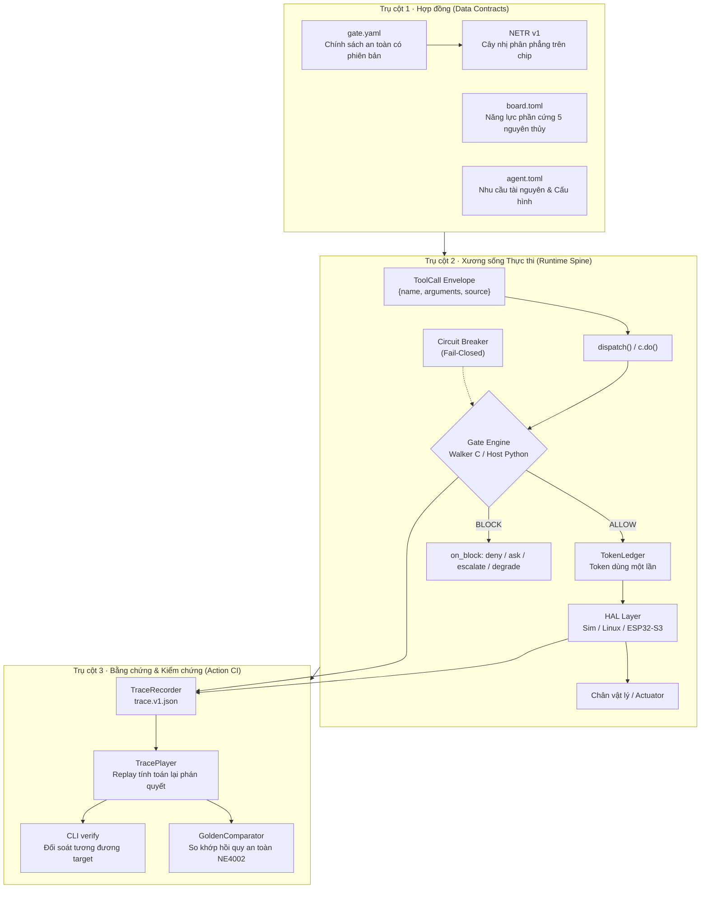

# 00 · Tổng quan kiến trúc (Architecture Overview)

> **Trạng thái:** `done` cho I0–I4 (đã có mã nguồn và test xanh ở `main`); `planned` cho I5–I18 (quy hoạch trong PRD, Roadmap, RFC và các bản thiết kế). Ngày phát hành, mốc lịch và tag phiên bản chỉ được quản lý tại [`neuroedge-roadmap.md` §0.2](../../neuroedge-roadmap.md#02-bảng-tổng-quan-tiến-độ-các-sprint-sprint-matrix-overview).

---

## 1. Tuyên ngôn & Sứ mệnh (Core Premise)

> **NeuroEdge — Hợp đồng vào Physical AI. Không hợp đồng, không hành động.**  
> *"Physical AI, under contract — no contract, no action."*

Khi một chatbot phần mềm trả lời sai, người dùng có thể bấm *Regenerate*. Nhưng khi một Physical AI Agent ra quyết định sai, rơ-le đã kích, động cơ đã quay, chốt cửa đã mở — đó là các tác động vật lý bất khả nghịch. 

NeuroEdge đặt một **Gate** (chính sách an toàn chuẩn kiểu, có phiên bản rõ ràng, kế thừa đơn điệu và hoàn toàn tất định) làm **lớp bảo vệ gần nhất đứng ngay trên 5 nguyên thủy phần cứng HAL** (`Q-30`, PRD §1.2). Mọi nguồn đề xuất hành động — từ câu lệnh nhận diện ngữ pháp cục bộ, suy luận của LLM qua Cloud, hay các tác tử bên ngoài qua giao thức MCP — đều chỉ là các `ToolCall` đề xuất. Gate đưa ra phán quyết độc lập, cưỡng chế mặc định an toàn (*fail-closed*), phát hành token dùng một lần và ghi vết toàn bộ phiên chạy vào nhật ký đối soát kiểm toán (`trace.v1.json`).

*Hình E-08 — Lộ trình tiến hóa 19 increment (I0–I18). Nét liền: done · Nét đứt: planned.*

---

## 2. Năm Nguyên tắc Bất biến (P-1..P-5, PRD §1.5)

Toàn bộ các quyết định kỹ thuật và thiết kế thành phần trong tài liệu này đều phụng sự và chịu sự ràng buộc tuyệt đối của 5 nguyên tắc bất biến:

| Mã | Nguyên tắc cốt lõi | Hệ quả kiến trúc & Ràng buộc kỹ thuật |
|:---:|:---|:---|
| **P-1** | **Hành động vật lý là hợp đồng chuẩn kiểu** | Mọi lệnh ra chân phần cứng bắt buộc phải có chữ ký/token của Gate hợp lệ (`c.do()`). Lời gọi trực tiếp bị cấm ở tầng biên dịch. Mọi nguồn gọi (`local_grammar`, `system_two`, `mcp`) đều được chuẩn hóa thành `ToolCall` đi qua cùng một Gate (`Q-24`). |
| **P-2** | **Các môi trường thực thi ngang hàng (Target Equivalence)** | Cấm rẽ nhánh logic nghiệp vụ theo môi trường trong mã nguồn agent. Cùng một Gate và kịch bản phải chạy với phán quyết như nhau trên `sim`, `linux` và `esp32s3` (`FR-TGT-04`). Mức độ cam kết kiểm thử được phân theo 3 bậc target (`Q-13`, `FR-TGT-08`). |
| **P-3** | **Giá trị ở quản trị đội thiết bị (Fleet OS) & License thương mại** | Lõi framework mở theo giấy phép mã nguồn công khai, lược đồ mở theo chuẩn mở. NeuroEdge không kiếm tiền bằng cách bán lại token suy luận AI (inference). Doanh thu đến từ nền tảng quản trị đội thiết bị Fleet OS và license thương mại cho doanh nghiệp (`Q-45`). |
| **P-4** | **Mô hình AI thay thế được, Cloud-First** | Toàn bộ truy cập mô hình ngôn ngữ và nhận thức đi qua tầng trừu tượng `SystemOne` và `SystemTwo` (chuẩn OpenAI API qua LiteLLM SDK + adapter, `Q-10`, `Q-12`). Phần nặng (LLM, STT, TTS) đặt ở Cloud; vi điều khiển chỉ đảm nhiệm thu/phát âm thanh, FSM và thẩm định Gate. |
| **P-5** | **Hiệu ứng mạng từ cộng đồng chia sẻ Gate an toàn** | Gate là tài nguyên dữ liệu có phiên bản, kiểm tra tĩnh được. Quy tắc kế thừa chỉ cho phép siết chặt, cấm nới lỏng. Kho chia sẻ Gate Registry cho phép tái sử dụng các chính sách an toàn đã được kiểm chứng mà không chia sẻ mã nghiệp vụ độc quyền. |

---

## 3. Ba Trụ cột Kiến trúc (The Three Architectural Pillars)

Kiến trúc NeuroEdge vận hành dựa trên sự kết hợp chặt chẽ của ba trụ cột:

1. **Hợp đồng là Dữ liệu (Contracts as Data):** Không có logic an toàn nào bị mã hóa cứng (hardcoded) trong mã nguồn ứng dụng. Chính sách an toàn được định nghĩa bằng YAML độc lập, bo mạch được đặc tả bằng TOML năng lực, và khi biên dịch xuống firmware nhúng, Gate trở thành cấu trúc nhị phân phẳng `NETR v1` (`Q-9`, `Q-23`, RFC-0003) mà vi điều khiển chỉ việc duyệt tuần tự trong Flash.
2. **Xương sống Thực thi Đơn nhất (Single Execution Spine):** Không tồn tại bất kỳ con đường nào kích hoạt cơ cấu chấp hành mà bỏ qua Gate. Đường đi duy nhất là: `ToolCall → dispatch() → c.do() → Gate.evaluate() → TokenLedger.issue() → HAL.authorize() → Pin Actuator`.
3. **Mọi Hành vi Đều Để lại Vết ghi Đối soát (Evidence by Design):** Toàn bộ dữ kiện đầu vào, phán quyết trung gian, token phát hành và tín hiệu ra chân GPIO được chuẩn tắc hóa theo chuẩn RFC 8785 (JCS) thành tệp vết ghi JSON v1. Vết ghi này có thể phát lại tất định trên bất kỳ môi trường nào để chứng minh không có hồi quy an toàn.

---

## 4. Bản đồ Đọc theo Đối tượng (Reading Guide)

Hệ thống tài liệu kiến trúc được phân tách thành các mức độ chi tiết theo chuẩn mô hình C4 (Context $\rightarrow$ Container $\rightarrow$ Component $\rightarrow$ Code), phục vụ 4 nhóm đối tượng chính:

| Nhóm đối tượng độc giả | Mục tiêu tiếp cận | Lộ trình đọc khuyến nghị |
|:---|:---|:---|
| **Lập trình viên mới (Day 1)** | Chạy được hệ thống trên máy cá nhân trong $< 10$ phút mà không cần phần cứng thật | [`12-dev-quickstart.md`](12-dev-quickstart.md) $\rightarrow$ [`00-overview.md`](00-overview.md) $\rightarrow$ [`01-context-c4l1.md`](01-context-c4l1.md) |
| **Kỹ sư Lõi & Kỹ sư Nhúng** | Hiểu sâu cấu trúc 8 layer host, kiến trúc firmware FreeRTOS, memory map và tương tác runtime | [`02-container-c4l2.md`](02-container-c4l2.md) $\rightarrow$ [`03-component-host-c4l3.md`](03-component-host-c4l3.md) $\rightarrow$ [`04-component-device-c4l3.md`](04-component-device-c4l3.md) $\rightarrow$ [`05-code-gate-hal-c4l4.md`](05-code-gate-hal-c4l4.md) $\rightarrow$ [`06-runtime-flows.md`](06-runtime-flows.md) |
| **Đối tác OEM Port HAL** | Đưa NeuroEdge lên dòng chip/bo mạch vi điều khiển mới (STM32, RP2350, NXP) | [`11-hal-port-guide.md`](11-hal-port-guide.md) $\rightarrow$ [`10-target-equivalence.md`](10-target-equivalence.md) $\rightarrow$ [`07-data-contracts.md`](07-data-contracts.md) |
| **Kỹ sư An toàn & QA Lead** | Thẩm định các chiến thuật đáp ứng NFR, ranh giới tin cậy và chỉ mục quyết định ADR | [`08-nfr.md`](08-nfr.md) $\rightarrow$ [`09-adr.md`](09-adr.md) $\rightarrow$ [`06-runtime-flows.md`](06-runtime-flows.md) |

---

## 5. Tổng quan 19 Chặng Tiến hóa (Scope I0–I18)

Kiến trúc NeuroEdge được xây dựng để tiến hóa có kiểm soát qua 19 nấc gia số (increments), bảo đảm không phải thiết kế lại nền tảng khi mở rộng:

| Nhóm chặng | Increments | Trạng thái | Năng lực cốt lõi | Tài liệu chi tiết |
|:---|:---:|:---:|:---|:---|
| **Khối 1a — Lõi logic & Action CI** | **I0 – I2** | `done` | Schemas v1, Gate Resolver (5 nguyên tắc), Hal `sim` + `linux`, Action CI (record/replay/golden), System 2 qua LiteLLM, Gated Tool Profile MCP. | [`03`](03-component-host-c4l3.md), [`05`](05-code-gate-hal-c4l4.md), [`06`](06-runtime-flows.md), [`10`](10-target-equivalence.md) |
| **Khối 1b — Vi điều khiển biên** | **I3 – I5** | `in-progress` | Walker C99 & Sổ token trên QEMU (`done`); Vết ghi UART (`TSK-S4-09`); FSM thoại C/C++ & Audio streaming trên Box-3 (`TSK-S5-01..07`). | [`04`](04-component-device-c4l3.md), [`10`](10-target-equivalence.md), [`13`](13-evolution-i0-i18.md) |
| **Công khai & v1.0** | **I6 – I7** | `planned` | Schemas công khai, PyPI release v0.1.0, OTA A/B cấp thiết bị có ký số & rollback, nghiệm thu toàn bộ tiêu chí A1–A9. | [`13-evolution-i0-i18.md`](13-evolution-i0-i18.md) |
| **Developer Beta** | **I8** | `planned` | Đóng băng nhánh `1.0.x`, hỗ trợ 50–100 lập trình viên, đo lường các chỉ số B1–B5. | [`13-evolution-i0-i18.md`](13-evolution-i0-i18.md) |
| **Khối 2 & 3 — Tầng Dịch vụ** | **I9 – I10** | `planned` | **Fleet OS** (Canary OTA điều phối, EMQX Broker mTLS, Trace vault) & **Gate Registry** (CNCF ORAS/OCI, OpenMeter billing). | [`02`](02-container-c4l2.md), [`13`](13-evolution-i0-i18.md) |
| **Mở rộng Target & NeuroBrain** | **I11 – I13** | `planned` | Mở enum target (RFC-0002 PR2), **NeuroBrain** (Chat Contracting & Lab bring-up có gate), Bộ công cụ port cộng đồng bậc 3. | [`11`](11-hal-port-guide.md), [`13`](13-evolution-i0-i18.md) |
| **Robot Phân tầng & Thị giác** | **I14 – I18** | `planned` | Kiến trúc Robot phân tán (Não Linux + Node MCU qua Zenoh-pico, token lease `motion.*`), Thị giác `vision.in`, Jetson Orin Nano, Hệ sinh thái OEM. | [`13-evolution-i0-i18.md`](13-evolution-i0-i18.md) |
