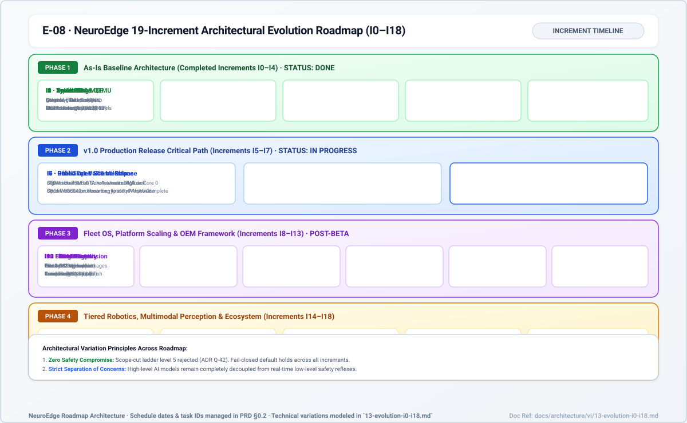
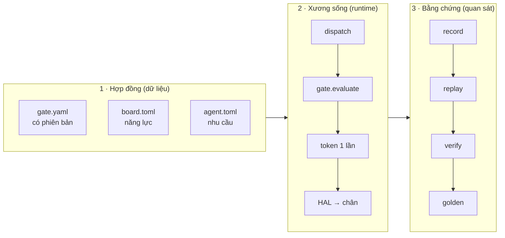

# 00 · Tổng quan kiến trúc

> Trạng thái: `done` cho I0–I4 (đã có mã ở `main`); `planned` cho I5–I18
> (mới ở PRD/roadmap/draft/RFC). Ngày và tag chỉ ở roadmap §0.2.

## 1. Tuyên ngôn (một câu)

**NeuroEdge — Hợp đồng vào Physical AI. Không hợp đồng, không hành động.**
Mọi tác động vật lý (chốt cửa, rơ-le, đèn, motor) muốn ra thế giới thực đều
phải qua một **hợp đồng an toàn có kiểu, có phiên bản** — lớp bảo vệ gần nhất
đứng ngay trên 5 nguyên thủy HAL (`Q-30`, PRD §1.2).

*Hình E-08 — lộ trình increment. Nét liền: done · nét đứt: planned.*

## 2. Năm nguyên tắc bất biến (P-1..P-5, PRD §1.5)

| # | Nguyên tắc | Hệ quả kiến trúc |
|:---:|:---|:---|
| P-1 | Hành động vật lý là hợp đồng chuẩn kiểu | HAL từ chối mọi lệnh thiếu chữ ký gate đã pass; mọi nguồn (ngữ pháp, S1/S2, MCP) là một ToolCall qua cùng gate (`Q-24`) |
| P-2 | Các môi trường thực thi ngang hàng | Cấm rẽ nhánh theo target trong mã agent; cam kết kiểm chứng phân theo bậc target (`Q-13`, `FR-TGT-08`) |
| P-3 | Giá trị ở quản trị fleet + license | Lõi source-available, chuẩn mở; Fleet OS là dịch vụ thương mại duy nhất (`Q-45`) |
| P-4 | Mô hình thay thế được, cloud-first | Mọi truy cập model qua `SystemOne`/`SystemTwo`; chuẩn OpenAI API + adapter (`Q-10`, `Q-12`); STT/TTS ở provider |
| P-5 | Hiệu ứng mạng từ chia sẻ gate | Gate là dữ liệu có phiên bản, kế thừa chỉ siết chặt; adapter/HAL port có cổng kiểm soát riêng |

## 3. Ba trụ kiến trúc

1. **Hợp đồng là dữ liệu**, không phải mã: gate YAML, board/agent TOML, cây
   nhị phân NETR trên thiết bị (`Q-9`, `Q-23`, RFC-0003).
2. **Xương sống duy nhất** tới chân: `ToolCall → dispatch → c.do → gate →
   token → HAL` (chi tiết: `05-code-gate-hal-c4l4.md`).
3. **Mọi phiên để lại vết ghi** replay được trên mọi target (chi tiết:
   `06-runtime-flows.md`, `07-data-contracts.md`).

## 4. Phạm vi I0–I18 (bản đồ đọc)

| Increment | Năng lực | Đọc chi tiết |
|:---|:---|:---|
| I0–I2 (done) | Lõi hợp đồng, `sim`+`linux`, Action CI, walker C trên QEMU | `03`, `05`, `06`, `10` |
| I3–I5 (phần không cần bo mạch done) | Gate + thoại trên Box-3 thật | `04`, `10` |
| I6–I7 (planned) | Công khai, OTA A/B có ký, ổn định 24h | `13-evolution-i0-i18.md` |
| I8 (planned) | Developer Beta, đóng băng dòng `1.0.x` | `13` |
| I9–I10 (planned) | Fleet OS, Registry | `02`, `13` |
| I11–I13 (planned) | Mở target, NeuroBrain, bộ port cộng đồng | `11`, `13` |
| I14–I18 (planned) | Robot phân tầng, thị giác, hệ sinh thái | `13` |

Mục tiêu M1..M5, persona U1..U6, hành trình 1..3: PRD §1–§2 (tài liệu này
không chép lại).
