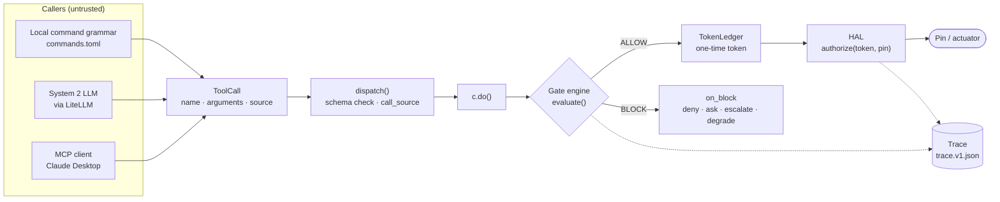

# 00 · Tổng quan kiến trúc

> **Phạm vi:** toàn hệ thống, ở mức cao nhất. **Nguồn sự thật:** mã trong `main`; yêu cầu ở
> [`neuroedge-prd.md`](../../../roadmap/neuroedge-prd.md); tiến độ ở
> [`neuroedge-roadmap.md`](../../../roadmap/neuroedge-roadmap.md) §0. Quy ước nhãn `done` / `partial` /
> `planned`: [`README.md`](../README.md).

**Đọc chương này để làm gì:** Chương này dành cho mọi kỹ sư, kiến trúc sư và đối tác cần cái nhìn bao quát toàn bộ kiến trúc NeuroEdge. Tài liệu trả lời các câu hỏi nền tảng: *NeuroEdge giải bài toán gì trong Physical AI? Cơ chế nào bảo đảm hành động vật lý không bao giờ vượt qua gate an toàn? Hệ thống phân tầng và tương đương target ra sao giữa máy phát triển (host) và chip biên ($5)?* Trước khi đọc, người đọc chỉ cần hiểu cơ bản về agent AI và điều khiển nhúng. Sau chương này, lập trình viên ứng dụng nên đọc [`01`](01-context-c4l1.md) và [`12`](12-dev-quickstart.md); kỹ sư hệ thống đọc tiếp [`02`](02-container-c4l2.md) và [`03`](03-component-host-c4l3.md); kiến trúc sư đọc [`15`](15-target-architecture.md).

## 1. NeuroEdge giải bài toán gì

Một chatbot trả lời sai thì người dùng bấm "tạo lại". Một agent điều khiển thiết bị vật lý mà sai
thì chốt cửa đã mở, quạt đã tắt, rơ-le đã đóng — không có nút "tạo lại". Mô hình AI sinh ra đề
xuất; nó không thể là nơi quyết định một hành động vật lý có được làm hay không.

NeuroEdge tách hai việc đó ra. Mọi đề xuất hành động — từ ngữ pháp lệnh cục bộ, từ một LLM, từ
một agent khác qua MCP — đều được chuẩn hoá thành một **tool call có kiểu**, rồi phải qua một
**gate**: chính sách an toàn viết bằng YAML, có phiên bản, kế thừa được, được biên dịch thành cây
quyết định tất định. Gate cho `ALLOW` thì một **token phán quyết dùng một lần** ([one-time token](../../user/thuat-ngu.md)) được cấp, và chỉ
token đó mở được đúng các chân phần cứng của hành động đó. Mọi dữ kiện, phán quyết và lệnh chân
được ghi vào một **vết ghi** ([trace](../../user/thuat-ngu.md)) phát lại được. Cùng một gate chạy trên trình mô phỏng (`sim`), trên
Linux (`linux`) và trên chip ESP32-S3 (`esp32s3`).

### 1.1 Tinh thần sản phẩm — sáu lời hứa

**Không hợp đồng, không hành động.** Mỗi lời hứa dưới đây là một điều người dùng cảm nhận được, và mỗi
lời hứa có một cơ chế kiến trúc giữ nó. Khi một quyết định thiết kế làm yếu một lời hứa, quyết định đó sai
— kể cả khi nó làm sản phẩm nhanh hơn hay dễ demo hơn.

| # | Lời hứa với người dùng | Kiến trúc giữ lời hứa bằng | Người dùng thấy điều đó ở đâu |
|:---:|:---|:---|:---|
| 1 | **Sai ở thế giới thật không bấm lại được, nên mọi lệnh phải được duyệt trước.** Model chỉ đề xuất, không bao giờ quyết | Một đường duy nhất `dispatch()` → gate → token dùng một lần → HAL; không có đường tắt ([`05`](05-code-gate-hal-c4l4.md)) | Mỗi hành động có một phán quyết `ALLOW`/`BLOCK` kèm lý do |
| 2 | **Không chắc thì không làm.** Mất mạng, cảm biến cũ, camera đứng hình, model không trả lời ⇒ chặn | Fail-closed ở mọi hướng (bất biến 2); chỉ lệnh đưa cơ cấu về trạng thái an toàn là luôn được phép (Q-62) | Thiết bị dừng hoặc hỏi lại, không đoán |
| 3 | **Một hợp đồng ở mọi nơi.** Thử trên laptop là đúng như chạy trên chip $5 | Cùng tệp gate, phân giải thuần, hai hiện thực Python và C của cùng đặc tả ([`10`](10-target-equivalence.md)) | `neuroedge verify` cho cùng phán quyết trên `sim`, `linux`, `esp32s3` |
| 4 | **Bằng chứng thay cho lời hứa.** Mọi sự cố tái hiện được trên máy lập trình viên | Mọi dữ kiện, phán quyết, lệnh chân vào vết ghi; replay tính lại không gọi model ([`06`](06-runtime-flows.md) §7) | `neuroedge replay`, `gate explain`, Action CI trong PR |
| 5 | **Người giữ quyền cuối.** Model và agent khác không tự xác nhận thay người; nhưng cũng không ai xác nhận thay một số đo vật lý | `ask` chỉ người trên thiết bị trả lời được (Q-26); bản nháp do client MCP viết qua NeuroEdge Lab phải có người duyệt, không tool nào khoá được (Q-71); tiêu chí số bị cấm trong `confirms` (Q-62) | Câu hỏi xác nhận trên trang `--ui`, bằng giọng nói hay nút bấm |
| 6 | **Cắm vào stack của người khác, không ôm cả stack.** NeuroEdge là lớp hợp đồng, không phải một nền tảng khép kín | MCP là cửa gọi vào; model và giọng nói là provider thay được (P-4); lược đồ, đặc tả, bộ kiểm tuân thủ theo Apache-2.0 (Q-45); MCP qua mạng có xác thực ở mốc ra mắt (Q-58) | Claude, Home Assistant hay agent framework gọi thiết bị qua gate |

Sản phẩm lớn lên qua mười mốc phát hành theo người dùng (roadmap §0.5); kiến trúc của từng mốc và cách
mỗi mốc chứng minh lại sáu lời hứa ở [`13`](13-evolution-i0-i18.md).

## 2. Hệ thống trong một hình

*Hình E-01 — Người dùng, hệ thống bên ngoài, và ranh giới của NeuroEdge. Chi tiết: [`01`](01-context-c4l1.md).*

*Cách đọc hình E-01:* Hình thể hiện bối cảnh toàn hệ thống ở mức cao nhất: tác nhân người dùng và hệ thống bên ngoài nằm ngoài ranh giới; bên trong ranh giới là NeuroEdge (SDK + CLI Python, firmware C99), thiết bị (`sim` · `linux` · `esp32s3`) và tệp dự án. Khối viền nét liền là các thành phần đã có mã; khối viền nét đứt là các thành phần quy hoạch tương lai (`planned`). Điểm cốt lõi cần nhớ: dù bắt nguồn từ lệnh gõ, giọng nói hay kết nối mạng, mọi hành động tác động vật lý đều phải đi qua cùng một ranh giới kiểm soát an toàn của NeuroEdge.

Đường đi duy nhất từ ý định tới chân phần cứng — **xương sống thực thi** — giống nhau ở mọi nguồn
gọi và mọi môi trường:

```mermaid
flowchart LR
    subgraph Sources["Callers (untrusted)"]
        G["Local command grammar<br/>commands.toml"]
        S2["System 2 LLM<br/>via LiteLLM"]
        MCP["MCP client<br/>Claude Desktop"]
    end
    TC["ToolCall<br/>name · arguments · source"]
    D["dispatch()<br/>schema check · call_source"]
    DO["c.do()"]
    GATE{"Gate engine<br/>evaluate()"}
    TOK["TokenLedger<br/>one-time token"]
    HAL["HAL<br/>authorize(token, pin)"]
    PIN(["Pin / actuator"])
    OB["on_block<br/>deny · ask · escalate · degrade"]
    TR[("Trace<br/>trace.v1.json")]

    G --> TC
    S2 --> TC
    MCP --> TC
    TC --> D --> DO --> GATE
    GATE -- ALLOW --> TOK --> HAL --> PIN
    GATE -- BLOCK --> OB
    GATE -.-> TR
    HAL -.-> TR
```

*Cách đọc sơ đồ:* Khối chữ nhật là các thành phần phần mềm; hình thoi là điểm thẩm định gate an toàn; hình elip là chân actuator vật lý. Mũi tên nét liền biểu diễn xương sống thực thi bắt buộc (từ nguồn gọi không tin cậy → `dispatch()` → `c.do()` → gate → token → HAL); mũi tên nét đứt biểu diễn dữ liệu ghi nhật ký ra tệp vết ghi (`trace.v1.json`). Điểm cốt lõi cần nhớ: không có bất kỳ đường tắt nào tới chân phần cứng mà không sở hữu token phán quyết dùng một lần được cấp từ gate.

- **Không có đường tắt.** Gọi thẳng hàm `@action`, gọi `digital.out()` ngoài `c.do()`, đưa một
  chuỗi hay token tự chế cho HAL, dùng lại token, dùng token hết hạn — đều bị từ chối và ghi vết
  (`docs/spec/threat_model.md` §2).
- **Không chắc thì chặn.** Không thẩm định kịp, mất mạng mà không có fallback, dữ kiện thiếu hay
  sai kiểu ⇒ `BLOCK`, không bao giờ `ALLOW` (bất biến 2, `CHANGELOG.md` §3.3).
- **Bằng chứng tự sinh.** Vết ghi chứa đủ dữ kiện để tính lại mọi phán quyết mà không gọi model
  và không động vào máy (chi tiết: [`06`](06-runtime-flows.md) §7).

## 3. Năm nguyên tắc và nơi kiến trúc cưỡng chế chúng

Nội dung nguyên tắc ở PRD §1.5; bảng này chỉ ra **cơ chế kiến trúc** giữ từng nguyên tắc.

| Nguyên tắc (PRD §1.5) | Cơ chế kiến trúc cưỡng chế | Ở đâu |
|:---|:---|:---|
| **P-1** Hành động vật lý là hợp đồng chuẩn kiểu | Một đường duy nhất `dispatch()` → `c.do()` → gate → token → HAL; HAL không có sổ token thì từ chối mọi lệnh | [`05`](05-code-gate-hal-c4l4.md) · `actions/`, `hal/` |
| **P-2** Các môi trường thực thi ngang hàng | Cùng tệp gate, cùng ngữ nghĩa lượng giá trên host (Python) và chip (C); `verify` so quyết định giữa target; cam kết kiểm chứng phân theo bậc target (FR-TGT-08, Q-13) | [`10`](10-target-equivalence.md) |
| **P-3** Giá trị ở quản trị đội thiết bị và license thương mại | Lõi an toàn nằm trọn trong gói `neuroedge`; dịch vụ (Fleet OS) là container riêng, chưa có mã | [`02`](02-container-c4l2.md) §5 |
| **P-4** Mô hình AI thay thế được | Mọi model sau giao thức `FactSource` / provider; STT/TTS cũng là provider thay thế được qua cấu hình; chip chỉ thu/phát âm thanh và lượng giá gate (PRD §1.5 P-4); không SDK nào được import ở lõi | [`03`](03-component-host-c4l3.md) §3.4 |
| **P-5** Hiệu ứng mạng từ chia sẻ chính sách | Gate là dữ liệu có phiên bản, định danh `neuroedge://`, băm JCS SHA-256, kế thừa chỉ siết chặt | [`07`](07-data-contracts.md) §2 |

## 4. Đặc tính kiến trúc, theo thứ tự ưu tiên

Khi hai đặc tính xung đột, đặc tính đứng trên thắng. Mỗi dòng là một quyết định thiết kế đã có mã.

| # | Đặc tính | Nghĩa là | Chiến thuật chính | Chương |
|:---:|:---|:---|:---|:---|
| 1 | **An toàn theo mặc định** | Mọi lỗi đều dẫn tới chặn | `budget.fail` mặc định `closed`; `fail: open` không kế thừa; sổ token đầy thì từ chối, không đẩy token cũ ra | [`05`](05-code-gate-hal-c4l4.md), [`08`](08-nfr.md) |
| 2 | **Tất định và phát lại được** | Cùng dữ kiện ⇒ cùng phán quyết, ở mọi nơi | Phân giải gate là hàm thuần; cây quyết định không đọc đồng hồ; replay tính lại từ dữ kiện đã ghi | [`05`](05-code-gate-hal-c4l4.md), [`06`](06-runtime-flows.md) |
| 3 | **Tương đương giữa môi trường** | Agent không rẽ nhánh theo target | Hai hiện thực (Python, C) của cùng một đặc tả, chứng minh bằng bảng sự thật và vector chung | [`10`](10-target-equivalence.md) |
| 4 | **Có thể kiểm toán** | Người duyệt hiểu được mà không đọc mã | Gate là YAML đọc được; `gate explain`; vết ghi theo lược đồ đóng băng; lỗi luôn có ba phần | [`07`](07-data-contracts.md) |
| 5 | **Thay được model** | Đổi nhà cung cấp bằng cấu hình | Chuẩn OpenAI-compatible, adapter `python:`; model chỉ trả dữ kiện, không bao giờ trả `ALLOW` | [`03`](03-component-host-c4l3.md) |
| 6 | **Chạy được khi mất mạng** | Chức năng an toàn không cần Internet | Ngữ pháp lệnh cục bộ là fallback của mọi model; lõi chỉ dùng thư viện chuẩn cho HTTP | [`06`](06-runtime-flows.md) §5 |
| 7 | **Vừa chip nhỏ** | Gate chạy trên ESP32-S3 | Không JSON, không CEL trên chip; cây nhị phân `NETR` đọc tại chỗ trong flash; walker không cấp phát, stack ≤ 512 B | [`04`](04-component-device-c4l3.md) |

## 5. Hình dạng hệ thống

NeuroEdge có ba phần, cộng với chuỗi CI giữ chúng khớp nhau:

| Phần | Là gì | Ngôn ngữ | Trạng thái |
|:---|:---|:---|:---|
| **Gói `neuroedge`** (host) | SDK, CLI, engine gate, HAL `sim`/`linux`, model, thoại (từ tệp WAV `done`, phiên thoại thời gian thực `partial` — [`neuroedge-roadmap.md`](../../../roadmap/neuroedge-roadmap.md) I4), MCP, Action CI | Python 3.11+ | `done` (thoại thời gian thực `partial` — roadmap I4) |
| **Firmware `esp32s3`** | Walker `NETR`, sổ token, vết ghi UART, component sinh cho agent, OTA có ký | C99 trên ESP-IDF v5.4 | `partial` — chạy trên QEMU; chưa điều khiển chân |
| **Hợp đồng dữ liệu** | `gate.v1`, `trace.v1`, `board.v1`, `agent.toml`, `NETR` v1, dòng UART | JSON Schema, TOML, nhị phân | `done`, đóng băng qua RFC |
| **CI** | Test Python, gpio-sim, QEMU, ảnh golden, OTA, bảo mật | GitHub Actions | `done` |

Hai phần không có mã hôm nay và chỉ xuất hiện ở trạng thái `planned`: **Fleet OS** (I9) và **Gate
Registry** (I10). Mọi thứ quy hoạch khác (bốn gói nguyên thủy mở rộng, NeuroEdge Lab qua MCP, robot nhiều node, thị giác trên Jetson) ở
[`13`](13-evolution-i0-i18.md).

### 5.1 Mô hình logic năm lớp

Mô hình logic 5 tầng của NeuroEdge ([`neuroedge-proposal.md`](../../../roadmap/neuroedge-proposal.md) §3.1) được vắt ngang bởi trục kiểm thử Action CI:

| Tầng / Trục | Bản chất tầng (proposal §3.1) | Gói host (`03` §2) và component firmware (`04`) hiện thực | Trạng thái |
|:---|:---|:---|:---|
| **L4: Tầng ứng dụng Agent** | Logic agent, bộ nhớ ngữ cảnh, tool call có gate (MCP), System 2 | `mcp_host`, `mcp_server`, System 2 trong `models/` | `done` |
| **L3: Động cơ hợp đồng hành động** (IP cốt lõi) | Thẩm định gate chuẩn kiểu, kế thừa chính sách, mạch ngắt fail-closed | `engine/`, `actions/` (sổ token dùng một lần), `ne_gate` (`ne_walker.c`, `ne_token.c`), `ne_agent` | `done` (host và QEMU) |
| **L2: Nhận thức & runtime hội thoại** | Nhận diện wake-word, neural VAD, khử vang AEC, STT/TTS độ trễ thấp, máy trạng thái hội thoại thời gian thực (Q-48) | `perception/` (máy trạng thái, wake, STT/TTS), `hal/audio.py` (`EnergyVAD`), `models/` (System 1/2, ngữ pháp, tri thức) | `partial` — thoại từ tệp WAV và STT/TTS cloud `done`; phiên thời gian thực, AEC (Q-22), mô hình wake-word thật còn lại (roadmap I4) |
| **L1: Lớp trừu tượng phần cứng (HAL)** | 5 nguyên thủy cơ bản v1.x (`audio.in`, `audio.out`, `digital.out`, `sensor.read`, `display`), đối chiếu hợp đồng năng lực lúc biên dịch | `hal/` (đối chiếu bo mạch, API); firmware HAL trên chip | `done` (`hal/` trên host); `planned` trên chip (TSK-S4-01) |
| **L0: Các môi trường thực thi ngang hàng** | Triển khai cụ thể cho từng target (`sim`, `linux`, `esp32s3`) | `hal/sim.py` (`SimHAL`), `hal/linux.py` (`LinuxHAL`), firmware cho `esp32s3` trong `targets/esp32s3/` (gói `sim/` vừa là target `sim` (L0) vừa là nơi lắp ráp phía host — `03` §2 bậc 7) | `done` (`sim`, `linux` ảo); `partial` (`esp32s3` trên QEMU) |
| **Trục ngang: Action CI** | Ghi nhận sự kiện (JSON) → Replay chuẩn xác → Đối chiếu hành động | `testing/` (`TraceRecorder`, `TracePlayer`, `GoldenComparator`), `trace.py` (`trace.v1`) và `engine/trace_sink.py` (`EventLog`), `cli` (`record`, `replay`, `verify`) | `done` |

Các adapter System 1 ở L2 (`models/`) hiện thực giao thức `FactSource` do L3 quy định (`engine/gate.py`) thay vì L3 phụ thuộc L2 — đó là đảo ngược phụ thuộc (dependency inversion); còn `perception/` thì phụ thuộc `sim` ([`03`](03-component-host-c4l3.md) §2, bậc 8). Do đó đồ thị import giữa các gói không phải là một ngăn xếp từ trên xuống dưới một cách ngây thơ.

### 5.2 Thuật ngữ phân tầng

Để người đọc không nhầm lẫn giữa các cách phân chia tầng/bậc trong tài liệu:

| Khái niệm | Thang đo | Ý nghĩa | Tài liệu quy định |
|:---|:---|:---|:---|
| **Mức kiến trúc C4** | L1…L4 | Bốn cấp độ trực quan hoá kiến trúc: L1 Context (Bối cảnh) · L2 Container · L3 Component (Thành phần) · L4 Code (Mã) | Mô hình C4 (Simon Brown) · [`01`](01-context-c4l1.md)…[`05`](05-code-gate-hal-c4l4.md) |
| **Tầng logic hệ thống** | L0…L4 | Năm tầng chức năng logic của nền tảng: L0 Target · L1 HAL · L2 Perception/Runtime · L3 Action Contract Engine · L4 Agent Application, cùng trục Action CI | [`neuroedge-proposal.md`](../../../roadmap/neuroedge-proposal.md) §3.1 |
| **Bậc phụ thuộc gói** | Bậc 0…10 | Thứ tự import các module Python phía host, ngăn ngừa phụ thuộc vòng lặp (Bậc 0: `errors`, `paths`… Bậc 10: `cli`) | [`03`](03-component-host-c4l3.md) §2 · `python/tests/test_architecture_layers.py` |
| **Bậc cam kết target** | Bậc 1…3 | Mức cam kết kiểm chứng phần cứng của đội lõi: Bậc 1 (chính thức: `sim`, `linux`, `esp32s3`), Bậc 2 (mở rộng: `jetson`), Bậc 3 (cộng đồng: `stm32`, `rp2350`) | PRD FR-TGT-08, Q-13 · proposal §3.2 · [`15`](15-target-architecture.md) §4.1 |
| **Tầng phân tầng robot** | T0…T6 | Bảy tầng kiến trúc robot phân tán: T0 Cơ cấu phần cứng/an toàn cục bộ · T1 Wire Zenoh-pico · T2 Lớp an toàn black channel · T3 Gate từng node · T4 Trace hợp nhất · T5 MCP · T6 ROS 2 bridge | `draft-ke-hoach-mo-rong-robot-fofoca.md` §4 · [`15`](15-target-architecture.md) §4.3 |

## 6. Hiện trạng theo năng lực

Bảng dưới là ảnh chụp hình dạng, không phải bảng tiến độ; tiến độ từng task ở roadmap §4–§8.

| Năng lực | `sim` | `linux` | `esp32s3` |
|:---|:---|:---|:---|
| Gate: phân giải, lượng giá, token | `done` | `done` | `done` trên host và QEMU |
| Điều khiển chân | `done` (ảo) | `done` trên gpio-sim | `planned` (TSK-S4-01) |
| Cảm biến, màn hình | `done` (ảo) | `done` trên `i2c-stub`, `vkms` | `planned`; giao diện LVGL chỉ build trên host |
| Thoại (từ tệp WAV) | `done` | `done` | `planned` (I5) |
| Thoại thời gian thực (micro) | `done` trên laptop (`run --mic`, TSK-I4-04) | `partial` — mới mở thiết bị | `planned` |
| Model cloud (System 1, System 2) | `done` | `done` | không áp dụng: chip chỉ lượng giá gate |
| MCP | `done` | `done` | không áp dụng |
| Vết ghi, replay, verify | `done` | `done` | `done` (UART, QEMU) |
| Cập nhật OTA có ký | không áp dụng | không áp dụng | `partial` — trên QEMU |

## 7. Ranh giới — NeuroEdge không phải là gì

- **Không phải chức năng an toàn được chứng nhận** (không SIL theo IEC 61508, không PL theo ISO
  13849 — Q-38). Gate không thay nút dừng khẩn hay khoá liên động phần cứng.
- **Không chống kẻ tấn công trong cùng tiến trình.** Token là `(nonce, digest)` trong bộ nhớ; mối
  đe doạ trong phạm vi là **bỏ qua gate do nhầm lẫn**, và điều đó được chứng minh bằng test
  (`docs/spec/threat_model.md` §3, `TODOS.md` #2).
- **Không phải dịch vụ đám mây.** Hôm nay NeuroEdge là một thư viện, một CLI và một firmware; không
  có máy chủ nào do NeuroEdge vận hành.
- **Không bán lại token suy luận** ([`neuroedge-proposal.md`](../../../roadmap/neuroedge-proposal.md) §6.4; PRD §1.4 N4). Lớp trừu tượng provider là self-host thuộc lõi; người dùng tự vận hành và trả tiền trực tiếp cho nhà cung cấp mô hình.
- **Không tự làm SLAM hay điều hướng** — chỉ gate lệnh vận tốc qua ROS 2 / Nav2 ([`neuroedge-prd.md`](../../../roadmap/neuroedge-prd.md) §14, Q-34).
- **Không có sàn giao dịch trả phí (paid marketplace)** ([`neuroedge-prd.md`](../../../roadmap/neuroedge-prd.md) §14, PF-3).
- **Không có thanh toán tự động giữa các agent (agent-to-agent payment)** ([`neuroedge-prd.md`](../../../roadmap/neuroedge-prd.md) §14, PF-4).
- **Không tự huấn luyện từ đánh thức (custom wake-word training) trong v1.0** ([`neuroedge-prd.md`](../../../roadmap/neuroedge-prd.md) §3).

Kiến trúc quy hoạch tổng thể (to-be architecture) cho các chặng tiếp theo xem tại [`15-target-architecture.md`](15-target-architecture.md).

## 8. Đọc tiếp

Lộ trình đọc theo vai trò ở [`README.md`](../README.md). Người mới bắt đầu ở
[`12-dev-quickstart.md`](12-dev-quickstart.md).
