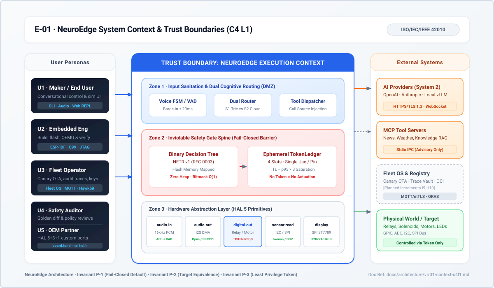
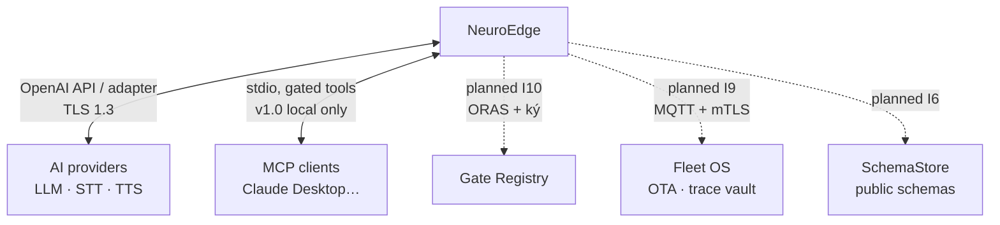

# 01 · Bối cảnh hệ thống (C4 L1)

> Trạng thái: `done` cho lõi + provider + MCP; `planned` cho Fleet OS,
> Registry, SchemaStore công khai (I6–I10).

*Hình E-01 — NeuroEdge ở giữa: người dùng bên trái, hệ ngoài bên phải.
Nét đứt: planned.*

## 1. Actor (persona: PRD §2.1)

| Actor | Dùng gì | Kỳ vọng |
|:---|:---|:---|
| Maker U1 | `new`, `run --target sim`, sim UI | TTFV < 10 phút, không phần cứng, không tài khoản (Hành trình 1) |
| Trưởng nhóm nhúng U2 | `build`, `test`, `verify`, nightly | Đổi prompt/board không hồi quy chốt cửa (J2, J3) |
| Fleet Ops U3 | vết ghi sự cố, OTA canary (planned) | Tái hiện hiện trường bằng một lệnh (Hành trình 2) |
| An toàn/QA U4 | gate YAML, `gate explain`, vết ghi | Duyệt điều kiện không cần đọc Python (J6) |
| OEM U5 | board.toml, HAL port, bộ kiểm tuân thủ | Tích hợp không khóa chip (chi tiết: `11-hal-port-guide.md`) |
| Đội robot U6 (planned) | gate từng node, ROS 2/Nav2 adapter | Mọi lệnh tốc độ qua gate (Q-32..Q-38) |

## 2. Hệ ngoài

- **Provider** (P-4, `Q-10`, `Q-12`): thay thế được, key chỉ qua biến môi
  trường, provider + model ghi vào sự kiện `system_two_call`, không ghi prompt/key.
- **MCP client**: gọi tool thiết bị qua `mcp serve`, **vẫn qua gate**; transport
  mạng cần xác thực là việc hoãn (`TODOS.md` #24, NFR-SEC-09).
- **Registry/Fleet/SchemaStore**: planned — kiến trúc hiện tại giữ chỗ bằng
  `gate publish` digest, `digests.lock`, vết ghi replay được (không thiết kế
  lại khi chúng tới).

## 3. Ranh giới tin cậy (đặc tả: `threat_model.md`)

- Bên gọi **không tin cậy**: LLM, client MCP, nội dung MCP server ngoài
  (`trust: untrusted`, chỉ digest vào vết ghi).
- Kênh xác nhận **tin cậy**: chỉ người qua thiết bị (`local_grammar`, `ui`).
- Mất mạng: gate vẫn lượng giá bằng ngữ pháp lệnh cục bộ; chỉ `BLOCK`
  `gate_unreachable` khi fallback không chạy (`Q-14`).
