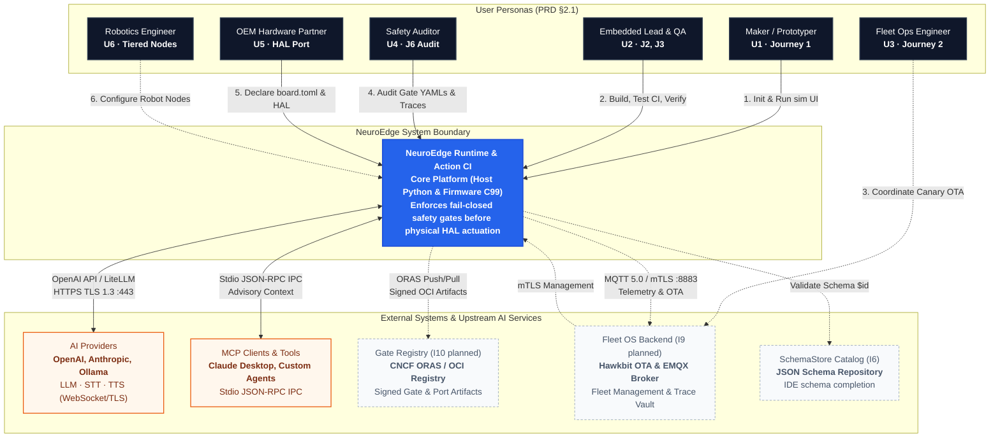

# 01 · Bối cảnh hệ thống (C4 L1 — System Context)

> **Trạng thái:** `done` cho các liên kết Lõi, AI Provider qua OpenAI API, và MCP Stdio; `planned` cho các liên kết Fleet OS, Gate Registry công khai và SchemaStore (I6–I10). Xem [`00-overview.md`](00-overview.md) để tra cứu vị trí trong toàn bộ hệ thống tài liệu.

---

## 1. Sơ đồ Bối cảnh Hệ thống (C4 L1 System Context Diagram)

Sơ đồ C4 Level 1 mô tả vị trí trung tâm của NeuroEdge trong hệ sinh thái Physical AI, kết nối giữa người dùng, môi trường thực thi phần cứng và các dịch vụ đám mây ngoại vi:


*Hình E-01 — Bối cảnh toàn cảnh NeuroEdge: Tác nhân bên trái, hệ thống ngoài bên phải. Nét liền: done · Nét đứt: planned.*



---

## 2. Danh mục Tác nhân Người dùng (Actors & Personas)

Các tác nhân tương tác với hệ thống tương ứng với các Persona và Hành trình người dùng đã được chuẩn hóa trong PRD §2:

| Tác nhân | Vai trò trong hệ thống | Công cụ & Giao diện sử dụng | Kỳ vọng cốt lõi |
|:---|:---|:---|:---|
| **Maker / Dev sáng chế (U1)** | Lập trình viên cá nhân, phát triển ứng dụng Physical AI từ con số 0 | `neuroedge new`, `neuroedge run --ui`, Web UI cục bộ 127.0.0.1 | **TTFV < 10 phút** trên laptop sạch; không cần mua phần cứng, không cần khoá API cloud (Hành trình 1). |
| **Trưởng nhóm Nhúng (U2)** | Chịu trách nhiệm về độ tin cậy và an toàn khi nạp mã lên phần cứng | `neuroedge build`, `neuroedge test`, `verify`, Nightly CI runner | Khi đổi prompt hoặc đổi chip, **không bao giờ hồi quy an toàn** (chốt cửa không mở nhầm, rơ-le không kích sai) (J2, J3). |
| **Người vận hành Fleet (U3)** | Vận hành hàng nghìn thiết bị ngoài hiện trường (khách sạn, tòa nhà, nhà máy) | Giao diện Fleet OS (planned I9), tệp vết ghi sự cố từ xa | **Tái hiện nguyên trạng sự cố hiện trường trong 30 giây** bằng lệnh `replay` trên máy tính; cập nhật OTA Canary an toàn, không brick máy (Hành trình 2). |
| **Chuyên viên An toàn (U4)** | Phê duyệt chính sách vận hành và giải trình pháp lý / bảo hiểm | File Gate YAML, lệnh `neuroedge gate explain`, tệp `trace.v1.json` | Đọc hiểu và phê duyệt điều kiện an toàn **mà không cần đọc code Python/C**; có bằng chứng đối soát kiểm toán không thể chối bỏ (J6). |
| **Đối tác OEM (U5)** | Nhà sản xuất phần cứng đưa NeuroEdge lên bo mạch mới | `board.toml`, C HAL stubs, Bộ kiểm thử tuân thủ (Compliance suite) | Tích hợp nhanh, **không bị trói buộc độc quyền vào một dòng chip**; giữ quyền sở hữu HAL driver (chi tiết: [`11-hal-port-guide.md`](11-hal-port-guide.md)). |
| **Kỹ sư Robot (U6)** | Thiết kế hệ thống tự hành và cánh tay robot phân tán (planned I14) | Zenoh-pico, adapter ROS 2 / Nav2, Gate từng node chấp hành | Mọi lệnh điều khiển vận tốc (`cmd_vel`) đều phải qua Gate an toàn; có cơ chế ngắt cứng tức thời (Q-32..Q-38). |

---

## 3. Hệ thống Ngoại vi & Giao thức Kết nối (External Systems)

### 3.1 AI Providers (LLM, STT, TTS)
* **Vai trò:** Cung cấp năng lực hiểu ngôn ngữ tự nhiên, chuyển giọng nói thành văn bản (STT), suy luận giải quyết vấn đề (System 2 LLM), và tổng hợp tiếng nói (TTS).
* **Giao thức & Ràng buộc:**
  * Kết nối chuẩn hóa qua giao thức **OpenAI API** hoặc **Custom Adapter** (`Q-10`, `Q-12`, PRD §4.3).
  * Bảo mật bắt buộc: **TLS 1.3 HTTPS** (`NFR-SEC-08`). API key chỉ được truyền qua biến môi trường của tiến trình, tuyệt đối không lưu cứng trong `agent.toml` hay tệp vết ghi.
  * Trong vết ghi: Chỉ ghi nhận tên provider, tên model, số token và độ trễ vào sự kiện `system_two_call`; nội dung prompt thô được ẩn danh hóa nếu bật `--anonymize`.

### 3.2 MCP Clients (Model Context Protocol)
* **Vai trò:** Cho phép các ứng dụng giao diện AI hiện đại (như Claude Desktop, Cursor, hay các tác tử phần mềm tự hành) khám phá và điều khiển thiết bị phần cứng.
* **Giao thức & Ràng buộc:**
  * Phiên bản v1.0 chỉ hỗ trợ kênh truyền **stdio** nội bộ trên cùng máy tính (`NFR-SEC-09`).
  * Mọi `@action` được chiếu xạ thành một Tool MCP kèm `inputSchema` và `outputSchema`.
  * **Ràng buộc an toàn:** Lời gọi từ MCP Client được gán nhãn `call_source = "mcp"` (nguồn không tin cậy) và bắt buộc phải qua Gate thẩm định trước khi tới HAL (`Q-24`, `Q-27`). Transport mạng (HTTP/mTLS) hoãn tới Khối 2 (`TODOS.md` #24).

### 3.3 Gate Registry (Planned I10)
* **Vai trò:** Kho lưu trữ, quản lý phiên bản và phân phối các gói Gate an toàn, Adapter, và HAL port đã được kiểm chứng.
* **Giao thức:** Chuẩn OCI Artifacts sử dụng công cụ **CNCF ORAS / Harbor**. Mỗi artifact tải lên đều được ký số mật mã (Cosign / Sigstore).
* **Tính sẵn sàng hôm nay:** Lõi v1.0 đã sẵn sàng cho Registry nhờ lệnh `neuroedge gate publish` xuất mã băm chuẩn tắc JCS SHA-256 và cơ chế khóa phiên bản `digests.lock`.

### 3.4 Fleet OS Backend (Planned I9)
* **Vai trò:** Nền tảng SaaS quản trị vòng đời thiết bị: điều phối cập nhật firmware Canary A/B qua Eclipse Hawkbit, broker truyền nhận sự kiện viễn trắc qua EMQX, và lưu trữ tập trung các vết ghi sự cố (Trace Vault).
* **Giao thức:** Thiết bị kết nối qua giao thức **MQTT 5.0 bọc trong mTLS** với chứng chỉ X.509 riêng cho từng thiết bị (`NFR-SEC-04`).

---

## 4. Mô hình Ranh giới Tin cậy (Trust Boundaries & Threat Model)

Dựa trên tài liệu đặc tả mô hình mối đe dọa [`docs/spec/threat_model.md`](file:///Users/minhlt/Downloads/Projects/neuroedge-init/docs/spec/threat_model.md), hệ thống thiết lập ba ranh giới tin cậy nghiêm ngặt:

```mermaid
flowchart LR
    subgraph Untrusted["Vùng KHÔNG Tin cậy (Untrusted Zone)"]
        U_LLM["LLM Cloud<br/>(Ảo giác, Prompt Injection)"]
        U_MCP["MCP Clients / External Servers<br/>(Lệnh độc hại ngoài mạng)"]
        U_ENV["Môi trường mạng không an toàn"]
    end

    subgraph DMZ["Vùng Thẩm định Hợp đồng (Contract DMZ)"]
        DISP["dispatch() & Argument Bounds Check"]
        GATE["Gate Engine (Tất định 100%)"]
        CB["Circuit Breaker (Fail-Closed)"]
        TL["TokenLedger (Token dùng 1 lần)"]
    end

    subgraph Trusted["Vùng TIN CẬY Cục bộ (Trusted Execution Zone)"]
        USER["Người dùng tại thiết bị<br/>(Xác nhận trực tiếp qua UI/Nút bấm)"]
        HAL["HAL Layer (Kiểm tra & Tiêu hủy Token)"]
        GPIO["Actuators / Chốt cửa / Rơ-le"]
    end

    U_LLM -->|Đề xuất ToolCall| DISP
    U_MCP -->|Đề xuất ToolCall| DISP
    DISP --> GATE
    CB -.-> GATE
    GATE -- "BLOCK (Từ chối)" --> LOG["Trace Log / on_block"]
    GATE -- "ALLOW (Hợp lệ)" --> TL
    TL -->|Cấp Token (Digest + Nonce)| HAL
    USER -->|POST /confirm| GATE
    HAL -->|Tiêu hủy Token| GPIO

    style Untrusted fill:#fee,stroke:#c00,stroke-dasharray: 5 5
    style DMZ fill:#fef,stroke:#90c,stroke-width:2px
    style Trusted fill:#efe,stroke:#090,stroke-width:2px
```

1. **Nguyên tắc "Mọi Bên gọi đều Không tin cậy" (Zero Trust Callers):**
   * Mô hình AI (kể cả Claude 3.5 hay GPT-4o) và các client MCP bên ngoài đều được coi là nguồn dữ liệu không tin cậy (`trust: untrusted`). Chúng có thể bị tấn công tiêm nhiễm câu lệnh (prompt injection) hoặc sinh ảo giác. Do đó, output của LLM **chỉ là đề xuất**, không bao giờ là lệnh trực tiếp ra phần cứng.
2. **Kênh Xác nhận Tin cậy Duy nhất (The Only Trusted Human Confirmation):**
   * Đối với các hành động bị Gate chặn ở chế độ `on_block: ask`, việc mở khóa **chỉ được phép thực hiện bởi người dùng đứng trực tiếp tại thiết bị** thông qua REPL terminal (`:confirm`) hoặc qua trang Web UI cùng nguồn gốc (`POST /confirm` same-origin) (`Q-26`, RFC-0006). Không cho phép LLM hoặc client MCP tự xác nhận thay con người.
3. **Mặc định An toàn khi Mất mạng (Fail-Closed Offline Guarantee):**
   * Khi mất mạng, Gate không bị vô hiệu hóa. Hệ thống tự động chuyển sang bộ nhận diện lệnh cố định cục bộ (`commands.toml`, `Q-14`). Nếu câu lệnh nằm trong ngữ pháp và dữ kiện cảm biến thỏa mãn $\rightarrow$ Gate vẫn cho phép chạy. Nếu có nghi vấn $\rightarrow$ tự động kích hoạt mạch ngắt fail-closed, chặn mọi tác động vật lý với lý do `gate_unreachable`.
