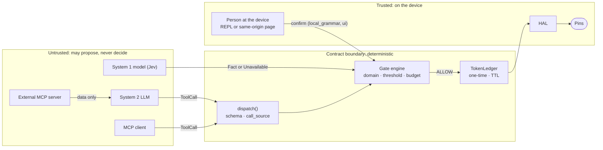

# 01 · Bối cảnh hệ thống (C4 L1)

> **Phạm vi:** NeuroEdge nhìn từ bên ngoài — ai dùng nó, nó nói chuyện với hệ thống nào, và ranh
> giới tin cậy nằm ở đâu. **Nguồn:** `python/neuroedge/models/providers/`,
> `python/neuroedge/perception/providers/`, `python/neuroedge/mcp_server.py`, PRD §2,
> `docs/spec/threat_model.md`.

## 1. Sơ đồ bối cảnh

*Hình E-01 — Người dùng bên trái, hệ thống bên ngoài bên phải. Nét đứt là `planned`.*

## 2. Người dùng

| Người dùng | Làm gì với NeuroEdge | Công cụ chính | Trạng thái |
|:---|:---|:---|:---|
| **Maker, lập trình viên ứng dụng** | Viết agent (`agent.toml`, gate, action), chạy và kiểm trên máy mình | `neuroedge new · run · test · record` | `done` |
| **Kỹ sư lõi và kỹ sư nhúng** | Sinh firmware cho agent, nạp lên chip, so phán quyết giữa các môi trường | `build --target esp32s3 · verify · record --port` | `done` (trên QEMU) |
| **Người duyệt an toàn, QA** | Đọc và duyệt gate mà không đọc mã; điều tra một phiên từ vết ghi | `gate explain · trace view · replay` | `done` |
| **Đối tác OEM** | Khai báo một bo mạch mới, port HAL, chứng minh tương đương | `board.toml`, vector tuân thủ | `partial` — xem [`11`](11-hal-port-guide.md) |
| **Người vận hành đội thiết bị** | Phát hành bản cập nhật theo đợt, thu vết ghi sự cố từ xa | Fleet OS | `planned` (I9) |

Các nhóm người dùng và hành trình gốc ở PRD §2 (`U1`…`U6`, `J1`…`J7`).

## 3. Hệ thống bên ngoài

Mọi kết nối ra ngoài đều **tuỳ chọn**: bản cài cơ bản chạy toàn bộ `sim` không cần mạng hay khoá
(Q-15). Khoá API không bao giờ nằm trong tệp: chỉ **tên** biến môi trường được ghi (`api_key_env`),
và build từ chối mọi trường trông giống khoá (`models/providers/common.py`).

| Hệ thống | Vai trò | Giao thức và định dạng | Mã đảm nhận | Trạng thái |
|:---|:---|:---|:---|:---|
| **Nhà cung cấp LLM** (System 2) | Trả lời câu tự do, đề xuất tool call | Chat completions chuẩn OpenAI qua thư viện LiteLLM (không chạy proxy — Q-10); hoặc adapter `python:` | `models/providers/litellm_provider.py`, `openai_chat.py` | `done` |
| **Jev trên OpenRouter** (System 1) | Quyết một số tiêu chí gate từ lời người nói | `POST {api_base}/systemone` (System One API), HTTPS bắt buộc trừ loopback | `models/providers/systemone_api.py` | `done` |
| **Nhà cung cấp giọng nói** | STT, TTS | `POST {base_url}/audio/transcriptions` và `/audio/speech` chuẩn OpenAI | `perception/providers/openai_audio.py` | `done` |
| **Máy chủ STT cục bộ** | STT dự phòng khi STT chính hỏng | Như trên, thường `http://localhost` | `[stt.fallback]` | `done` |
| **Client MCP** | Gọi action của agent như công cụ | JSON-RPC qua **stdio** (không qua mạng — NFR-SEC-09) | `mcp_server.py` | `done` |
| **MCP server bên ngoài** | Nguồn thông tin cho System 2 (tin tức, tra cứu) | stdio; chỉ công cụ trong danh sách cho phép | `mcp_host.py` | `done` |
| **ESP-IDF v5.4 và Espressif QEMU** | Biên dịch firmware, chạy chip ảo | Project ESP-IDF sinh bởi `build`; UART đọc qua tệp hoặc `tcp://` | `engine/firmware.py`, `testing/uart.py` | `done` |
| **Máy chủ ảnh OTA** | Phục vụ một ảnh app đã ký | HTTP(S) GET bất kỳ máy chủ tĩnh nào | `components/ne_ota/` | `partial` — trên QEMU |
| **Fleet OS, Gate Registry** | Quản trị đội thiết bị; kho gate chia sẻ | Quy hoạch: MQTT với broker giấy phép dễ dãi (Mosquitto, NanoMQ hoặc VerneMQ — **không** EMQX, Q-11); OCI qua ORAS và Harbor | chưa có mã | `planned` (I9, I10) |

## 4. Ranh giới tin cậy

```mermaid
flowchart LR
    subgraph Untrusted["Untrusted: may propose, never decide"]
        LLM["System 2 LLM"]
        JEV["System 1 model (Jev)"]
        MCPC["MCP client"]
        EXT["External MCP server"]
    end
    subgraph Contract["Contract boundary: deterministic"]
        DISP["dispatch()<br/>schema · call_source"]
        GATE["Gate engine<br/>domain · threshold · budget"]
        LEDGER["TokenLedger<br/>one-time · TTL"]
    end
    subgraph Local["Trusted: on the device"]
        PERSON["Person at the device<br/>REPL or same-origin page"]
        HAL["HAL"]
        PIN(["Pins"])
    end
    LLM -- "ToolCall" --> DISP
    MCPC -- "ToolCall" --> DISP
    EXT -- "data only" --> LLM
    JEV -- "Fact or Unavailable" --> GATE
    DISP --> GATE
    GATE -- "ALLOW" --> LEDGER --> HAL --> PIN
    PERSON -- "confirm (local_grammar, ui)" --> GATE
```

Bốn luật định ranh giới, mỗi luật có test ở `docs/spec/threat_model.md` §2b:

1. **Model và client chỉ đề xuất.** LLM và client MCP chỉ gửi được `ToolCall` qua `dispatch()`.
   Công cụ không tồn tại hay tham số sai kiểu ⇒ `REJECTED`, không phán quyết nào được tính.
2. **Nguồn gọi do runtime gán, không do bên gọi khai.** `call_source` được dispatcher chèn vào như
   một dữ kiện tin cậy; một gate có thể từ chối một hành động cho riêng nguồn `mcp` hay
   `system_two`.
3. **Câu trả lời của model là dữ kiện, không phải phán quyết.** Jev trả `Fact` hoặc `Unavailable`,
   rồi bị kiểm miền giá trị và ngưỡng tin cậy trước khi vào gate. Model không bao giờ trả `ALLOW`.
   Nội dung từ MCP server bên ngoài được đánh dấu "dữ liệu không tin cậy"; lời gọi nó dẫn tới vẫn
   phải qua gate.
4. **Chỉ người có mặt tại thiết bị mới xác nhận được.** Khi gate hỏi lại (`on_block: ask`), chỉ hai
   kênh `local_grammar` (gõ hoặc nói "có") và `ui` (nút trên trang cùng nguồn gốc 127.0.0.1) được
   trả lời (Q-26). System 2 và client MCP không có cách nào xác nhận thay.

Ngoài phạm vi, nói rõ: MCP qua mạng (chỉ stdio ở v1.0), kẻ tấn công trong cùng tiến trình, và an
toàn chức năng được chứng nhận (`docs/spec/threat_model.md` §3, §3b).

## 5. Dữ liệu rời khỏi máy

| Tới | Dữ liệu gửi đi | Không bao giờ gửi |
|:---|:---|:---|
| LLM (System 2) | Câu người dùng, danh sách công cụ, lịch sử lượt | Khoá API (chỉ đọc từ biến môi trường), token phán quyết |
| Jev (System 1) | **Chỉ lời người nói** và câu hỏi có kiểu cho từng tiêu chí | Tên action, tham số, dữ kiện phiên; lời gọi MCP không ai nói thì không gửi gì |
| STT | Đoạn âm thanh của một lượt | — |
| TTS | Câu trả lời cần đọc | — |

Vết ghi mặc định lưu chữ thô (câu gõ, bản chép lời); chế độ `--anonymize` băm chúng tại nguồn mà
vẫn giữ mọi phán quyết (NFR-PRIV-04). Âm thanh không bao giờ được lưu vào vết ghi.
