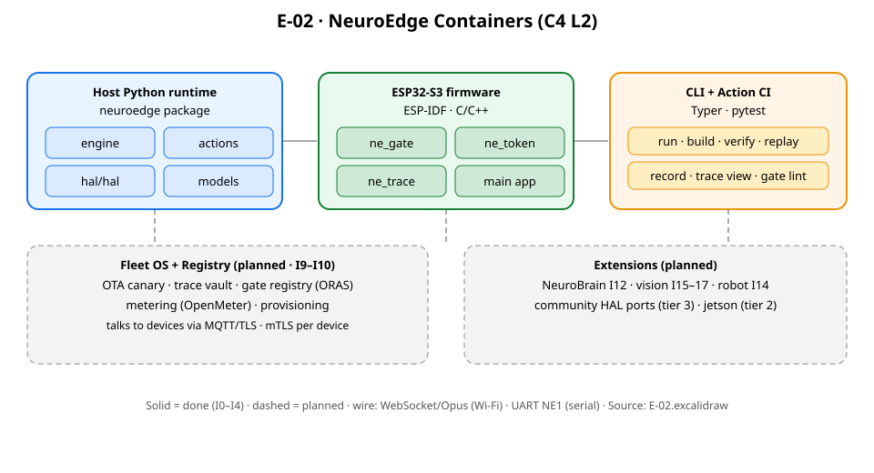

# 02 · Container & Ranh giới Tiến trình (C4 L2)

> **Trạng thái:** `done` cho Host Runtime, Firmware ESP32-S3 và CLI / Action CI; `planned` cho Fleet OS, Gate Registry, NeuroBrain và Robot Nodes (I8–I18). Xem [`00-overview.md`](00-overview.md) để tra cứu vị trí tài liệu.

---

## 1. Sơ đồ Container Toàn hệ thống (C4 L2 Container Diagram)

Sơ đồ C4 Level 2 phân rã hệ thống NeuroEdge thành các tiến trình (processes), môi trường thực thi (execution runtimes) và kho lưu trữ dữ liệu độc lập:


*Hình E-02 — Bản đồ Container: Khối nét liền đã có mã nguồn (done) · Khối nét đứt quy hoạch (planned).*

```mermaid
flowchart TB
    classDef primary fill:#2563eb,stroke:#1d4ed8,color:#ffffff,stroke-width:2px,font-weight:bold;
    classDef core fill:#eff6ff,stroke:#3b82f6,color:#1e3a8a,stroke-width:1.5px;
    classDef mcu fill:#f0fdf4,stroke:#16a34a,color:#14532d,stroke-width:2px,font-weight:bold;
    classDef store fill:#f1f5f9,stroke:#64748b,color:#0f172a,stroke-width:1.5px;
    classDef external fill:#fff7ed,stroke:#ea580c,color:#7c2d12,stroke-width:1.5px;
    classDef planned fill:#faf5ff,stroke:#a855f7,color:#6b21a8,stroke-dasharray: 4 3;

    subgraph DevMachine["Host Workstation &amp; CI Runner"]
        CLI["CLI &amp; Action CI Runner<br/><b>Python 3.11+ Typer / Rich / Pytest</b><br/>run · build · verify · replay · record · test"]:::primary
        HOST["Host Python Runtime<br/><b>Package neuroedge</b><br/>Engine · Actions · SimHAL · LinuxHAL · Models · MCP Host"]:::core
        SIM_UI["Local Sim Web UI<br/><b>HTTP 127.0.0.1 :8765</b><br/>Virtual Board &amp; In-Person Confirmations"]:::core
        TRACE_STORE[("Trace Storage<br/><b>Local Filesystem</b><br/>traces/*.json · fixtures/")]:::store
        
        CLI --> HOST
        HOST <--> SIM_UI
        HOST --> TRACE_STORE
        CLI --> TRACE_STORE
    end

    subgraph EmbeddedDevice["Edge Microcontroller (ESP32-S3 Box-3 / QEMU)"]
        FW["Firmware C99 Runtime<br/><b>ESP-IDF v5.1+ / FreeRTOS</b><br/>Walker C NETR · TokenLedger · Voice FSM · I2S/GPIO"]:::mcu
        FLASH_STORE[("On-Chip Flash Storage<br/><b>16MB SPI Flash</b><br/>NETR const trees · A/B Partitions · NVS")]:::store
        
        FW <--> FLASH_STORE
    end

    subgraph CloudServices["Cloud &amp; Fleet Platform (I9–I10 Planned)"]
        FLEET["Fleet OS Backend<br/><b>Hawkbit Canary OTA &amp; EMQX Broker</b><br/>mTLS :8883"]:::planned
        REGISTRY["Gate Registry<br/><b>CNCF ORAS / OCI Signed Store</b>"]:::planned
        VAULT[("Central Trace Vault<br/><b>Standard 90d · Enterprise 3yr</b>")]:::planned
        
        FLEET <--> VAULT
    end

    subgraph ExternalActors["External Ecosystem"]
        EXT_MCP["Claude Desktop / MCP Client<br/><b>External AI Desktop</b>"]:::external
        EXT_LLM["AI Cloud Providers<br/><b>OpenAI / Anthropic / LiteLLM</b>"]:::external
    end

    CLI <-->|1. Stdio JSON-RPC IPC| EXT_MCP
    HOST <-->|2. HTTPS TLS 1.3 / WebSocket| EXT_LLM
    HOST -->|3. neuroedge build (NETR binary + headers)| FW
    FW <-->|4. UART NE1 Framing (115200 8N1)| HOST
    FW -.->|5. MQTT 5.0 / mTLS :8883| FLEET
    CLI -.->|6. OCI Publish/Pull Gates| REGISTRY
    FW -.->|7. Telemetry &amp; Crash Dumps| VAULT
```

---

## 2. Chi tiết Các Container Đã Hoàn Thành (Done Containers — I0–I4)

### 2.1 Host Python Runtime (`neuroedge` Package)
* **Công nghệ & Môi trường:** Python 3.11+, thuần thư viện chuẩn `tomllib` (không phụ thuộc parser TOML ngoài). Hỗ trợ chạy trên macOS, Linux x86-64, Linux ARM64 (Raspberry Pi 5).
* **Trách nhiệm chính:**
  * Cung cấp toàn bộ logic phân giải kế thừa Gate (`GateResolver`), thẩm định an toàn 5 nguyên tắc, và biên dịch cây quyết định nhị phân `NETR v1` (`compiler.py`).
  * Thực thi tầng `actions`: Quản lý ngữ cảnh phiên hội thoại (`ConversationContext`), quản lý vòng đời token dùng một lần (`TokenLedger`), và phân phối công cụ an toàn (`dispatch()`).
  * Chạy `SimHAL` và `LinuxHAL` (tương tác trực tiếp kernel qua `gpiod` v2 / `gpio-sim`).
  * Kết nối tầng mô hình: `SystemOne` (lệnh cục bộ tất định) và `SystemTwo` (LiteLLM SDK tích hợp trong tiến trình, `Q-10`).
  * Phục vụ máy chủ MCP nội bộ và giao diện Web UI cục bộ (`sim/ui.py`).

### 2.2 Firmware ESP32-S3 (Nhúng C99 / ESP-IDF)
* **Công nghệ & Môi trường:** C99 thuần, framework ESP-IDF (v5.2.1 cho bo mạch thật, v5.4 cho Espressif QEMU). Hệ điều hành thời gian thực FreeRTOS.
* **Trách nhiệm chính:**
  * **Bộ duyệt cây C (`ne_gate/ne_walker.c`):** Đọc trực tiếp cấu trúc nhị phân `NETR v1` ánh xạ trong bộ nhớ Flash (Memory-Mapped Flash), không cấp phát bộ nhớ động (0 static RAM), kích thước stack $\le 512$ bytes (`Q-9`, `Q-23`).
  * **Sổ Token C (`ne_gate/ne_token.c`):** Quản lý 4 slot token dùng một lần trên vi điều khiển, cơ chế đếm hạn thời gian wrap-safe theo đồng hồ đơn điệu của chip.
  * **Module Xuất vết UART (`ne_trace`):** Định dạng và xuất các sự kiện vết ghi JSON-lines có tiền tố `NE1 ` qua UART0 / USB-CDC (`TSK-S4-09`).
  * **Trình tự Khởi động An toàn (`main.c`):** Thực hiện đo kiểm bộ nhớ (`memory_probe`) $\rightarrow$ chạy self-test gate nhúng trong Flash $\rightarrow$ chỉ mở mạng và vòng lặp ứng dụng khi self-test trả về `NE_SELFTEST PASS`.

### 2.3 CLI & Khung Kiểm thử Action CI
* **Công nghệ & Môi trường:** Typer, Rich, Pytest, DeepDiff.
* **Trách nhiệm chính:**
  * Điểm vào lệnh hợp nhất: `new` (khởi tạo mẫu), `run` (REPL tương tác), `build` (đối chiếu năng lực), `test` (chạy bộ assertion Action CI), `record` (ghi vết), `replay` (phát lại vết trên HAL thật), `verify` (kiểm tra tương đương target).
  * Cưỡng chế nghiêm ngặt **Hợp đồng mã thoát chuẩn tắc (Exit Codes)**:
    * Mã `0`: Bài kiểm tra hoặc lệnh chạy thành công đạt 100%.
    * Mã `1`: Lỗi cú pháp, sai lệch an toàn (Safety Regression), hoặc vi phạm Gate.
    * Mã `2`: Tính năng hoặc target chưa được hiện thực (giúp CI phân biệt chính xác giữa "hỏng" và "chưa làm").

---

## 3. Chi tiết Các Container Quy hoạch (Planned Containers — I8–I18)

Kiến trúc hiện tại đã thiết lập sẵn các điểm móc (hooks) và giữ chỗ dữ liệu (data reservation) để tích hợp các container sau mà không làm vỡ tính tương thích:

| Container | Increment | Công nghệ đề xuất | Trách nhiệm cốt lõi | Điều kiến trúc hiện tại đã giữ chỗ sẵn |
|:---|:---:|:---|:---|:---|
| **Fleet OS Backend** | **I9** | FastAPI, Eclipse Hawkbit, EMQX Broker, PostgreSQL | Điều phối cập nhật OTA Canary (1% $\rightarrow$ 10% $\rightarrow$ 100%, tự động dừng nếu tỷ lệ lỗi tăng); quản trị danh bạ thiết bị và xác thực mTLS. | Cấu trúc vết ghi mang trường `metadata.device_id`; hợp đồng phân vùng A/B và chữ ký RSA/ECDSA đã đặc tả trong FR-OTA. |
| **Gate Registry** | **I10** | CNCF ORAS, Harbor OCI Registry, Cosign | Lưu trữ và lập chỉ mục các chính sách Gate công khai, Adapter nhà cung cấp và bản port HAL cộng đồng có ký số. | Lệnh `gate publish` xuất digest RFC 8785; cơ chế khóa `digests.lock`; cú pháp định danh URI `neuroedge://<pkg>/<gate>@<semver>`. |
| **Trace Vault** | **I9** | S3-compatible Object Storage (MinIO / Ceph), ClickHouse | Kho lưu trữ tập trung hàng triệu tệp vết ghi gửi về từ hiện trường; hỗ trợ tìm kiếm theo phán quyết BLOCK và phân tích độ trễ P95. | Cấu trúc tệp `trace.v1.json` độc lập, chuẩn tắc hóa theo chuẩn JCS, sẵn sàng lưu trữ mà không cần biến đổi lược đồ. |
| **NeuroBrain Copilot** | **I12** | Python package `neuroedge.brain`, LLM Hardware Assistant | Trợ lý hội thoại giúp kỹ sư bring-up bo mạch: quét bus I2C, đề xuất Gate và Action bằng ngôn ngữ tự nhiên (Chat Contracting). | **Bất biến B-1:** `neuroedge.brain` bắt buộc phải đi qua `dispatch()` $\rightarrow$ Gate, không có quyền can thiệp thẳng vào HAL. |
| **Robot Distributed Nodes** | **I14** | Zenoh-pico, C/C++ micro-ROS runtime | Kiến trúc phân tán trên robot di động: Não trung tâm (Linux RPi 5) điều phối các Node vi điều khiển điều khiển động cơ qua mạng thời gian thực. | Phân tách ranh giới Gate cho từng node; cơ chế gia hạn token an toàn (token lease `motion.*`, `Q-37`); trạng thái an toàn tự khai báo (`Q-35`). |

---

## 4. Ma trận Giao tiếp Liên Container (Inter-Container Communication Matrix)

Bảng dưới đây quy định phương thức truyền thông, định dạng payload, yêu cầu bảo mật và giới hạn độ trễ giữa các container:

| Nguồn $\rightarrow$ Đích | Kênh truyền dẫn | Định dạng dữ liệu | Xác thực & Bảo mật | Ngân sách độ trễ (Latency Budget) |
|:---|:---|:---|:---|:---|
| **CLI $\rightarrow$ Host Runtime** | In-process call | Python Objects / DTOs | Nội bộ tiến trình | $< 1\text{ ms}$ |
| **Host $\rightarrow$ Local Sim UI** | HTTP / WebSocket | JSON / Server-Sent Events (SSE) | Same-origin 127.0.0.1, từ chối Cross-Origin POST | $< 50\text{ ms}$ |
| **External MCP $\rightarrow$ Host** | Stdio (Standard I/O) | JSON-RPC 2.0 (MCP Protocol) | Gán nhãn `call_source = "mcp"`, thẩm định qua Gate | $< 100\text{ ms}$ |
| **Host $\rightarrow$ AI Providers** | HTTPS over WAN | JSON (OpenAI API payload) | TLS 1.3, API Key qua biến môi trường | P95 $< 1.500\text{ ms}$ (`NFR-PERF-07`) |
| **Firmware $\rightarrow$ Host** | UART0 / USB-CDC hoặc TCP | JSON-Lines (tiền tố `NE1 `) | Baudrate 921600 (hoặc TCP socket 5555 trên QEMU) | $< 20\text{ ms}$ mỗi dòng sự kiện |
| **Host $\rightarrow$ Firmware (Build)** | Trình biên dịch sinh mã | Binary NETR v1 + C Header `.h` | Đối chiếu hash CRC32 và SHA-256 | Thực hiện lúc build (Build-time) |
| **Firmware $\rightarrow$ Fleet OS** *(I9)* | MQTT 5.0 qua WAN | JSON / CBOR nén | mTLS với chứng chỉ X.509 riêng theo thiết bị | Giám sát không đồng bộ (Asynchronous) |
| **Robot Brain $\rightarrow$ Nodes** *(I14)* | Zenoh-pico Bus | CDR / Raw Binary Frames | Black channel (IEC 61784-3), Token lease | $< 10\text{ ms}$ (Thời gian thực) |
