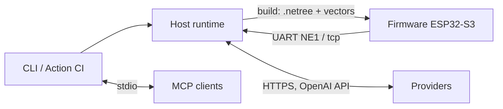

# 02 · Container (C4 L2)

> Trạng thái: host runtime + firmware walker + CLI/CI `done`;
> Fleet/Registry/mở rộng `planned` (I8–I18).

*Hình E-02 — 3 container done (nét liền) + 2 vùng planned (nét đứt).*

## 1. Container done

| Container | Công nghệ | Chứa gì | Giao tiếp |
|:---|:---|:---|:---|
| Host Python runtime | Python 3.11+, `neuroedge` package | engine, actions, hal, models, perception, sim, mcp, testing, trace, viz | Gọi provider qua HTTPS; UART/TCP đọc vết `NE1` từ thiết bị |
| ESP32-S3 firmware | C/C++ trên ESP-IDF | `ne_gate` (walker), `ne_token` (sổ token), `ne_trace` (dòng `NE1`), `main` (boot → selftest → replay vector → network/idle) | UART `NE1`, Wi-Fi WebSocket Opus nhị phân + sự kiện JSON |
| CLI + Action CI | Typer + Rich, pytest | `run`, `build`, `verify`, `replay`, `record`, `trace view/export`, `gate lint/resolve/publish/explain` | Đọc/ghi cùng vết `trace.v1`; mã thoát 0/1/2 (PRD FR-CLI) |

## 2. Container planned (giữ chỗ từ hôm nay)

| Container | Increment | Điều kiến trúc hiện tại đã giữ chỗ |
|:---|:---|:---|
| Fleet OS | I9 | Vết ghi là JSON Lines replay được; `device_id` trong `metadata`; OTA A/B + ký ở FR-OTA |
| Gate Registry | I10 | `gate publish` in digest JCS; `digests.lock` khóa gate chuẩn mực; `extends` ghim digest (RFC-0003 thu hẹp) |
| NeuroBrain | I12 | `neuroedge.brain` (planned) chỉ được gọi HAL qua `dispatch()` → gate (bất biến B-1) |
| Robot multi-node | I14 | Mỗi node có HAL + gate riêng; wire Zenoh-pico (`Q-36`); token lease cho `motion.*` (`Q-37`) |
| Vision / Jetson | I15–I17 | Nguyên thủy `vision.in` qua RFC riêng; bậc target 2/3 (`Q-13`, RFC-0002 PR2) |

Chi tiết evolución: `13-evolution-i0-i18.md`.
