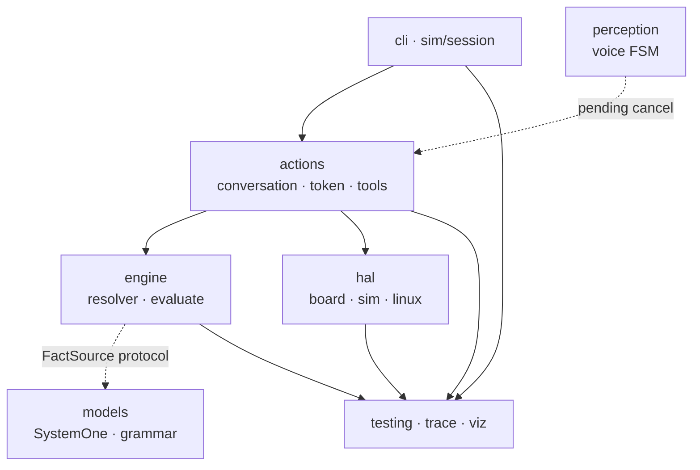

# 03 · Component host Python (C4 L3)

> Trạng thái: `done` (I0–I4). Nguồn mã: `python/neuroedge/`
> (bản đồ kho: `CONTRIBUTING.md` §6).

*Hình E-03 — chồng layer host. Mũi tên: chiều phụ thuộc cho phép (trên dùng dưới).*

## 1. Ma trận layer

| Layer | Tệp chính | Trách nhiệm | Được import bởi | Không được import |
|:---|:---|:---|:---|:---|
| Foundation | `errors.py`, `paths.py`, `trace.py` | Lỗi 3 phần `NE…`; tìm root repo/wheel; thẩm định `trace.v1` | mọi layer | không import nội bộ |
| L3 core · engine | `engine/gate_resolver.py`, `constraints.py`, `gate.py`, `decision_tree.py`, `binary_tree.py`, `compiler.py`, `circuit_breaker.py`, `latency.py`, `canonical.py` | Phân giải `extends` + 5 nguyên tắc; `evaluate` → phán quyết; biên dịch cây + NETR; đối chiếu lúc `build`; mạch ngắt; độ trễ từng chặng | `actions`, `sim`, `cli`, `testing` | `actions`, `hal`, `sim`, `models` (trừ `compiler → hal/board` để đối chiếu) |
| L3 surface · actions | `actions/spec.py`, `conversation.py`, `token.py`, `tools.py`, `confirmation.py` | `@action`; `c.do()/c.say()`; `TokenLedger` dùng một lần TTL=`p95×3`; `dispatch()`; xác nhận `ask` | `sim`, `cli`, `testing`, `mcp_*` | `sim`, `cli` |
| L1 · hal | `hal/__init__.py`, `board.py`, `digital.py`, `sim.py`, `linux.py`, `sysfs.py`, `framebuffer.py` | 5 nguyên thủy đóng; `BoardProfile` (vế có); `digital_out` bắt `authorize(token)` trước; mặc định refuse-all | `actions` (qua `digital.grant`), `sim`, `testing` | `engine`, `actions` |
| L2 · models | `models/system.py`, `grammar.py`, `knowledge.py`, `providers/` | `SystemOne` bool/level/choice + fallback ngữ pháp; `SystemTwo` sinh mở; LiteLLM/adapter sau `providers/` | `engine` (qua giao thức `FactSource`), `sim` | SDK provider trực tiếp trong lõi |
| L2 · perception | `perception/voice_fsm.py`, `voice_session.py` | FSM 5 trạng thái + đồng hồ tiêm vào; không quyết gate, không lái chân; chỉ hủy pending + đóng token khi cắt lời | `sim` | `hal` trực tiếp (qua `pending_commands` được tiêm) |
| L0 · sim/cli | `sim/session.py`, `sim/ui.py`, `cli/` | **Hub lắp ráp duy nhất**: `load()` wire HAL+engine+models+tools+MCP; REPL; trang `--ui` | — (đỉnh) | — |
| L0 · MCP | `mcp_server.py`, `mcp_host.py`, `mcp_desktop.py` | Bề mặt entry thứ hai: agent là MCP server có gate (tool = `@action`, `call_source=mcp`); System 2 là MCP host (in-process `build_server` + server ngoài allowlist); sinh cấu hình Claude Desktop | `actions/tools`, `sim` | gọi HAL/engine ngoài `dispatch()` |
| Observability | `engine/trace_sink.py`, `testing/recorder.py`, `player.py`, `golden.py`, `assertions.py`, `viz/` | Bus `EventLog.emit`; record/anonymize; replay tính lại; so golden; HTML/Perfetto | `cli`, `sim` | logic quyết định |

## 2. Luật phụ thuộc (bất biến kiến trúc)

1. `engine` không biết `hal`/`actions`/`sim` — chỉ nhận `FactSource` (protocol) và `board` cho `compiler`.
2. `hal` không biết `engine` — chỉ biết `authorize(token)` và tên chân logic.
3. Cầu duy nhất `engine ↔ hal` là `actions/conversation.py`.
4. `sim/session.py` là nơi duy nhất thấy đủ mọi thứ để wire một phiên.
5. `EventLog` là bus chung: engine, hal, conversation, SystemTwo, FSM đều `emit()` về một log → một vết ghi thẩm định được.

Vi phạm 1–3 khi review là lý do từ chối PR (rẽ nhánh logic sai tầng sẽ phá
tương đương target, P-2).
