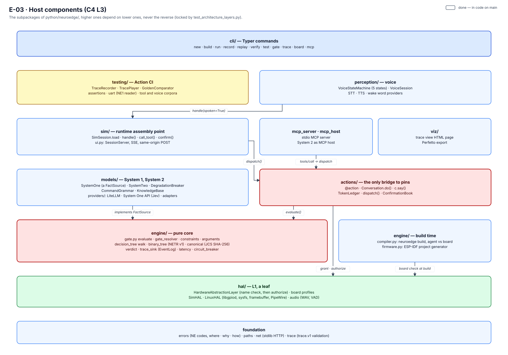
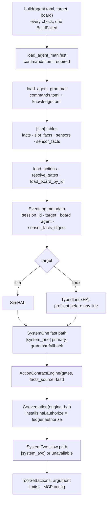

# 03 · Thành phần phía host (C4 L3)

> **Phạm vi:** gói Python `python/neuroedge/` — các gói con, trách nhiệm của từng gói, phụ thuộc
> thật giữa chúng, giao thức nối chúng, và nơi lắp ráp. **Nguồn:** mã trong `python/neuroedge/`;
> đồ thị phụ thuộc được test [`test_architecture_layers.py`](../../../python/tests/test_architecture_layers.py)
> khoá lại.

## 1. Sơ đồ thành phần


*Hình E-03 — Các gói con xếp theo chiều phụ thuộc: gói ở trên dùng gói ở dưới, không bao giờ ngược lại.*

## 2. Các tầng và luật phụ thuộc

Docstring của từng gói tự gọi tên tầng của nó: HAL là **L1**, model và nhận thức là **L2**, engine
và action là **L3** ("Action Contract"), target là **L0**. Xếp theo chiều phụ thuộc thật, từ dưới
lên:

| Bậc | Gói | Được phụ thuộc vào | Tầng |
|:---:|:---|:---|:---|
| 0 | `errors`, `paths`, `net`, `trace` | chỉ nhau | nền |
| 1 | `hal` | `errors`, `paths` | L1 |
| 2 | `engine` | bậc 0; **riêng `engine/compiler.py`** được dùng `hal` (đối chiếu bo mạch lúc build) và import muộn `actions`, `models`, `perception`, `mcp_host` (kiểm cấu hình) | L3 lõi |
| 3 | `actions` | `engine`, `hal`, bậc 0 | L3 bề mặt |
| 4 | `models` | `engine` (hiện thực giao thức của nó), `net`, bậc 0 | L2 |
| 5 | `mcp_server`, `mcp_host`, `mcp_desktop` | `actions`, bậc 0 | L4 theo proposal §3.1 (docstring không tự khai tầng) |
| 6 | `viz`, `templates` | `viz`: `hal`, `trace`, bậc 0; `templates`: `errors`, `paths` | công cụ |
| 7 | `sim` | mọi bậc dưới | L0, **nơi lắp ráp** |
| 8 | `perception` | `sim` (phiên thoại bọc phiên gõ), `models`, `actions`, `engine`, `hal`, `net` | L2 |
| 9 | `testing` | `perception`, `actions`, `engine`, `hal`, `trace`; `sim` import muộn (và `sim/serve.py` import muộn `testing` để lấy bộ ghi vết — chỉ khi có `trace_out`) | Action CI |
| 10 | `studio` | mọi bậc dưới trừ `cli` — ứng dụng web cục bộ `neuroedge studio` thể hiện mọi năng lực (TSK-I1-04, `docs/spec/studio.md`) | công cụ |
| 11 | `cli` | mọi gói | vào |

Giữa L2 và L3 có nguyên lý đảo ngược phụ thuộc (dependency inversion): các adapter System 1 của L2 trong `models/` (`SystemOne`, `CommandGrammar`, `systemone_api`) hiện thực giao thức `FactSource` của `engine/gate.py` (L3), thay vì L3 phụ thuộc L2.

Bốn luật, mỗi luật là một lựa chọn có chủ đích:

1. **Lõi engine thuần.** `gate.py`, `gate_resolver.py`, `decision_tree.py`, `binary_tree.py`,
   `verdict.py` không biết HAL, action hay model tồn tại. Chúng nhận dữ kiện qua giao thức
   `FactSource` và trả `GateResult`. Nhờ vậy phân giải gate là hàm thuần (bất biến 4).
2. **HAL là lá.** `hal` chỉ phụ thuộc `errors` và `paths`. Nó không biết gate là gì: nó chỉ gọi một
   hàm `authorize(token, pin, called_from)` được lắp vào từ bên ngoài, và hàm mặc định từ chối mọi
   lệnh.
3. **Một cây cầu duy nhất giữa gate và HAL:** `actions/conversation.py` (`Conversation.do`). Không
   gói nào khác vừa gọi `evaluate()` vừa chạm chân.
4. **Một nơi lắp ráp lúc chạy:** `SimSession.load` (`sim/session.py`) tạo và nối engine, sổ token,
   HAL, model, bộ công cụ và MCP. `VoiceSession` bọc một `SimSession`; CLI, máy chủ MCP, bộ chạy
   corpus đều đi qua nó. Lúc build, nơi lắp ráp là `engine/compiler.py::build`.

### 2.1 Gói quy hoạch

Các gói sau đã được quy hoạch trong kiến trúc tương lai nhưng chưa có mã trong kho hôm nay:

- `brain/` (I4a, NeuroBrain): logic điều phối phòng lab; tuân thủ bất biến B-1 — chỉ tác động vật lý qua `dispatch()` và gate, không bao giờ gọi thẳng HAL, được khoá bằng test quét AST và import (`neuroedge-design-neurobrain.md` §1 "Bảy nguyên tắc"; TSK-N1-07, `tests/test_brain_boundary.py`) — xem [`15`](15-target-architecture.md) §4.2.
- `perception/vision/` và `sim/vision/` (I2a, TSK-V1b-*): đường ống thị giác và giả lập thị giác; thị giác đóng vai trò đầu vào L2, vào gate dưới dạng dữ kiện do maker khai (Q-54) — xem [`15`](15-target-architecture.md) §4.4.
- `services/fleet/` và `services/registry/` (I9–I10, TSK-K2, TSK-K3): các dịch vụ phía máy chủ cho Fleet OS (điều phối OTA theo đợt, broker MQTT, viễn trắc) và Gate Registry (kho OCI qua ORAS/Harbor, đo lường) — xem [`15`](15-target-architecture.md) §3.1, §3.2.

Khi `brain/` vào kho, nó cần một mục trong `ALLOWED` (và `LAZY` nếu có import muộn) của [`python/tests/test_architecture_layers.py`](../../../python/tests/test_architecture_layers.py). `perception/vision/` và `sim/vision/` thuộc đơn vị `perception` và `sim` sẵn có nên không cần mục mới; `services/` (kể cả `services/metering/engine.py`, TSK-K3-02) nằm ngoài gói `neuroedge` nên test này không quét.

## 3. Danh mục thành phần

### 3.1 `engine/` — động cơ hợp đồng hành động

| Module | Trách nhiệm | Kiểu và hàm chính |
|:---|:---|:---|
| `gate_resolver.py` | Gộp chuỗi `extends` thành một `ResolvedGate`, cưỡng chế năm nguyên tắc kế thừa và RFC-0004/0005/0006; tra `neuroedge://` trong thư mục gate | `GateRegistry`, `ResolvedGate`, `resolve_gate_file`, `resolve_gate_uri` |
| `constraints.py` | Chuẩn hoá mệnh đề `allow_when` thành tập giá trị được nhận; so độ chặt | `Constraint.is_at_least_as_strict_as`, `parse_allow_when` |
| `arguments.py` | Giới hạn tham số (RFC-0005): kiểm, gộp chỉ-thu-hẹp, gợi ý schema | `check`, `merge_arguments`, `schema_hint` |
| `canonical.py` | JSON chuẩn tắc RFC 8785 và băm SHA-256 | `canonicalize`, `digest`, `gate_digest` |
| `decision_tree.py` | Biên dịch gate thành cây JSON nội bộ; duyệt cây (bản Python mà walker C phải khớp) | `compile_tree`, `walk`, `known_failure`, `truth_table` |
| `binary_tree.py` | Mã hoá cây thành `NETR` v1 cho chip; sinh header C | `encode`, `c_header`, `domain_index` |
| `gate.py` | Lượng giá một gate: kiểm tham số, gom dữ kiện trong ngân sách thời gian, duyệt cây, áp `on_block` và `budget.fail` | `ActionContractEngine.evaluate`, `GateResult`, giao thức `FactSource` |
| `verdict.py` | Từ vựng phán quyết | `GateVerdict`, `Reason`, `Fact`, `Unavailable` |
| `circuit_breaker.py` | Ngắt model chính sau nhiều lần lỗi liên tiếp; chỉ định tuyến, không bao giờ tạo `ALLOW` | `DegradationBreaker` |
| `trace_sink.py` | Nhật ký sự kiện của phiên, xuất `trace.v1` | `EventLog.emit`, `EventLog.to_trace` |
| `latency.py` | Độ trễ từng chặng và tỷ lệ System 1 / System 2 | `TurnMeter`, `turn_summary` |
| `gate_explain.py` | Dữ liệu cho `gate explain`: tiêu chí từ đâu, điều gì bị siết | `explain_gate_file` |
| `compiler.py` | `neuroedge build`: đối chiếu agent ↔ bo mạch, kiểm mọi bảng cấu hình, ghi artifact; gom **mọi** vấn đề vào một `BuildFailed` | `build`, `load_agent_manifest`, `check_capabilities` |
| `firmware.py` | Sinh project ESP-IDF cho agent: component `ne_agent`, `version.txt`, chép mã firmware | `render_project`, `firmware_problems`, `checks` |

### 3.2 `actions/` — bề mặt hành động vật lý

| Module | Trách nhiệm | Kiểu và hàm chính |
|:---|:---|:---|
| `spec.py` | `@action`: đăng ký hành động, gate của nó, năng lực nó cần; gọi thẳng hàm ⇒ `NE1001` | `action`, `ActionSpec`, `REGISTRY` |
| `conversation.py` | `c.do()`: gate → token → thân hàm → đóng token; fallback `degrade`; mở câu hỏi `ask`. `c.say()` nói, không qua gate | `Conversation.do`, `confirm`, `say`, `ActionResult` |
| `token.py` | Sổ token phán quyết dùng một lần, TTL = p95 × 3; là hàm `authorize` của HAL | `TokenLedger.issue`, `authorize`, `close`, `VerdictToken` |
| `tools.py` | Mỗi `@action` là một công cụ; `dispatch()` là đường duy nhất từ tool call tới chân | `ToolCall`, `dispatch`, `ToolResult`, `input_schema` |
| `confirmation.py` | Câu hỏi `on_block: ask`: ai được trả lời, hết hạn khi nào, gắn với digest gate | `ConfirmationBook.open`, `take`, `PendingConfirmation` |

### 3.3 `hal/` — lớp trừu tượng phần cứng

| Module | Trách nhiệm |
|:---|:---|
| `__init__.py` | `HardwareAbstractionLayer`: kiểm tên chân **trước** khi gọi `authorize` (gõ sai tên không tốn token), rồi ghi lệnh |
| `board.py` | Đọc và thẩm định `boards/*.toml`; năm nguyên thủy (`PRIMITIVES`), ba target (`SUPPORTED_TARGETS`), bo mạch tham chiếu |
| `digital.py`, `sensor.py`, `display.py` | API cho thân `@action`: `digital.out("door_lock").pulse(...)`, `sensor.read(...)`, `display.show(...)`; `digital.out` ngoài `c.do()` ⇒ `NE1001` |
| `sim.py` | `SimHAL`: chân, cảm biến, màn hình, micro, loa ảo; lệnh hẹn giờ và huỷ khi cắt lời |
| `linux.py` | `LinuxHAL`, `TypedLinuxHAL`: line GPIO qua libgpiod v2 tìm theo tên; kiểm mọi thiết bị trước khi giữ line; thả mọi line khi thoát |
| `sysfs.py` | Cảm biến hwmon và IIO, tìm theo nhãn; không bao giờ trả giá trị mặc định |
| `framebuffer.py` | Màn hình trong bộ nhớ hoặc `/dev/fbN` |
| `audio.py` | Thư viện chuẩn: đọc/ghi WAV, VAD năng lượng, khung 20 ms, dòng thời gian loa |

### 3.4 `models/` — System 1, System 2, ngữ pháp, tri thức

| Module | Trách nhiệm |
|:---|:---|
| `system.py` | `SystemOne` (hiện thực `FactSource`: model chính rồi fallback, có bộ ngắt mạch) và `SystemTwo` (LLM, có fallback, ghi `system_two_call`) |
| `grammar.py` | Ngữ pháp lệnh cố định từ `commands.toml`: chuẩn hoá, khớp mẫu, điểm `difflib`; `GrammarAdjudicator` quyết tiêu chí từ câu lệnh |
| `knowledge.py` | Tri thức cục bộ từ `knowledge.toml`, truy xuất tất định |
| `providers/` | **Nơi duy nhất gọi tên một nhà cung cấp.** LiteLLM (import muộn), System One API (Jev), adapter `python:pkg.mod:factory`, luật chung cho mọi bảng cấu hình (không khoá trong tệp, kiểm endpoint) |

### 3.5 `perception/` — thoại

| Module | Trách nhiệm |
|:---|:---|
| `voice_fsm.py` | Máy trạng thái hội thoại năm trạng thái (`IDLE`, `LISTENING`, `THINKING`, `SPEAKING`, `BARGE_IN`) theo `docs/spec/voice_fsm.md`; không bao giờ lượng giá gate hay chạm chân |
| `voice_session.py` | Đặt máy trạng thái trước một `SimSession`: khung âm thanh → VAD hoặc từ đánh thức → STT → cùng đường với lệnh gõ; thời gian ảo |
| `providers/` | STT/TTS chuẩn OpenAI, từ đánh thức (openWakeWord hoặc adapter), nhà cung cấp giả để test |

### 3.6 `sim/`, MCP, `testing/`, `viz/`, `cli/`

| Thành phần | Trách nhiệm |
|:---|:---|
| `sim/session.py` | `SimSession`: nơi lắp ráp một agent trên `sim` hoặc `linux`; xử lý một lượt (`handle`), một tool call (`call_tool`), một câu trả lời xác nhận |
| `sim/ui.py` | `SessionServer`: web UI cùng phiên, SSE, kiểm cùng nguồn gốc |
| `sim/serve.py` | Vòng phục vụ MCP qua stdio dùng chung: `neuroedge mcp serve` và `neuroedge.serve_mcp` (hàm Python công khai, `docs/spec/python_api.md`) cùng gọi `run_stdio` |
| `mcp_server.py` | Agent thành máy chủ MCP qua stdio; mỗi lần một lời gọi |
| `mcp_host.py` | System 2 làm MCP host: công cụ của thiết bị qua máy chủ MCP của chính agent (vẫn qua gate), công cụ thông tin từ server bên ngoài theo danh sách cho phép |
| `testing/` | Action CI: `TraceRecorder`, `TracePlayer`, `GoldenComparator`, thư viện assert, đọc UART, chạy corpus tool call và thoại |
| `viz/` | Trang HTML tự chứa cho `trace view` và web UI; xuất Perfetto |
| `cli/` | Typer: mọi lệnh; lỗi thành thông báo ba phần và mã thoát 0/1/2 |

## 4. Các giao thức nối thành phần

Đây là những điểm nối mà một kỹ sư sẽ hiện thực hoặc thay thế. Chữ ký lấy nguyên từ mã.

```python
# engine/gate.py — nguồn dữ kiện cho gate (SystemOne, GrammarAdjudicator, SystemOneApi hiện thực nó)
class FactSource(Protocol):
    async def adjudicate(self, criterion: str, definition: Mapping[str, Any],
                         state: Mapping[str, Any] | None, deadline_ms: float) -> Fact | Unavailable: ...

# hal/__init__.py — HAL không biết gate; nó chỉ hỏi hàm authorize được lắp vào
Authorizer = Callable[[Any, str, str], None]          # (token, pin, called_from) -> None hoặc raise

# actions/token.py — sổ token là hàm authorize của HAL
class TokenLedger:
    def issue(self, *, gate: str, gate_digest: str, action: str, pins: frozenset[str],
              session_id: str, p95_ms: float) -> VerdictToken: ...
    def authorize(self, signature: Any, pin: str, called_from: str) -> None: ...
    def close(self, token: VerdictToken) -> None: ...

# actions/tools.py — đường duy nhất từ một tool call tới chân
async def dispatch(conversation: Conversation, tools: ToolSet, call: ToolCall) -> ToolResult: ...

# engine/trace_sink.py — mọi thành phần ghi vào một nhật ký của phiên
class EventLog:
    def emit(self, type: str, data: dict[str, Any]) -> None: ...

# models/providers/base.py — nhà cung cấp System 2
class Provider(Protocol):
    def __call__(self, task: str, name: str | None, state: Mapping[str, Any] | None) -> Any: ...

# perception/providers/base.py và wake.py — giọng nói
class SpeechToText(Protocol):
    def transcribe(self, clip: AudioClip) -> str | Transcript | Awaitable[str | Transcript]: ...
class TextToSpeech(Protocol):
    def synthesize(self, text: str) -> Speech | Awaitable[Speech]: ...
class WakeWordDetector(Protocol):
    def detect(self, frame: AudioFrame) -> tuple[str, float] | None: ...
```

## 5. Lắp ráp một phiên

`SimSession.load(agent_toml, target=...)` làm đúng các bước sau, theo thứ tự; bước nào lỗi thì
không có phiên nào được tạo và không line GPIO nào bị giữ.


```mermaid
flowchart TB
    A["build(agent.toml, target, board)<br/>every check, one BuildFailed"] --> B["load_agent_manifest<br/>commands.toml required"]
    B --> C["load_agent_grammar<br/>commands.toml + knowledge.toml"]
    C --> D["[sim] tables<br/>facts · slot_facts · sensors · sensor_facts"]
    D --> E["load_actions · resolve_gates · load_board_by_id"]
    E --> F["EventLog metadata<br/>session_id · target · board · agent · sensor_facts_digest"]
    F --> G{"target"}
    G -- sim --> H1["SimHAL"]
    G -- linux --> H2["TypedLinuxHAL<br/>preflight before any line"]
    H1 --> I["SystemOne fast path<br/>[system_one] primary, grammar fallback"]
    H2 --> I
    I --> J["ActionContractEngine(gates, facts_source=fast)"]
    J --> K["Conversation(engine, hal)<br/>installs hal.authorize = ledger.authorize"]
    K --> L["SystemTwo slow path<br/>[system_two] or unavailable"]
    L --> M["ToolSet(actions, argument limits) · MCP config"]
```

Thứ tự dữ kiện cho gate trong một phiên: `[sim.facts]` → `[sim.slot_facts]` → `[sim.sensor_facts]`
(đọc cảm biến ở mỗi lần gom) → model chính của `[system_one]` cho các tiêu chí nó được giao →
ngữ pháp lệnh.

## 6. Phụ thuộc bên ngoài

Lõi chỉ cần bảy thư viện; mỗi năng lực tuỳ chọn là một phần mở rộng, import muộn trong đúng hàm cần
nó — cài thiếu thì lỗi ba phần chỉ ra phần mở rộng cần cài.

| Phần mở rộng | Gói | Import muộn trong |
|:---|:---|:---|
| (lõi) | `typer`, `rich`, `pydantic`, `jsonschema[format-nongpl]`, `pyyaml`, `rfc8785`, `deepdiff` | — |
| `mcp` | `mcp` | `mcp_server.py::_sdk`, `mcp_host.py::ToolHost.__aenter__` |
| `cloud` | `litellm==1.102.0` | `models/providers/litellm_provider.py::_import_litellm` |
| `linux` | `gpiod` (LGPL, nên chỉ là tuỳ chọn) | `hal/linux.py::_import_gpiod` |
| `audio` | `sounddevice` | `hal/linux.py::_import_sounddevice`, chỉ backend `live` |
| `wake` | `openwakeword`, `onnxruntime` | `perception/providers/wake.py` |
| `serial` | `pyserial` | `testing/uart.py` |

HTTP tới Jev và tới STT/TTS dùng thư viện chuẩn (`net.py`): không theo redirect, không qua proxy,
có hạn chót và giới hạn kích thước.

## 7. Điểm mở rộng

| Muốn thêm | Làm ở đâu | Không phải sửa |
|:---|:---|:---|
| Một nhà cung cấp LLM, STT, TTS, System 1 | Adapter `python:gói.mô_đun:hàm` trong `agent.toml` | Lõi |
| Một từ đánh thức | Adapter hiện thực `WakeWordDetector` | Lõi |
| Một mẫu agent | `python/neuroedge/templates/` | Engine |
| Một kiểu sự kiện vết ghi | `EventLog.emit("…", data)` — `type` trong `trace.v1` là chuỗi tự do | `schemas/` (không cần RFC) |
| Một target | Lớp con `HardwareAbstractionLayer` + profile `boards/` + vector | Engine, gate — nhưng danh sách target đóng băng tới RFC-0002 ([`11`](11-hal-port-guide.md)) |
| Một toán tử `allow_when` hay một kiểu tiêu chí | **Cần RFC** (`CONTRIBUTING.md` §3) | — |
