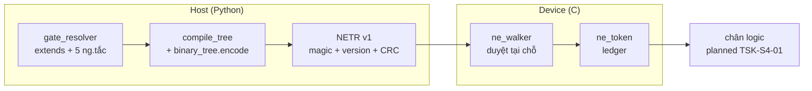

# 04 · Component firmware ESP32-S3 (C4 L3)

> Trạng thái: walker + token + vết UART + selftest `done` (chạy trên QEMU mỗi
> PR); HAL firmware đầy đủ `planned` (`TSK-S4-01`, chờ bo mạch).
> Nguồn: `targets/esp32s3/`, đặc tả `hal_mcu_review.md` (KL-1..KL-5, RB-1..RB-4).

*Hình E-04 — thứ tự boot và bố cục flash. Nét đứt: planned.*

## 1. Component

| Component | File | Trách nhiệm | Ràng buộc MCU |
|:---|:---|:---|:---|
| `ne_gate` walker | `components/ne_gate/ne_walker.c` | `ne_tree_load` + `ne_evaluate/ne_decide`: duyệt cây NETR tại chỗ trong flash, ra cùng phán quyết với engine host | C99, không heap/static/recursion/parser JSON/CEL-VM, stack ≤ 512 B |
| `ne_token` ledger | `components/ne_token/ne_token.c` | `init/issue/authorize/close`: 4 slot, đầy thì refuse (fail-closed), TTL=`p95×3`, `boot_id` thay `process_instance_id` | Caller-owned, wrap-safe theo đồng hồ đơn điệu |
| `ne_trace` | `components/ne_trace/ne_trace.c` | Dòng `NE1 ` ≤ 512 B: một sự kiện `trace.v1` JSON; khung `device_info … trace_end` | Không biến toàn cục câm; baud/console chốt khi bo mạch về (`TODOS.md` #35) |
| `main` boot | `main/main.c`, `memory_probe`, `gate_selftest`, `trace_vectors` | Đo bộ nhớ (Q-3) → selftest gate → replay 3 vết chuẩn mực → network/idle | Selftest FAIL thì dừng boot, không bao giờ gate trên cây chưa kiểm |
| Sinh mã host | `scripts/gen_firmware_gates.py`, `gen_firmware_vectors.py` | `.netree` + header C + bảng action + vector từ vết chuẩn mực | Chạy lúc build, không sửa tay output |

## 2. Hợp đồng host ≡ device (Q-8, Q-9, Q-23)

- Ngữ nghĩa một: `ne_decide` ≡ `engine/`: kiểm tham số trước
  (`argument_out_of_range`), rồi từng tiêu chí theo `criteria_order`,
  `confirm_mask` sau `ask`, `fail_open` cho `gate_unreachable`/`budget_exceeded`.
- Fact tới walker là **index trong domain** (bool/level/choice đã sắp) — không
  so chuỗi trên chip.
- Tương đương chứng minh bằng: bảng sự thật mỗi PR (host) + boot QEMU hằng
  đêm + `verify --targets esp32s3 --port` so với golden (chi tiết: `10`).

## 3. Ràng buộc phần cứng đã chốt (Q-2, Q-3)

Box-3 tham chiếu duy nhất; SRAM tự do ≥ 120 KB, PSRAM ≥ 2 MB, firmware ≤
3,5 MB (vừa A/B trên flash 16 MB). STT/TTS ở provider cloud (P-4) nên pipeline
trên chip chỉ còn thu/phát + AEC/VAD + FSM + gate.
