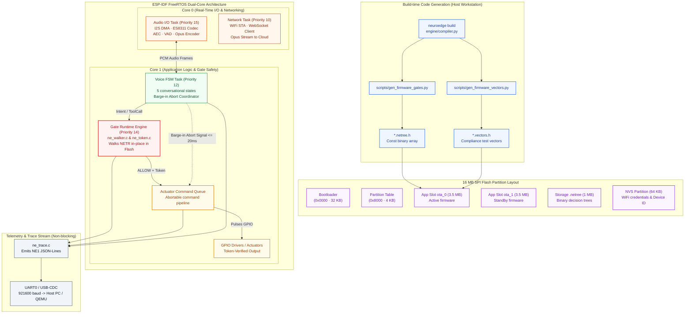
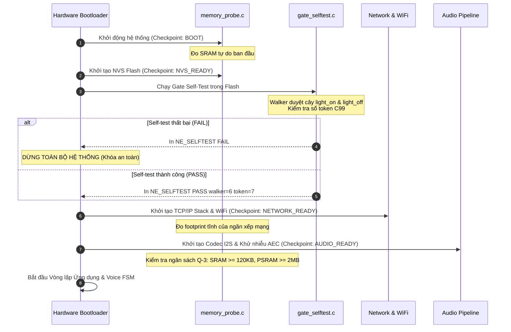

# 04 · Thành phần Firmware ESP32-S3 (C4 L3 — Device Level)

> **Trạng thái:** Walker C99, Sổ token C99, Vết ghi UART và Self-test boot `done` (chạy trên Espressif QEMU trong CI mỗi PR); HAL firmware và driver âm thanh đầy đủ `in-progress / planned` (`TSK-S4-01`, chờ bo mạch vật lý).  
> **Nguồn mã nguồn:** `targets/esp32s3/`. Đặc tả ràng buộc nhúng: [`docs/spec/hal_mcu_review.md`](../../spec/hal_mcu_review.md) (KL-1..KL-5, RB-1..RB-4).

---

## 1. Sơ đồ Thành phần Firmware ESP32-S3 (C4 L3 Device Diagram)

Firmware vi điều khiển được tổ chức thành các thành phần C99 độc lập, chạy trên nền FreeRTOS của ESP-IDF 5.2.1+ / 5.4:


*Hình E-04 — Cấu trúc thành phần Firmware và luồng khởi động an toàn trên vi điều khiển ESP32-S3.*



---

## 2. Chi tiết Các Thành phần Lõi Firmware

### 2.1 Bộ Duyệt Cây Quyết định Nhị phân (`ne_gate/ne_walker.c`)
* **Vai trò:** Hiện thực engine đánh giá chính sách Gate trực tiếp trên vi điều khiển, đảm bảo tính tất định 100% giống hệt host engine.
* **Đặc tính kỹ thuật & Ràng buộc nhúng:**
  * **C99 thuần túy:** Tuyệt đối không dùng đệ quy (non-recursive), không cấp phát bộ nhớ động (`malloc`/`calloc`), không biến tĩnh dùng chung (reentrant & thread-safe).
  * **Zero Heap RAM:** Toàn bộ cấu trúc cây `NETR v1` được ánh xạ trực tiếp từ Flash (Memory-Mapped Flash qua SPI MMU). Con trỏ duyệt trực tiếp trên Flash bus.
  * **Ngân sách Stack:** Kích thước stack tiêu thụ tối đa $\le 512$ bytes, an toàn tuyệt đối cho các tác vụ FreeRTOS có stack nhỏ.
  * **Xử lý Fact:** Fact truyền vào walker là **index số nguyên trong domain** (`0..N` cho bool/level/choice), không so sánh chuỗi ký tự trên chip.

### 2.2 Sổ Quản lý Token Dùng Một Lần (`ne_gate/ne_token.c`)
* **Vai trò:** Cưỡng chế nguyên tắc an toàn: Không một chân GPIO nào có thể kích hoạt mà không có token phán quyết hợp lệ từ Gate.
* **Đặc tính kỹ thuật:**
  * **4 Slot Bộ nhớ Cố định:** Cấu trúc mảng tĩnh 4 slot token (`NE_TOKEN_SLOTS = 4`). Khi cả 4 slot đang bận, sổ từ chối cấp thêm token mới $\rightarrow$ **Mặc định an toàn Fail-Closed** (`NE_TOKEN_ERR_FULL`).
  * **Đồng hồ Đơn điệu Wrap-Safe:** Sử dụng `esp_timer_get_time() / 1000` (mili-giây đơn điệu) để kiểm tra thời hạn sống `TTL = p95_latency * 3`.
  * **Bảo vệ Bộ nhớ:** Kiểm tra nonce ngẫu nhiên và `boot_id` được sinh lúc khởi động thiết bị. Token bị can thiệp bộ nhớ hoặc bị phát lại lần thứ hai sẽ lập tức bị từ chối với mã `NE_TOKEN_REPLAYED`.

### 2.3 Bộ Định dạng Vết ghi UART (`ne_gate/ne_trace.c`)
* **Vai trò:** Đưa toàn bộ sự kiện diễn ra trên vi điều khiển về máy tính cá nhân để Action CI có thể đối soát và thẩm định (`TSK-S4-09`).
* **Định dạng dữ liệu:**
  * Mỗi sự kiện xuất thành **một dòng văn bản độc lập trên UART0/USB-CDC**, bắt đầu bằng tiền tố `NE1 ` theo sau là chuỗi JSON nén tối giản:
    ```text
    NE1 {"offset_ms":120,"type":"gate_evaluation_result","data":{"gate":"light_on","verdict":"ALLOW","reason":0}}
    ```
  * Bộ đệm xuất dòng tĩnh $\le 512$ bytes, không cấp phát heap, tách bạch hoàn toàn với log hệ thống của ESP-IDF (`ESP_LOGI`).

---

## 3. Trình tự Khởi động An toàn (Boot Sequence Timeline)

Mỗi lần cấp nguồn hoặc khởi động lại, firmware ESP32-S3 bắt buộc phải đi qua 5 checkpoint đo kiểm nghiêm ngặt:



* **Quy tắc An toàn Tuyệt đối:** Nếu `gate_selftest` phát hiện bất kỳ sai lệch nào giữa phán quyết của C walker so với bản chuẩn $\rightarrow$ thiết bị dừng boot ngay lập tức, từ chối mở mạng, từ chối cấp xung GPIO. Không bao giờ cho phép một runtime không đáng tin cậy điều khiển phần cứng.

---

## 4. Ngân sách Bộ nhớ Phần cứng đã Chốt (Q-2, Q-3 Hardware Budgets)

Dựa trên Quyết định kỹ thuật `Q-3` trên bo mạch tham chiếu duy nhất **ESP32-S3-BOX-3** (16 MB Quad Flash, 512 KB Internal SRAM, 8 MB Octal PSRAM):

| Vùng tài nguyên | Ngưỡng cam kết (Q-3) | Phân bổ thực tế dự kiến | Chiến thuật kiểm soát kiến trúc |
|:---|:---:|:---|:---|
| **SRAM Ứng dụng** | $\ge 120\text{ KB}$ | Ngăn xếp mạng: ~60 KB · OS/FreeRTOS: ~40 KB · DMA Buffers: ~30 KB $\rightarrow$ Còn dư $\ge 140\text{ KB}$ | Toàn bộ buffer lớn (âm thanh, ring buffer) bắt buộc đẩy sang PSRAM; walker C dùng 0 bytes SRAM tĩnh (`RB-1`, `RB-2`). |
| **PSRAM Ngoài** | $\ge 2\text{ MB}$ | Đệm âm thanh AEC/VAD: ~512 KB · WebSocket stream buffer: ~256 KB $\rightarrow$ Còn dư $\ge 6\text{ MB}$ | Cấp phát tĩnh một lần lúc boot (Static allocation at init), cấm `malloc` trong vòng lặp thời gian thực (`RB-4`). |
| **Dung lượng Flash** | $\le 3,5\text{ MB}$ | Ứng dụng nén: ~2.8 MB (bao gồm mbedTLS, WiFi, Opus, ESP-SR) | Phù hợp với khe phân vùng A/B kép (khe $3.5\text{ MB}$ trên Flash $16\text{ MB}$) phục vụ cập nhật OTA an toàn (`FR-OTA-01`). |
