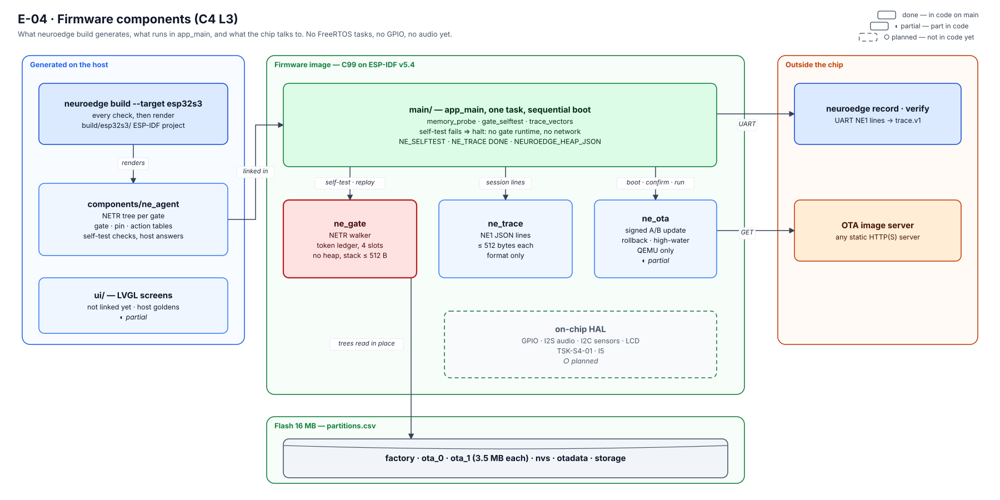
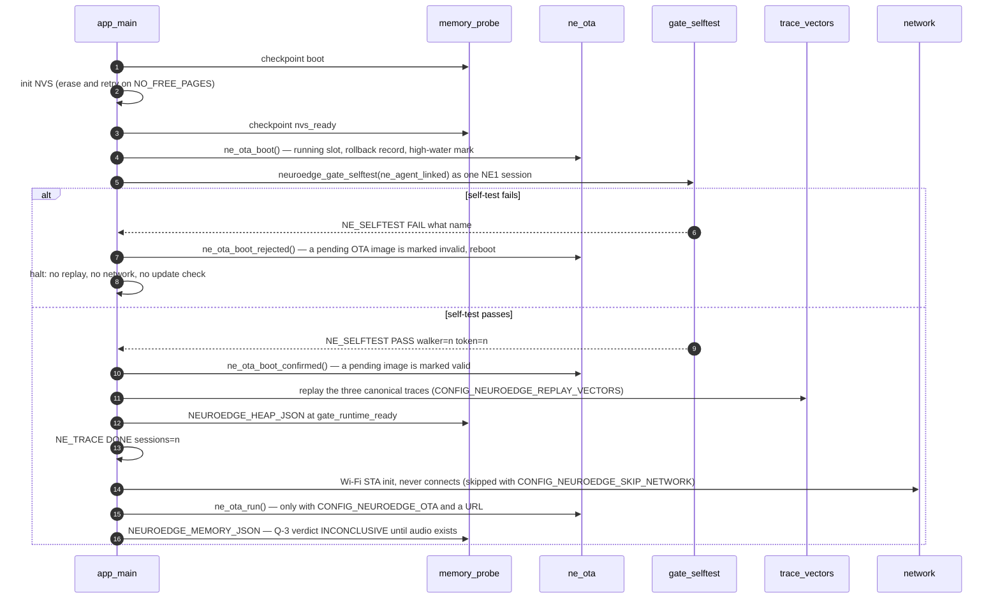
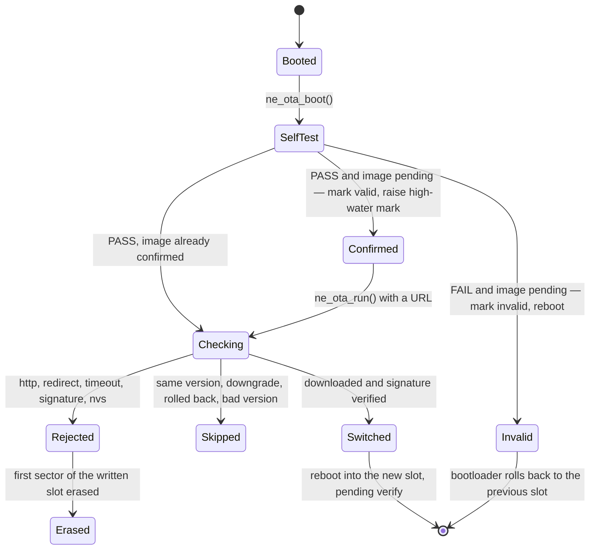

# 04 · Thành phần firmware ESP32-S3 (C4 L3)

> **Phạm vi:** firmware trong `targets/esp32s3/` — các component, trình tự khởi động, bộ nhớ, OTA,
> giao diện. **Nguồn:** mã C trong `targets/esp32s3/`, `python/neuroedge/engine/firmware.py`,
> `docs/spec/hal_mcu_review.md`, `docs/reports/memory_spike_report.md`.
> **Trạng thái:** `partial` — mọi thứ dưới đây chạy trên máy tính (C biên dịch trên host) và trên
> Espressif QEMU trong CI; chưa có bo mạch, và firmware **chưa điều khiển chân nào**.

**Đọc chương này để làm gì:** Dành cho kỹ sư nhúng và lập trình viên hệ thống cần hiểu cấu trúc firmware ESP32-S3, quy trình boot, bộ nhớ và cơ chế OTA. Trả lời câu hỏi: firmware trên chip chạy những gì, dùng bao nhiêu bộ nhớ, và tự kiểm tra ra sao trước khi kích hoạt phần cứng. Nên đọc [`02`](02-container-c4l2.md) trước để nắm ranh giới container, và đọc [`05`](05-code-gate-hal-c4l4.md) sau để hiểu chi tiết walker và token.

## 1. Sơ đồ thành phần


*Hình E-04 — Component firmware, dữ liệu sinh lúc build, và trình tự khởi động.*

**Cách đọc sơ đồ:** Các hộp thể hiện các component firmware và phân vùng bộ nhớ trên chip ESP32-S3; mũi tên nét liền là luồng khởi động và gọi hàm trực tiếp, mũi tên nét đứt là dữ liệu được sinh lúc build hoặc ghi ra ngoài. Điều cốt lõi cần nhớ: firmware chạy tuần tự trong `app_main`, self-test phải vượt qua 100% trước khi cho phép bất kỳ hành động vật lý nào.

## 2. Những gì firmware **không** có hôm nay

Nói trước, để không ai đọc sơ đồ thành nhiều hơn thực tế:

- **Không có task FreeRTOS nào được tạo.** Mọi bước chạy tuần tự trong `app_main`. Không có độ ưu
  tiên, hàng đợi hay ghim nhân.
- **Không có âm thanh.** Không I2S, codec, AEC, VAD, Opus hay ESP-SR — chỉ một `TODO(TSK-S1-10)`
  trong `main/main.c`. Thoại trên chip là increment I5.
- **Không điều khiển GPIO.** Bảng chân của agent mang **tên** chân, chưa có số GPIO; HAL trên chip
  là TSK-S4-01.
- **Wi-Fi được khởi động nhưng không bao giờ kết nối** (không có `esp_wifi_connect`): mạng chỉ được
  dựng để đo chi phí bộ nhớ của nó (`TODOS.md` #50).
- **Giao diện LVGL không được link vào firmware** (§7). Phân vùng `storage` không được mount.

## 3. Danh mục component

| Component | Đường dẫn | Trách nhiệm | Phụ thuộc | Trạng thái |
|:---|:---|:---|:---|:---|
| `main` | `main/` | Trình tự khởi động; bộ đo bộ nhớ (`memory_probe.c`); self-test gate (`gate_selftest.c`); phát lại ba vết ghi chuẩn mực (`trace_vectors.c`) | mọi component dưới | `done` |
| `ne_gate` | `components/ne_gate/` | Walker cây `NETR` v1 (`ne_walker.c`) và sổ token (`ne_token.c`); C99 thuần, không cấp phát, không biến toàn cục, không đệ quy | — | `done` |
| `ne_trace` | `components/ne_trace/` | Định dạng dòng vết ghi `NE1 {…}` ≤ 512 byte; chỉ định dạng, ứng dụng ghi ra UART | `ne_gate` | `done` |
| `ne_agent` | `components/ne_agent/` (**sinh ra**) | Phần riêng của agent: cây `NETR` mỗi gate, bảng gate · chân · action, phép kiểm self-test kèm đáp án của engine host | `ne_gate`, `ne_trace` | `done` |
| `ne_ota` | `components/ne_ota/` | Cập nhật A/B có ký, rollback, chặn hạ cấp; chính sách là C99 thuần (`ne_ota_policy.c`), phần ESP-IDF ở `ne_ota.c` | ESP-IDF `app_update`, `esp_https_ota`, `nvs_flash`… | `partial` — trên QEMU |
| `ne_ui` | `ui/` (**không link**) | Chín màn hình LVGL, tiếng Việt và tiếng Anh | LVGL v9.6 | `partial` — chỉ build trên host |

`ne_gate`, `ne_trace`, `ne_agent` biên dịch với `-std=c99 -Wall -Wextra -Wconversion -Werror`.

### Thành phần quy hoạch

| Đường dẫn quy hoạch | Task | Thành phần (là gì) và mục đích (vì sao cần) | Kiến trúc đích |
|:---|:---|:---|:---|
| `targets/esp32s3/hal/` | TSK-S4-01 | Hiện thực 5 nguyên thủy HAL trên ESP-IDF; cần để điều khiển phần cứng thật thay vì giả lập | [`15`](15-target-architecture.md) §2.1 |
| `targets/esp32s3/drivers/` | TSK-S4-03 | Driver `digital.out` và `sensor.read` trên chân thật; cần để kích xung actuator và đọc cảm biến trên bo mạch Box-3 | [`15`](15-target-architecture.md) §2.1 |
| `targets/esp32s3/audio/` | TSK-S5-01 | Tích hợp WebRTC AEC, libfvad (VAD), Opus streaming; cần để khử vang, phát hiện tiếng nói và nén âm thanh | [`15`](15-target-architecture.md) §2.1 |
| `targets/esp32s3/drivers/audio_path.c` | TSK-S5-02 | Driver đường dẫn audio thu/phát I2S (ES8311/ES7210); cần để giao tiếp với codec âm thanh phần cứng của Box-3 | [`15`](15-target-architecture.md) §2.1 |
| `targets/esp32s3/fsm/voice_fsm.c` | TSK-S5-03 | Hiện thực C của máy trạng thái hội thoại (`voice_fsm.md`); cần để điều phối lượt thoại thời gian thực trực tiếp trên chip | [`15`](15-target-architecture.md) §2.1 |
| `targets/esp32s3/fsm/actuator_abort.c` | TSK-S5-04 | Logic thu hồi lệnh actuator chưa thực thi khi bị cắt lời (barge-in); cần để huỷ lệnh actuator chưa giao trong ≤ 20 ms và đóng token khi bị cắt lời ([`voice_fsm.md`](../../spec/voice_fsm.md) §5.2) | [`15`](15-target-architecture.md) §2.1 |
| `targets/esp32s3/audio/provider_client.c` | TSK-S5-06 | Client streaming âm thanh lên provider cloud; cần để truyền nhận luồng STT/TTS từ vi điều khiển | [`15`](15-target-architecture.md) §2.1 |
| `targets/esp32s3/fallback/` | TSK-S5-07 | Bộ nhận diện lệnh cố định cục bộ; cần để thiết bị vẫn lượng giá gate và hành động an toàn khi mất Internet | [`15`](15-target-architecture.md) §2.1 |
| `targets/esp32s3/security/` | TSK-S6-05 | Secure Boot, mã hoá flash, nút ngắt micro vật lý; cần để bảo vệ toàn vẹn firmware và quyền riêng tư | [`15`](15-target-architecture.md) §2.1 |

Hiện tại firmware chỉ có một `app_main` tuần tự; mô hình task FreeRTOS (số lượng task, độ ưu tiên, hàng đợi và ghim nhân) cho đường thoại chưa được thiết kế (→ [`15`](15-target-architecture.md) §2.2). Firmware cho node robot MCU ngoại vi thứ hai (RP2350, TSK-W3-07 tại `targets/rp2350/`, chạy walker gate và sổ token C99 độc lập trên node tay máy — draft robot §9.4) xem [`15`](15-target-architecture.md) §4.3.

### 3.1 `ne_gate` — walker và sổ token

```c
/* ne_walker.h — đọc cây tại chỗ trong bộ nhớ của người gọi, không chép */
ne_status ne_tree_load(ne_tree *tree, const uint8_t *buf, uint32_t len);
ne_status ne_evaluate(const ne_tree *tree, const ne_fact *facts, const ne_arg_value *args,
                      int confirmed, ne_result *out);
ne_status ne_decide(const ne_tree *tree, const ne_fact *facts, const ne_arg_value *args,
                    int confirmed, ne_degraded degraded, ne_result *out);

/* ne_token.h — bản thiết bị của actions/token.py; sổ do người gọi cấp phát */
ne_token_status ne_ledger_init(ne_ledger *ledger, uint32_t boot_id);
ne_token_status ne_token_issue(ne_ledger *ledger, const ne_tree *tree, uint32_t pin_mask,
                               uint32_t now_ms, ne_random_fn fill_random, ne_token *out);
ne_token_reason ne_token_authorize(ne_ledger *ledger, const ne_token *token, uint32_t pin,
                                   uint32_t now_ms);
void ne_token_close(ne_ledger *ledger, const ne_token *token);
```

- **Dữ kiện đi vào walker là chỉ số trong miền giá trị**, không phải chuỗi: chip không bao giờ so
  chuỗi. Mỗi `ne_fact` mang `present`, `in_domain`, `index`, và độ tin cậy nếu có.
- **Sổ token có bốn khe** (`NE_TOKEN_SLOTS`), nonce 16 byte, TTL = `p95_latency_ms × 3`, tuổi token
  tính `(uint32_t)(now − issued)` nên an toàn khi bộ đếm mili-giây quay vòng. `boot_id` đóng vai
  `process_instance_id` của host: token từ lần khởi động trước ⇒ hết hạn.
- **Sổ đầy thì từ chối** (`NE_TOKEN_ERR_FULL`), không bao giờ đẩy token đang sống ra.
- Mọi lý do từ chối ánh xạ về cùng mã lỗi với host: không phải token, token lạ, chân không được cấp
  ⇒ `NE1001`; dùng lại, hết hạn ⇒ `NE1002`.

Bố cục byte của `NETR` và thuật toán duyệt: [`05`](05-code-gate-hal-c4l4.md).

### 3.2 `ne_agent` — component sinh cho từng agent

`neuroedge build --target esp32s3` (`engine/firmware.py::render_component`) sinh ra:

| Tệp | Nội dung |
|:---|:---|
| `gates/<key>.netree.h` | `static const uint8_t ne_tree_<key>[]` — byte `NETR` v1 của gate, nằm trong flash |
| `ne_agent.c` | Bảng gate (nhãn, digest, chữ `on_block` mà `NETR` không mang — `TODOS.md` #36), bảng chân (tên), bảng action (gate, mặt nạ chân), và **các phép kiểm self-test** |
| `include/ne_agent.h` | Kiểu dữ liệu; `NE_AGENT_VERSION`, `NE_AGENT_BOARD`, `NE_AGENT_LANGUAGE`; một ký hiệu `ne_agent_linked` |

Phép kiểm self-test sinh cho mỗi gate: trường hợp cơ sở; với mỗi tiêu chí mọi giá trị trong miền,
dữ kiện vắng, giá trị ngoài miền, và các biến thể độ tin cậy nếu có ngưỡng; một trường hợp mất mạng;
và bản "đã xác nhận" cho gate `ask`. **Đáp án của mỗi phép kiểm do chính engine Python tính lúc
build** — đó là điều làm self-test chứng minh được tương đương host ↔ chip.

## 4. Trình tự khởi động

Mọi dòng đánh dấu (`NE_SELFTEST`, `NE_TRACE DONE`, `NEUROEDGE_*_JSON`, `NE_OTA`) được in ở cột 0,
không có tiền tố log, để script CI neo được bằng `^`.


```mermaid
sequenceDiagram
    autonumber
    participant M as app_main
    participant P as memory_probe
    participant O as ne_ota
    participant S as gate_selftest
    participant V as trace_vectors
    participant N as network
    M->>P: checkpoint boot
    M->>M: init NVS (erase and retry on NO_FREE_PAGES)
    M->>P: checkpoint nvs_ready
    M->>O: ne_ota_boot() — running slot, rollback record, high-water mark
    M->>S: neuroedge_gate_selftest(ne_agent_linked) as one NE1 session
    alt self-test fails
        S-->>M: NE_SELFTEST FAIL what name
        M->>O: ne_ota_boot_rejected() — a pending OTA image is marked invalid, reboot
        M->>M: halt: no replay, no network, no update check
    else self-test passes
        S-->>M: NE_SELFTEST PASS walker=n token=n
        M->>O: ne_ota_boot_confirmed() — a pending image is marked valid
        M->>V: replay the three canonical traces (CONFIG_NEUROEDGE_REPLAY_VECTORS)
        M->>P: NEUROEDGE_HEAP_JSON at gate_runtime_ready
        M->>M: NE_TRACE DONE sessions=n
        M->>N: Wi-Fi STA init, never connects (skipped with CONFIG_NEUROEDGE_SKIP_NETWORK)
        M->>O: ne_ota_run() — only with CONFIG_NEUROEDGE_OTA and a URL
        M->>P: NEUROEDGE_MEMORY_JSON — Q-3 verdict INCONCLUSIVE until audio exists
    end
```

**Cách đọc sơ đồ:** Các cột thẳng đứng đại diện cho `app_main` và các module chức năng nội bộ firmware; mũi tên nét liền là lời gọi hàm đồng bộ, mũi tên nét đứt là kết quả trả về; khối `alt` phân nhánh theo kết quả self-test. Điều cốt lõi cần nhớ: nếu self-test thất bại, ảnh OTA đang chờ (nếu có) bị đánh dấu không hợp lệ và máy khởi động lại để bootloader quay về khe trước; không có ảnh chờ thì firmware dừng — không replay, không mạng, không action.

Self-test gồm bốn giai đoạn: (1) mỗi cây nạp được và digest khớp bản host biên dịch; (2) walker
quyết từng phép kiểm đúng như engine host, từng trường một; (3) token của mỗi action mở đúng chân
của nó đúng một lần, từ chối chân khác, từ chối token bị sửa; (4) sổ đầy thì từ chối, đóng một token
thì khe được dùng lại. Thất bại một chỗ ⇒ firmware dừng: không runtime gate, không action, không mạng.

| Tuỳ chọn Kconfig | Mặc định | Tác dụng |
|:---|:---:|:---|
| `CONFIG_NEUROEDGE_QEMU` | n | `device_id = "qemu"` thay vì `esp32s3-<MAC>` |
| `CONFIG_NEUROEDGE_SKIP_NETWORK` | n | Bỏ khởi động Wi-Fi (lớp `sdkconfig.qemu` bật) |
| `CONFIG_NEUROEDGE_REPLAY_VECTORS` | y | Phát lại ba vết ghi chuẩn mực sau self-test |
| `CONFIG_NEUROEDGE_OTA` | n | Bật đường cập nhật; Kconfig và `#error` từ chối nếu thiếu kiểm chữ ký hoặc rollback |
| `CONFIG_NEUROEDGE_OTA_ETH` | n | Mạng Ethernet ảo `open_eth` của QEMU cho OTA |

## 5. Bộ nhớ và flash

**Bảng phân vùng** (`partitions.csv`, flash 16 MB): `nvs` 16 KiB · `otadata` 8 KiB · `phy_init` 4 KiB
· `factory`, `ota_0`, `ota_1` mỗi khe 3,5 MiB · `storage` (spiffs) 5 MiB, chưa dùng. Khe 3,5 MiB
chính là trần kích thước firmware của Q-3.

**Lớp cấu hình** chồng lên nhau qua `SDKCONFIG_DEFAULTS`:

| Lớp | Đặt gì |
|:---|:---|
| `sdkconfig.defaults` | Flash 16 MB, bảng phân vùng riêng, PSRAM octal 80 MHz, FreeRTOS 1000 Hz, tối ưu hiệu năng |
| `sdkconfig.qemu` | Bỏ mạng, cờ QEMU, bỏ qua khi không tìm thấy PSRAM |
| `sdkconfig.ota` | OTA, rollback của bootloader, ký ảnh RSA-3072 và kiểm chữ ký khi cập nhật (chưa Secure Boot), stack task chính 8 KB |
| `sdkconfig.qemu_ota` | URL máy chủ thử, `open_eth`, tắt tăng tốc phần cứng AES/SHA/MPI (mô hình GDMA của QEMU chưa đủ) |

**Kỷ luật bộ nhớ tĩnh**, được test trên từng PR (`test_c_walker.py`, `test_c_token.py`,
`test_c_trace.py`): tệp đối tượng của walker, sổ token và bộ định dạng vết ghi **không có** ký hiệu
`.data`/`.bss`; mỗi hàm dùng stack ≤ 512 byte. Bộ nhớ trạng thái (sổ token, bộ đệm dòng) do ứng
dụng cấp phát, không bao giờ nằm trong component.

**Ngân sách Q-3** (SRAM ≥ 120 KB và PSRAM ≥ 2 MB cho ứng dụng, firmware ≤ 3,5 MB) được CI kiểm
từng phần: kích thước ảnh, RAM tĩnh còn lại của cấu hình bo mạch, heap lúc khởi động trên QEMU. Số
đo và điều kiện đo ở [`memory_spike_report.md`](../../reports/memory_spike_report.md) §4.1 — đó là
**sàn**, không phải phán quyết Q-3, vì chưa có bo mạch và chưa có âm thanh.

## 6. `ne_ota` — cập nhật có ký


```mermaid
stateDiagram-v2
    [*] --> Booted
    Booted --> SelfTest: ne_ota_boot()
    SelfTest --> Confirmed: PASS and image pending — mark valid, raise high-water mark
    SelfTest --> Invalid: FAIL and image pending — mark invalid, reboot
    Invalid --> [*]: bootloader rolls back to the previous slot
    Confirmed --> Checking: ne_ota_run() with a URL
    SelfTest --> Checking: PASS, image already confirmed
    Checking --> Skipped: same version, downgrade, rolled back, bad version
    Checking --> Rejected: http, redirect, timeout, signature, nvs
    Rejected --> Erased: first sector of the written slot erased
    Checking --> Switched: downloaded and signature verified
    Switched --> [*]: reboot into the new slot, pending verify
```

**Cách đọc sơ đồ:** Các nút bo tròn đại diện cho các trạng thái của vòng đời ảnh cập nhật OTA; mũi tên nét liền là bước chuyển trạng thái kèm điều kiện kích hoạt. Điều cốt lõi cần nhớ: ảnh mới nạp chỉ được xác nhận (`Confirmed`) khi vượt qua self-test lúc khởi động; sai chữ ký, lỗi tải hoặc quá hạn ⇒ `Rejected`: xoá sector đầu của khe vừa ghi, máy vẫn chạy khe hiện tại; chỉ self-test hỏng trên ảnh đang chờ mới làm bootloader quay về khe trước.

- **Quyết định cài hay không** là một hàm C thuần, `ne_ota_should_install(running, remote,
  rolled_back, high_water)`, được test trên host dưới ASan/UBSan và dùng nguyên trong firmware.
  Thứ tự: thiếu phiên bản ⇒ bỏ; phiên bản không phải `MAJOR.MINOR.PATCH` ⇒ bỏ; trùng ⇒ bỏ; trùng bản
  vừa bị quay về ⇒ bỏ; không cao hơn mốc nước cao ⇒ bỏ (hạ cấp); còn lại ⇒ cài.
- **NVS** (namespace `ne_ota`): `url` (rỗng ⇒ tắt OTA), `best` (mốc nước cao — phiên bản cao nhất
  đã vượt self-test), `rollback` (phiên bản vừa bị quay về). Không đọc được NVS ⇒ từ chối, không đoán.
- **Mọi lần từ chối sau khi đã ghi byte** (sai chữ ký, tải dở, quá hạn, lỗi tải) xoá sector đầu của
  khe vừa ghi, để không lần khởi động nào rơi vào ảnh bị từ chối.
- **Giới hạn:** chưa có Secure Boot và chống hạ cấp bằng eFuse (TSK-S6-05); OTA không cập nhật
  bootloader; ảnh treo mà không tự khởi động lại chỉ quay về ở lần tắt nguồn bật lại. Thủ tục và ý
  nghĩa từng dòng `NE_OTA`: [`docs/user/nap-firmware.md`](../../user/nap-firmware.md) §6.

## 7. `ne_ui` — giao diện thiết bị (chưa link)

Chín màn hình (`ne_ui_show_boot`, `idle`, `voice`, `confirm`, `verdict`, `degraded`, `sensor`, `ota`,
`fatal`) trên panel 320×240 RGB565. Mã là C99 trên API LVGL v9.6, không header ESP-IDF, nên cùng mã
đó build trên máy tính để so **ảnh golden** mỗi PR (33 trường hợp × 2 ngôn ngữ, harness chạy dưới
ASan/UBSan). Vẽ tất định: không đồng hồ, không ngẫu nhiên, không hoạt ảnh. Chữ của agent là dữ liệu:
UTF-8 kiểm chặt, cắt có dấu `…`. Ngôn ngữ: `ne_ui_init` trả `false` và không vẽ gì nếu ngôn ngữ không
có bảng chữ. Đặc tả: [`docs/spec/ui.md`](../../spec/ui.md). Việc nối giao diện vào firmware chờ driver
màn hình (TSK-S4-01); project sinh cho agent hôm nay không chép `ui/`.

## 8. Build và kiểm

| Kiểm gì | Bằng gì | Ở đâu |
|:---|:---|:---|
| Walker, sổ token, bộ vết ghi khớp host; bộ nhớ tĩnh; fuzz tệp cây | C biên dịch trên host (gcc/clang, ASan/UBSan) | `pytest` job `tests` |
| Chính sách OTA, quy tắc phiên bản C = Python | C trên host | `pytest` job `tests` |
| Firmware boot, self-test, vết ghi, heap | ESP-IDF v5.4 + QEMU (`scripts/qemu_boot.sh`) | job `firmware-qemu` |
| Kích thước ảnh, RAM tĩnh cấu hình bo mạch | `scripts/check_firmware_size.py` | job `firmware-size` |
| Firmware sinh cho một agent mới boot được, bản OTA ký đúng phiên bản | `neuroedge build` + `idf.py` + QEMU + `scripts/build_ota_layer.sh` | job `agent-firmware` |
| OTA bảy pha a–g | `scripts/qemu_ota.sh` | job `ota-rollback` |
| Ảnh golden giao diện | `scripts/run_ui_golden.sh` | job `ui-golden` |
| Vết ghi UART thành `trace.v1`, `verify` trên chip | `neuroedge record --port`, `verify --targets esp32s3` | job `uart-trace` |

Danh sách đầy đủ và điều kiện kích hoạt từng job: `CHANGELOG.md` §2.5.
