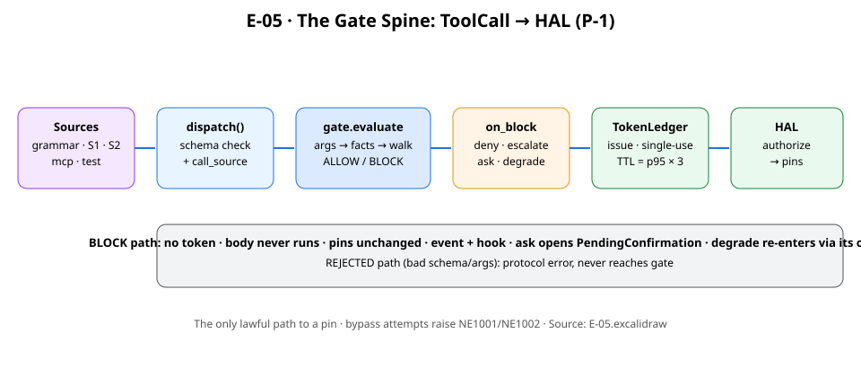
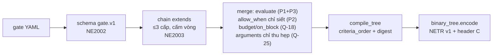
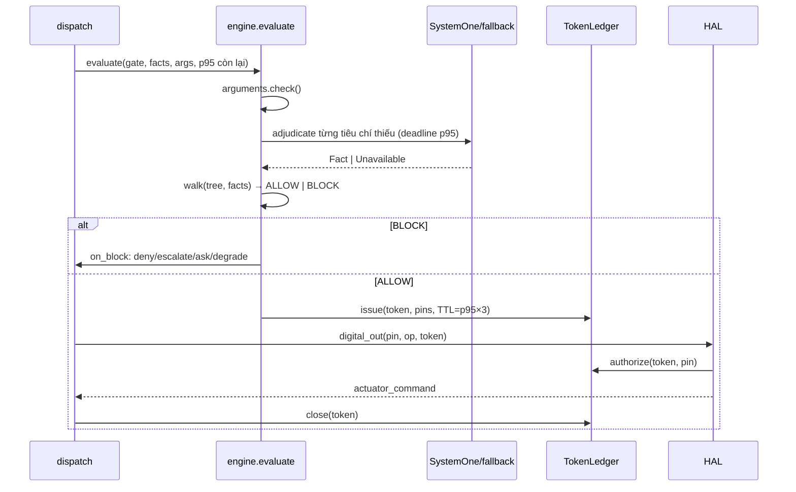

# 05 · Mức mã: gate → token → HAL (C4 L4)

> Trạng thái: `done`. Đọc cùng poster E-05 và `09-adr.md`
> (Q-9, Q-18, Q-23, Q-25, Q-26).

## 1. Phân giải gate (build/lint/resolve)

- Con định nghĩa lại tiêu chí đã kế thừa → từ chối (P1). `allow_when` dạng
  chuỗi CEL trong chuỗi kế thừa → từ chối (chỉ gate độc lập được CEL, và lint
  hiện từ chối cả CEL độc lập cho tới khi có trình biên dịch — fail-closed).
- `p95` con ≤ cha; chuỗi đã `closed` thì con không được `fail: open`;
  con không tự đưa vào `degrade` mới (Q-18). Tham số ngoài khoảng do gate
  chặn (`argument_out_of_range`), không phải REJECTED (Q-25).

## 2. Lượng giá lúc chạy (một lượt `c.do()`)

- `BLOCK` → không token, thân `@action` không chạy, chân không đổi. `degrade`
  chạy `fallback_action` **qua gate của chính nó** (đệ quy, chống vòng).
  `ask` có `confirms` thì mở `PendingConfirmation` dùng một lần, hết hạn theo
  `max(p95×3, 10s)`; xác nhận chỉ từ người qua thiết bị (Q-26).
- Token dùng một lần mỗi chân; dùng lại/quá TTL/khác tiến trình → NE1002,
  chân không kích, ghi `actuator_command_rejected`. Lỗi hợp đồng (NE1001)
  **ném ra**, không biến thành BLOCK.

## 3. Bố cục NETR v1 trên thiết bị (RFC-0003)

Header 64 B (`NETR`, layout v1, `gate_digest[32]`, node/arg/enum count,
`on_block`, `fail_open`, p95, `confirm_mask`, CRC32) + node 24 B ×n (kind,
domain size, offsets, `admitted_mask`, `confidence_floor`) + arg/enum +
strings NUL. Tối đa ~19 KB flash. `ne_tree_load` từ chối magic/version/size/
CRC/limit sai. Walker không cấp phát — đây là lý do gate chạy được trên chip
$5 mà vẫn fail-closed.
