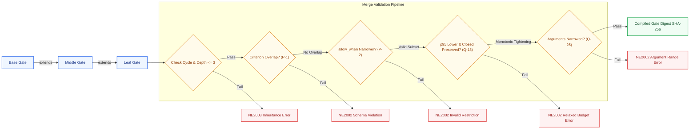
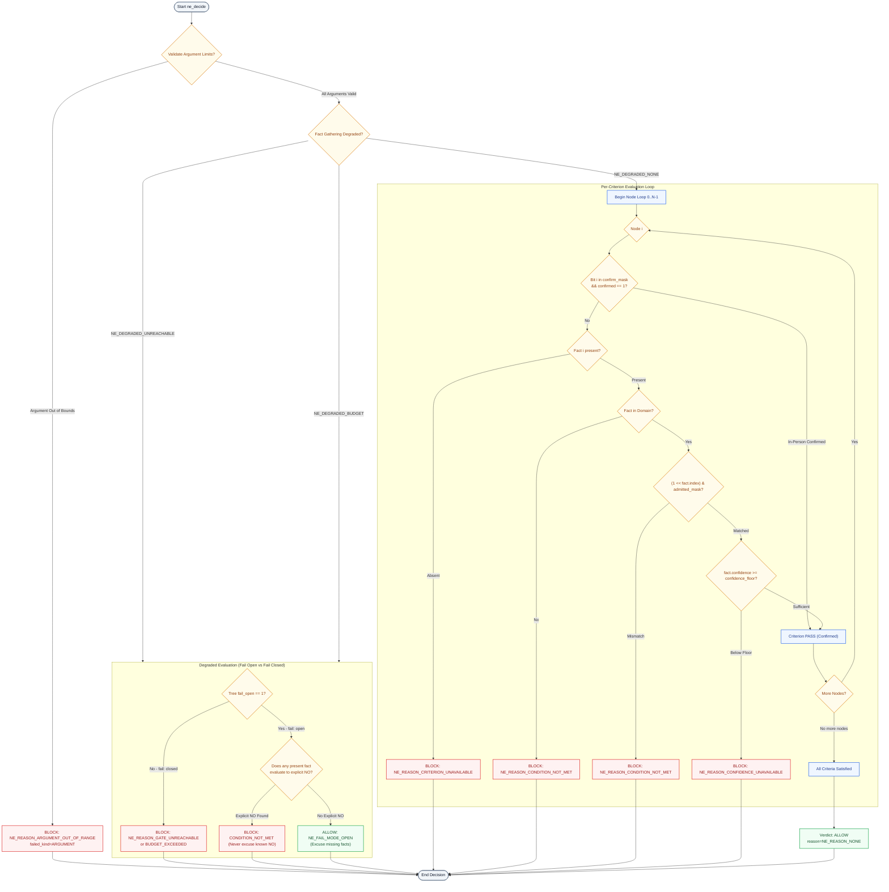
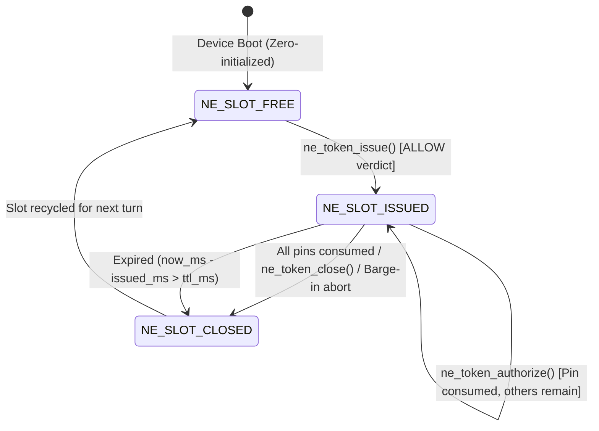
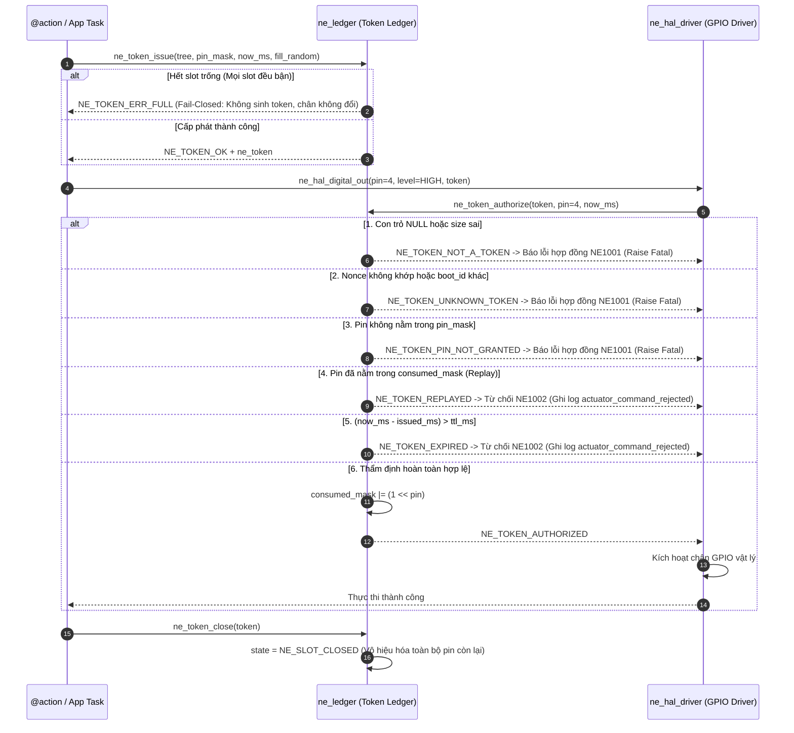

# 05 · Mức mã: gate → token → HAL (C4 L4)

> **Trạng thái:** `done` · Chuẩn hóa kiến trúc mức mã (C4 L4)  
> **Tài liệu tham chiếu:** Poster [E-05](../assets/svg/E-05-gate-spine.svg), [09-adr.md](file:///Users/minhlt/Downloads/Projects/neuroedge-init/docs/architecture/vi/09-adr.md) (ADR Q-9, Q-18, Q-23, Q-25, Q-26), [RFC-0003](file:///Users/minhlt/Downloads/Projects/neuroedge-init/docs/rfcs/RFC-0003-binary-decision-tree.md), [RFC-0005](file:///Users/minhlt/Downloads/Projects/neuroedge-init/docs/rfcs/RFC-0005-gate-argument-limits.md), [RFC-0006](file:///Users/minhlt/Downloads/Projects/neuroedge-init/docs/rfcs/RFC-0006-on-block-ask-confirms.md)  
> **Mã nguồn thực thi:** Python [`python/neuroedge/engine/`](file:///Users/minhlt/Downloads/Projects/neuroedge-init/python/neuroedge/engine/) & C99 [`targets/esp32s3/components/ne_gate/`](file:///Users/minhlt/Downloads/Projects/neuroedge-init/targets/esp32s3/components/ne_gate/)

---

## 1. Bản đồ tổng thể chuỗi Gate Spine (C4 L4)

Kiến trúc mức mã thực thi nguyên lý **P-1 (Fail-Closed Default)** và **P-3 (Target Equivalence)**: Mọi quyết định kích hoạt phần cứng (Actuator) đều phải đi qua cây quyết định nhị phân xác định, sinh ra Token dùng một lần có hạn mức thời gian và chân định danh trước khi HAL cho phép chuyển trạng thái GPIO.

```mermaid
flowchart TD
    classDef bld fill:#eff6ff,stroke:#2563eb,color:#1e3a8a,stroke-width:1.5px;
    classDef hst fill:#fff7ed,stroke:#ea580c,color:#7c2d12,stroke-width:1.5px;
    classDef dev fill:#f0fdf4,stroke:#16a34a,color:#14532d,stroke-width:1.5px;
    classDef sec fill:#fef2f2,stroke:#dc2626,color:#991b1b,stroke-width:1.5px;

    subgraph BuildTime["1. Build Time (Compiler Pipeline)"]
        Y["gate.yaml"]:::bld -->|Schema Check NE2002| SC["Schema Validation"]:::bld
        SC -->|Inheritance Resolve NE2003| IR["Extends Merger &lt;= 3 levels"]:::bld
        IR -->|Rule Invariants P1/P2/Q-18/Q-25| MR["Merged Gate Model"]:::bld
        MR -->|Compile Decision Tree| CD["Deterministic Tree Optimizer"]:::bld
        CD -->|RFC-0003 Encoder| BE["NETR v1 Binary / C Header"]:::bld
    end

    subgraph HostRuntime["2. Host Runtime (c.do())"]
        AC["@action Dispatcher"]:::hst -->|Evaluate Request| GE["engine.evaluate()"]:::hst
        GE -->|Check Arguments| AC2["Argument Range Validator"]:::hst
        GE -->|Resolve Facts via Adjudicator| AD["FactSource / SystemOne"]:::hst
        AD -->|Facts + Latency Check| WT["Decision Tree Walker"]:::hst
        WT -->|Verdict ALLOW| TL["TokenLedger.issue()"]:::sec
        WT -->|Verdict BLOCK| OB["on_block: deny/ask/degrade"]:::sec
        TL -->|Ephemeral Token| AH["actions.conversation"]:::hst
    end

    subgraph DeviceRuntime["3. Device Runtime (Zero-Alloc C99 Walker)"]
        FL["Flash Memory Mapped NETR v1"]:::dev -->|ne_tree_load()| TR["ne_tree Struct View"]:::dev
        SN["Hardware Sensors / Facts"]:::dev -->|ne_decide()| DW["ne_evaluate Core"]:::dev
        DW -->|Status ALLOW| NL["ne_token_issue()"]:::sec
        NL -->|ne_token| DH["ne_token_authorize()"]:::sec
        DH -->|Pin Granted &amp; Consumed| GP["ESP32-S3 GPIO / Actuator Driver"]:::dev
    end

    BE -.->|Flash via OTA / Flash Tool| FL
    AH -->|HAL Driver Call| DH
```

---

## 2. Đường ống phân giải Gate (Build / Lint / Merge)

### 2.1. Quy tắc kế thừa và hợp nhất (Inheritance & Merge Invariants)

Quá trình hợp nhất Gate (`gate_resolver.py`) kiểm tra tính hợp lệ tĩnh của chuỗi kế thừa theo 5 bất biến:

1. **Độ sâu kế thừa giới hạn ($\le 3$ cấp):** Cấm kế thừa vòng lặp hoặc chuỗi vượt quá 3 cấp (báo lỗi `NE2003`).
2. **Bất biến định nghĩa lại tiêu chí (P-1 & Q-9):** Gate con **tuyệt đối không được** định nghĩa lại tiêu chí đã xuất hiện ở bất kỳ gate cha nào trong chuỗi kế thừa (`NE2002`).
3. **Thu hẹp điều kiện `allow_when` (P-2):** Gate con chỉ được phép siết chặt tập giá trị chấp nhận (`admitted` là tập con chặt chẽ hoặc bằng tập của cha) và nâng cao ngưỡng tin cậy (`confidence_floor` con $\ge$ cha).
4. **Kế thừa ngân sách & Fail Mode (ADR Q-18):**
   - $p95_{\text{con}} \le p95_{\text{cha}}$ (ngân sách thời gian chỉ có thể siết chặt hơn).
   - Nếu bất kỳ gate nào trong chuỗi kế thừa đặt `fail: closed`, gate con **không thể** mở lại thành `fail: open`.
   - Gate con không được tự ý giới thiệu hành động `degrade` mới nếu gate cha đã thiết lập hành vi cứu cánh khác.
5. **Thu hẹp tham số hành động (ADR Q-25 / RFC-0005):**
   - `minimum` chỉ có thể tăng lên ($\ge$).
   - `maximum` chỉ có thể giảm đi ($\le$).
   - `enum` chỉ có thể thu hẹp (tập con).
   - `max_length` chỉ có thể giảm đi ($\le$).
   - Tham số truyền vào vượt khoảng bị Gate chặn với lý do `argument_out_of_range` (trạng thái `BLOCK`), không ném lỗi `REJECTED` của tầng giao thức LLM.



---

## 3. Định dạng nhị phân NETR v1 trên thiết bị (RFC-0003)

Cây quyết định được biên dịch thành file nhị phân phẳng `.netree` hoặc mảng `const uint8_t` trong C header. Trình duyệt walker trên thiết bị đọc trực tiếp trên bộ nhớ flash (Memory Mapped I/O), không cấp phát bộ nhớ động (Zero Heap Allocation), không dùng đệ quy, không con trỏ toàn cục.

### 3.1. Bố cục bộ nhớ tổng thể (Memory Layout)

Mọi số nguyên đều là **Little-Endian**, các cấu trúc được căn lề tự nhiên (Naturally Aligned).

```
+------------------------------------------------------------------------+
| 1. Header (64 Bytes)                                                   |
+------------------------------------------------------------------------+
| 2. Node Records (24 Bytes * node_count) [Tối đa 32 nodes]               |
+------------------------------------------------------------------------+
| 3. Argument Limits (32 Bytes * arg_count) [Tối đa 16 args]             |
+------------------------------------------------------------------------+
| 4. Enum Values (16 Bytes * enum_count) [Tối đa 64 enums]               |
+------------------------------------------------------------------------+
| 5. String Table (UTF-8, NUL-terminated) [Tối đa 16,384 Bytes]          |
+------------------------------------------------------------------------+
```

### 3.2. Đặc tả chi tiết từng Byte Header (64 Bytes)

| Offset (Bytes) | Trường (Field) | Kiểu dữ liệu | Mô tả chi tiết |
| :--- | :--- | :--- | :--- |
| `0x00 - 0x03` | `magic` | `char[4]` | Bắt buộc là ASCII `"NETR"` (`0x4E, 0x45, 0x54, 0x52`). |
| `0x04 - 0x05` | `layout_version` | `uint16_t` | Phiên bản layout nhị phân (hiện tại cố định = `1`). |
| `0x06 - 0x07` | `header_size` | `uint16_t` | Kích thước header tính theo byte (cố định = `64`). |
| `0x08 - 0x27` | `gate_digest` | `uint8_t[32]`| Băm mật mã SHA-256 thô của Gate Canonical Definition. |
| `0x28 - 0x29` | `node_count` | `uint16_t` | Số lượng tiêu chí kiểm tra (`nodes`), $0 \le N \le 32$. |
| `0x2A - 0x2B` | `arg_count` | `uint16_t` | Số lượng tham số giới hạn (`arguments`), $0 \le A \le 16$. |
| `0x2C - 0x2D` | `enum_count` | `uint16_t` | Số lượng giá trị enum tham số, $0 \le E \le 64$. |
| `0x2E` | `on_block_action`| `uint8_t` | Hành vi khi BLOCK: `0`=deny, `1`=escalate, `2`=ask, `3`=degrade. |
| `0x2F` | `fail_open` | `uint8_t` | Hành vi lỗi degraded: `0` = fail-closed, `1` = fail-open. |
| `0x30 - 0x33` | `p95_latency_ms`| `uint32_t` | Ngân sách thời gian đánh giá tối đa theo hợp đồng (ms). |
| `0x34 - 0x37` | `confirm_mask` | `uint32_t` | Bitmask: Bit $i=1$ nghĩa là tiêu chí thứ $i$ có thể được con người xác nhận tại chỗ (RFC-0006). |
| `0x38 - 0x3B` | `strings_size` | `uint32_t` | Tổng kích thước bảng chuỗi UTF-8 (kèm ký tự `\0`), $\le 16384$. |
| `0x3C - 0x3F` | `crc32` | `uint32_t` | Mã kiểm tra CRC-32 (IEEE 802.3) của toàn bộ file khi trường này được điền bằng `0`. |

### 3.3. Đặc tả Node Record (24 Bytes)

Mỗi tiêu chí trong cây quyết định ứng với một bản ghi 24 Bytes:

| Offset | Trường | Kiểu dữ liệu | Ý nghĩa |
| :--- | :--- | :--- | :--- |
| `0x00` | `kind` | `uint8_t` | Kiểu tiêu chí: `0` = `bool`, `1` = `level`, `2` = `choice`. |
| `0x01` | `domain_size` | `uint8_t` | Số phần tử trong miền giá trị ($1 \le D \le 32$). |
| `0x02 - 0x03` | `name_off` | `uint16_t` | Byte offset trỏ vào String Table lưu tên định danh tiêu chí. |
| `0x04 - 0x07` | `admitted_mask`| `uint32_t` | Bitmask các giá trị được phép: Bit $j=1$ nghĩa là giá trị thứ $j$ trong domain được chấp thuận (`ALLOW`). |
| `0x08 - 0x0F` | `confidence_floor` | `double` (f64)| Ngưỡng độ tin cậy tối thiểu ($0.0 \dots 1.0$, IEEE 754). |
| `0x10 - 0x11` | `domain_off` | `uint16_t` | Offset trong String Table bắt đầu chuỗi các giá trị domain liên tiếp (mỗi giá trị kết thúc bằng `\0`). |
| `0x12 - 0x13` | `reserved16` | `uint16_t` | Cố định = `0` (dự phòng căn lề). |
| `0x14 - 0x17` | `reserved32` | `uint32_t` | Cố định = `0` (dự phòng căn lề). |

### 3.4. Đặc tả Argument Limit Record (32 Bytes) & Enum Record (16 Bytes)

- **Cấu trúc Argument (32 Bytes):**
  - `0x00 - 0x01`: `name_off` (`uint16_t`) - Offset tên tham số trong String Table.
  - `0x02`: `type` (`uint8_t`) - `0`=string, `1`=integer, `2`=number, `3`=boolean.
  - `0x03`: `flags` (`uint8_t`) - Bitmask cờ giới hạn (`0x01`=HAS_MIN, `0x02`=HAS_MAX, `0x04`=HAS_ENUM, `0x08`=HAS_MAX_LENGTH).
  - `0x04 - 0x05`: `enum_first` (`uint16_t`) - Vị trí phần tử đầu tiên trong Enum Table.
  - `0x06 - 0x07`: `enum_count` (`uint16_t`) - Số lượng phần tử enum của tham số này.
  - `0x08 - 0x0B`: `max_length` (`uint32_t`) - Giới hạn độ dài chuỗi tối đa.
  - `0x0C - 0x0F`: `reserved` (`uint32_t`) - Cố định = `0`.
  - `0x10 - 0x17`: `minimum` (`double`) - Giá trị cận dưới.
  - `0x18 - 0x1F`: `maximum` (`double`) - Giá trị cận trên.

- **Cấu trúc Enum (16 Bytes):**
  - `0x00 - 0x07`: `number` (`double`) - Giá trị số thực (nếu enum dạng số).
  - `0x08 - 0x0B`: `str_off` (`uint32_t`) - Offset chuỗi trong String Table (nếu enum dạng chuỗi).
  - `0x0C - 0x0F`: `str_len` (`uint32_t`) - Độ dài byte UTF-8 của chuỗi enum.

---

## 4. Định nghĩa C Structs trên Firmware (`targets/esp32s3/components/ne_gate/`)

Mã nguồn C99 được kiểm toán chặt chẽ, đảm bảo tính bất biến trên kiến trúc 32-bit Xtensa / RISC-V:

```c
/* ne_walker.h — Định nghĩa cấu trúc cây quyết định nhị phân */

typedef enum {
    NE_OK = 0,
    NE_ERR_ARGUMENT = 1,   /* Con trỏ NULL hoặc tham số không hợp lệ */
    NE_ERR_SIZE = 2,       /* Kích thước file nhỏ hơn header hoặc không khớp */
    NE_ERR_MAGIC = 3,      /* Sai Magic (khác "NETR") */
    NE_ERR_VERSION = 4,    /* Phiên bản layout không hỗ trợ (khác 1) */
    NE_ERR_CRC = 5,        /* Sai mã kiểm tra CRC-32 */
    NE_ERR_LIMITS = 6,     /* Vượt giới hạn NE_MAX_* (nodes > 32, args > 16) */
    NE_ERR_STRUCTURE = 7   /* Lỗi cấu trúc nội tại (offset chuỗi tràn ngoài bảng) */
} ne_status;

typedef enum { NE_ALLOW = 0, NE_BLOCK = 1 } ne_verdict;

typedef enum {
    NE_REASON_NONE = 0,
    NE_REASON_CONDITION_NOT_MET = 1,      /* Sự thật không thỏa mãn admitted_mask */
    NE_REASON_CRITERION_UNAVAILABLE = 2,  /* Thiếu dữ kiện sự thật */
    NE_REASON_CONFIDENCE_UNAVAILABLE = 3, /* Độ tin cậy dưới ngưỡng confidence_floor */
    NE_REASON_ARGUMENT_OUT_OF_RANGE = 4,  /* Tham số vi phạm min/max/enum/max_length */
    NE_REASON_GATE_UNREACHABLE = 5,       /* Nguồn sự thật ngoại vi mất kết nối (Q-14) */
    NE_REASON_BUDGET_EXCEEDED = 6         /* Thu thập sự thật quá ngân sách p95 */
} ne_reason;

typedef struct {
    const uint8_t *base;        /* Con trỏ vùng nhớ flash memory mapped */
    uint32_t size;              /* Kích thước tổng cộng của blob NETR */
    uint16_t node_count;        /* Số lượng tiêu chí */
    uint16_t arg_count;         /* Số lượng giới hạn tham số */
    uint16_t enum_count;        /* Số lượng enum */
    uint8_t on_block_action;    /* Hành động on_block (0..3) */
    uint8_t fail_open;          /* Cờ fail_open */
    uint32_t p95_latency_ms;    /* Thời hạn ngân sách */
    uint32_t confirm_mask;      /* Mask các tiêu chí người có thể xác nhận */
    uint32_t strings_size;      /* Kích thước bảng chuỗi */
    const uint8_t *gate_digest; /* Con trỏ trỏ tới 32 bytes SHA-256 */
} ne_tree;

typedef struct {
    uint8_t present;            /* 1 nếu có dữ kiện, 0 nếu không có */
    uint8_t in_domain;          /* 1 nếu giá trị nằm trong domain của node */
    uint8_t index;              /* Chỉ số nguyên của giá trị trong domain */
    uint8_t has_confidence;     /* 1 nếu có kèm độ tin cậy */
    double confidence;          /* Điểm tin cậy (0.0 .. 1.0) */
} ne_fact;

typedef struct {
    ne_verdict verdict;         /* NE_ALLOW hoặc NE_BLOCK */
    ne_reason reason;           /* Nguyên nhân đưa ra phán quyết */
    ne_failed_kind failed_kind; /* Thất bại do CRITERION hay ARGUMENT */
    uint8_t failed_index;       /* Chỉ số tiêu chí hoặc tham số vi phạm đầu tiên */
    uint8_t answerable;         /* 1 nếu câu hỏi BLOCK có thể được người gỡ bỏ */
    uint8_t fail_mode;          /* NE_FAIL_MODE_OPEN hoặc NE_FAIL_MODE_CLOSED */
    uint32_t confirmed_mask;    /* Mask các tiêu chí đã được xác nhận */
} ne_result;
```

---

## 5. Thuật toán duyệt cây quyết định nhị phân (`ne_evaluate` / `ne_decide`)

Thuật toán duyệt cây trên chip hoạt động hoàn toàn xác định với độ phức tạp thời gian $O(N + A)$ và bộ nhớ phụ $O(1)$:



> **Nguyên tắc vàng của `fail: open`:**  
> `fail: open` chỉ áp dụng để tha thứ cho các tiêu chí bị **mất kết nối hoặc thiếu dữ liệu**. Nếu một tiêu chí có dữ liệu thực tế và dữ liệu đó nói **"KHÔNG"** (`CONDITION_NOT_MET`), phán quyết bắt buộc vẫn là `BLOCK`. Không bao giờ có chuyện `fail: open` ghi đè một phán quyết từ chối đã biết.

---

## 6. Cơ chế Token Ledger & Ủy quyền HAL

### 6.1. Cấu trúc Token và Sổ cái (Ledger Layout)

Để thực thi nguyên tắc **Least Privilege** và chống tấn công Replay trên bus phần cứng, mọi lệnh điều khiển cơ cấu chấp hành phải đi kèm một Token hợp lệ do Ledger cấp phát:

```c
/* ne_token.h — Đặc tả Ledger và Token */

#define NE_TOKEN_SLOTS 4u     /* Tối đa 4 slot token đồng thời trên RAM */
#define NE_NONCE_SIZE  16u    /* Nonce ngẫu nhiên 128-bit chống replay */
#define NE_DIGEST_SIZE 32u    /* Băm SHA-256 của Gate cấp phát */
#define NE_TTL_FACTOR  3u     /* Thời hạn sống TTL = p95_latency_ms * 3 */
#define NE_MAX_PINS    32u    /* Mask hỗ trợ tới 32 chân GPIO độc lập */

typedef struct {
    uint8_t nonce[NE_NONCE_SIZE];        /* 16 bytes ngẫu nhiên từ TRNG */
    uint8_t gate_digest[NE_DIGEST_SIZE]; /* Băm của gate đã phê duyệt ALLOW */
    uint32_t boot_id;                    /* Định danh phiên khởi động (ngẫu nhiên khi boot) */
    uint32_t pin_mask;                   /* Mask các chân được cấp quyền */
    uint32_t issued_ms;                  /* Thời điểm cấp phát (ms kể từ boot) */
    uint32_t ttl_ms;                     /* Thời gian sống tối đa (ms) */
} ne_token;

typedef struct {
    ne_token token;
    uint32_t consumed_mask;              /* Mask các chân đã bị kích hoạt/tiêu thụ */
    uint8_t state;                       /* NE_SLOT_FREE, NE_SLOT_ISSUED, NE_SLOT_CLOSED */
} ne_token_slot;

typedef struct {
    uint32_t boot_id;                    /* Định danh khởi động của thiết bị */
    ne_token_slot slots[NE_TOKEN_SLOTS]; /* Mảng tĩnh 4 slot, không cấp phát heap */
} ne_ledger;
```

### 6.2. Sơ đồ trạng thái Slot Token Ledger (Slot State Transitions)

Mỗi slot trong sổ Token Ledger chuyển trạng thái theo mô hình tất định:



### 6.3. Vòng đời Token và Thứ tự thẩm định nghiêm ngặt

Hàm `ne_token_authorize` kiểm tra theo đúng thứ tự ưu tiên (phù hợp tuyệt đối với `python/neuroedge/actions/token.py` qua kiểm thử vi sai `test_c_token.py`):



> **Phân biệt ranh giới lỗi NE1001 vs NE1002:**
> - **NE1001 (Contract Violation):** Do lập trình viên vi phạm giao thức (token giả, token từ tiến trình khác, xin cấp quyền pin này nhưng lại lái pin khác). Hệ thống **bắt buộc ném ngoại lệ (Raise / Panic)**, không được nuốt lỗi thành BLOCK.
> - **NE1002 (Operational Rejection):** Do điều kiện thời gian thực tế (token hết hạn do mạng lag, hoặc gọi lại lần thứ 2). Lệnh chấp hành bị từ chối an toàn, phát sinh sự kiện kiểm toán `actuator_command_rejected`.

---

## 7. Hợp đồng Ngắt khẩn cấp (Actuator Abort) & Bộ ngắt mạch (Circuit Breaker)

### 7.1. Hợp đồng Hủy tức thì khi Barge-in ($\le 20$ ms)

Khi phát hiện người dùng ngắt lời (`barge_in_detected`), luồng âm thanh phát tín hiệu hủy qua Event Group / Ring Buffer:
1. Trình điều phối hủy ngay lập tức phiên làm việc hiện tại.
2. Mọi Token đang lưu hành (`NE_SLOT_ISSUED`) lập tức bị thu hồi thông qua `ne_token_close()`.
3. Nếu động cơ hoặc cơ cấu chấp hành đang trong trạng thái vận động PWM / Step, driver HAL bắt buộc phải đưa phần cứng về trạng thái an toàn trong vòng **$\le 1$ khung âm thanh (20 ms)**.

### 7.2. Bộ ngắt mạch chống lặp Degrade (Circuit Breaker)

Hành vi `on_block: degrade` kích hoạt `fallback_action`. Để chống lỗi tràn ngăn xếp (Stack Overflow) hoặc lặp vô tận:
- Trình phân giải từ chối bất kỳ cây nào tạo vòng lặp degrade tĩnh ở build time (`A -> degrade B -> degrade A`).
- Lúc chạy, `engine/gate.py` duy trì độ sâu degrade tối đa $D_{\max} = 1$. Lệnh degrade thứ 2 liên tiếp tự động bị hạ cấp thành `deny`.
- **Ngưỡng Trip:** Nếu một Gate gặp lỗi hạ cấp liên tiếp 3 lần trong vòng 60 giây ($N=3$), Circuit Breaker chuyển sang trạng thái `OPEN` trong 30 giây, từ chối ngay lập tức mọi lệnh gọi tiếp theo với lý do `circuit_breaker_tripped` mà không kích hoạt gọi mạng vô ích.
